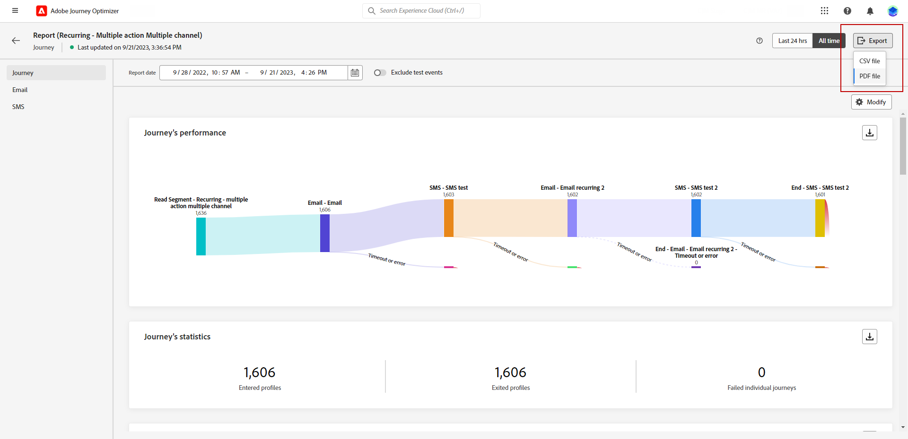

# 全局报告入门 {#global-report}

>[!AVAILABILITY]
>
>目前的报告经验将于2025年1月停用。 在此日期之后，新的报告体验将成为标准。我们建议您熟悉新特性和功能，以确保顺利过渡。 [开始使用Journey Optimizer的新报告界面。](report-gs-cja.md)

>[!NOTE]
>
> 如果使用查询服务时通过API进行自定义查询，则报告可能会有延迟。

使用&#x200B;**[!UICONTROL 全局报告]**&#x200B;衡量选定时间段内历程和投放的影响。

* 如果要在历程上下文中定位历程或投放，请从&#x200B;**[!UICONTROL 历程]**&#x200B;菜单访问您的历程，然后单击&#x200B;**[!UICONTROL 查看报告]**&#x200B;按钮。 然后，您可以找到历程、电子邮件、短信和推送全局报表。

  

* 如果要定位促销活动，请从&#x200B;**[!UICONTROL 促销活动]**&#x200B;菜单访问您的促销活动，然后单击&#x200B;**[!UICONTROL 报表]**&#x200B;按钮。

  

* 如果要针对您的投放从&#x200B;**[!UICONTROL 实时报告]**&#x200B;切换到&#x200B;**[!UICONTROL 全局报告]**，请从选项卡切换器中单击&#x200B;**[!UICONTROL 所有时间]**。

  

有关Adobe Journey Optimizer中可用的每个量度的详细列表，请参阅[此页面](#list-of-components-global)

## 自定义仪表板 {#modify-dashboard}

可以通过更改时间段、调整小组件大小或删除小组件来修改每个报表仪表板。 更改构件只会影响当前用户的仪表板。 其他用户将看到自己的功能板或默认设置的功能板。

1. 从全局报表中，选择开始和结束时间以定向特定数据。

   

1. 对于涉及多个已配置的&#x200B;**[!UICONTROL 操作]**&#x200B;的历程报告，请从下拉菜单中选择特定的&#x200B;**[!UICONTROL 操作]**。

1. 如果只想定位一个或多个定期消息，请从&#x200B;**[!UICONTROL 执行时间]**&#x200B;下拉列表中选择它。

   

1. 选择是否要通过切换栏从报表中排除测试事件。 有关测试事件的详细信息，请参阅[此页面](../building-journeys/testing-the-journey.md)。

   请注意，**[!UICONTROL 排除测试事件]**&#x200B;选项仅适用于历程报表。

   

1. 单击&#x200B;**[!UICONTROL 修改]**&#x200B;以开始自定义仪表板。

   

1. 通过拖动小部件的右下角调整其大小。

   

1. 单击&#x200B;**[!UICONTROL 删除]**&#x200B;可删除不需要的任何构件。

   

1. 如果对显示顺序和小部件的大小满意，请单击&#x200B;**[!UICONTROL 保存]**。

1. 要自定义数据的显示方式，可以从不同的可视化选项（如图形、表格和圆环图）进行切换。

   

您的信息板现已保存。 您的不同更改将重新应用以供以后使用实时报告。 如果需要，请使用&#x200B;**[!UICONTROL 重置]**&#x200B;选项恢复默认小部件和小部件的顺序。

## 导出您的报告 {#export-reports}

您可以轻松地将不同的报表导出为PDF或CSV格式，以便您共享或打印它们。 导出报告的步骤详见以下选项卡。

➡️ [在视频中了解此功能](#video-csv)

>[!BEGINTABS]

>[!TAB 将报告导出为CSV文件]

1. 在报表中，单击&#x200B;**[!UICONTROL 导出]**&#x200B;并选择&#x200B;**[!UICONTROL CSV文件]**&#x200B;以生成整个报表级别的CSV文件。

   

1. 您还可以选择从特定构件导出数据。 单击所选构件旁边的&#x200B;**[!UICONTROL 将构件数据导出到CSV]**。

   

1. 您的文件会自动下载，并位于本地文件中。

   如果在报表级别生成文件，则它包含每个小组件的详细信息，包括其标题和数据。

   如果在小组件级别生成文件，则它会专门提供选定小组件的数据。

>[!TAB 将报告导出为PDF文件]

1. 在报表中，单击&#x200B;**[!UICONTROL 导出]**&#x200B;并选择&#x200B;**[!UICONTROL PDF文件]**。

   

1. 在“打印”窗口中，根据需要配置文档。 请注意，选项可能因您的浏览器而异。

1. 选择打印报表或将报表另存为PDF。

1. 找到要保存文件的文件夹，根据需要重命名它，然后单击“保存”。

您的报表现在可以在PDF文件中查看或共享。

>[!ENDTABS]

### 导出报告（视频） {#video-csv}

请观看以下操作方法视频，了解如何下载适用于单个报表和单个小部件的CSV报表。

>[!VIDEO](https://video.tv.adobe.com/v/3424603?quality=12)

>[!CONTEXTUALHELP]
>id="ajo_report_campaign_ctr"
>title="CTR"
>abstract="CTR 构件"

>[!CONTEXTUALHELP]
>id="ajo_report_campaign_clicks"
>title="点击次数"
>abstract="点击构件"

>[!CONTEXTUALHELP]
>id="ajo_report_campaign_delivered"
>title="已送达"
>abstract="已交付构件"

>[!CONTEXTUALHELP]
>id="ajo_report_campaign_overview"
>title="Campaign 概述"
>abstract="活动概述构件"

>[!CONTEXTUALHELP]
>id="ajo_report_campaign_funnel"
>title="Campaign 漏斗结果"
>abstract="Campaign 漏斗结果构件"

>[!CONTEXTUALHELP]
>id="ajo_report_campaign_tracking_link"
>title="跟踪关联标签"
>abstract="跟踪关联标签构件"

>[!CONTEXTUALHELP]
>id="ajo_report_campaign_displays"
>title="显示数"
>abstract="显示构件"

<!--campaign email-->

>[!CONTEXTUALHELP]
>id="ajo_report_campaign_email_delivered_click"
>title="已投放和点击趋势"
>abstract="已投放和点击趋势构件"

>[!CONTEXTUALHELP]
>id="ajo_report_campaign_email_delivery_status"
>title="投放状态"
>abstract="投放状态构件"

>[!CONTEXTUALHELP]
>id="ajo_report_campaign_email_sending_statistics"
>title="发送统计数据"
>abstract="跟踪统计数据构件"

>[!CONTEXTUALHELP]
>id="ajo_report_campaign_email_tracking_statistics"
>title="跟踪统计数据"
>abstract="跟踪统计数据构件"

>[!CONTEXTUALHELP]
>id="ajo_report_campaign_email_domains"
>title="电子邮件域"
>abstract="电子邮件域名构件"

>[!CONTEXTUALHELP]
>id="ajo_report_campaign_email_tracked_link"
>title="跟踪关联标签"
>abstract="跟踪关联标签构件"

>[!CONTEXTUALHELP]
>id="ajo_report_campaign_email_tracked_link_urls"
>title="跟踪关联 URL"
>abstract="跟踪关联 URL 构件"

>[!CONTEXTUALHELP]
>id="ajo_report_campaign_email_subjects"
>title="电子邮件主题"
>abstract="电子邮件主题构件"

>[!CONTEXTUALHELP]
>id="ajo_report_campaign_email_bounce_reasons"
>title="退回原因"
>abstract="退回原因构件"

>[!CONTEXTUALHELP]
>id="ajo_report_campaign_email_exclude"
>title="排除原因"
>abstract="排除原因构件"

>[!CONTEXTUALHELP]
>id="ajo_report_campaign_email_error"
>title="错误原因"
>abstract="错误原因构件"

<!--campaign push-->

>[!CONTEXTUALHELP]
>id="ajo_report_campaign_push_sending_statistics"
>title="发送统计数据"
>abstract="跟踪统计数据构件"

>[!CONTEXTUALHELP]
>id="ajo_report_campaign_push_tracking_statistics"
>title="跟踪统计数据"
>abstract="跟踪统计数据构件"

>[!CONTEXTUALHELP]
>id="ajo_report_campaign_push_tracked_link"
>title="跟踪关联标签"
>abstract="跟踪关联标签构件"

>[!CONTEXTUALHELP]
>id="ajo_report_campaign_push_tracked_link_urls"
>title="跟踪关联 URL"
>abstract="跟踪关联 URL 构件"

>[!CONTEXTUALHELP]
>id="ajo_report_campaign_push_bounce_reasons"
>title="退回原因"
>abstract="退回原因构件"

>[!CONTEXTUALHELP]
>id="ajo_report_campaign_push_exclude"
>title="排除的原因"
>abstract="排除原因构件"

>[!CONTEXTUALHELP]
>id="ajo_report_campaign_push_email_error"
>title="错误原因"
>abstract="错误原因构件"

<!--campaign inapp-->

>[!CONTEXTUALHELP]
>id="ajo_report_campaign_inapp_impression"
>title="印象和点击趋势"
>abstract="印象和点击趋势构件"

>[!CONTEXTUALHELP]
>id="ajo_report_campaign_inapp_clicks"
>title="点击次数"
>abstract="点击构件"

>[!CONTEXTUALHELP]
>id="ajo_report_campaign_inapp_displays"
>title="显示数"
>abstract="显示构件"

>[!CONTEXTUALHELP]
>id="ajo_report_campaign_inapp_tracking_data"
>title="跟踪数据"
>abstract="追踪数据构件"

>[!CONTEXTUALHELP]
>id="ajo_report_campaign_inapp_tracked_link"
>title="跟踪关联标签"
>abstract="跟踪关联标签构件"

>[!CONTEXTUALHELP]
>id="ajo_report_campaign_inapp_tracked_link_urls"
>title="跟踪关联 URL"
>abstract="跟踪关联 URL 构件"

<!--campaign sms-->

>[!CONTEXTUALHELP]
>id="ajo_report_campaign_sms_delivered_click"
>title="已投放和点击趋势"
>abstract="已投放和点击趋势构件"

>[!CONTEXTUALHELP]
>id="ajo_report_campaign_sms_delivery_status"
>title="投放状态"
>abstract="投放状态构件"

>[!CONTEXTUALHELP]
>id="ajo_report_campaign_sms_tracked_link"
>title="跟踪关联标签"
>abstract="跟踪关联标签构件"

>[!CONTEXTUALHELP]
>id="ajo_report_campaign_sms_tracked_link_urls"
>title="跟踪关联 URL"
>abstract="跟踪关联 URL 构件"

>[!CONTEXTUALHELP]
>id="ajo_report_campaign_sms_inbound"
>title="SMS 入站消息"
>abstract="SMS 入站消息构件"

>[!CONTEXTUALHELP]
>id="ajo_report_campaign_sms_message_type"
>title="SMS 消息类型"
>abstract="SMS 消息类型构件"

>[!CONTEXTUALHELP]
>id="ajo_report_campaign_sms_providers"
>title="SMS 提供者"
>abstract="SMS 提供者构件"

>[!CONTEXTUALHELP]
>id="ajo_report_campaign_sms_bounce"
>title="退回原因"
>abstract="退回原因构件"

>[!CONTEXTUALHELP]
>id="ajo_report_campaign_sms_exclude"
>title="排除原因"
>abstract="排除原因构件"

>[!CONTEXTUALHELP]
>id="ajo_report_campaign_sms_error"
>title="错误原因"
>abstract="错误原因构件"
