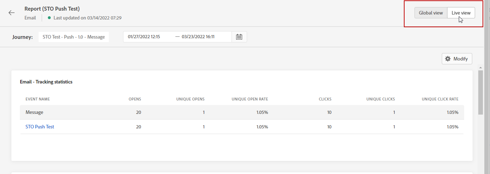
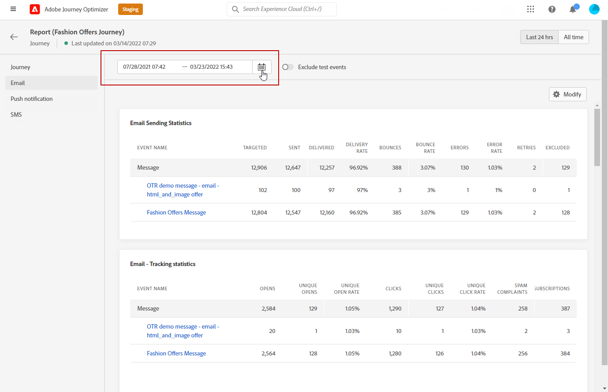
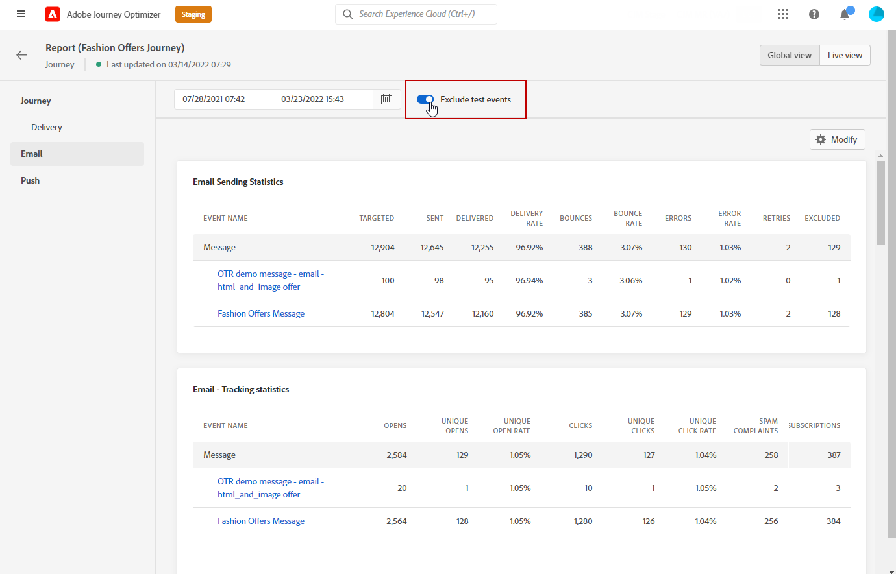

# 全局报告入门 {#global-report}

>[!NOTE]
>
> 如果在使用查询服务时通过API进行自定义查询，则报告可能会有延迟。

使用 **[!UICONTROL 全局报告]** 用于衡量所选时段内历程和投放的影响。

* 如果要在历程上下文中定位历程或投放，请从 **[!UICONTROL 历程]** 菜单，访问您的旅程，然后单击 **[!UICONTROL 查看报告]** 按钮。 然后，您可以找到历程、电子邮件、短信和推送全局报表。

   

* 如果要定位促销活动，请从 **[!UICONTROL 营销活动]** 菜单，访问您的营销策划，然后单击 **[!UICONTROL 报告]** 按钮。

   

* 如果要从 **[!UICONTROL 实时报告]** 到 **[!UICONTROL 全局报告]** 对于您的投放，请单击 **[!UICONTROL 所有时间]** 选项卡切换器中的。

   

有关Adobe Journey Optimizer中可用的每个量度的详细列表，请参阅 [此页面](#list-of-components-global)

## 自定义仪表板 {#modify-dashboard}

可以通过更改时间段、调整大小或删除构件来修改每个报表仪表板。 更改构件只会影响当前用户的仪表板。 其他用户将看到他们自己的功能板或默认设置的功能板。

1. 从全局报表中，选择开始和结束时间以定位特定数据。

   

1. 选择是否要通过切换栏从报表中排除测试事件。 有关测试事件的详细信息，请参阅 [此页面](../building-journeys/testing-the-journey.md).

   请注意 **[!UICONTROL 排除测试事件]** 选项仅适用于历程报表。

   

1. 单击 **[!UICONTROL 修改]** 以开始自定义您的仪表板。

   

1. 通过拖动小部件的右下角调整其大小。

   

1. 单击 **[!UICONTROL 移除]** 以删除任何您不需要的构件。

   

1. 对小部件的显示顺序和大小满意后，单击 **[!UICONTROL 保存]**.

1. 要自定义数据的显示方式，可以从不同的可视化选项（如图形、表格和圆环图）进行切换。

   

您的信息板现已保存。 您的不同更改将重新应用，以供以后使用实时报告。 如果需要，请使用 **[!UICONTROL 重置]** 用于恢复默认构件和构件顺序的选项。

## 导出报告 {#export-reports}

您可以轻松地将不同的报表导出为PDF格式，以便共享或打印它们。

1. 在报表中，单击 **[!UICONTROL 导出]**.

   

1. 在“打印”窗口中，根据需要配置文档。 请注意，选项可能因您的浏览器而异。

1. 选择打印报表或将报表另存为PDF。

1. 找到要保存文件的文件夹，根据需要对其进行重命名，然后单击“保存”。

您的报告现在可以在PDF文件中查看或共享。

