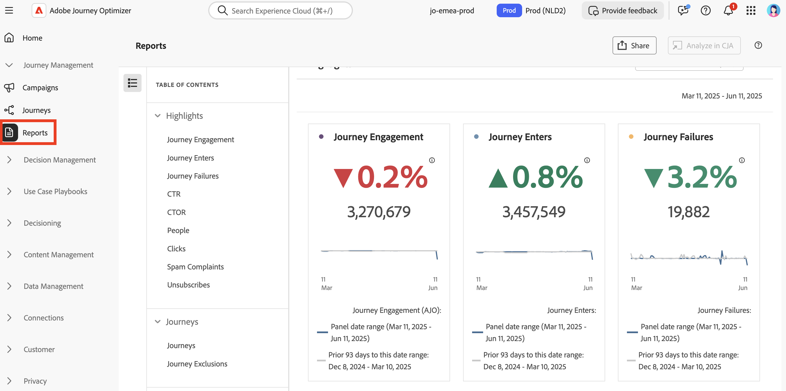

# 报告功能入门 {#get-started-report}

Adobe Journey Optimizer通过其强大的报告功能为您提供切实可行的见解。 报告适用于营销活动、历程、登陆页面、订阅列表等。 下面列出了可用的报告。

此外，为了优化[!DNL Journey Optimizer]体验的可投放性，我们建议使用本节[&#128279;](deliverability.md)中列出的最佳实践。

## 报告类型 {#reporting-types}

* **最近24小时的实时报告** — 使用&#x200B;**[!UICONTROL 实时报告]**&#x200B;在内置仪表板中实时衡量和可视化您的历程和消息的影响和性能。 在发送投放或从&#x200B;**[!UICONTROL 最近24小时]**&#x200B;选项卡执行历程后，**[!UICONTROL 实时报告]**&#x200B;中的数据可用。 在本节[&#128279;](live-report.md)中了解有关实时报告的更多信息。

  

* **使用Customer Journey Analytics的全时报表** - Journey Optimizer报表与Customer Journey Analytics功能完全集成，实现了两个平台报表的标准化，并提高了数据一致性和可靠性。 Journey Optimizer与Customer Journey Analytics之间的这种无缝集成提供了对绩效指标的更清晰查看，使用户能够做出更明智的决策。 在本节[&#128279;](report-gs-cja.md)中了解关于所有时间报表的更多信息。

  

  如果您拥有Adobe Customer Journey Analytics许可证，则可以在Customer Journey Analytics中分析Journey Optimizer报表。 这个功能强大的选项可将您无缝重定向到您的Customer Journey Analytics环境，使您能够全面个性化报告。 您可以使用专门的Customer Journey Analytics量度扩充构件，将您的洞察提升到新的水平。 [了解详情](report-cja-manage.md)

## 让我们深入探究

现在您已了解&#x200B;**[!DNL Journey Optimizer]**&#x200B;中的报告类型，接下来该深入了解这些文档部分，了解如何访问和了解报告功能。

<table style="table-layout:fixed"><tr style="border: 0;">
<td>

<strong>历程报表</strong>

<a href="journey-live-report.md"><strong>实时报告</strong></a>

<a href="journey-global-report-cja.md"><strong>所有时间报表</strong></a>

<a href="sharing-overview.md"><strong>创建历程报告</strong></a>

</td>
<td>

<strong>营销活动报表</strong>

<a href="campaign-live-report.md"><strong>实时报告</strong></a>

<a href="campaign-global-report-cja.md"><strong>所有时间报表</strong></a>

</td>
<td>

<strong>登陆页面报表</strong>

<a href="lp-report-live.md"><strong>实时报告</strong></a>

<a href="lp-report-global-cja.md"><strong>所有时间报表</strong></a>

</td>
<td>

<strong>订阅列表报告</strong>

<a href="subscription-report-live.md"><strong>实时报告</strong></a>

<a href="subscription-report-global-cja.md"><strong>所有时间报表</strong></a>

</td>
</tr></table>

## 每个渠道的所有时间报表

### 出站渠道

选择一个出站渠道以发现相关的&#x200B;**全局所有时间报表**。

<table style="table-layout:fixed"><tr style="border: 0;">
<td>

<strong>电子邮件渠道</strong>

<a href="campaign-global-report-cja-email.md"><strong>营销活动报告</strong></a>

<a href="journey-global-report-cja-email.md"><strong>历程报告</strong></a>

</td>
<td>

<strong>短信渠道</strong>

<a href="campaign-global-report-cja-sms.md"><strong>营销活动报告</strong></a>

<a href="journey-global-report-cja-sms.md"><strong>历程报告</strong></a>

</td>
<td>

<strong>推送渠道</strong>

<a href="campaign-global-report-cja-push.md"><strong>营销活动报告</strong></a>

<a href="journey-global-report-cja-push.md"><strong>历程报告</strong></a>

</td>
<td>

<strong>直邮渠道</strong>

<a href="campaign-global-report-cja-direct.md"><strong>营销活动报告</strong></a>

<a href="journey-global-report-cja-direct.md"><strong>历程报告</strong></a>

</td>
</tr></table>

### 入站体验

选择入站体验，以发现相关的&#x200B;**全局所有时间报表**。

<table style="table-layout:fixed"><tr style="border: 0;">
<td>

<strong>应用程序内渠道</strong>

<a href="campaign-global-report-cja-inapp.md"><strong>营销活动报告</strong></a>

<a href="journey-global-report-cja-inapp.md"><strong>历程报告</strong></a>

</td>
<td>

<strong>Web 渠道</strong>

<a href="campaign-global-report-cja-web.md"><strong>营销活动报告</strong></a>

<a href="journey-global-report-cja-web.md"><strong>历程报告</strong></a>

</td>
<td>&lt;

<strong>基于代码的体验</strong>

<a href="campaign-global-report-cja-code.md"><strong>营销活动报告</strong></a>

<a href="campaign-global-report-cja-code.md"><strong>历程报告</strong></a>

</td>
<td>

<strong>内容卡</strong>

<a href="campaign-global-report-cja-content.md"><strong>营销活动报告</strong></a>

<a href="journey-global-report-cja-content.md"><strong>历程报告</strong></a>

</td>
</tr></table>
