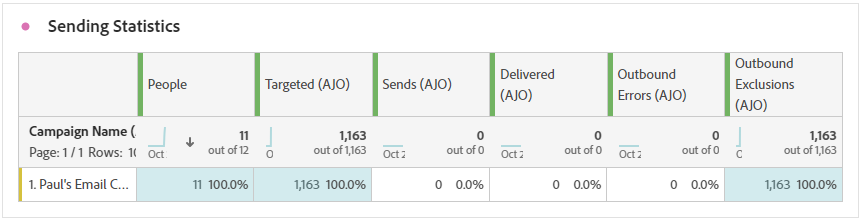

# 直邮历程报告 {#journey-global-report}

>[!BEGINSHADEBOX]

您可以通过单击历程中的&#x200B;**[!UICONTROL 查看报告]**&#x200B;按钮访问直邮历程报告。 [了解详情](report-gs-cja.md)

>[!ENDSHADEBOX]

## 发送统计信息 {#sending-statistics-directmail}

**[!UICONTROL 发送统计数据]**&#x200B;表为您提供直邮历程的性能分析。 查看关键量度，如定向收件人数和成功投放件数，帮助您衡量邮件的影响范围和有效性。

+++ 了解有关发送统计信息量度的更多信息

* **[!UICONTROL 人员]**：符合消息目标用户档案资格的用户档案数。

* **[!UICONTROL 目标]**：发送过程中处理的直邮消息总数。

* **[!UICONTROL 发送次数]**：您的直邮邮件的发送总数。

* **[!UICONTROL 已投放]**：成功发送的直邮邮件数，与已发送的邮件总数相关。

* **[!UICONTROL 出站错误]**：发送过程中发生的阻止将错误发送到配置文件的错误总数。

* **[!UICONTROL 出站排除]**： Adobe Journey Optimizer已排除的用户档案数。

+++

## 投放状态 {#delivery-status-directmail}

**[!UICONTROL 投放状态]**&#x200B;图形提供与历程中发送的直邮消息相关的数据的综合视图，提供对关键量度（如投放和错误）的分析。 这样即可对直邮消息发送过程进行详细分析，从而提供关于历程效率和性能的宝贵信息。

+++ 了解有关投放状态量度的更多信息

* **[!UICONTROL 已投放]**：成功发送的直邮邮件数，与已发送的直邮邮件总数相关。

* **[!UICONTROL 出站错误]**：发送过程中发生的阻止将直邮消息发送到用户档案的错误总数。

* **[!UICONTROL 出站排除]**： Adobe Journey Optimizer已排除的用户档案数。

+++

## 错误原因 {#error-reasons-directmail}

**[!UICONTROL 错误原因]**&#x200B;表允许您识别直邮邮件发送过程中发生的特定错误，从而便于对遇到的任何问题进行彻底分析。

## 排除的原因 {#exclude-reasons-directmail}

[&#128279;](assets/cja-direct-excluded.png)

**[!UICONTROL 排除原因]**&#x200B;表直观地描述了导致从目标受众中排除用户配置文件，从而阻止他们接收直邮消息的各种因素。

有关排除原因的完整列表，请参阅[此页面](exclusion-list.md)。
