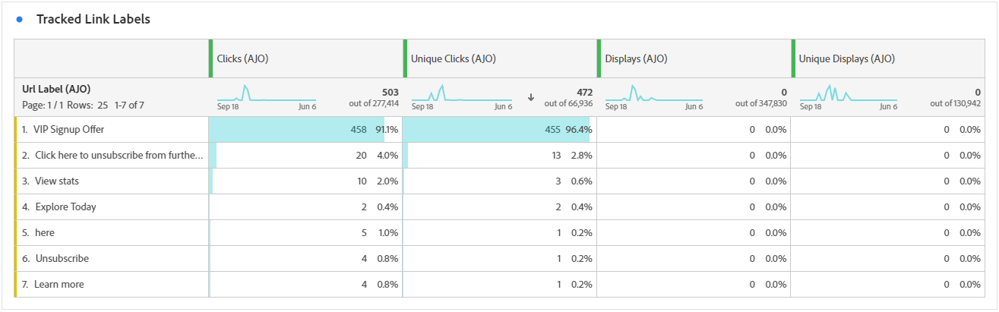

# 应用程序内历程报告 {#journey-global-report}

>[!INFO]
>
>您的历程报告可能同时显示多个历程中的信息，因为用户一次可以涉及多个历程。 因此，如果为参与同时活动历程的用户触发入站通信（应用程序内、Web和基于代码），则这些通信可能会显示在多个历程中，这可能会导致数据重叠。

>[!BEGINSHADEBOX]

您可以通过单击历程中的&#x200B;**[!UICONTROL 报告]**&#x200B;按钮访问应用程序内历程报告。 [了解详情](report-gs-cja.md)

>[!ENDSHADEBOX]

## 显示和单击趋势 {#display-click-trend}

**[!UICONTROL 显示和单击趋势]**&#x200B;图形显示配置文件与应用程序内消息的参与情况的详细分析，提供有关配置文件与内容如何交互的宝贵见解。

+++ 了解有关“显示和单击趋势”量度的更多信息

* **[!UICONTROL 点击次数]**：应用程序内消息中内容的点击次数。

* **[!UICONTROL 显示]**：消息的打开次数。

+++

## 点击次数 {#clicks-inapp}

**[!UICONTROL 点击量]**&#x200B;图形显示应用程序内点击量度，同时显示内容点击总数和点击内容的独特配置文件数。

+++ 了解有关点击量度的更多信息

* **[!UICONTROL 唯一点击次数]**：点击应用程序内消息中内容的用户档案数

* **[!UICONTROL 点击次数]**：应用程序内消息中内容的点击次数。

+++

## 显示 {#display-inapp}

**[!UICONTROL 显示]**&#x200B;图形可帮助您了解消息的整体影响范围以及与消息交互的唯一用户档案的数量。

+++ 了解有关显示量度的更多信息

* **[!UICONTROL 显示]**：消息的打开次数。

* **[!UICONTROL 独特显示]**：消息的打开次数，一个用户档案的多个交互未考虑在内。

+++

## 跟踪数据 {#tracking-data-inapp}

**[!UICONTROL 跟踪数据]**&#x200B;表提供了与应用程序内消息关联的配置文件活动的详细快照，提供了有关参与和应用程序内消息有效性方面的基本见解。

+++ 了解有关跟踪数据量度的更多信息

* **[!UICONTROL 人员]**：有资格作为应用程序内消息的目标用户档案的用户档案数。

* **[!UICONTROL 点进率(CTR)]**：与应用程序内消息交互的用户百分比。

* **[!UICONTROL 点进打开率(CTOR)]**：应用程序内消息的打开次数。

* **[!UICONTROL 点击次数]**：应用程序内消息中内容的点击次数。

* **[!UICONTROL 唯一点击次数]**：点击应用程序内消息中内容的用户档案数。

* **[!UICONTROL 显示]**：消息的打开次数。

* **[!UICONTROL 独特显示]**：消息的打开次数，一个用户档案的多个交互未考虑在内。

* **[!UICONTROL 发送]**：应用程序内消息的发送总数。

* **[!UICONTROL 入站触发]**：用户交互或预定义事件触发应用程序内消息的次数。

* **[!UICONTROL 入站消除]**：用户在不与应用程序内消息交互的情况下消除该消息的次数。

+++

## 跟踪关联标签 {#track-link-label-inapp}

**[!UICONTROL 跟踪的链接标签]**&#x200B;表提供了应用程序内消息中链接标签的全面概述，突出显示生成最高访客流量的链接标签。 此功能使您能够识别最受欢迎的链接并确定其优先级。

+++ 了解有关跟踪的链接标签量度的更多信息

* **[!UICONTROL 唯一点击次数]**：点击应用程序内消息中内容的用户档案数。

* **[!UICONTROL 点击次数]**：应用程序内消息中内容的点击次数。

* **[!UICONTROL 显示]**：消息的打开次数。

* **[!UICONTROL 独特显示]**：消息的打开次数，一个用户档案的多个交互未考虑在内。

+++

## 跟踪关联 URL {#track-link-url-inapp}

**[!UICONTROL 跟踪的链接URL]**&#x200B;表提供了应用程序内消息中吸引最高访客流量的URL的全面概述。 这使您能够识别最受欢迎的链接并排定其优先级，从而更好地了解应用程序内消息中与特定内容的用户档案参与情况。

+++ 了解有关跟踪的链接URL量度的更多信息

* **[!UICONTROL 唯一点击次数]**：点击应用程序内消息中内容的用户档案数

* **[!UICONTROL 点击次数]**：应用程序内消息中内容的点击次数。

+++
