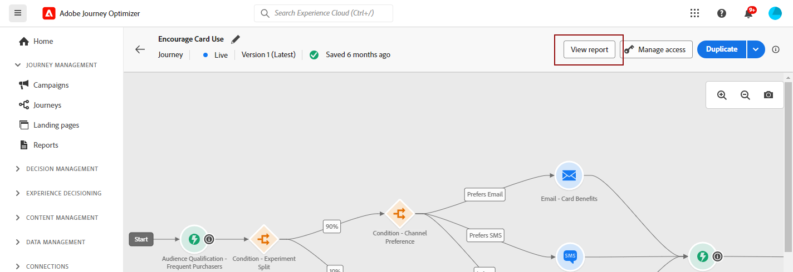
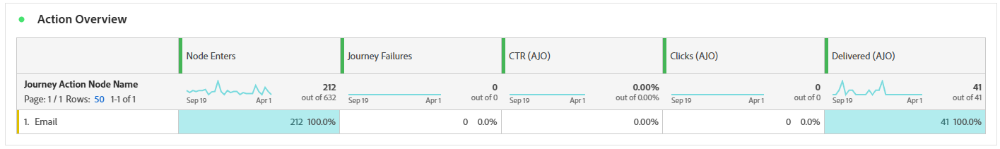
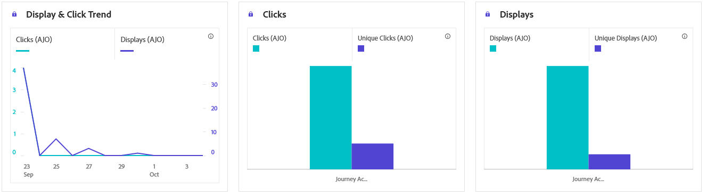

# 历程报告 {#journey-global-report}

**历程报表**&#x200B;可用作一个包含所有内容的仪表板，提供与您的旅程关联的基本量度分析。 其中包括已输入用户档案计数和失败的个人历程实例等详细信息，可全面了解历程的有效性和参与级别。

使用&#x200B;**[!UICONTROL 查看报告]**&#x200B;按钮，可以直接从您的旅程访问&#x200B;**历程报告**。

根据旅程中的消息活动，将显示&#x200B;**[!UICONTROL 历程报告]**&#x200B;页，其中包含下列选项卡：

* [历程](#journey-global)
* [电子邮件](#email-global)
* [推送](#push-global)
* [短信](#sms-global)
* [应用程序内](#in-app-global)
* [Web](#web-cja)
* [直邮](#direct-mail-cja)
* [基于代码](#code-based)
* [内容信息卡](#content-card)

要了解有关Customer Journey AnalyticsWorkspace以及如何筛选和分析数据的更多信息，请参阅[此页面](https://experienceleague.adobe.com/en/docs/analytics-platform/using/cja-workspace/home)。

## 历程概述 {#journey-global}

**[!UICONTROL 历程]**&#x200B;报告让您清楚地了解历程的最重要跟踪数据。

### 历程KPI {#journey-perfomance}

**[!UICONTROL 历程]**&#x200B;关键绩效指标(KPI)用作一个包含所有内容的仪表板，提供与您的旅程关联的基本量度分析。 其中包括输入的配置文件计数和失败的个人历程实例等详细信息，可全面了解历程的有效性和参与级别。

+++ 了解有关历程KPI指标的更多信息

* **[!UICONTROL 历程参与度]**：与历程中发送的消息交互的个人总数

* **[!UICONTROL 历程进入]**：到达历程进入事件的个人总数。

* **[!UICONTROL 历程退出]**：退出历程的个人总数。

* **[!UICONTROL 历程失败]**：未成功执行的单个历程总数。

+++

### 历程统计信息 {#journey-stats}

**[!UICONTROL 历程统计数据]**&#x200B;表提供了有关历程的关键数据的详细摘要。 其中包括关键量度，如失败次数和成功进入次数，为您的电子邮件和历程的性能和影响提供有价值的见解。

+++ 了解有关历程统计量度的更多信息

* **[!UICONTROL 历程参与度]**：与历程中发送的消息交互的个人总数。

* **[!UICONTROL 历程进入]**：到达历程进入事件的个人总数。

* **[!UICONTROL 历程退出]**：退出历程的个人总数。

* **[!UICONTROL 历程失败]**：未成功执行的单个历程总数。

* **[!UICONTROL 独特的历程进入次数]**：到达历程进入事件的个人总数，不考虑一个用户档案的多个交互。

* **[!UICONTROL 独特历程退出]**：退出旅程的个人总数，未考虑一个用户档案的多个交互。

* **[!UICONTROL 独特历程失败]**：未成功执行的单个历程总数，未考虑一个配置文件的多个交互。

+++

## 历程画布 {#journey-canvas}

**[!UICONTROL 历程画布]**&#x200B;小组件允许您在定向用户档案浏览您的旅程时直观地跟踪其轨迹。 [请参阅Customer Journey Analytics文档以了解详情](https://experienceleague.adobe.com/en/docs/analytics-platform/using/cja-workspace/visualizations/journey-canvas/journey-canvas)

使用以下选项增强画布自定义：

* 从&#x200B;**[!UICONTROL 节点类型]**&#x200B;下拉菜单添加或删除所需的活动类型，如消息或条件。
* 调整&#x200B;**[!UICONTROL 百分比值]**&#x200B;以确定不同历程路径之间的流量分配。
* 自定义您的&#x200B;**[!UICONTROL 箭头设置]**&#x200B;以包含标签、条件或选择干净显示。
* 启用&#x200B;**[!UICONTROL 显示流失]**&#x200B;选项以在画布上直接可视化退出历程的用户档案。

## 操作表现 {#action-performance}

### 随时间变化的性能 {#action-overtime}

**[!UICONTROL 随时间变化的性能]**&#x200B;图表允许您识别和分析符合条件的配置文件数量，这些配置文件将被视为操作的目标配置文件。 此可视化图表提供了关于策略有效性的宝贵见解，并帮助您制定数据驱动型决策以优化性能。

### 操作概述 {#action-overview}

**[!UICONTROL 操作概述]**&#x200B;表用作综合仪表板，提供与历程中操作相关的关键量度分析。 这包括关键详细信息，例如交互次数和点进率

+++ 了解有关操作概述量度的更多信息

* **[!UICONTROL 人员]**：有资格作为操作目标配置文件的用户配置文件数。

* **[!UICONTROL 点击最低速率]**：与操作交互的用户百分比。

* **[!UICONTROL 点击次数]**：在操作中点击内容的次数。

* **[!UICONTROL 已投放]**：成功发送的操作数与已发送操作的总数相关。

+++

## 事件性能 {#events-performance}

### 随时间变化的性能 {#event-overtime}

通过&#x200B;**[!UICONTROL 随时间变化的性能]**&#x200B;图表，您可以识别和分析符合事件目标配置文件的资格配置文件数。 这个强大的工具可帮助您跟踪一段时间内的趋势和模式，提供有助于优化事件策略的宝贵见解。

### 事件概述 {#event-overview}

**[!UICONTROL 事件概述]**&#x200B;表显示一段时间内符合您的事件条件的配置文件数。 此工具可帮助您识别资格鉴定率中的模式，以优化事件策略。

+++ 了解有关历程统计量度的更多信息

* **[!UICONTROL 人员]**：符合活动目标配置文件资格的用户配置文件数。

+++

## 电子邮件详细信息 {#email-global}

在历程报告中，**[!UICONTROL 电子邮件]**&#x200B;选项卡详细列出了与历程中发送的电子邮件相关的主要信息。

### 已交付与点击趋势 {#delivered-click}

**[!UICONTROL 已投放与点击趋势]**&#x200B;图显示您的用户档案与电子邮件交互的详细分析，提供了有关各种域如何与您的内容交互的宝贵见解。

+++ 了解更多有关已交付与点击趋势量度的信息

* **[!UICONTROL 已投放]**：成功发送的电子邮件数与已发送的电子邮件总数相关。

* **[!UICONTROL 点击次数]**：内容在电子邮件中的点击次数。

+++

### 投放状态 {#delivery-status}

**[!UICONTROL 投放状态]**&#x200B;图表让您一目了然地查看电子邮件的执行情况。 跟踪关键量度，如投放和退回，让您快速了解电子邮件历程的效率。

+++ 了解有关投放状态量度的更多信息

* **[!UICONTROL 已投放]**：成功发送的电子邮件数与已发送的电子邮件总数相关。

* **[!UICONTROL 出站渠道的跳出次数]**：发送进程和自动返回处理期间累计的错误总数与已发送消息的总数之比。

* **[!UICONTROL 出站错误]**：发送过程中发生的阻止将错误发送到配置文件的错误总数。

* **[!UICONTROL 已排除]**： Adobe Journey Optimizer已排除的用户档案数。

+++

### 发送统计信息 {#email-sending-statistics}

**[!UICONTROL 发送统计数据]**&#x200B;表清晰地显示了您的电子邮件在历程中的执行情况。 它跟踪投放率和交互等关键量度，为您提供宝贵的见解以优化电子邮件策略以实现更好的触及率和参与度。

+++ 了解有关发送统计量度的更多信息

* **[!UICONTROL 人员]**：符合消息目标用户档案资格的用户档案数。

* **[!UICONTROL 目标]**：发送过程中处理的电子邮件总数。

* **[!UICONTROL 发送]**：您的电子邮件的发送总数。

* **[!UICONTROL 已投放]**：成功发送的电子邮件数与已发送的邮件总数相关。

* **[!UICONTROL 跳出次数]**：在发送进程和自动返回处理期间累计的错误总数与已发送消息的总数之比。

* **[!UICONTROL 出站错误]**：发送过程中发生的阻止将错误发送到配置文件的错误总数。

* **[!UICONTROL 出站排除]**： Adobe Journey Optimizer已排除的用户档案数。

+++

### 电子邮件 - 跟踪统计数据 {#email-tracking}

**[!UICONTROL 电子邮件 — 跟踪统计数据]**&#x200B;表提供与历程中包含的电子邮件相关的配置文件活动的详细帐户。 其中包括打开次数、点击次数和其他相关参与指示器的指标，可全面了解用户档案与电子邮件内容的交互方式。

+++ 了解有关跟踪统计量度的更多信息

* **[!UICONTROL 点进率(CTR)]**：与电子邮件交互的用户百分比。

* **[!UICONTROL 点进打开率(CTOR)]**：电子邮件的打开次数。

* **[!UICONTROL 点击次数]**：内容在电子邮件中的点击次数。

* **[!UICONTROL 唯一点击次数]**：点击电子邮件中内容的用户档案数。

* **[!UICONTROL 电子邮件打开次数]**：您的电子邮件在历程中打开的次数。

* **[!UICONTROL 独特电子邮件打开次数]**：已打开电子邮件的百分比。

* **[!UICONTROL 垃圾邮件投诉次数]**：将邮件声明为垃圾邮件或垃圾邮件的次数。

* **[!UICONTROL 取消订阅]**：取消订阅链接的点击次数。

+++

### 电子邮件域 {#email-domains}

**[!UICONTROL 电子邮件域]**&#x200B;表提供了按域分类的电子邮件的深入细分，提供了对电子邮件历程性能指标的广泛分析。 通过这种全面的分析，您可以了解不同域在响应电子邮件内容时的行为。

+++ 了解有关电子邮件域指标的更多信息

* **[!UICONTROL 发送]**：您的电子邮件的发送总数。

* **[!UICONTROL 已投放]**：成功发送的电子邮件数与已发送的电子邮件总数相关。

* **[!UICONTROL 电子邮件打开次数]**：您的电子邮件在历程中打开的次数。

* **[!UICONTROL 点击次数]**：内容在电子邮件中的点击次数。

* **[!UICONTROL 出站渠道的跳出次数]**：发送进程和自动返回处理期间累计的错误总数与已发送电子邮件的总数相关。

* **[!UICONTROL 出站错误]**：发送过程中发生的阻止将错误发送到配置文件的错误总数。
+++

### 跟踪关联标签 {#track-link-label}

**[!UICONTROL 跟踪的链接标签]**&#x200B;表提供了电子邮件中链接标签的全面概述，突出显示生成最高访客流量的那些标签。 此功能使您能够识别最受欢迎的链接并确定其优先级。

+++ 了解有关跟踪链接标签量度的更多信息

* **[!UICONTROL 唯一点击次数]**：点击电子邮件中内容的用户档案数。

* **[!UICONTROL 点击次数]**：内容在电子邮件中的点击次数。

+++

### 跟踪关联 URL {#track-link-url}

**[!UICONTROL 跟踪的链接URL]**&#x200B;表提供了您的电子邮件中吸引最高访客流量的URL的全面概述。 这使您能够识别最受欢迎的链接并排定其优先级，从而加深您对电子邮件中特定内容的用户档案参与情况的了解。

+++ 了解有关跟踪的链接URL量度的更多信息

* **[!UICONTROL 唯一点击次数]**：点击电子邮件中内容的用户档案数。

* **[!UICONTROL 点击次数]**：内容在电子邮件中的点击次数。

* **[!UICONTROL 显示]**：消息的打开次数。

* **[!UICONTROL 独特显示]**：消息的打开次数，一个用户档案的多个交互未考虑在内。

+++

### 电子邮件主题 {#email-subject}

**[!UICONTROL 电子邮件主题]**&#x200B;表全面概述了吸引最多访客流量的电子邮件主题。 此资源提供了有关受众参与动态的有价值见解。

+++ 了解有关电子邮件主题量度的更多信息

* **[!UICONTROL 人员]**：有资格作为电子邮件目标配置文件的用户配置文件数。

+++

### 退回原因 {#email-bounce-reasons}

**[!UICONTROL 退回原因]**&#x200B;表编译与退回邮件相关的可用数据，提供关于电子邮件退回具体原因的详细见解。

有关退回的详细信息，请参阅[禁止显示列表](../reports/suppression-list.md)页面。

### 排除的原因 {#email-excluded}

**[!UICONTROL 排除的原因]**&#x200B;表提供了导致从目标受众中排除用户个人资料导致未收到该消息的各种因素的综合视图。

有关排除原因的完整列表，请参阅[此页面](exclusion-list.md)。

### 错误原因 {#email-errors}

**[!UICONTROL 错误原因]**&#x200B;表提供了在发送过程中发生的特定错误的可见性，提供了有关错误性质和发生情况的宝贵信息。

## 推送通知选项卡 {#push-global}

在历程报告中，**[!UICONTROL 推送通知]**&#x200B;选项卡详细列出了与历程中发送的推送通知相关的主要信息。

## 推送通知 {#push-notification}

### 发送统计信息 {#sending-statistics-push}

**[!UICONTROL 发送统计数据]**&#x200B;表帮助您了解推送通知的执行情况。 其中包括投放率和受众规模等关键指标，可让您获得关于历程效果和触及范围的宝贵见解。

+++ 了解有关发送统计量度的更多信息

* **[!UICONTROL 人员]**：符合短信消息目标用户档案资格的用户档案数。

* **[!UICONTROL 目标]**：分析期间处理的推送通知总数。

* **[!UICONTROL 发送]**：推送通知的发送总数。

* **[!UICONTROL 已传递]**：成功发送的推送通知数与已发送的推送通知总数相关。

* **[!UICONTROL 出站渠道的跳出次数]**：发送进程和自动返回处理期间累计的错误总数与推送通知总数相关。

* **[!UICONTROL 出站错误]**：发生阻止将其发送到配置文件的错误总数。

* **[!UICONTROL 出站排除]**： Adobe Journey Optimizer已排除的用户档案数。

+++

### 跟踪统计数据 {#tracking-statistics-push}

**[!UICONTROL 跟踪统计数据]**&#x200B;表提供了与推送通知关联的配置文件活动的详细快照，提供了有关参与和推送通知有效性的基本见解。

+++ 了解有关跟踪统计量度的更多信息

* **[!UICONTROL 点进率(CTR)]**：与推送通知交互的用户百分比。

* **[!UICONTROL 点进打开率(CTOR)]**：推送通知的打开次数。

* **[!UICONTROL 点击次数]**：在推送通知中点击内容的次数。

* **[!UICONTROL 唯一点击次数]**：点击推送通知中内容的用户档案数。

<!--
* **[!UICONTROL Push custom actions]**: 
-->
+++

### 跟踪关联标签 {#track-link-label-push}

**[!UICONTROL 跟踪的链接标签]**&#x200B;表提供了推送通知中链接标签的全面概述，突出显示生成最高访客流量的链接标签。 此功能使您能够识别最受欢迎的链接并确定其优先级。

+++ 了解有关跟踪链接标签量度的更多信息

* **[!UICONTROL 唯一点击次数]**：点击推送通知中内容的用户档案数。

* **[!UICONTROL 点击次数]**：在推送通知中点击内容的次数。

+++

### 跟踪关联 URL {#track-link-url-push}

**[!UICONTROL 跟踪的链接URL]**&#x200B;表提供了推送通知中吸引最高访客流量的URL的全面概述。 这使您能够识别最受欢迎的链接并确定其优先级，从而更好地了解推送通知中特定内容的用户档案参与情况。

+++ 了解有关跟踪的链接URL量度的更多信息

* **[!UICONTROL 唯一点击次数]**：点击推送通知中内容的用户档案数。

* **[!UICONTROL 点击次数]**：在推送通知中点击内容的次数。

+++

### 退回原因 {#bounce-reasons-push}

**[!UICONTROL 退回原因]**&#x200B;表提供了与退回推送通知相关的数据的全面概述，从而针对推送通知退回实例背后的具体原因提供了宝贵的见解。

### 错误原因 {#error-reasons-push}

**[!UICONTROL 错误原因]**&#x200B;表允许您识别推送通知发送过程中发生的特定错误，从而便于全面分析遇到的任何问题。

### 排除的原因 {#exclude-reasons-push}

**[!UICONTROL 排除原因]**&#x200B;表直观地描述了导致从目标受众中排除用户个人资料的各种因素，阻止他们接收您的推送通知。

有关排除原因的完整列表，请参阅[此页面](exclusion-list.md)。

## 短信 {#sms}

### 已交付与点击趋势 {#delivered-click-sms}

**[!UICONTROL 已投放与点击趋势]**&#x200B;图显示用户档案与短信消息的参与情况的详细分析，提供了有关各个域如何与您的内容进行交互的宝贵见解。

+++ 了解更多有关已交付与点击趋势量度的信息

* **[!UICONTROL 已投放]**：成功发送的短信消息数与短信消息总数相关。

* **[!UICONTROL 点击次数]**：短信消息中内容的点击次数。

+++

### 投放状态 {#delivery-status-sms}

**[!UICONTROL 投放状态]**&#x200B;表提供与短信消息相关的配置文件活动的详细帐户。 这包括有关投放的量度、点击量和其他相关参与指标，从而全面了解用户档案与短信内容的交互方式。

+++ 了解有关投放状态量度的更多信息

* **[!UICONTROL 已投放]**：成功发送的短信消息数与短信消息总数相关。

* **[!UICONTROL 出站渠道的跳出次数]**：发送进程和自动返回处理期间累计的错误总数与已发送短信消息的总数之比。

* **[!UICONTROL 出站错误]**：发生阻止将其发送到配置文件的错误总数。

* **[!UICONTROL 出站排除]**： Adobe Journey Optimizer已排除的用户档案数。

+++

### 跟踪关联标签 {#track-link-label-sms}

**[!UICONTROL 跟踪的链接标签]**&#x200B;表提供了短信消息中链接标签的全面概述，突出显示生成最高访客流量的链接标签。 此功能使您能够识别最受欢迎的链接并确定其优先级。

+++ 了解有关跟踪链接标签量度的更多信息

* **[!UICONTROL 唯一点击次数]**：点击短信消息中内容的用户档案数。

* **[!UICONTROL 点击次数]**：短信消息中内容的点击次数。

+++

### 跟踪关联 URL {#track-link-url-sms}

**[!UICONTROL 跟踪的链接URL]**&#x200B;表提供了您的SMS消息中吸引最高访客流量的URL的全面概述。 这使您能够识别最受欢迎的链接并排定其优先顺序，从而更加了解短信消息中特定内容的用户档案参与情况。

+++ 了解有关跟踪的链接URL量度的更多信息

* **[!UICONTROL 唯一点击次数]**：点击短信消息中内容的用户档案数。

* **[!UICONTROL 点击次数]**：短信消息中内容的点击次数。

* **[!UICONTROL 显示]**：消息的打开次数。

* **[!UICONTROL 独特显示]**：消息的打开次数，一个用户档案的多个交互未考虑在内。

+++

### SMS 入站消息 {#sms-inbound}

**[!UICONTROL SMS入站消息]**&#x200B;表全面概述了哪些SMS消息吸引的访客流量最高。 此资源提供了有关受众参与动态的有价值见解。

+++ 了解有关短信入站消息量度的更多信息

* **[!UICONTROL 人员]**：符合短信消息目标用户档案资格的用户档案数。

+++

### SMS消息类型 {#sms-message-type}

**[!UICONTROL SMS消息类型]**&#x200B;表全面概述了哪种SMS消息类型吸引的访客流量最高。 此资源提供了有关受众参与动态的有价值见解。

+++ 了解有关短信消息类型量度的更多信息

* **[!UICONTROL 人员]**：符合短信消息目标用户档案资格的用户档案数。

+++

### SMS 提供者 {#sms-providers}

**[!UICONTROL 短信提供商]**&#x200B;表全面概述了哪些短信提供商吸引的访客流量最高。 此资源提供了有关受众参与动态的有价值见解。

+++ 了解有关短信提供商量度的更多信息

* **[!UICONTROL 人员]**：符合短信消息目标用户档案资格的用户档案数。

+++

### 退回原因 {#bounce-reasons-sms}

**[!UICONTROL 退回原因]**&#x200B;表提供了与退回的短信消息相关的数据的全面概述，从而针对短信消息退回实例背后的具体原因提供了宝贵的见解。

### 错误原因 {#error-reasons-sms}

**[!UICONTROL 错误原因]**&#x200B;表允许您识别在发送短信消息过程中发生的特定错误，从而便于彻底分析遇到的任何问题。

### 排除原因 {#excluded-reasons-sms}

**[!UICONTROL 排除原因]**&#x200B;表直观地描述了导致从目标受众中排除用户配置文件，从而阻止他们接收短信消息的各种因素。

有关排除原因的完整列表，请参阅[此页面](exclusion-list.md)。

## 应用程序内

### 展示和点击趋势 {#impression-click-trend}

**[!UICONTROL 展示和点击趋势]**&#x200B;图显示个人资料与应用程序内消息互动的详细分析，提供有关个人资料与内容互动方式的宝贵见解。

+++ 了解有关“展示次数”和“点击次数”趋势量度的更多信息

* **[!UICONTROL 点击次数]**：应用程序内消息中内容的点击次数。

* **[!UICONTROL 显示]**：消息的打开次数。

+++

### 点击次数 {#clicks-inapp}

**[!UICONTROL 点击量]**&#x200B;图形显示应用程序内点击量度，同时显示内容点击总数和点击内容的独特配置文件数。

+++ 了解有关点击量度的更多信息

* **[!UICONTROL 唯一点击次数]**：点击应用程序内消息中内容的用户档案数

* **[!UICONTROL 点击次数]**：应用程序内消息中内容的点击次数。

+++

### 显示 {#display-inapp}

**[!UICONTROL 显示]**&#x200B;图形可帮助您了解消息的整体影响范围以及与消息交互的唯一用户档案的数量。

+++ 了解有关显示量度的更多信息

* **[!UICONTROL 显示]**：消息的打开次数。

* **[!UICONTROL 独特显示]**：消息的打开次数，一个用户档案的多个交互未考虑在内。

+++

### 跟踪数据 {#tracking-data-inapp}

**[!UICONTROL 跟踪数据]**&#x200B;表提供了与应用程序内消息关联的配置文件活动的详细快照，提供了有关参与和应用程序内消息有效性方面的基本见解。

+++ 了解有关跟踪数据量度的更多信息

* **[!UICONTROL 人员]**：有资格作为应用程序内消息的目标用户档案的用户档案数。

* **[!UICONTROL 点进率(CTR)]**：与应用程序内消息交互的用户百分比。

* **[!UICONTROL 点进打开率(CTOR)]**：应用程序内消息的打开次数。

* **[!UICONTROL 点击次数]**：应用程序内消息中内容的点击次数。

* **[!UICONTROL 唯一点击次数]**：点击应用程序内消息中内容的用户档案数。

* **[!UICONTROL 显示]**：消息的打开次数。

* **[!UICONTROL 独特显示]**：消息的打开次数，一个用户档案的多个交互未考虑在内。

* **[!UICONTROL 发送]**：应用程序内消息的发送总数。

<!--
* **[!UICONTROL Inbound triggered]**: 

* **[!UICONTROL Inbound dismisses]**: 
-->
+++

### 跟踪关联标签 {#track-link-label-inapp}

**[!UICONTROL 跟踪的链接标签]**&#x200B;表提供了应用程序内消息中链接标签的全面概述，突出显示生成最高访客流量的链接标签。 此功能使您能够识别最受欢迎的链接并确定其优先级。

+++ 了解有关跟踪链接标签量度的更多信息

* **[!UICONTROL 唯一点击次数]**：点击应用程序内消息中内容的用户档案数。

* **[!UICONTROL 点击次数]**：应用程序内消息中内容的点击次数。

* **[!UICONTROL 显示]**：消息的打开次数。

* **[!UICONTROL 独特显示]**：消息的打开次数，一个用户档案的多个交互未考虑在内。

+++

### 跟踪关联 URL {#track-link-url-inapp}

**[!UICONTROL 跟踪的链接URL]**&#x200B;表提供了应用程序内消息中吸引最高访客流量的URL的全面概述。 这使您能够识别最受欢迎的链接并排定其优先级，从而更好地了解应用程序内消息中与特定内容的用户档案参与情况。

+++ 了解有关跟踪的链接URL量度的更多信息

* **[!UICONTROL 唯一点击次数]**：点击应用程序内消息中内容的用户档案数

* **[!UICONTROL 点击次数]**：应用程序内消息中内容的点击次数。

+++

## Web {#web-cja}

### 展示和点击趋势 {#impressions-web}

**[!UICONTROL 展示和点击趋势]**&#x200B;图显示个人资料与网页交互情况的详细分析，提供有关个人资料与内容交互情况的宝贵见解。

+++ 了解有关“展示次数”和“点击次数”趋势量度的更多信息

* **[!UICONTROL 点击次数]**：内容在网页中的点击次数。

* **[!UICONTROL 显示]**：消息的打开次数。

+++

### 点击次数 {#clicks-web}

**[!UICONTROL 点击量]**&#x200B;图形显示网页点击量度，同时显示内容点击总数和点击内容的独特配置文件数。

+++ 了解有关点击量度的更多信息

* **[!UICONTROL 唯一点击次数]**：点击您网页中内容的配置文件数。

* **[!UICONTROL 点击次数]**：内容在网页中的点击次数。

+++

### 显示数 {#displays-web}

**[!UICONTROL 显示]**&#x200B;图形可帮助您了解基于代码的体验已打开的总体影响范围以及与其交互的唯一配置文件的数量。

+++ 了解有关显示量度的更多信息

* **[!UICONTROL 显示]**：基于代码的体验的打开次数。

* **[!UICONTROL 唯一显示]**：基于代码的体验的打开次数，一个配置文件的多个交互未考虑在内。

+++

### 跟踪数据 {#track-data-web}

**[!UICONTROL 跟踪数据]**&#x200B;表提供了与您的网页关联的配置文件活动的详细快照，提供了有关参与和网页效果的基本见解。

+++ 了解有关跟踪数据量度的更多信息

* **[!UICONTROL 人员]**：符合网页目标配置文件资格的用户配置文件数。

* **[!UICONTROL 点进率(CTR)]**：与网页交互的用户百分比。

* **[!UICONTROL 点击次数]**：内容在网页中的点击次数。

* **[!UICONTROL 唯一点击次数]**：点击您网页中内容的配置文件数。

* **[!UICONTROL 显示]**：网页被打开的次数。

* **[!UICONTROL 独特显示]**：网页被打开的次数，一个配置文件的多个交互未考虑在内。

+++

### 跟踪关联标签 {#track-link-web}

**[!UICONTROL 跟踪的链接标签]**&#x200B;表提供了网页中链接标签的全面概述，突出显示生成最高访客流量的链接标签。 此功能使您能够识别最受欢迎的链接并确定其优先级。

+++ 了解有关跟踪链接标签量度的更多信息

* **[!UICONTROL 唯一点击次数]**：点击您网页中内容的配置文件数。

* **[!UICONTROL 点击次数]**：内容在网页中的点击次数。

* **[!UICONTROL 显示]**：消息的打开次数。

* **[!UICONTROL 独特显示]**：消息的打开次数，一个用户档案的多个交互未考虑在内。

+++

### 跟踪关联 URL {#track-url-web}

**[!UICONTROL 跟踪的链接URL]**&#x200B;表提供了网页中吸引最高访客流量的URL的全面概述。 这使您能够识别最受欢迎的链接并排定其优先顺序，从而更好地了解您对网页中特定内容的个人资料参与情况。

+++ 了解有关跟踪的链接URL量度的更多信息

* **[!UICONTROL 唯一点击次数]**：点击您网页中内容的配置文件数。

* **[!UICONTROL 点击次数]**：内容在网页中的点击次数。

* **[!UICONTROL 显示]**：消息的打开次数。

* **[!UICONTROL 独特显示]**：消息的打开次数，一个用户档案的多个交互未考虑在内。

+++

## 直邮 {#direct-mail-cja}

### 发送统计信息 {#sending-statistics-directmail}

**[!UICONTROL 发送统计数据]**&#x200B;表为您提供直邮历程的性能分析。 查看关键量度，如定向收件人数和成功投放件数，帮助您衡量邮件的影响范围和有效性。

+++ 了解有关发送统计量度的更多信息

* **[!UICONTROL 人员]**：符合消息目标用户档案资格的用户档案数。

* **[!UICONTROL 目标]**：发送过程中处理的直邮消息总数。

* **[!UICONTROL 发送次数]**：您的直邮邮件的发送总数。

* **[!UICONTROL 已投放]**：成功发送的直邮邮件数，与已发送的邮件总数相关。

* **[!UICONTROL 出站错误]**：发送过程中发生的阻止将错误发送到配置文件的错误总数。

* **[!UICONTROL 出站排除]**： Adobe Journey Optimizer已排除的用户档案数。

+++

### 投放状态 {#delivery-status-directmail}

**[!UICONTROL 投放状态]**&#x200B;图形提供与历程中发送的直邮消息相关的数据的综合视图，提供对关键量度（如投放和错误）的分析。 这样即可对直邮消息发送过程进行详细分析，从而提供关于历程效率和性能的宝贵信息。

+++ 了解有关投放状态量度的更多信息

* **[!UICONTROL 已投放]**：成功发送的直邮邮件数，与已发送的直邮邮件总数相关。

* **[!UICONTROL 出站错误]**：发送过程中发生的阻止将直邮消息发送到用户档案的错误总数。

* **[!UICONTROL 出站排除]**： Adobe Journey Optimizer已排除的用户档案数。

+++

### 错误原因 {#error-reasons-directmail}

**[!UICONTROL 错误原因]**&#x200B;表允许您识别直邮邮件发送过程中发生的特定错误，从而便于对遇到的任何问题进行彻底分析。

### 排除的原因 {#exclude-reasons-directmail}

**[!UICONTROL 排除原因]**&#x200B;表直观地描述了导致从目标受众中排除用户配置文件，从而阻止他们接收直邮消息的各种因素。

有关排除原因的完整列表，请参阅[此页面](exclusion-list.md)。

## 基于代码的体验 {#code-based}

### 显示并点击 {#impressions-code}

**[!UICONTROL 显示和点击]**&#x200B;图形显示配置文件与您的基于代码的体验的互动情况的详细分析，提供有关配置文件与您的内容如何互动的宝贵见解。

+++ 了解有关“展示次数”和“点击次数”量度的更多信息

* **[!UICONTROL 唯一点击次数]**：点击您体验中内容的用户档案数。

* **[!UICONTROL 点击次数]**：内容在体验中的点击次数。

* **[!UICONTROL 显示]**：体验被打开的次数。

* **[!UICONTROL 独特显示]**：体验打开的次数，一个配置文件的多个交互未考虑在内。

+++

### 跟踪数据 {#track-data-code}

**[!UICONTROL 跟踪数据]**&#x200B;表提供与您的基于代码的体验绑定的配置文件活动的详细快照，提供有关参与和体验效果的基本见解。

+++ 了解有关跟踪数据量度的更多信息

* **[!UICONTROL 人员]**：符合体验目标配置文件资格的用户配置文件数。

* **[!UICONTROL 点进率(CTR)]**：与您的体验交互的用户百分比。

* **[!UICONTROL 点击次数]**：内容在体验中的点击次数。

* **[!UICONTROL 唯一点击次数]**：点击您体验中内容的用户档案数。

* **[!UICONTROL 显示]**：您的体验被打开的次数。

* **[!UICONTROL 独特显示]**：您的体验被打开的次数，一个配置文件的多个交互未考虑在内。

+++

### 跟踪关联标签 {#track-link-code}

**[!UICONTROL 跟踪的链接标签]**&#x200B;表提供了基于代码的体验中链接标签的全面概述，突出显示生成最高访客流量的那些标签。 此功能使您能够识别最受欢迎的链接并确定其优先级。

+++ 了解有关跟踪链接标签量度的更多信息

* **[!UICONTROL 唯一点击次数]**：点击了您的基于代码的体验中的内容的用户档案数。

* **[!UICONTROL 点击次数]**：在基于代码的体验中点击内容的次数。

* **[!UICONTROL 显示]**：体验被打开的次数。

* **[!UICONTROL 独特显示]**：体验打开的次数，一个配置文件的多个交互未考虑在内。

+++

## 内容信息卡 {#content-card}

### 显示并点击 {#displays-content-card}

**[!UICONTROL 显示和点击]**&#x200B;图形显示配置文件与内容卡参与情况的详细分析，从而提供配置文件与内容交互方式的宝贵见解。

+++ 了解有关显示和点击量度的更多信息

* **[!UICONTROL 唯一点击次数]**：点击内容卡中内容的配置文件数。

* **[!UICONTROL 点击次数]**：内容卡片中被点击的次数。

* **[!UICONTROL 显示]**：内容卡被打开的次数。

* **[!UICONTROL 独特显示]**：内容卡被打开的次数，一个配置文件的多个交互未考虑在内。

+++

### 跟踪数据 {#track-data-content}

**[!UICONTROL 跟踪数据]**&#x200B;表提供了与您的内容卡绑定的配置文件活动的详细快照，提供了有关参与和体验效果的基本见解。

+++ 了解有关跟踪数据量度的更多信息

* **[!UICONTROL 人员]**：符合内容卡目标配置文件资格的用户配置文件数。

* **[!UICONTROL 点进率(CTR)]**：与您的内容卡交互的用户百分比。

* **[!UICONTROL 点击次数]**：内容卡片中被点击的次数。

* **[!UICONTROL 唯一点击次数]**：点击内容卡中内容的配置文件数。

* **[!UICONTROL 显示]**：内容卡被打开的次数。

* **[!UICONTROL 独特显示区]**：内容卡被打开的次数，一个配置文件的多个交互未考虑在内。

+++

### 跟踪关联标签 {#track-link-content}

**[!UICONTROL 跟踪的链接标签]**&#x200B;表提供了内容卡中链接标签的全面概述，突出显示生成最高访客流量的那些标签。 此功能使您能够识别最受欢迎的链接并确定其优先级。

+++ 了解有关跟踪链接标签量度的更多信息

* **[!UICONTROL 唯一点击次数]**：点击内容卡中内容的配置文件数。

* **[!UICONTROL 点击次数]**：内容卡片中被点击的次数。

* **[!UICONTROL 显示]**：内容卡被打开的次数。

* **[!UICONTROL 独特显示]**：内容卡被打开的次数，一个配置文件的多个交互未考虑在内。

+++