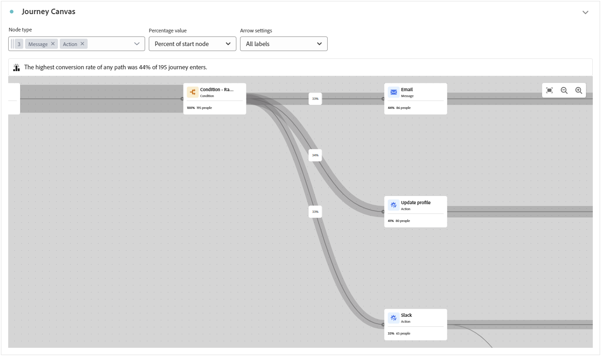
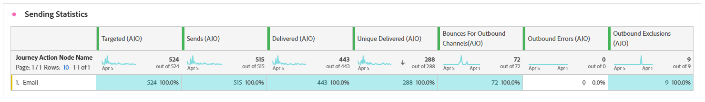

# 历程报告 {#journey-global-report}

此 **历程报表** 功能齐全的仪表板，提供与历程关联的基本量度分析。 其中包括已输入用户档案计数和失败的个人历程实例等详细信息，可全面了解历程的有效性和参与级别。

**历程报表** 可以直接从您的历程访问 **[!UICONTROL 查看报告]** 按钮。

此 **[!UICONTROL 历程报表]** 根据旅程中的消息活动，页面将显示以下选项卡：

* [历程](#journey-global)
* [电子邮件](#email-global)
* [推送](#push-global)
* [短信](#sms-global)
* [应用程序内](#in-app-global)
* [Web](#web-cja)
* [直邮](#direct-mail-cja)

要了解有关Customer Journey Analytics工作区以及如何过滤和分析数据的更多信息，请参阅 [此页面](https://experienceleague.adobe.com/en/docs/analytics-platform/using/cja-workspace/home).

## 历程概述 {#journey-global}

此 **[!UICONTROL 历程]** 报告让您清楚地了解历程的最重要的跟踪数据。

### 历程KPI {#journey-perfomance}

此 **[!UICONTROL 历程]** 关键绩效指标(KPI)作为包罗万象的功能板，提供与您的历程关联的基本量度分析。 其中包括输入的配置文件计数和失败的个人历程实例等详细信息，可全面了解历程的有效性和参与级别。

+++ 了解有关历程KPI指标的更多信息

* **[!UICONTROL 历程参与]**：与从历程发送的消息进行交互的个人总数

* **[!UICONTROL 历程进入]**：到达历程的进入事件的个人总数。

* **[!UICONTROL 历程退出]**：退出历程的个人总数。

* **[!UICONTROL 历程失败]**：未成功执行的各个历程的总数。

+++

### 历程统计信息 {#journey-stats}

此 **[!UICONTROL 历程统计数据]** 表格提供有关历程的关键数据的详细摘要。 其中包括关键量度，如失败次数和成功进入次数，为您的电子邮件和历程的性能和影响提供有价值的见解。

+++ 了解有关历程统计量度的更多信息

* **[!UICONTROL 历程参与]**：与从历程发送的消息进行交互的个人总数。

* **[!UICONTROL 历程进入]**：到达历程的进入事件的个人总数。

* **[!UICONTROL 历程退出]**：退出历程的个人总数。

* **[!UICONTROL 历程失败]**：未成功执行的各个历程的总数。

* **[!UICONTROL 独特的历程进入]**：到达历程的进入事件的个人总数，不考虑一个用户档案的多个交互。

* **[!UICONTROL 独特历程退出]**：退出旅程的个人总数，不考虑一个用户档案的多次交互。

* **[!UICONTROL 独特历程失败次数]**：未成功执行的单独历程总数，不考虑一个用户档案的多个交互。

+++

## 历程画布 {#journey-canvas}

此 **[!UICONTROL 历程画布]** 利用小组件，可在目标用户档案浏览您的历程时直观地跟踪其轨迹。

使用以下选项增强画布自定义：

* 在中添加或删除所需的活动类型，如消息或条件 **[!UICONTROL 节点类型]** 下拉菜单。
* 调整 **[!UICONTROL 百分比值]** 以确定不同历程路径之间的流量分配。
* 自定义您的 **[!UICONTROL 箭头设置]** 以包括标签、条件或选择干净显示。
* 启用 **[!UICONTROL 显示流失]** 选项可将直接在画布上退出历程的用户档案可视化。

## 操作表现 {#action-performance}

### 随时间变化的性能 {#action-overtime}

此 **[!UICONTROL 随时间变化的性能]** 通过图形，可识别和分析符合条件的用户档案数，将其视为操作的目标用户档案。 此可视化图表提供了关于策略有效性的宝贵见解，并帮助您制定数据驱动型决策以优化性能。

### 操作概述 {#action-overview}

此 **[!UICONTROL 操作概述]** 表用作一个综合仪表板，提供与旅程中操作相关的关键量度分析。 这包括关键详细信息，例如交互次数和点进率

+++ 了解有关操作概述量度的更多信息

* **[!UICONTROL 人员]**：符合操作目标配置文件资格的用户配置文件数。

* **[!UICONTROL 点击率谷底]**：与操作交互的用户百分比。

* **[!UICONTROL 点击次数]**：在您的操作中点击内容的次数。

* **[!UICONTROL 已投放]**：成功发送的操作数，与已发送操作的总数相关。

+++

## 事件性能 {#events-performance}

### 随时间变化的性能 {#event-overtime}

此 **[!UICONTROL 随时间变化的性能]** 图表允许您识别和分析符合事件目标用户档案条件的用户档案数。 这个强大的工具可帮助您跟踪一段时间内的趋势和模式，提供有助于优化事件策略的宝贵见解。

### 事件概述 {#event-overview}

此 **[!UICONTROL 事件概述]** 该表显示一段时间内符合事件标准的用户档案数。 此工具可帮助您识别资格鉴定率中的模式，以优化事件策略。

+++ 了解有关历程统计量度的更多信息

* **[!UICONTROL 人员]**：符合事件目标配置文件资格的用户配置文件数。

+++

## 电子邮件详细信息 {#email-global}

在您的历程报告中， **[!UICONTROL 电子邮件]** 选项卡详细介绍与旅程中发送的电子邮件相关的主要信息。

### 已交付与点击趋势 {#delivered-click}

此 **[!UICONTROL 已交付与点击趋势]** 图形呈现用户档案与电子邮件互动的详细分析，提供关于各种域如何与您的内容进行交互的宝贵见解。

+++ 了解更多有关已交付与点击趋势量度的信息

* **[!UICONTROL 已投放]**：成功发送的电子邮件数，与已发送电子邮件总数相关。

* **[!UICONTROL 点击次数]**：在电子邮件中点击内容的次数。

+++

### 投放状态 {#delivery-status}

此 **[!UICONTROL 投放状态]** graph让您可以一目了然地查看电子邮件的执行情况。 跟踪关键量度，如投放和退回，让您快速了解电子邮件历程的效率。

+++ 了解有关投放状态量度的更多信息

* **[!UICONTROL 已投放]**：成功发送的电子邮件数，与已发送电子邮件总数相关。

* **[!UICONTROL 出站渠道的跳出次数]**：在发送流程和自动返回处理期间累计的错误总数与已发送消息总数相关。

* **[!UICONTROL 出站错误]**：发送过程中发生的阻止将消息发送到用户档案的错误总数。

* **[!UICONTROL 已排除]**：Adobe Journey Optimizer已排除的用户档案数。

+++

### 发送统计信息 {#email-sending-statistics}

此 **[!UICONTROL 发送统计数据]** 表格清晰地显示了您的电子邮件在历程中的执行情况。 它跟踪投放率和交互等关键量度，为您提供宝贵的见解以优化电子邮件策略以实现更好的触及率和参与度。

+++ 了解有关发送统计量度的更多信息

* **[!UICONTROL 人员]**：符合消息目标用户档案资格的用户档案数。

* **[!UICONTROL 已定位]**：发送过程中处理的电子邮件总数。

* **[!UICONTROL 发送]**：电子邮件的发送总数。

* **[!UICONTROL 已投放]**：成功发送的电子邮件数，与已发送消息的总数相关。

* **[!UICONTROL 跳出次数]**：在发送流程和自动返回处理期间累计的错误总数与已发送消息总数相关。

* **[!UICONTROL 出站错误]**：发送过程中发生的阻止将消息发送到用户档案的错误总数。

* **[!UICONTROL 出站排除项]**：Adobe Journey Optimizer已排除的用户档案数。

+++

### 电子邮件 - 跟踪统计数据 {#email-tracking}

此 **[!UICONTROL 电子邮件 — 跟踪统计数据]** 表提供与您的历程中包含的电子邮件相关的用户档案活动的详细描述。 其中包括打开次数、点击次数和其他相关参与指示器的指标，可全面了解用户档案与电子邮件内容的交互方式。

+++ 了解有关跟踪统计量度的更多信息

* **[!UICONTROL 点进率(CTR)]**：与电子邮件交互的用户百分比。

* **[!UICONTROL 点进打开率(CTOR)]**：电子邮件的打开次数。

* **[!UICONTROL 点击次数]**：在电子邮件中点击内容的次数。

* **[!UICONTROL 独特点击]**：单击电子邮件中内容的用户档案数。

* **[!UICONTROL 电子邮件打开次数]**：您的电子邮件在历程中打开的次数。

* **[!UICONTROL 独特电子邮件打开次数]**：已打开电子邮件的百分比。

* **[!UICONTROL 垃圾邮件投诉数]**：将消息声明为垃圾邮件或垃圾邮件的次数。

* **[!UICONTROL 取消订阅]**：取消订阅链接的点击次数。

+++

### 电子邮件域 {#email-domains}

此 **[!UICONTROL 电子邮件域]** 表提供了按域分类的电子邮件深入细分，提供了对电子邮件历程性能指标的广泛见解。 通过这种全面的分析，您可以了解不同域在响应电子邮件内容时的行为。

+++ 了解有关电子邮件域指标的更多信息

* **[!UICONTROL 发送]**：电子邮件的发送总数。

* **[!UICONTROL 已投放]**：成功发送的电子邮件数，与已发送电子邮件总数相关。

* **[!UICONTROL 电子邮件打开次数]**：您的电子邮件在历程中打开的次数。

* **[!UICONTROL 点击次数]**：在电子邮件中点击内容的次数。

* **[!UICONTROL 出站渠道的跳出次数]**：在发送流程和自动返回处理期间累计的错误总数与已发送电子邮件总数相关。

* **[!UICONTROL 出站错误]**：发送过程中发生的阻止将消息发送到用户档案的错误总数。
+++

### 跟踪关联标签 {#track-link-label}

此 **[!UICONTROL 跟踪的链接标签]** 表提供了电子邮件中链接标签的全面概述，突出显示生成最高访客流量的标签。 此功能使您能够识别最受欢迎的链接并确定其优先级。

+++ 了解有关跟踪链接标签量度的更多信息

* **[!UICONTROL 独特点击]**：单击电子邮件中内容的用户档案数。

* **[!UICONTROL 点击次数]**：在电子邮件中点击内容的次数。

+++

### 跟踪关联 URL {#track-link-url}

此 **[!UICONTROL 跟踪的链接URL]** 表提供了电子邮件中吸引最高访客流量的URL的全面概述。 这使您能够识别最受欢迎的链接并排定其优先级，从而加深您对电子邮件中特定内容的用户档案参与情况的了解。

+++ 了解有关跟踪的链接URL量度的更多信息

* **[!UICONTROL 独特点击]**：单击电子邮件中内容的用户档案数。

* **[!UICONTROL 点击次数]**：在电子邮件中点击内容的次数。

* **[!UICONTROL 显示]**：消息的打开次数。

* **[!UICONTROL 独特显示]**：消息的打开次数，不考虑一个用户档案的多个交互。

+++

### 电子邮件主题 {#email-subject}

此 **[!UICONTROL 电子邮件主题]**  该表全面概述了吸引最多访客流量的电子邮件主题。 此资源提供了有关受众参与动态的有价值见解。

+++ 了解有关电子邮件主题量度的更多信息

* **[!UICONTROL 人员]**：符合电子邮件目标用户档案资格的用户配置文件数。

+++

### 退回原因 {#email-bounce-reasons}

此 **[!UICONTROL 退回原因]** 该表编译与退回邮件相关的可用数据，提供对电子邮件退回具体原因的详细分析。

有关退回的详细信息，请参阅 [禁止显示列表](../reports/suppression-list.md) 页面。

### 排除的原因 {#email-excluded}

此 **[!UICONTROL 排除的原因]** 下表全面显示了导致从目标受众中排除用户个人资料导致未收到消息的不同因素。

请参阅 [此页面](exclusion-list.md) 以获取排除原因的完整列表。

### 错误原因 {#email-errors}

此 **[!UICONTROL 错误原因]** 表格提供了发送过程中发生的特定错误的可见性，提供了有关错误性质和发生情况的宝贵信息。

## 推送通知选项卡 {#push-global}

在您的历程报告中， **[!UICONTROL 推送通知]** 选项卡详细列出了与历程中发送的推送通知相关的主要信息。

## 推送通知 {#push-notification}

### 发送统计信息 {#sending-statistics-push}

此 **[!UICONTROL 发送统计数据]** 表可帮助您了解推送通知的执行情况。 其中包括投放率和受众规模等关键指标，可让您获得关于历程效果和触及范围的宝贵见解。

+++ 了解有关发送统计量度的更多信息

* **[!UICONTROL 人员]**：符合短信消息目标用户档案资格的用户档案数。

* **[!UICONTROL 已定位]**：分析期间处理的推送通知总数。

* **[!UICONTROL 发送]**：推送通知的发送总数。

* **[!UICONTROL 已投放]**：成功发送的推送通知数，与已发送推送通知的总数相关。

* **[!UICONTROL 出站渠道的跳出次数]**：在发送流程和自动返回处理期间累计的错误总数与推送通知总数相关。

* **[!UICONTROL 出站错误]**：阻止将其发送到用户档案的错误总数。

* **[!UICONTROL 出站排除项]**：Adobe Journey Optimizer已排除的用户档案数。

+++

### 跟踪统计数据 {#tracking-statistics-push}

此 **[!UICONTROL 跟踪统计数据]** 表格提供了与推送通知绑定的用户档案活动的详细快照，提供了有关参与和推送通知有效性的基本见解。

+++ 了解有关跟踪统计量度的更多信息

* **[!UICONTROL 点进率(CTR)]**：与推送通知交互的用户百分比。

* **[!UICONTROL 点进打开率(CTOR)]**：推送通知的打开次数。

* **[!UICONTROL 点击次数]**：在推送通知中点击内容的次数。

* **[!UICONTROL 独特点击]**：单击了推送通知中内容的用户档案数。

<!--
* **[!UICONTROL Push custom actions]**: 
-->
+++

### 跟踪关联标签 {#track-link-label-push}

此 **[!UICONTROL 跟踪的链接标签]** 表提供了推送通知中链接标签的全面概述，突出显示生成最高访客流量的标签。 此功能使您能够识别最受欢迎的链接并确定其优先级。

+++ 了解有关跟踪链接标签量度的更多信息

* **[!UICONTROL 独特点击]**：单击了推送通知中内容的用户档案数。

* **[!UICONTROL 点击次数]**：在推送通知中点击内容的次数。

+++

### 跟踪关联 URL {#track-link-url-push}

此 **[!UICONTROL 跟踪的链接URL]** 表提供了推送通知中吸引最高访客流量的URL的全面概述。 这使您能够识别最受欢迎的链接并确定其优先级，从而更好地了解推送通知中特定内容的用户档案参与情况。

+++ 了解有关跟踪的链接URL量度的更多信息

* **[!UICONTROL 独特点击]**：单击了推送通知中内容的用户档案数。

* **[!UICONTROL 点击次数]**：在推送通知中点击内容的次数。

+++

### 退回原因 {#bounce-reasons-push}

此 **[!UICONTROL 退回原因]** 该表提供了与推送通知退回相关的数据的全面概述，从而针对推送通知退回实例背后的具体原因提供了宝贵的见解。

### 错误原因 {#error-reasons-push}

此 **[!UICONTROL 错误原因]** 表允许您识别在发送推送通知过程中发生的特定错误，从而便于对遇到的任何问题进行彻底分析。

### 排除的原因 {#exclude-reasons-push}

此 **[!UICONTROL 排除原因]** 该表直观地描述了导致从目标受众中排除用户配置文件，从而阻止他们接收推送通知的各种因素。

请参阅 [此页面](exclusion-list.md) 以获取排除原因的完整列表。

## 短信 {#sms}

### 已交付与点击趋势 {#delivered-click-sms}

此 **[!UICONTROL 已交付与点击趋势]** 图形呈现用户档案与短信消息互动的详细分析，提供关于各种域如何与您的内容进行交互的宝贵见解。

+++ 了解更多有关已交付与点击趋势量度的信息

* **[!UICONTROL 已投放]**：成功发送的短信消息数，与短信消息总数相关。

* **[!UICONTROL 点击次数]**：在短信消息中点击内容的次数。

+++

### 投放状态 {#delivery-status-sms}

此 **[!UICONTROL 投放状态]** 表提供与短信消息相关的用户档案活动的详细描述。 这包括有关投放的量度、点击量和其他相关参与指标，从而全面了解用户档案与短信内容的交互方式。

+++ 了解有关投放状态量度的更多信息

* **[!UICONTROL 已投放]**：成功发送的短信消息数，与短信消息总数相关。

* **[!UICONTROL 出站渠道的跳出次数]**：在发送流程和自动返回处理期间累计的错误总数与已发送短信消息的总数相关。

* **[!UICONTROL 出站错误]**：阻止将其发送到用户档案的错误总数。

* **[!UICONTROL 出站排除项]**：Adobe Journey Optimizer已排除的用户档案数。

+++

### 跟踪关联标签 {#track-link-label-sms}

此 **[!UICONTROL 跟踪的链接标签]** 表提供了短信消息中链接标签的全面概述，突出显示生成最高访客流量的标签。 此功能使您能够识别最受欢迎的链接并确定其优先级。

+++ 了解有关跟踪链接标签量度的更多信息

* **[!UICONTROL 独特点击]**：单击短信消息中内容的用户档案数。

* **[!UICONTROL 点击次数]**：在短信消息中点击内容的次数。

+++

### 跟踪关联 URL {#track-link-url-sms}

此 **[!UICONTROL 跟踪的链接URL]** 该表提供了短信消息中吸引最高访客流量的URL的全面概述。 这使您能够识别最受欢迎的链接并排定其优先顺序，从而更加了解短信消息中特定内容的用户档案参与情况。

+++ 了解有关跟踪的链接URL量度的更多信息

* **[!UICONTROL 独特点击]**：单击短信消息中内容的用户档案数。

* **[!UICONTROL 点击次数]**：在短信消息中点击内容的次数。

* **[!UICONTROL 显示]**：消息的打开次数。

* **[!UICONTROL 独特显示]**：消息的打开次数，不考虑一个用户档案的多个交互。

+++

### SMS 入站消息 {#sms-inbound}

此 **[!UICONTROL SMS入站消息]** 该表全面概述了哪些短信消息吸引的访客流量最高。 此资源提供了有关受众参与动态的有价值见解。

+++ 了解有关短信入站消息量度的更多信息

* **[!UICONTROL 人员]**：符合短信消息目标用户档案资格的用户档案数。

+++

### SMS消息类型 {#sms-message-type}

此 **[!UICONTROL SMS消息类型]** 该表全面概述了哪些短信消息类型吸引了最多访客。 此资源提供了有关受众参与动态的有价值见解。

+++ 了解有关短信消息类型量度的更多信息

* **[!UICONTROL 人员]**：符合短信消息目标用户档案资格的用户档案数。

+++

### SMS 提供者 {#sms-providers}

此 **[!UICONTROL 短信提供商]** 该表全面概述了哪些短信提供商吸引的访客流量最高。 此资源提供了有关受众参与动态的有价值见解。

+++ 了解有关短信提供商量度的更多信息

* **[!UICONTROL 人员]**：符合短信消息目标用户档案资格的用户档案数。

+++

### 退回原因 {#bounce-reasons-sms}

此 **[!UICONTROL 退回原因]** 该表提供了与弹回短信消息相关的数据的全面概述，从而针对短信消息退回实例背后的具体原因提供了宝贵的见解。

### 错误原因 {#error-reasons-sms}

此 **[!UICONTROL 错误原因]** 该表允许您识别在短信消息发送过程中发生的特定错误，便于对遇到的任何问题进行彻底分析。

### 排除原因 {#excluded-reasons-sms}

此 **[!UICONTROL 排除原因]** 该表直观地描述了导致从目标受众中排除用户配置文件，阻止他们接收短信消息的各种因素。

请参阅 [此页面](exclusion-list.md) 以获取排除原因的完整列表。

## 应用程序内

### 展示和点击趋势 {#impression-click-trend}

此 **[!UICONTROL 展示和点击趋势]** 图形可详细分析用户档案与应用程序内消息的互动情况，从而提供关于用户档案与内容互动情况的宝贵见解。

+++ 了解有关“展示次数”和“点击次数”趋势量度的更多信息

* **[!UICONTROL 点击次数]**：应用程序内消息中内容的点击次数。

* **[!UICONTROL 显示]**：消息的打开次数。

+++

### 点击次数 {#clicks-inapp}

此 **[!UICONTROL 点击次数]** 该图显示了应用程序内点击量度，说明了内容点击总数和点击内容的独特配置文件数。

+++ 了解有关点击量度的更多信息

* **[!UICONTROL 独特点击]**：单击应用程序内消息中内容的用户档案数

* **[!UICONTROL 点击次数]**：应用程序内消息中内容的点击次数。

+++

### 显示 {#display-inapp}

此 **[!UICONTROL 显示]** 图表有助于您了解消息的整体影响范围以及参与该消息的独特用户档案的数量。

+++ 了解有关显示量度的更多信息

* **[!UICONTROL 显示]**：消息的打开次数。

* **[!UICONTROL 独特显示]**：消息的打开次数，不考虑一个用户档案的多个交互。

+++

### 跟踪数据 {#tracking-data-inapp}

此 **[!UICONTROL 跟踪数据]** 表提供了与应用程序内消息绑定的用户档案活动的详细快照，提供了有关参与和应用程序内消息有效性的基本见解。

+++ 了解有关跟踪数据量度的更多信息

* **[!UICONTROL 人员]**：符合应用程序内消息的目标配置文件资格的用户配置文件数。

* **[!UICONTROL 点进率(CTR)]**：与应用程序内消息交互的用户百分比。

* **[!UICONTROL 点进打开率(CTOR)]**：应用程序内消息的打开次数。

* **[!UICONTROL 点击次数]**：应用程序内消息中内容的点击次数。

* **[!UICONTROL 独特点击]**：单击应用程序内消息中内容的用户档案数。

* **[!UICONTROL 显示]**：消息的打开次数。

* **[!UICONTROL 独特显示]**：消息的打开次数，不考虑一个用户档案的多个交互。

* **[!UICONTROL 发送]**：应用程序内消息的发送总数。

<!--
* **[!UICONTROL Inbound triggered]**: 

* **[!UICONTROL Inbound dismisses]**: 
-->
+++

### 跟踪关联标签 {#track-link-label-inapp}

此 **[!UICONTROL 跟踪的链接标签]** 表提供了应用程序内消息中链接标签的全面概述，突出显示生成最高访客流量的标签。 此功能使您能够识别最受欢迎的链接并确定其优先级。

+++ 了解有关跟踪链接标签量度的更多信息

* **[!UICONTROL 独特点击]**：单击应用程序内消息中内容的用户档案数。

* **[!UICONTROL 点击次数]**：应用程序内消息中内容的点击次数。

* **[!UICONTROL 显示]**：消息的打开次数。

* **[!UICONTROL 独特显示]**：消息的打开次数，不考虑一个用户档案的多个交互。

+++

### 跟踪关联 URL {#track-link-url-inapp}

此 **[!UICONTROL 跟踪的链接URL]** 该表全面概述了应用程序内消息中吸引最高访客流量的URL。 这使您能够识别最受欢迎的链接并排定其优先级，从而更好地了解应用程序内消息中与特定内容的用户档案参与情况。

+++ 了解有关跟踪的链接URL量度的更多信息

* **[!UICONTROL 独特点击]**：单击应用程序内消息中内容的用户档案数

* **[!UICONTROL 点击次数]**：应用程序内消息中内容的点击次数。

+++

## Web {#web-cja}

### 展示和点击趋势 {#impressions-web}

此 **[!UICONTROL 展示和点击趋势]** 图形提供个人资料与网页互动情况的详细分析，提供关于个人资料与内容互动情况的宝贵见解。

+++ 了解有关“展示次数”和“点击次数”趋势量度的更多信息

* **[!UICONTROL 点击次数]**：内容在网页中的点击次数。

* **[!UICONTROL 显示]**：消息的打开次数。

+++

### 点击次数 {#clicks-web}

此 **[!UICONTROL 点击次数]** 该图显示了网页点击量度，说明了内容点击总数和点击内容的独特配置文件数。

+++ 了解有关点击量度的更多信息

* **[!UICONTROL 独特点击]**：单击了网页中内容的配置文件数。

* **[!UICONTROL 点击次数]**：内容在网页中的点击次数。

+++

### 显示数 {#displays-web}

此 **[!UICONTROL 显示]** 图表有助于您了解消息的整体影响范围以及参与该消息的独特用户档案的数量。

+++ 了解有关显示量度的更多信息

* **[!UICONTROL 显示]**：消息的打开次数。

* **[!UICONTROL 独特显示]**：消息的打开次数，不考虑一个用户档案的多个交互。

+++

### 跟踪数据 {#track-data-web}

此 **[!UICONTROL 跟踪数据]** 表格提供了与网页绑定的个人资料活动的详细快照，提供了有关参与和网页效率的基本见解。

+++ 了解有关跟踪数据量度的更多信息

* **[!UICONTROL 人员]**：符合网页目标配置文件资格的用户配置文件数。

* **[!UICONTROL 点进率(CTR)]**：与网页交互的用户百分比。

* **[!UICONTROL 点击次数]**：内容在网页中的点击次数。

* **[!UICONTROL 独特点击]**：单击了网页中内容的配置文件数。

* **[!UICONTROL 显示]**：打开网页的次数。

* **[!UICONTROL 独特显示]**：打开网页的次数，不考虑一个配置文件的多次交互。

+++

### 跟踪关联标签 {#track-link-web}

此 **[!UICONTROL 跟踪的链接标签]** 表提供了您网页中链接标签的全面概述，突出显示生成最高访客流量的标签。 此功能使您能够识别最受欢迎的链接并确定其优先级。

+++ 了解有关跟踪链接标签量度的更多信息

* **[!UICONTROL 独特点击]**：单击了网页中内容的配置文件数。

* **[!UICONTROL 点击次数]**：内容在网页中的点击次数。

* **[!UICONTROL 显示]**：消息的打开次数。

* **[!UICONTROL 独特显示]**：消息的打开次数，不考虑一个用户档案的多个交互。

+++

### 跟踪关联 URL {#track-url-web}

此 **[!UICONTROL 跟踪的链接URL]** 该表全面概述了您网页中吸引最高访客流量的URL。 这使您能够识别最受欢迎的链接并排定其优先顺序，从而更好地了解您对网页中特定内容的个人资料参与情况。

+++ 了解有关跟踪的链接URL量度的更多信息

* **[!UICONTROL 独特点击]**：单击了网页中内容的配置文件数。

* **[!UICONTROL 点击次数]**：内容在网页中的点击次数。

* **[!UICONTROL 显示]**：消息的打开次数。

* **[!UICONTROL 独特显示]**：消息的打开次数，不考虑一个用户档案的多个交互。

+++

## 直邮 {#direct-mail-cja}

### 发送统计信息 {#sending-statistics-directmail}

此 **[!UICONTROL 发送统计数据]** 表让您了解直邮历程的性能。 查看关键量度，如定向收件人数和成功投放件数，帮助您衡量邮件的影响范围和有效性。

+++ 了解有关发送统计量度的更多信息

* **[!UICONTROL 人员]**：符合消息目标用户档案资格的用户档案数。

* **[!UICONTROL 已定位]**：发送过程中处理的直邮消息总数。

* **[!UICONTROL 发送]**：直邮消息的发送总数。

* **[!UICONTROL 已投放]**：成功发送的直邮消息数，与已发送消息总数相关。

* **[!UICONTROL 出站错误]**：发送过程中发生的阻止将消息发送到用户档案的错误总数。

* **[!UICONTROL 出站排除项]**：Adobe Journey Optimizer已排除的用户档案数。

+++

### 投放状态 {#delivery-status-directmail}

此 **[!UICONTROL 投放状态]** graph全面查看与旅程中发送的直邮消息相关的数据，并提供对关键量度（如投放和错误）的分析。 这样即可对直邮消息发送过程进行详细分析，从而提供关于历程效率和性能的宝贵信息。

+++ 了解有关投放状态量度的更多信息

* **[!UICONTROL 已投放]**：成功发送的直邮消息数，与已发送的直邮消息总数相关。

* **[!UICONTROL 出站错误]**：发送过程中发生的阻止将直邮消息发送到用户档案的错误总数。

* **[!UICONTROL 出站排除项]**：Adobe Journey Optimizer已排除的用户档案数。

+++

### 错误原因 {#error-reasons-directmail}

此 **[!UICONTROL 错误原因]** 该表允许您识别在直邮消息发送过程中发生的特定错误，便于对遇到的任何问题进行彻底分析。

### 排除的原因 {#exclude-reasons-directmail}

此 **[!UICONTROL 排除原因]** 该表直观地描述了导致从目标受众中排除用户配置文件，阻止他们接收直邮消息的各种因素。

请参阅 [此页面](exclusion-list.md) 以获取排除原因的完整列表。
