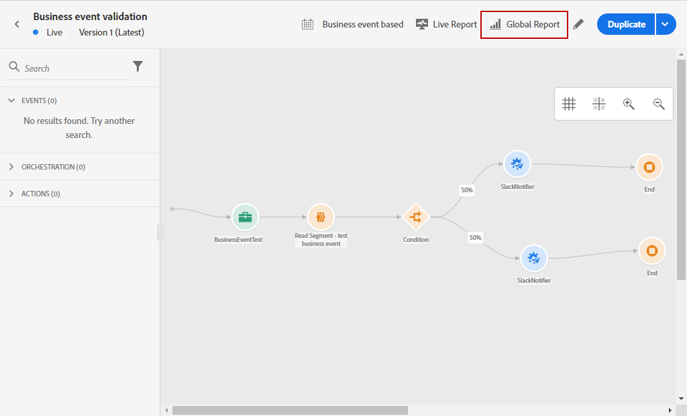
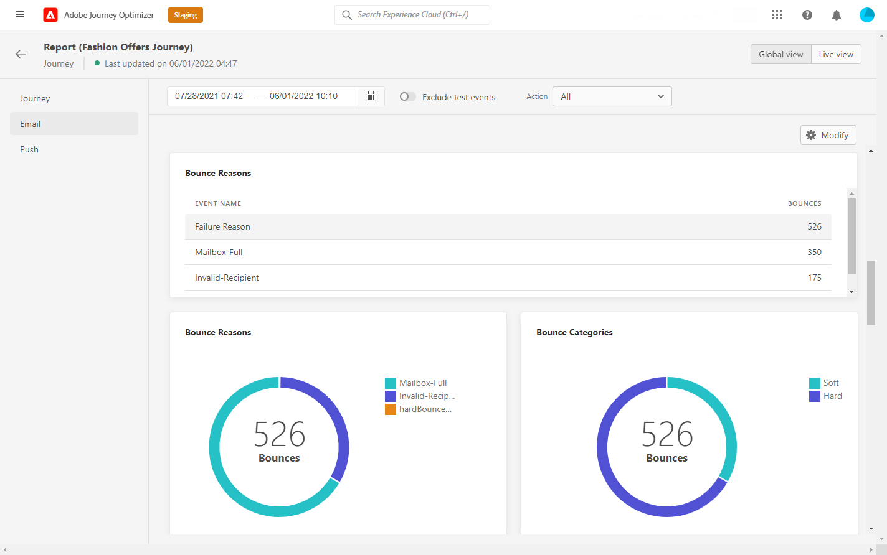

# 历程全局报告 {#journey-global-report}

历程全局报告可直接从您的历程(使用 **[!UICONTROL Global report]** 按钮。

历程 **[!UICONTROL Global report]** 页面中将显示以下选项卡：

* [历程](#journey-global)
* [电子邮件](#email-global)
* [推送](#push-global)
* [短信](#sms-global)

历程 **[!UICONTROL Global report]** 会分为不同的小组件，用于详细描述历程的成功和错误。 如果需要，可以调整每个小组件的大小并将其删除。 有关此内容的更多信息，请参阅此内容 [部分](global-report.md#modify-dashboard).

## 历程选项卡 {#journey-global}

从您的历程 **[!UICONTROL Global report]**, **[!UICONTROL Journey]** 选项卡可让您清楚地查看有关历程的最重要跟踪数据。

的 **[!UICONTROL Journey Performance]** 小组件允许您逐步查看目标用户档案在历程中的路径。

的 **[!UICONTROL Journey Statistics]** 小组件显示以下KPI:

* **[!UICONTROL Entered profiles]**:到达历程的登入事件的个人总数。

* **[!UICONTROL Exited profiles]**:退出历程的个人总数。

* **[!UICONTROL Failed individual journey]**:未成功执行的各个历程的总数。

的 **[!UICONTROL Events received by event]**, **[!UICONTROL Events by origin]** 和 **[!UICONTROL Top events]** 小组件允许您查看 **[!UICONTROL Events]** 已成功通过图形和表执行。

**[!UICONTROL Action Performance]**, **[!UICONTROL Action Error Reasons]** 和 **[!UICONTROL Top Actions]** 小组件代表在 **[!UICONTROL Actions]** 触发。

的 **[!UICONTROL Top Actions]** 表包含可用于 **[!UICONTROL Actions]**，例如：

* **[!UICONTROL Actions successfully executed]**:总数 **[!UICONTROL Actions]** 成功执行历程。

* **[!UICONTROL Error in action]**:发生的错误总数 **[!UICONTROL Actions]**.

## “电子邮件”选项卡 {#email-global}

从您的历程 **[!UICONTROL Global report]**, **[!UICONTROL Email]** 选项卡详细列出了与历程中发送的电子邮件投放相关的主要信息。

有关特定电子邮件投放的详细报告，请参阅 [电子邮件全局报告](#email-global-report) 中。

的 **[!UICONTROL Email Sending Statistics]** 图形详细说明了交付的成功：

* **[!UICONTROL Sent]**:投放的发送总数。

* **[!UICONTROL Delivered]**:已成功发送的消息数，与已发送消息的总数有关。

* **[!UICONTROL Delivery Rate]**:成功发送的消息的百分比。

* **[!UICONTROL Bounces]**:在投放和自动回访处理过程中累积的与已发送消息总数有关的错误总数。

* **[!UICONTROL Bounce Rate]**:退回的电子邮件与发送的电子邮件的百分比。

* **[!UICONTROL Errors]**:投放期间发生的阻止将其发送到用户档案的错误总数。

* **[!UICONTROL Error Rate]**:与发送的电子邮件相比，在阻止发送投放的投放期间发生的错误百分比。

的 **[!UICONTROL Email - Tracking statistics]** 包含用于投放的收件人活动的可用数据：

* **[!UICONTROL Opens]**:投放中打开投放的次数。

* **[!UICONTROL Unique Opens]**:已打开投放的百分比。

* **[!UICONTROL Open Rate]**:已打开的电子邮件总数与已投放电子邮件的数量相比较。

* **[!UICONTROL Clicks]**:电子邮件中内容的点击次数。

* **[!UICONTROL Unique Clicks]**：点击了电子邮件中内容的收件人数。

* **[!UICONTROL Click through rate]**:与历程进行交互的用户百分比。

* **[!UICONTROL Unsubscribe]**:退订链接的点击次数。

* **[!UICONTROL Spam complaints]**:将消息声明为垃圾邮件或垃圾邮件的次数。

的 **[!UICONTROL Sending Statistics]** 图表包含可用于已发送电子邮件的数据，例如：

* **[!UICONTROL Delivered]**:已成功发送的消息数，与已发送消息的总数有关。

* **[!UICONTROL Bounces]**:在投放和自动回访处理过程中累积的与已发送消息总数有关的错误总数。

* **[!UICONTROL Errors]**:投放期间发生的阻止将其发送到用户档案的错误总数。

的 **[!UICONTROL Bounce Reasons]** 和 **[!UICONTROL Bounce categories]** 小组件包含与弹回的消息相关的可用数据，例如：

* **[!UICONTROL Hard bounce]**:永久错误的总数，如错误的电子邮件地址。 这涉及显式声明地址无效的错误消息，如未知用户。

* **[!UICONTROL Soft bounce]**:临时错误（如完整收件箱）的总数。

* **[!UICONTROL Ignored]**:临时（如“不在办公室”）或技术错误（例如，如果发件人类型为邮递员）的总数。

有关退回的更多信息，请参阅 [禁止列表](../reports/suppression-list.md) 页面。

的 **[!UICONTROL Error Reasons]** 通过图表和表格，可查看在投放期间发生的错误。

的 **[!UICONTROL Excluded reasons]** 图形和表格显示阻止从定向用户档案中排除的用户配置文件接收消息的不同原因。

的 **[!UICONTROL Email - Top Url]** 图表和表格详细列出了投放中哪些URL的访问次数最多。

的 **[!UICONTROL Email - Top recipient domain]** 图表和表格详细列出了收件人最常使用哪些域来打开电子邮件。

>[!NOTE]
>
>的 **[!UICONTROL Optimized vs non optimized]** 和 **[!UICONTROL Send time optimization]**  只有为您的投放激活了发送时间优化选项时，小组件才可用。 有关发送时间优化的详细信息，请参阅此 [页面](../building-journeys/journeys-message.md#send-time-optimization).

的 **[!UICONTROL Optimized vs non optimized]** 图表详细列出了与消息相关的主要信息（无论消息是否已优化）：

* **[!UICONTROL Sent]**:投放的发送总数。
* **[!UICONTROL Opens]**:投放中打开投放的次数。
* **[!UICONTROL Clicks]**:电子邮件中内容的点击次数。

的 **[!UICONTROL Send time optimization]** 根据发送方法详细描述投放成功与否：已优化或正常。

* **[!UICONTROL Delivered]**:已成功发送的消息数，与已发送消息的总数有关。
* **[!UICONTROL Bounces]**:在投放和自动回访处理过程中累积的与已发送消息总数有关的错误总数。

>[!NOTE]
>
>仅当在电子邮件中插入决策时，选件小组件和量度才可用。 有关决策管理的详细信息，请参阅此 [页面](../offers/get-started/starting-offer-decisioning.md).

的 **[!UICONTROL Offers statistic]** 和 **[!UICONTROL Offers statistics]** 随着时间的推移，小组件可衡量选件的成功以及对目标受众的影响。 它使用KPI详细描述与消息相关的主要信息：

* **[!UICONTROL Offer sent]**:选件的发送总数。

* **[!UICONTROL Offer impression]**:在投放中打开选件的次数。

* **[!UICONTROL Offer clicks]**:在投放中点击选件的次数。

的 **[!UICONTROL Offers detailed statistic]** 表包含与选件一起用于收件人活动的可用数据：

* **[!UICONTROL Placement name]**:用于显示选件的版面名称。 有关版面的更多信息，请参阅 [页面](../offers/offer-library/creating-placements.md).

* **[!UICONTROL Offer name]**:在投放中添加的选件的名称。 有关版面的更多信息，请参阅 [页面](../offers/offer-library/creating-personalized-offers.md).

* **[!UICONTROL Offer sent]**:选件的发送总数。

* **[!UICONTROL Offer impression rate]**:已打开选件与已发送选件数的百分比。

* **[!UICONTROL Offer click rate]**:与选件进行交互的用户百分比。

## “推送”选项卡 {#push-global}

从您的历程 **[!UICONTROL Global report]**, **[!UICONTROL Push]** 选项卡详细列出了与历程中发送的推送投放相关的主要信息。

有关特定推送投放的详细报告，请参阅 [推送全局报表](#push-global-report).

的 **[!UICONTROL Push notification - Sending statistics]** 表格使用图形和KPI详细列出了与推送通知相关的主要信息：

* **[!UICONTROL Sent]**:投放的发送总数。

* **[!UICONTROL Delivered]**:已成功发送的消息数，与已发送消息的总数有关。

* **[!UICONTROL Delivery Rate]**:成功发送的消息的百分比。

* **[!UICONTROL Bounces]**:在投放和自动回访处理过程中累积的与已发送消息总数有关的错误总数。

* **[!UICONTROL Bounce Rate]**:与发送的推送通知相比，已退回的推送通知的百分比。

* **[!UICONTROL Errors]**:投放期间发生的阻止将其发送到用户档案的错误总数。

* **[!UICONTROL Error Rate]**:与发送的推送通知相比，在阻止发送投放的投放期间发生的错误百分比。

的 **[!UICONTROL Push - Tracking statistics]** 包含用于投放的收件人活动的可用数据：

* **[!UICONTROL Opens]**:投放中消息打开的次数。

* **[!UICONTROL Open Rate]**:打开的推送通知的百分比。

* **[!UICONTROL Actions]**:已送达推送通知的操作总数，例如按钮单击或解除。

* **[!UICONTROL Engagements]**:此推送通知的打开和操作总数，例如用户档案打开推送或单击按钮时。

* **[!UICONTROL Engagement Rate]**:此推送通知的打开次数和操作的百分比，例如用户档案打开了推送或单击了按钮。

的 **[!UICONTROL Push notification summary]** 图表包含可用于已发送推送通知的数据，例如：

* **[!UICONTROL Opens]**:投放中消息打开的次数。

* **[!UICONTROL Actions]**:已送达推送通知的操作总数，例如按钮单击或解除。

* **[!UICONTROL Bounces]**:在投放和自动回访处理过程中累积的与已发送消息总数有关的错误总数。

* **[!UICONTROL Delivered]**:已成功发送的消息数，与已发送消息的总数有关。

* **[!UICONTROL Errors]**:投放期间发生的阻止将其发送到用户档案的错误总数。

>[!NOTE]
>
>的 **[!UICONTROL Optimized vs non optimized]** 和 **[!UICONTROL Send time optimization]**  只有为您的投放激活了发送时间优化选项时，小组件才可用。 有关发送时间优化的详细信息，请参阅此 [页面](../building-journeys/journeys-message.md#send-time-optimization).

的 **[!UICONTROL Optimized vs non optimized]** 图表详细列出了与消息相关的主要信息（无论消息是否已优化）：

* **[!UICONTROL Delivered]**:已成功发送的消息数，与已发送消息的总数有关。
* **[!UICONTROL Opens]**:投放中打开投放的次数。
* **[!UICONTROL Actions]**:已送达推送通知的操作总数，例如按钮单击或解除。

的 **[!UICONTROL Send time optimization]** 根据发送方法详细描述投放成功与否：已优化或正常。

* **[!UICONTROL Delivered]**:已成功发送的消息数，与已发送消息的总数有关。
* **[!UICONTROL Bounces]**:在投放和自动回访处理过程中累积的与已发送消息总数有关的错误总数。

的 **[!UICONTROL Error Reasons]** 通过图表和表格，可查看在投放期间发生的错误。

的 **[!UICONTROL Excluded reasons]** 图形和表格显示阻止从定向用户档案中排除的用户配置文件接收消息的不同原因。

的 **[!UICONTROL Tracking by platform]**, **[!UICONTROL Sending by platform]** 和 **[!UICONTROL Breakdown by platform]** 图形和表格根据收件人的操作系统详细列出了推送通知的成功情况。

短信 **[!UICONTROL Global report]** 会分为不同的小组件，用于详细描述投放的成功和错误。 如果需要，可以调整每个小组件的大小并将其删除。 有关此内容的详细信息，请参阅 [部分](global-report.md#modify-dashboard).

## “短信”选项卡 {#sms-global}

的 **[!UICONTROL SMS - Sending statistics]** 表格详细说明了交付的成功：

* **[!UICONTROL Targeted]**:符合此投放目标用户档案的用户配置文件数。

* **[!UICONTROL Excluded]**:未收到消息的从定向用户档案中排除的用户用户档案数。

* **[!UICONTROL Sent]**:投放的发送总数。

* **[!UICONTROL Delivered]**:已成功发送的消息数，与已发送消息的总数有关。

* **[!UICONTROL Bounces]**:在投放和自动回访处理过程中累积的与已发送消息总数有关的错误总数。

* **[!UICONTROL Errors]**:投放期间发生的阻止将其发送到用户档案的错误总数。

的 **[!UICONTROL SMS summary]** 小组件通过图形详细描述与您的消息相关的主要信息：

* **[!UICONTROL Sent]**:投放的发送总数。

* **[!UICONTROL Delivered]**:已成功发送的消息数，与已发送消息的总数有关。

* **[!UICONTROL Bounces]**:在投放和自动回访处理过程中累积的与已发送消息总数有关的错误总数。

* **[!UICONTROL Errors]**:投放期间发生的阻止将其发送到用户档案的错误总数。

的 **[!UICONTROL Exclude Reasons]** 图形和表格允许您查看在投放期间发生的错误和排除项。
