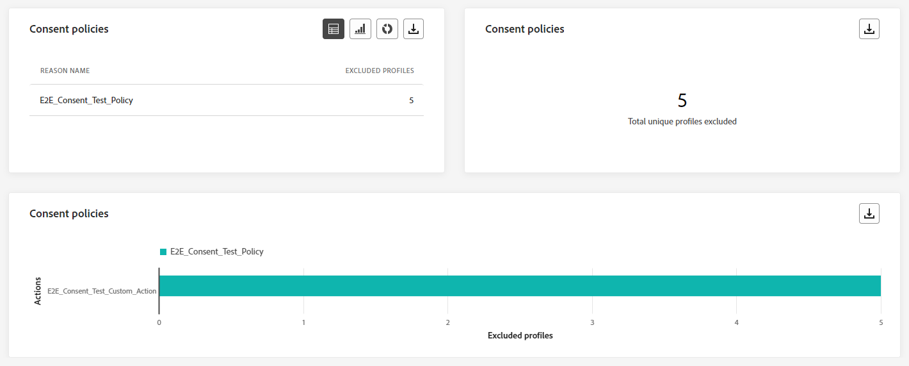
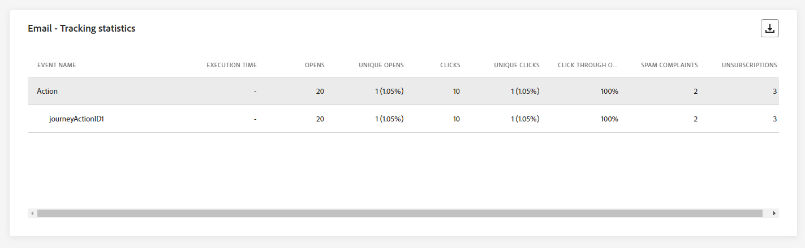
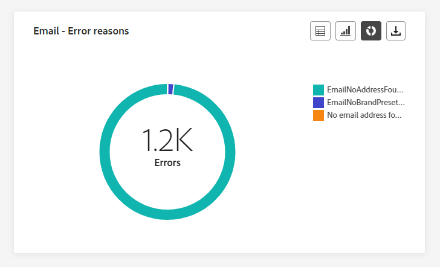
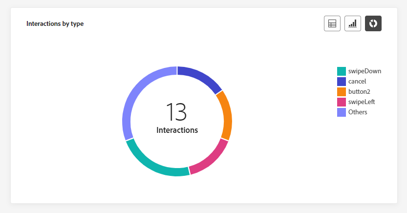

# 历程全局报告 {#journey-global-report}

>[!CONTEXTUALHELP]
>id="ajo_journey_global_report"
>title="历程全局报告"
>abstract="历程全局报告让您可以衡量您的历程在选定时段内产生的影响。报告分为不同的构件，详细说明历程中的成功和错误。可通过调整构件大小或删除构件而修改每个报告仪表板。"

>[!AVAILABILITY]
>
>目前的报告经验将于2025年1月停用。 在此日期之后，新的报告体验将成为标准。我们建议您熟悉新特性和功能，以确保顺利过渡。[开始使用Journey Optimizer的新报告界面。](report-gs-cja.md)

全局报告可从“所有时间”选项卡访问，它显示至少两个小时前发生的事件，并涵盖选定时间段内的事件。 相比之下，实时报表侧重于过去24小时内发生的事件，距事件发生的最小时间间隔为2分钟。

使用&#x200B;**[!UICONTROL 查看报告]**&#x200B;按钮，可以直接从旅程访问历程全局报告。

历程&#x200B;**[!UICONTROL 全局报告]**&#x200B;页面将显示以下选项卡：

* [历程](#journey-global)
* [电子邮件](#email-global)
* [推送](#push-global)
* [短信](#sms-global)
* [应用程序内](#in-app-global)

历程&#x200B;**[!UICONTROL 全局报告]**&#x200B;被分为多个小部件，其中详细说明了历程的成功和错误。 如果需要，可以调整每个小部件的大小并将其删除。 有关此内容的更多信息，请参阅此[部分](global-report.md#modify-dashboard)。

有关Adobe Journey Optimizer中可用的每个量度的详细列表，请参阅[此页面](global-report.md#list-of-components-global)。

## “历程”选项卡 {#journey-global}

通过历程&#x200B;**[!UICONTROL 全局报告]**，**[!UICONTROL 历程]**&#x200B;选项卡可让您清楚地了解历程的最重要跟踪数据。

### 历程表现 {#journey-perfomance}

>[!CONTEXTUALHELP]
>id="ajo_journey_performance"
>title="历程表现"
>abstract="“历程表现”构件使您能够直观地跟踪目标轮廓在您的历程中的进展路径。"

**[!UICONTROL 历程性能]**&#x200B;小组件允许您在定向用户档案浏览您的历程时直观地跟踪其轨迹。

请注意，节点的配置文件计数仅在配置文件完成节点后更新，而不是在输入节点后更新。 例如，**等待**&#x200B;节点上的配置文件仅在到达指定日期且配置文件已退出该节点时计算。

### 历程统计 {#journey-statistics}

>[!CONTEXTUALHELP]
>id="ajo_journey_statistics"
>title="历程统计"
>abstract="“历程统计”关键绩效量度 (KPI) 作为一种综合仪表板，可提供与您的历程相关的基本量度的深入分析。"

**[!UICONTROL 历程统计数据]**&#x200B;关键绩效指标(KPI)用作一个包含所有内容的仪表板，提供与您的旅程关联的基本量度分析。 其中包括输入的配置文件计数和失败的个人历程实例等详细信息，可全面了解历程的有效性和参与级别。

+++ 了解有关历程统计量度的更多信息

* **[!UICONTROL 输入的配置文件]**：到达历程的进入事件的个人总数。

* **[!UICONTROL 已退出配置文件]**：已退出历程的个人总数。

* **[!UICONTROL 失败的单个历程]**：未成功执行的单个历程总数。

+++

### 操作表现 {#action-performance}

>[!CONTEXTUALHELP]
>id="ajo_journey_action_performance"
>title="操作表现"
>abstract="“操作表现”构件显示了启动操作时发生的最成功的操作。"

**[!UICONTROL 操作性能]**&#x200B;构件表示在触发&#x200B;**[!UICONTROL 操作]**&#x200B;时执行的最成功的操作。

### 热门操作 {#top-actions}

>[!CONTEXTUALHELP]
>id="ajo_journey_top_actions"
>title="热门操作"
>abstract="“热门操作”表格整合了有关您的操作的重要信息，提供了对每项操作的频率和有效性的简明观察。"

**[!UICONTROL 热门操作]**&#x200B;表编译&#x200B;**[!UICONTROL 操作]**&#x200B;上的基本数据。 它提供了有关每个操作的频率和性能的简洁见解。

+++ 了解有关热门操作量度的更多信息

* 已成功执行&#x200B;**[!UICONTROL 个操作]**：历程已成功执行的&#x200B;**[!UICONTROL 个操作]**&#x200B;的总数。

* **[!UICONTROL 操作]**&#x200B;出错： **[!UICONTROL 操作]**&#x200B;发生的错误总数。

+++

### 操作错误原因 {#action-error}

>[!CONTEXTUALHELP]
>id="ajo_journey_actions_error_reasons"
>title="操作错误原因"
>abstract="操作错误原因表格和图形提供了执行操作期间所遇错误的完整摘要，从而全面概述了可能发生的问题。"

**[!UICONTROL 操作错误原因]**&#x200B;表和图形提供了执行&#x200B;**[!UICONTROL 操作]**&#x200B;期间发生的错误的全面概述。

### 按来源列出的事件 {#events-origin}

>[!CONTEXTUALHELP]
>id="ajo_journey_events_origin"
>title="按来源列出的事件"
>abstract="“按来源列出的事件”表格和图形提供了成功接收事件的情况。这些视觉表示内容有助于准确识别有效接收的事件，从而为您的历程中每个事件的表现和影响提供有价值的洞察。"

**[!UICONTROL 按源分类的事件]**&#x200B;表和图表提供了成功接收&#x200B;**[!UICONTROL 事件]**&#x200B;的详细视角。 通过这些可视化表示法，您可以准确地识别哪些&#x200B;**[!UICONTROL 事件]**&#x200B;被有效接收，从而针对历程中各个事件的性能和影响提供宝贵的见解。

### 按事件显示接收的事件 {#events-received}

>[!CONTEXTUALHELP]
>id="ajo_journey_events_received"
>title="按事件显示接收的事件"
>abstract="“按事件显示接收的事件”图型有助于识别和分析您的历程中有效执行的特定事件，从而提供有关单个事件的表现和成功率的宝贵洞察。"

通过事件&#x200B;]**接收的**[!UICONTROL &#x200B;事件图表，您可以识别和分析历程中哪个特定&#x200B;**[!UICONTROL 事件]**&#x200B;被有效执行，从而针对各个事件的性能和成功率提供有价值的分析。

### 热门事件 {#top-events}

>[!CONTEXTUALHELP]
>id="ajo_journey_top_events"
>title="热门事件"
>abstract="“热门事件”表格整合了有关事件的基本数据，提供了对每个事件的频率和表现的简明观察。"

**[!UICONTROL 热门事件]**&#x200B;表编译&#x200B;**[!UICONTROL 事件]**&#x200B;上的基本数据。 它提供了每个&#x200B;**[!UICONTROL 事件]**&#x200B;的频率和性能的简明见解。

### 同意政策 {#consent-policies}

>[!CONTEXTUALHELP]
>id="ajo_journey_consent_policies"
>title="同意政策"
>abstract="“同意政策”表格和图形显示从自定义操作中的每项策略中排除的轮廓的数量。其中清楚地展示了每项同意政策对轮廓排除情况的影响。"

**[!UICONTROL 同意策略]**&#x200B;表和图表显示了自定义操作中从每个策略中排除的用户档案数。 这可以清楚地了解每个同意策略对配置文件排除的影响。

有关自定义操作的详细信息，请参阅[详细文档](../action/about-custom-action-configuration.md)。

请注意，要让这些构件显示在历程报表中，您需要重置仪表板。 为此，请在报表顶部单击&#x200B;**[!UICONTROL 修改]**，然后单击&#x200B;**[!UICONTROL 重置]**。

## 电子邮件选项卡 {#email-global}

在历程&#x200B;**[!UICONTROL 全局报告]**&#x200B;中，**[!UICONTROL 电子邮件]**&#x200B;选项卡详细列出了与历程中发送的电子邮件相关的主要信息。

### 电子邮件 - 发送统计数据 {#email-sending-statistics}

>[!CONTEXTUALHELP]
>id="ajo_journey_email_sending_statistics"
>title="电子邮件 - 发送统计数据"
>abstract="“电子邮件 - 发送统计数据”表汇总有关电子邮件的基本数据，如定向邮件或已送达邮件。"

**[!UICONTROL 电子邮件发送统计数据]**&#x200B;表提供了有关历程中电子邮件的基本数据的全面摘要。 它详细说明了关键量度，例如目标受众规模以及成功投放的电子邮件数量，为您的电子邮件和历程的有效性和影响范围提供了有价值的见解。

+++ 了解有关电子邮件发送统计量度的更多信息

* **[!UICONTROL 执行时间]**：如果为定期历程，则为每次历程执行的开始时间。 要仅定位一个或多个重复实例，请从&#x200B;**[!UICONTROL 执行时间]**&#x200B;下拉列表中选择它。

* **[!UICONTROL 目标]**：任何操作（如发送电子邮件或短信）的目标用户档案数。

* **[!UICONTROL 已发送]**：为历程发送的电子邮件总数。

* **[!UICONTROL 已投放]**：成功发送的电子邮件数与已发送的电子邮件总数相关。

* **[!UICONTROL 投放率]**：成功发送的电子邮件百分比。

* **[!UICONTROL 跳出次数]**：发送过程中累计的错误总数以及自动返回处理与已发送电子邮件总数之间的关系。

* **[!UICONTROL 跳出率]**：与已发送电子邮件相比跳出的电子邮件百分比。

* **[!UICONTROL 错误]**：发送过程中发生的阻止将错误发送到用户档案的错误总数。

* **[!UICONTROL 错误率]**：发送过程中发生的与已发送的电子邮件相比无法发送该邮件的错误百分比。

* **[!UICONTROL 重试]**：重试队列中的电子邮件数。

* **[!UICONTROL 已排除]**： Adobe Journey Optimizer已排除的用户档案数。

+++

### 电子邮件 - 跟踪统计数据 {#email-tracking}

>[!CONTEXTUALHELP]
>id="ajo_journey_email_tracking_statistics"
>title="电子邮件 - 跟踪统计数据"
>abstract="“电子邮件 - 跟踪统计数据”表提供有关电子邮件的轮廓活动的数据。"

**[!UICONTROL 电子邮件 — 跟踪统计数据]**&#x200B;表提供与历程中包含的电子邮件相关的配置文件活动的详细帐户。 其中包括打开次数、点击次数和其他相关参与指示器的指标，可全面了解用户档案与电子邮件内容的交互方式。

+++ 了解有关电子邮件 — 跟踪统计量度的更多信息

* **[!UICONTROL 执行时间]**：历程中每次执行定期电子邮件的开始时间。 要仅定向一个或多个定期电子邮件，请从&#x200B;**[!UICONTROL 执行时间]**&#x200B;下拉列表中选择它。

* **[!UICONTROL 打开次数]**：您的电子邮件在历程中打开的次数。

* **[!UICONTROL 独特打开次数]**：已打开电子邮件的百分比。

* **[!UICONTROL 唯一打开率]**：与已送达电子邮件数相比的已打开电子邮件总数。

* **[!UICONTROL 点击次数]**：内容在电子邮件中的点击次数。

* **[!UICONTROL 唯一点击次数]**：点击您电子邮件中内容的收件人数量。

* **[!UICONTROL 点进率]**：与历程交互的用户百分比。

* **[!UICONTROL 取消订阅]**：取消订阅链接的点击次数。

* **[!UICONTROL 垃圾邮件投诉次数]**：您的电子邮件被声明为垃圾邮件或垃圾邮件的次数。

+++

### 电子邮件 - 发送效果 {#email-performance}

>[!CONTEXTUALHELP]
>id="ajo_journey_email_sending_performance"
>title="电子邮件 - 发送效果"
>abstract="“电子邮件 - 发送效果”图表呈现有关已发送的电子邮件的全面数据，其中提供对是否送达和退回次数等关键量度的洞察，从而可详细地分析电子邮件送达过程。"

**[!UICONTROL 电子邮件 — 发送性能]**&#x200B;图形全面查看与历程中发送的电子邮件相关的数据，并提供对关键量度（如送达次数和跳出次数）的分析。 这样即可对电子邮件发送过程进行详细分析，从而提供关于历程效率和性能的宝贵信息。

+++ 了解有关电子邮件 — 发送性能指标的更多信息

* **[!UICONTROL 已投放]**：成功发送的电子邮件数与已发送的电子邮件总数相关。

* **[!UICONTROL 跳出次数]**：在发送进程和自动返回处理期间累计的错误总数与已发送消息的总数之比。

* **[!UICONTROL 重试]**：重试队列中的电子邮件数。

* **[!UICONTROL 错误]**：发送过程中发生的阻止将错误发送到用户档案的错误总数。

+++

### 电子邮件 - 退回类别和原因 {#email-bounce-categories}

>[!CONTEXTUALHELP]
>id="ajo_journey_email_bounces"
>title="电子邮件 - 退回类别和原因"
>abstract="“电子邮件 - 退回类别和原因”构件汇总了有关退回邮件的数据，提供了对导致电子邮件退回的具体原因和类别的深入洞察"

**[!UICONTROL 退回原因]**&#x200B;和&#x200B;**[!UICONTROL 退回类别]**&#x200B;小组件编译与退回邮件相关的可用数据，提供电子邮件退回背后的具体原因和类别的详细分析。

有关退回的详细信息，请参阅[禁止显示列表](../reports/suppression-list.md)页面。

+++ 了解有关电子邮件 — 退回类别量度的更多信息

* **[!UICONTROL 硬退回]**：永久错误的总数，如电子邮件地址错误。 这涉及显式声明地址无效的错误消息，例如“未知用户”。

* **[!UICONTROL 软退回]**：临时错误的总数，如收件箱已满。

* **[!UICONTROL Ignored]**：临时总数，例如“不在办公室”或技术错误，例如，如果发件人类型为“邮递员”。

+++

### 电子邮件 - 错误原因 {#email-errors}

>[!CONTEXTUALHELP]
>id="ajo_journey_email_error_reasons"
>title="电子邮件 - 错误原因"
>abstract="通过“电子邮件 - 错误原因”图表，可了解在发送过程中发生的具体错误。"

**[!UICONTROL 错误原因]**&#x200B;图形和表提供了在发送过程中发生的特定错误的可见性，提供了有关错误性质和发生情况的宝贵信息。

### 电子邮件 - 排除的原因 {#email-excluded}

>[!CONTEXTUALHELP]
>id="ajo_journey_email_excluded_reasons"
>title="电子邮件 - 排除的原因"
>abstract="“排除的原因”图表说明导致从目标受众中排除用户轮廓，从而收不到消息的各种因素。"

**[!UICONTROL 排除的原因]**&#x200B;图形和表全面介绍了导致从目标受众中排除用户个人资料导致未收到消息的各种因素。

有关排除原因的完整列表，请参阅[此页面](exclusion-list.md)。

### 按域列出的已发送和已送达邮件 {#sent-domains}

>[!CONTEXTUALHELP]
>id="ajo_journey_email_sent_delivered_domains"
>title="按域列出的已发送和已送达邮件"
>abstract="按域列出的已发送和已送达邮件表格和图形提供了按域分类的电子邮件细分，可提供对电子邮件通信整体性能的深入洞察。"

**[!UICONTROL 由域发送和传送的]**&#x200B;表格和图形在域级别提供了电子邮件的详细细目，提供了关于电子邮件性能的全面见解。

+++ 了解有关“按域发送和交付”指标的更多信息

* **[!UICONTROL 已发送]**：您的电子邮件的发送总数。

* **[!UICONTROL 已投放]**：成功发送的电子邮件数与已发送的电子邮件总数相关。

+++

### 按域列出的打开和点击数 {#open-domains}

>[!CONTEXTUALHELP]
>id="ajo_journey_email_open_clicks_domains"
>title="按域列出的打开和点击数"
>abstract="按域列出的打开和点击数图形和表格提供了域级别的详细细分，全面展示了受众如何与您的电子邮件参与。"

**[!UICONTROL 按域打开和点击]**&#x200B;图形和表格显示了您的个人资料与电子邮件互动的域级细分，提供了有关不同域如何与您的内容交互的宝贵见解。

+++ 了解有关“按域列出的打开和点击次数”量度的更多信息

* **[!UICONTROL 打开次数]**：电子邮件的打开次数。

* **[!UICONTROL 点击次数]**：在电子邮件中点击内容的次数。

+++

### 按域列出的退回和错误 {#bounces-domains}

>[!CONTEXTUALHELP]
>id="ajo_journey_email_bounces_errors_domains"
>title="按域列出的退回和错误"
>abstract="按域列出的退回和错误图形和表格提供了域级别的精细细分，可深入了解电子邮件发送过程中遇到的特定错误。"

按域&#x200B;]**列出的**[!UICONTROL &#x200B;退回和错误图表和表格提供了发送过程中遇到的特定错误的域级细分，提供了所发生问题的详细分析。

+++ 详细了解按域列出的退回和错误量度

* **[!UICONTROL 跳出次数]**：发送过程中累计的错误总数以及自动返回处理与已发送电子邮件总数之间的关系。

* **[!UICONTROL 错误]**：发送过程中发生的阻止将错误发送到用户档案的错误总数。

+++

### 按域列出的退回原因 {#bounce-reasons-domains}

>[!CONTEXTUALHELP]
>id="ajo_journey_email_bounces_reasons_domains"
>title="按域列出的退回原因"
>abstract="“按域列出的退回原因”图形和表格包含域级别的细分，提供了对临时和永久错误的综合洞察。此详细分析为您提供有关退回邮件背后具体原因的宝贵信息。"

按域&#x200B;]**列出的**[!UICONTROL &#x200B;退回原因图表和表提供了有关临时和永久错误的域级数据细分，提供了有关退回消息背后原因的详细见解。

### 电子邮件 - 热门 URL {#email-top}

>[!CONTEXTUALHELP]
>id="ajo_journey_email_top_url"
>title="电子邮件 - 热门 URL"
>abstract="“电子邮件 - 热门 URL”图表全面概述电子邮件中获得访客流量最高的 URL，从而可找出最热门的链接。"

**[!UICONTROL 电子邮件 — 顶级URL]**&#x200B;图形和表提供了电子邮件中吸引最高访客流量的URL的全面概述。 这使您能够识别最受欢迎的链接并排定其优先级，从而加深您对电子邮件中特定内容的用户档案参与情况的了解。

###  电子邮件 - 优化  {#email-sto}

>[!CONTEXTUALHELP]
>id="ajo_journey_email_optimization"
>title=" 电子邮件 - 优化 "
>abstract="“发送时间优化”以及“已优化”和“未优化”构件提供了有关您的消息的详细信息，并突出显示它们是否已优化。"

>[!NOTE]
>
>仅当为您的投放激活发送时间优化选项时，**[!UICONTROL 发送时间优化]**&#x200B;和&#x200B;**[!UICONTROL 优化与未优化]**&#x200B;构件才可用。 有关发送时间优化的更多信息，请参阅[此页面](../building-journeys/journeys-message.md#send-time-optimization)。

**[!UICONTROL 发送时间优化]**&#x200B;和&#x200B;**[!UICONTROL 已优化与未优化]**&#x200B;构件根据发送方法（已优化或正常）详细列出您的电子邮件是否成功。

+++ 了解有关发送时间优化和已优化与未优化量度的更多信息

* **[!UICONTROL 已投放]**：成功发送的邮件数与已发送的邮件总数相关。
* **[!UICONTROL 跳出次数]**：在发送进程和自动返回处理期间累计的错误总数与已发送消息的总数之比。

* **[!UICONTROL 已发送]**：为历程发送的电子邮件总数。

* **[!UICONTROL 打开次数]**：您的电子邮件在历程中打开的次数。

* **[!UICONTROL 点击次数]**：在电子邮件中点击内容的次数。

+++

### 电子邮件 - 产品建议 {#email-offers}

>[!CONTEXTUALHELP]
>id="ajo_journey_email_offers"
>title="电子邮件 - 产品建议"
>abstract="“产品建议统计”和“产品建议详细统计”构件提供了对产品建议绩效的全面洞察，提供了其随时间产生影响的详细分析，并提供了详细的统计数据，以供更深入的了解。"

>[!NOTE]
>
>仅在电子邮件中插入决策时，优惠小组件和量度才可用。 有关决策管理的详细信息，请参阅此[页面](../offers/get-started/starting-offer-decisioning.md)。

**[!UICONTROL 优惠统计数据]**&#x200B;和&#x200B;**[!UICONTROL 随时间变化的优惠统计数据]**&#x200B;小组件衡量您的优惠是否成功及对目标受众的影响。 它会使用KPI详细描述与消息相关的主要信息。

+++ 了解有关电子邮件 — 优惠指标的更多信息

* **[!UICONTROL 已发送优惠]**：优惠的发送总数。

* **[!UICONTROL 优惠展示]**：优惠在电子邮件中的打开次数。

* **[!UICONTROL 优惠点击次数]**：优惠在电子邮件中的点击次数。

* **[!UICONTROL 投放位置名称]**：用于显示优惠的投放位置名称。 有关版面的详细信息，请参阅此[页面](../offers/offer-library/creating-placements.md)。

* **[!UICONTROL 选件名称]**：在电子邮件中添加的选件名称。 有关版面的详细信息，请参阅此[页面](../offers/offer-library/creating-personalized-offers.md)。

* **[!UICONTROL 已发送优惠]**：优惠的发送总数。

* **[!UICONTROL 优惠展示率]**：已打开优惠与已发送优惠的百分比之比。

* **[!UICONTROL 优惠点击率]**：与优惠交互的用户百分比。

+++

## 推送通知选项卡 {#push-global}

在历程&#x200B;**[!UICONTROL 全局报告]**&#x200B;中，**[!UICONTROL 推送通知]**&#x200B;选项卡详细介绍了与历程中发送的推送通知相关的主要信息。

### 推送通知 - 发送统计数据 {#push-sending-stat}

>[!CONTEXTUALHELP]
>id="ajo_journey_push_sending_statistics"
>title="推送通知 - 发送统计数据"
>abstract="“推送通知发送统计数据”表汇总有关推送通知的基本数据，如定向消息或已送达消息。"

**[!UICONTROL 推送通知 — 发送统计数据]**&#x200B;表提供与推送通知相关的基本数据的简要摘要，包括关键量度，例如定向消息数和成功投放消息数。

+++ 了解有关推送通知 — 发送统计量度的更多信息

* **[!UICONTROL 执行时间]**：如果为定期历程，则为每次历程执行的开始时间。 要仅定位一个或多个重复实例，请从&#x200B;**[!UICONTROL 执行时间]**&#x200B;下拉列表中选择它。

* **[!UICONTROL 目标]**：任何操作（如发送电子邮件或短信）的目标用户档案数。

* **[!UICONTROL 已发送]**：已发送的推送通知总数。

* **[!UICONTROL 已传递]**：成功发送的推送通知数与已发送的推送通知总数相关。

* **[!UICONTROL 投放率]**：已成功发送的推送通知的百分比。

* **[!UICONTROL 跳出次数]**：发送过程中累计的错误总数以及自动返回处理与已发送推送通知总数之间的关系。

* **[!UICONTROL 退回率]**：退回的推送通知与已发送的推送通知相比的百分比。

* **[!UICONTROL 错误]**：发送过程中发生的阻止将错误发送到用户档案的错误总数。

* **[!UICONTROL 错误率]**：发送过程中发生的与发送的推送通知相比无法发送的错误百分比。

* **[!UICONTROL 已排除]**： Adobe Journey Optimizer已排除的用户档案数。

+++

### 推送通知 – 跟踪统计数据 {#push-tracking-stat}

>[!CONTEXTUALHELP]
>id="ajo_journey_push_tracking_statistics"
>title="推送通知 – 跟踪统计数据"
>abstract="“推送跟踪统计数据”提供有关推送通知的轮廓活动的数据。"

**[!UICONTROL 推送 — 跟踪统计数据]**&#x200B;小组件提供与推送通知关联的配置文件活动的详细快照，提供有关参与和推送通知有效性的基本见解。

+++ 了解有关推送通知 — 跟踪统计量度的更多信息

* **[!UICONTROL 执行时间]**：如果为定期历程，则为每次历程执行的开始时间。 要仅定位一个或多个重复实例，请从&#x200B;**[!UICONTROL 执行时间]**&#x200B;下拉列表中选择它。

* **[!UICONTROL 打开次数]**：您的推送通知在历程中打开的次数。

* **[!UICONTROL 操作]**：对已送达推送通知执行的操作总数，例如按钮点击或解除。

+++

### 推送通知 - 发送摘要 {#push-summary}

>[!CONTEXTUALHELP]
>id="ajo_journey_push_sending_summary"
>title="推送通知 - 发送摘要"
>abstract="“推送通知发送摘要”图表显示对于已发送的推送通知可用的数据。"

**[!UICONTROL 推送通知 — 发送摘要]**&#x200B;图形提供了动态表示形式，显示了对推送通知活动的分析。 此图形呈现提供了已发送推送通知的全面细分。

+++ 了解有关推送通知 — 发送摘要量度的更多信息

* **[!UICONTROL 打开次数]**：您的推送通知在历程中打开的次数。

* **[!UICONTROL 操作]**：对已送达推送通知执行的操作总数，例如按钮点击或解除。

* **[!UICONTROL 跳出次数]**：发送过程中累计的错误总数以及自动返回处理与已发送推送通知总数之间的关系。

* **[!UICONTROL 已传递]**：成功发送的推送通知数与已发送的推送通知总数相关。

* **[!UICONTROL 错误]**：发送过程中发生的阻止将错误发送到用户档案的错误总数。

+++

### 推送通知 - 错误原因 {#push-error-reasons}

>[!CONTEXTUALHELP]
>id="ajo_journey_push_error_reasons"
>title="推送通知 - 错误原因"
>abstract="通过“错误原因”图表，可了解在发送过程中发生的具体错误"

**[!UICONTROL 错误原因]**&#x200B;表和图形使您能够识别推送通知发送过程中发生的特定错误，从而详细了解过程中遇到的任何问题。

### 推送通知 - 排除的原因 {#push-excluded}

>[!CONTEXTUALHELP]
>id="ajo_journey_push_excluded_reasons"
>title="推送通知 - 排除的原因"
>abstract="“排除的原因”图表说明了阻止被排除在目标受众之外的用户轮廓接收消息的各种因素。"

**[!UICONTROL 排除的原因]**&#x200B;图形和表显示了阻止从目标用户档案排除的用户配置文件接收推送通知的不同原因。

有关排除原因的完整列表，请参阅[此页面](exclusion-list.md)。

### 推送通知 - 按平台细分 {#push-breakdown}

>[!CONTEXTUALHELP]
>id="ajo_journey_push_breakdown_platform"
>title="推送通知 - 按平台细分"
>abstract="“推送通知 - 按平台细分”图形和表格提供了基于轮廓操作系统的推送通知成功情况的细分。"

**[!UICONTROL 按平台]**&#x200B;划分的图表和表提供了推送通知成功情况的详细分析，并根据用户档案的操作系统提供了见解。 此划分可让您更好地了解推送通知在不同平台上的执行情况。

### 推送通知 — 优化 {#push-sto}

>[!NOTE]
>
>仅当为您的投放激活发送时间优化选项时，**[!UICONTROL 优化与未优化]**&#x200B;和&#x200B;**[!UICONTROL 发送时间优化]**&#x200B;构件才可用。 有关发送时间优化的更多信息，请参阅[此页面](../building-journeys/journeys-message.md#send-time-optimization)。

**[!UICONTROL 已优化和未优化]**&#x200B;和&#x200B;**[!UICONTROL 发送时间优化]**&#x200B;小组件详细介绍了与您的消息相关的主要信息，无论它们是否已优化。

+++ 了解有关推送通知 — 优化量度的更多信息

* **[!UICONTROL 已投放]**：成功发送的邮件数与已发送的邮件总数相关。

* **[!UICONTROL 打开次数]**：您的推送通知在历程中打开的次数。

* **[!UICONTROL 操作]**：对已送达推送通知执行的操作总数，例如按钮点击或解除。

* **[!UICONTROL 已投放]**：成功发送的邮件数与已发送的邮件总数相关。

* **[!UICONTROL 跳出次数]**：在发送进程和自动返回处理期间累计的错误总数与已发送消息的总数之比。

+++

## 短信选项卡 {#sms-global}

### 短信 - 发送统计数据 {#sms-sending-stat}

>[!CONTEXTUALHELP]
>id="ajo_journey_sms_sending_statistics"
>title="短信 - 发送统计数据"
>abstract="“短信 - 发送统计数据”表格汇总了有关短信的基本数据，如定向消息或已送达消息。"

**[!UICONTROL SMS — 发送统计数据]**&#x200B;表提供与您的SMS消息相关的基本数据的简要摘要，包括关键量度，例如定向消息数和成功投放消息数。

+++ 了解有关短信 — 发送统计量度的更多信息

* **[!UICONTROL 执行时间]**：如果为定期历程，则为每次历程执行的开始时间。 要仅定位一个或多个重复实例，请从&#x200B;**[!UICONTROL 执行时间]**&#x200B;下拉列表中选择它。

* **[!UICONTROL 目标]**：符合短信消息目标用户档案资格的用户档案数。

* **[!UICONTROL 已排除]**：未收到短信的用户配置文件数（从定向配置文件中排除）。

* **[!UICONTROL 已发送]**：为历程发送的短信消息总数。

* **[!UICONTROL 跳出次数]**：发送过程中累计的错误总数以及自动返回处理与已发送短信消息总数之间的关系。

* **[!UICONTROL 错误]**：发送过程中发生的阻止将错误发送到用户档案的错误总数。

+++

### 短信 - 跟踪统计数据 {#sms-tracking-stat}

>[!CONTEXTUALHELP]
>id="ajo_journey_sms_tracking_statistics"
>title="短信 - 跟踪统计数据"
>abstract="“短信 - 跟踪统计数据”构件全面概述了有关访客与 URL 交互的基本信息。"

**[!UICONTROL SMS — 跟踪统计数据]**&#x200B;小组件提供与访客与URL的参与相关的关键信息的详细概述，提供对SMS消息有效性的洞察。

* **[!UICONTROL 执行时间]**：定期短信每次执行的开始时间。 要仅定位一个或多个定期短信，请从&#x200B;**[!UICONTROL 执行时间]**&#x200B;下拉列表中选择它。

* **[!UICONTROL 点击次数]**：在短信消息中点击内容的次数。

### 短信 - 各日期的效果 {#sms-performance-date}

>[!CONTEXTUALHELP]
>id="ajo_journey_sms_perfomance_date"
>title="短信 - 各日期的效果"
>abstract="“短信 - 各日期的效果”构件以图形表示形式提供有关消息的关键信息。"

**[!UICONTROL 短信 — 按日期列出的性能]**&#x200B;构件详细概述了与消息相关的关键信息，这些信息通过图形显示，提供了特定时间段内性能趋势的见解。

+++ 了解有关短信的更多信息 — 按日期列出的绩效指标

* **[!UICONTROL 已发送]**：为历程发送的短信消息总数

* **[!UICONTROL 跳出次数]**：发送过程中累计的错误总数以及自动返回处理与已发送短信消息总数之间的关系。

* **[!UICONTROL 错误]**：发送过程中发生的阻止将错误发送到用户档案的错误总数。

+++

### 短信 - 退回原因 {#sms-bounce}

>[!CONTEXTUALHELP]
>id="ajo_journey_sms_bounces_reasons"
>title="短信 - 退回原因"
>abstract="“退回原因”图表包含与退回邮件相关的可用数据。"

**[!UICONTROL 退回原因]**&#x200B;图形和表提供与退回的短信消息相关的数据的全面概述，从而针对SMS消息退回实例背后的具体原因提供有价值的见解。

### 短信 - 错误原因 {#sms-error}

>[!CONTEXTUALHELP]
>id="ajo_journey_sms_error_reasons"
>title="短信 - 错误原因"
>abstract="通过“短信 - 错误原因”图表，可了解在发送过程中发生的具体错误。"

**[!UICONTROL 错误原因]**&#x200B;图形和表允许您识别在发送短信消息过程中发生的特定错误，从而便于彻底分析遇到的任何问题。

### 短信 - 排除的原因 {#sms-excluded}

>[!CONTEXTUALHELP]
>id="ajo_journey_sms_excluded_reasons"
>title="短信 - 排除的原因"
>abstract="“排除的原因”图表说明导致从目标受众中排除用户轮廓，从而收不到消息的各种因素。"

**[!UICONTROL 排除的原因]**&#x200B;图形和表直观地描述了导致从目标受众中排除用户配置文件，阻止他们接收短信消息的各种因素。

有关排除原因的完整列表，请参阅[此页面](exclusion-list.md)。

### 短信 - 按链接显示的点击次数 {#sms-clicks}

>[!CONTEXTUALHELP]
>id="ajo_journey_sms_clicks"
>title="短信 - 按链接显示的点击次数"
>abstract="“短信 - 按链接显示的点击次数”构件提供有关访客与消息中的 URL 参与的基本洞察。"

**[!UICONTROL 短信 — 链接点击次数]**&#x200B;小组件提供了有关访客与消息中所包含URL参与度的基本信息，提供了有关哪些链接吸引最多交互的宝贵信息。

## 应用程序内选项卡 {#in-app-global}

在您的历程&#x200B;**[!UICONTROL 全局报告]**&#x200B;中，**[!UICONTROL 应用程序内]**&#x200B;选项卡详细介绍了与历程中发送的应用程序内消息相关的主要信息。

### 应用程序内性能 {#inapp-performance}

>[!CONTEXTUALHELP]
>id="ajo_journey_inapp_performance"
>title="应用程序内性能"
>abstract="“应用程序内性能”KPI 提供针对访客与应用程序内消息参与的基本洞察。"

**[!UICONTROL 应用程序内性能]** KPI提供了有关用户档案与应用程序内消息互动情况的基本信息，提供了评估历程中包含的应用程序内消息的有效性和影响的基本量度。

+++ 了解有关应用程序内 — 按日期列出的性能指标的更多信息

* **[!UICONTROL 独特展示次数]**：向其显示应用程序内消息的独特用户数。

* **[!UICONTROL 展示次数]**：向所有用户显示的应用程序内消息总数。

  >[!NOTE]
  >
  >要确保计入展示次数，用户必须满足两个条件：
  >* 应用程序内体验中的资格，通过访问其历程中的特定应用程序内活动来实现。
  >* 满足触发器规则中指定的条件。
  > 
  >由于第二标准，目标用户档案的数量和独特展示次数之间可能存在显着差异。

* **[!UICONTROL 交互]**：与应用程序内消息的参与次数。 这包括用户执行的任何操作，例如单击、解除或任何其他交互。
+++

### 应用程序内摘要 {#inapp-summary}

>[!CONTEXTUALHELP]
>id="ajo_journey_inapp_summary"
>title="应用程序内摘要"
>abstract="“应用程序内摘要”图表显示指定时段内应用程序内展示和交互的进展。"

**[!UICONTROL 应用程序内摘要]**&#x200B;图形说明了指定时间段内应用程序内展示和交互的进度，提供了应用程序内消息性能的全面概述。

### 各类型的交互 {#interactions-type}

>[!CONTEXTUALHELP]
>id="ajo_journey_inapp_interactions"
>title="各类型的交互"
>abstract="“各类型的交互”图表通过跟踪任何点击、取消或交互而详述用户如何与应用程序内消息交互。"

按类型&#x200B;]**进行的**[!UICONTROL &#x200B;交互的图形和表详细介绍了用户档案如何与应用程序内消息、跟踪操作（如点击、解除）或任何其他形式的参与进行交互。
