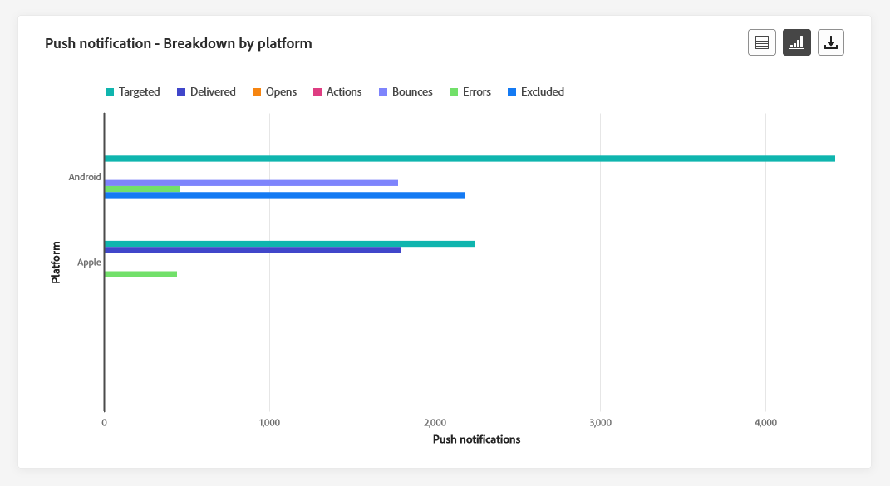

# 历程全局报告 {#journey-global-report}

>[!CONTEXTUALHELP]
>id="ajo_journey_global_report"
>title="历程全局报告"
>abstract="历程全局报告让您可以衡量您的历程在选定时段内产生的影响。报告分为不同的构件，详细说明历程中的成功和错误。可通过调整构件大小或删除构件而修改每个报告仪表板。"

全局报告可从“所有时间”选项卡访问，它显示至少两个小时前发生的事件，并涵盖选定时间段内的事件。 相比之下，实时报表侧重于过去24小时内发生的事件，距事件发生的最小时间间隔为2分钟。

您可以使用直接从旅程访问历程全局报告 **[!UICONTROL 查看报告]** 按钮。

历程 **[!UICONTROL 全局报告]** 页面将显示以下选项卡：

* [历程](#journey-global)
* [电子邮件](#email-global)
* [推送](#push-global)
* [短信](#sms-global)
* [应用程序内](#in-app-global)

历程 **[!UICONTROL 全局报告]** 分为多个构件，其中详细描述历程的成功和错误。 如果需要，可以调整每个小部件的大小并将其删除。 有关详细信息，请参阅此 [部分](global-report.md#modify-dashboard).

有关Adobe Journey Optimizer中可用的每个量度的详细列表，请参阅 [此页面](global-report.md#list-of-components-global).

## “历程”选项卡 {#journey-global}

在您的历程中 **[!UICONTROL 全局报告]**， **[!UICONTROL 历程]** 选项卡让您清楚地了解历程最重要的跟踪数据。

### 历程性能 {#journey-perfomance}

此 **[!UICONTROL 历程性能]** 利用小组件，可在目标用户档案浏览您的历程时直观地跟踪其轨迹。

### 历程统计数据 {#journey-statistics}

此 **[!UICONTROL 历程统计数据]** 关键绩效指标(KPI)作为包罗万象的功能板，提供与您的历程关联的基本量度分析。 其中包括输入的配置文件计数和失败的个人历程实例等详细信息，可全面了解历程的有效性和参与级别。

+++ 了解有关历程统计量度的更多信息

* **[!UICONTROL 输入的配置文件]**：到达历程的进入事件的个人总数。

* **[!UICONTROL 退出的配置文件]**：退出历程的个人总数。

* **[!UICONTROL 失败的个人历程]**：未成功执行的各个历程的总数。

+++

### 操作性能 {#action-performance}

此 **[!UICONTROL 操作性能]** 构件代表在执行 **[!UICONTROL 操作]** 已触发。

### 热门操作 {#top-actions}

此 **[!UICONTROL 热门操作]** 表编译您的上的重要数据 **[!UICONTROL 操作]**. 它提供了有关每个操作的频率和性能的简洁见解。

+++ 了解有关热门操作量度的更多信息

* **[!UICONTROL 已成功执行操作]**：总数 **[!UICONTROL 操作]** 已成功为历程执行。

* **[!UICONTROL 操作出错]**：发生的错误总数 **[!UICONTROL 操作]**.

+++

### 操作错误原因 {#action-error}

此 **[!UICONTROL 操作错误原因]**  表格和图形全面概述了执行期间发生的错误， **[!UICONTROL 操作]**.

### 按来源显示的事件 {#events-origin}

此 **[!UICONTROL 按来源显示的事件]** 表格和图表提供了贵机构成功接收报文的详细情况 **[!UICONTROL 活动]**. 通过这些可视化表示形式，您可以准确地识别您的 **[!UICONTROL 活动]** ，提供了关于历程中各个事件的性能和影响的宝贵见解。

### 按事件显示接收的事件 {#events-received}

此 **[!UICONTROL 按事件显示接收的事件]** 图表使您能够识别和分析特定的 **[!UICONTROL 事件]** 在您的历程中有效地执行，从而针对各个事件的性能和成功率提供有价值的分析。

### 热门事件 {#top-events}

此 **[!UICONTROL 热门事件]** 表编译您的上的重要数据 **[!UICONTROL 活动]**. 它提供了对每个体验的频度和性能的简洁见解 **[!UICONTROL 事件]**.

### 同意政策 {#consent-policies}

此 **[!UICONTROL 同意政策]** 表和图形显示了自定义操作中从每个策略中排除的用户档案数。 这可以清楚地了解每个同意策略对配置文件排除的影响。

有关自定义操作的详细信息，请参阅 [详细文档](../action/about-custom-action-configuration.md).

请注意，要让这些构件显示在历程报表中，您需要重置仪表板。 要执行此操作，请单击 **[!UICONTROL 修改]** 则 **[!UICONTROL 重置]** 在你的报告上面。

## 电子邮件选项卡 {#email-global}

在您的历程中 **[!UICONTROL 全局报告]**， **[!UICONTROL 电子邮件]** 选项卡详细介绍与旅程中发送的电子邮件相关的主要信息。

### 电子邮件发送统计数据 {#email-sending-statistics}

此 **[!UICONTROL 电子邮件发送统计数据]** 表提供有关您的历程中电子邮件的基本数据的全面摘要。 它详细说明了关键量度，例如目标受众规模以及成功投放的电子邮件数量，为您的电子邮件和历程的有效性和影响范围提供了有价值的见解。

+++ 了解有关电子邮件发送统计量度的更多信息

* **[!UICONTROL 执行时间]**：如果为重复历程，则为每次历程执行的开始时间。 要仅定位一个或多个重复实例，请从以下位置选择它： **[!UICONTROL 执行时间]** 下拉菜单。

* **[!UICONTROL 已定位]**：任何操作（如发送电子邮件或短信）的目标用户档案数。

* **[!UICONTROL 已发送]**：为历程发送的电子邮件总数。

* **[!UICONTROL 已投放]**：成功发送的电子邮件数，与已发送电子邮件总数相关。

* **[!UICONTROL 投放率]**：成功发送的电子邮件百分比。

* **[!UICONTROL 跳出次数]**：与已发送电子邮件总数相关的发送过程和自动返回处理期间累计的错误总数。

* **[!UICONTROL 跳出率]**：退回的电子邮件与发送的电子邮件相比的百分比。

* **[!UICONTROL 错误]**：发送过程中发生的阻止将消息发送到用户档案的错误总数。

* **[!UICONTROL 错误率]**：与已发送电子邮件相比，发送过程中发生阻止发送该邮件的错误百分比。

* **[!UICONTROL 重试]**：重试队列中的电子邮件数。

* **[!UICONTROL 已排除]**：Adobe Journey Optimizer已排除的用户档案数。

+++

### 电子邮件 - 跟踪统计数据 {#email-tracking}

此 **[!UICONTROL 电子邮件 — 跟踪统计数据]** 表提供与您的历程中包含的电子邮件相关的用户档案活动的详细描述。 其中包括打开次数、点击次数和其他相关参与指示器的指标，可全面了解用户档案与电子邮件内容的交互方式。

+++ 了解有关电子邮件 — 跟踪统计量度的更多信息

* **[!UICONTROL 执行时间]**：历程中每次执行定期电子邮件的开始时间。 要仅定向一个或多个定期电子邮件，请从中选择它 **[!UICONTROL 执行时间]** 下拉菜单。

* **[!UICONTROL 打开次数]**：您的电子邮件在历程中打开的次数。

* **[!UICONTROL 独特打开次数]**：已打开电子邮件的百分比。

* **[!UICONTROL 独特打开率]**：打开的电子邮件总数，与已投放的电子邮件数相比。

* **[!UICONTROL 点击次数]**：在电子邮件中点击内容的次数。

* **[!UICONTROL 独特点击]**：单击了电子邮件中内容的收件人数量。

* **[!UICONTROL 点进率]**：与历程交互的用户百分比。

* **[!UICONTROL 取消订阅]**：取消订阅链接的点击次数。

* **[!UICONTROL 垃圾邮件投诉数]**：您的电子邮件被声明为垃圾邮件或垃圾邮件的次数。

+++

### 电子邮件 - 发送性能 {#email-performance}

此 **[!UICONTROL 电子邮件 — 发送性能]** graph全面查看与历程中发送的电子邮件相关的数据，并提供对关键量度（如投放和跳出次数）的洞察。 这样即可对电子邮件发送过程进行详细分析，从而提供关于历程效率和性能的宝贵信息。

+++ 了解有关电子邮件 — 发送性能指标的更多信息

* **[!UICONTROL 已投放]**：成功发送的电子邮件数，与已发送电子邮件总数相关。

* **[!UICONTROL 跳出次数]**：在发送流程和自动返回处理期间累计的错误总数与已发送消息总数相关。

* **[!UICONTROL 重试]**：重试队列中的电子邮件数。

* **[!UICONTROL 错误]**：发送过程中发生的阻止将消息发送到用户档案的错误总数。

+++

### 电子邮件 — 退回类别和原因 {#email-bounce-categories}

此 **[!UICONTROL 退回原因]** 和 **[!UICONTROL 退回类别]** 小组件编译与退回邮件相关的可用数据，提供对电子邮件退回具体原因和类别的详细分析。

有关退回的详细信息，请参阅 [禁止显示列表](../reports/suppression-list.md) 页面。

+++ 了解有关电子邮件 — 退回类别量度的更多信息

* **[!UICONTROL 硬退回]**：永久错误的总数，如错误的电子邮件地址。 这涉及显式声明地址无效的错误消息，例如“未知用户”。

* **[!UICONTROL 软退回]**：临时错误的总数，如收件箱已满。

* **[!UICONTROL 已忽略]**：临时总数，例如外出或技术错误，例如，如果发件人类型是邮递员。

+++

### 电子邮件 - 错误原因 {#email-errors}

此 **[!UICONTROL 错误原因]** 图表和表格提供了发送过程中发生的特定错误的可见性，提供了有关错误性质和发生情况的宝贵信息。

### 电子邮件 - 排除原因 {#email-excluded}

此 **[!UICONTROL 排除的原因]** 图表和表格全面介绍了导致从目标受众中排除用户配置文件，从而导致未收到消息的不同因素。

请参阅 [此页面](exclusion-list.md) 以获取排除原因的完整列表。

### 按域列出的已发送和已送达邮件 {#sent-domains}

此  **[!UICONTROL 按域发送和投放]** 表格和图形在域级别提供了电子邮件的详细细分，提供了对电子邮件性能的全面洞察。

+++ 了解有关“按域发送和交付”指标的更多信息

* **[!UICONTROL 已发送]**：您的电子邮件的发送总数。

* **[!UICONTROL 已投放]**：成功发送的电子邮件数，与已发送电子邮件总数相关。

+++

### 按域列出的打开和点击数 {#open-domains}

此  **[!UICONTROL 按域打开和点击]** 图表显示了用户档案与您的电子邮件互动的域级细分，提供了有关不同域与您的内容如何互动的宝贵见解。

+++ 了解有关“按域列出的打开和点击次数”量度的更多信息

* **[!UICONTROL 打开次数]**：电子邮件的打开次数。

* **[!UICONTROL 点击次数]**：在电子邮件中点击内容的次数。

+++

### 按域列出的退回和错误 {#bounces-domains}

此  **[!UICONTROL 按域列出的退回和错误]** 图表和表格提供了发送过程中遇到的特定错误的域级细分，提供了对所发生问题的详细分析。

+++ 详细了解按域列出的退回和错误量度

* **[!UICONTROL 跳出次数]**：与已发送电子邮件总数相关的发送过程和自动返回处理期间累计的错误总数。

* **[!UICONTROL 错误]**：发送过程中发生的阻止将消息发送到用户档案的错误总数。

+++

### 按域列出的退回原因 {#bounce-reasons-domains}

此  **[!UICONTROL 按域列出的退回原因]** 图表提供了有关临时和永久错误的域级数据细分，提供了有关退回消息原因的详细见解。

### 电子邮件 - 热门 URL {#email-top}

此 **[!UICONTROL 电子邮件 — 顶部URL]** 图表和表格提供了电子邮件中吸引最高访客流量的URL的全面概述。 这使您能够识别最受欢迎的链接并排定其优先级，从而加深您对电子邮件中特定内容的用户档案参与情况的了解。

### 电子邮件 — 优化 {#email-sto}

>[!NOTE]
>
>此 **[!UICONTROL 发送时间优化]** 和 **[!UICONTROL 已优化和未优化]** 仅当为您的投放激活发送时间优化选项时，构件才可用。 有关发送时间优化的详细信息，请参阅 [此页面](../building-journeys/journeys-message.md#send-time-optimization).

此 **[!UICONTROL 发送时间优化]** 和 **[!UICONTROL 已优化和未优化]** 小组件根据发送方法（优化或正常）详细描述电子邮件的成功与否。

+++ 了解有关发送时间优化和已优化与未优化量度的更多信息

* **[!UICONTROL 已投放]**：成功发送的消息数，与已发送消息的总数相关。
* **[!UICONTROL 跳出次数]**：在发送流程和自动返回处理期间累计的错误总数与已发送消息总数相关。

* **[!UICONTROL 已发送]**：为历程发送的电子邮件总数。

* **[!UICONTROL 打开次数]**：您的电子邮件在历程中打开的次数。

* **[!UICONTROL 点击次数]**：在电子邮件中单击内容的次数。

+++

### 电子邮件 — 优惠 {#email-offers}

>[!NOTE]
>
>仅在电子邮件中插入决策时，优惠小组件和量度才可用。 有关决策管理的更多信息，请参阅此 [页面](../offers/get-started/starting-offer-decisioning.md).

此 **[!UICONTROL 优惠统计数据]** 和 **[!UICONTROL 优惠的详细统计数据]** 随着时间的推移，小组件将衡量您选件的成功情况以及对目标受众的影响。 它会使用KPI详细描述与消息相关的主要信息。

+++ 了解有关电子邮件 — 优惠指标的更多信息

* **[!UICONTROL 已发送优惠]**：选件的发送总数。

* **[!UICONTROL 优惠展示]**：选件在电子邮件中打开的次数。

* **[!UICONTROL 优惠点击次数]**：选件在电子邮件中被点按的次数。

* **[!UICONTROL 投放位置名称]**：用于显示优惠的投放位置的名称。 有关版面的详细信息，请参阅此 [页面](../offers/offer-library/creating-placements.md).

* **[!UICONTROL 选件名称]**：在电子邮件中添加的选件名称。 有关版面的详细信息，请参阅此 [页面](../offers/offer-library/creating-personalized-offers.md).

* **[!UICONTROL 已发送优惠]**：选件的发送总数。

* **[!UICONTROL 优惠展示率]**：已打开选件的数量与已发送选件数量的百分比。

* **[!UICONTROL 优惠点击率]**：与选件交互的用户百分比。

+++

## 推送通知选项卡 {#push-global}

在您的历程中 **[!UICONTROL 全局报告]**， **[!UICONTROL 推送通知]** 选项卡详细列出了与历程中发送的推送通知相关的主要信息。

### 推送通知 - 发送统计数据 {#push-sending-stat}

此 **[!UICONTROL 推送通知 — 发送统计数据]** 表提供与推送通知相关的基本数据的简要摘要，包括关键量度，例如定向消息数量和成功投放消息数量。

+++ 了解有关推送通知 — 发送统计量度的更多信息

* **[!UICONTROL 执行时间]**：如果为重复历程，则为每次历程执行的开始时间。 要仅定位一个或多个重复实例，请从以下位置选择它： **[!UICONTROL 执行时间]** 下拉菜单。

* **[!UICONTROL 已定位]**：任何操作（如发送电子邮件或短信）的目标用户档案数。

* **[!UICONTROL 已发送]**：发送的推送通知总数。

* **[!UICONTROL 已投放]**：成功发送的推送通知数，与已发送推送通知的总数相关。

* **[!UICONTROL 投放率]**：已成功发送的推送通知的百分比。

* **[!UICONTROL 跳出次数]**：在发送流程和自动返回处理期间累计的错误总数与已发送推送通知的总数相关。

* **[!UICONTROL 跳出率]**：退回的推送通知与已发送的推送通知相比的百分比。

* **[!UICONTROL 错误]**：发送过程中发生的阻止将消息发送到用户档案的错误总数。

* **[!UICONTROL 错误率]**：与发送的推送通知相比，发送过程中发生阻止发送该消息的错误百分比。

* **[!UICONTROL 已排除]**：Adobe Journey Optimizer已排除的用户档案数。

+++

### 推送通知 – 跟踪统计数据 {#push-tracking-stat}

此 **[!UICONTROL 推送 — 跟踪统计数据]** 构件提供与推送通知绑定的用户档案活动的详细快照，提供关于参与和推送通知有效性的基本见解。

+++ 了解有关推送通知 — 跟踪统计量度的更多信息

* **[!UICONTROL 执行时间]**：如果为重复历程，则为每次历程执行的开始时间。 要仅定位一个或多个重复实例，请从以下位置选择它： **[!UICONTROL 执行时间]** 下拉菜单。

* **[!UICONTROL 打开次数]**：您的推送通知在历程中打开的次数。

* **[!UICONTROL 操作]**：对已投放推送通知执行的总操作数，例如按钮点击或解除。

+++

### 推送通知 - 发送摘要 {#push-summary}

此 **[!UICONTROL 推送通知 — 发送摘要]** 图形提供动态表示形式，显示推送通知活动的分析。 此图形呈现提供了已发送推送通知的全面细分。

+++ 了解有关推送通知 — 发送摘要量度的更多信息

* **[!UICONTROL 打开次数]**：您的推送通知在历程中打开的次数。

* **[!UICONTROL 操作]**：对已投放推送通知执行的总操作数，例如按钮点击或解除。

* **[!UICONTROL 跳出次数]**：在发送流程和自动返回处理期间累计的错误总数与已发送推送通知的总数相关。

* **[!UICONTROL 已投放]**：成功发送的推送通知数，与已发送推送通知的总数相关。

* **[!UICONTROL 错误]**：发送过程中发生的阻止将消息发送到用户档案的错误总数。

+++

### 推送通知 - 错误原因 {#push-error-reasons}

此 **[!UICONTROL 错误原因]** 表格和图形使您能够识别在推送通知发送过程中发生的特定错误，从而为您提供在此过程中遇到的任何问题的详细见解。

### 推送通知 - 排除原因 {#push-excluded}

此 **[!UICONTROL 排除的原因]** 图形和表格显示了阻止从定向用户档案中排除的用户用户档案接收推送通知的不同原因。

请参阅 [此页面](exclusion-list.md) 以获取排除原因的完整列表。

### 推送通知 - 按平台细分 {#push-breakdown}

此 **[!UICONTROL 按平台细分]** 图表提供推送通知成功情况的详细分析，并根据用户档案的操作系统提供见解。 此划分可让您更好地了解推送通知在不同平台上的执行情况。

### 推送通知 — 优化 {#push-sto}

>[!NOTE]
>
>此 **[!UICONTROL 已优化和未优化]** 和 **[!UICONTROL 发送时间优化]**  仅当为您的投放激活发送时间优化选项时，构件才可用。 有关发送时间优化的详细信息，请参阅 [此页面](../building-journeys/journeys-message.md#send-time-optimization).

此 **[!UICONTROL 已优化和未优化]** 和 **[!UICONTROL 发送时间优化]**  小组件详细说明与您的消息相关的主要信息，无论它们是否已优化。

+++ 了解有关推送通知 — 优化量度的更多信息

* **[!UICONTROL 已投放]**：成功发送的消息数，与已发送消息的总数相关。

* **[!UICONTROL 打开次数]**：您的推送通知在历程中打开的次数。

* **[!UICONTROL 操作]**：对已投放推送通知执行的总操作数，例如按钮点击或解除。

* **[!UICONTROL 已投放]**：成功发送的消息数，与已发送消息的总数相关。

* **[!UICONTROL 跳出次数]**：在发送流程和自动返回处理期间累计的错误总数与已发送消息总数相关。

+++

## 短信选项卡 {#sms-global}

### 短信 - 发送统计数据 {#sms-sending-stat}

此 **[!UICONTROL 短信 — 发送统计数据]** 表提供与短信消息相关的基本数据的简要摘要，其中包括关键量度，例如定向消息数量和成功投放消息计数。

+++ 了解有关短信 — 发送统计量度的更多信息

* **[!UICONTROL 执行时间]**：如果为重复历程，则为每次历程执行的开始时间。 要仅定位一个或多个重复实例，请从以下位置选择它： **[!UICONTROL 执行时间]** 下拉菜单。

* **[!UICONTROL 已定位]**：符合短信消息目标用户档案资格的用户档案数。

* **[!UICONTROL 已排除]**：从定向用户档案中排除且未收到短信消息的用户用户档案数。

* **[!UICONTROL 已发送]**：为历程发送的短信消息总数。

* **[!UICONTROL 跳出次数]**：在发送流程和自动返回处理期间累计的错误总数与已发送短信消息的总数相关。

* **[!UICONTROL 错误]**：发送过程中发生的阻止将消息发送到用户档案的错误总数。

+++

### 短信 — 跟踪统计数据 {#sms-tracking-stat}

此 **[!UICONTROL 短信 — 跟踪统计数据]** 构件详细概述了与访客与您的URL参与度相关的关键信息，提供了有关短信消息有效性洞察。

* **[!UICONTROL 执行时间]**：定期短信每次执行的开始时间。 要仅定向一个或多个定期短信，请从中选择它 **[!UICONTROL 执行时间]** 下拉菜单。

* **[!UICONTROL 点击次数]**：内容在短信消息中被点击的次数。

### 短信 - 按日期显示效果 {#sms-performance-date}

此 **[!UICONTROL 短信 — 按日期列出的性能]** 构件通过图表详细概述与报文相关的关键信息，提供特定时间段内性能趋势的见解。

+++ 了解有关短信的更多信息 — 按日期列出的绩效指标

* **[!UICONTROL 已发送]**：为历程发送的短信消息总数

* **[!UICONTROL 跳出次数]**：在发送流程和自动返回处理期间累计的错误总数与已发送短信消息的总数相关。

* **[!UICONTROL 错误]**：发送过程中发生的阻止将消息发送到用户档案的错误总数。

+++

### 短信 - 退回原因 {#sms-bounce}

此 **[!UICONTROL 退回原因]** 图形和表格提供了与短信退回消息相关的数据的全面概述，从而针对SMS消息退回实例背后的具体原因提供了宝贵的见解。

### 短信 - 错误原因 {#sms-error}

此 **[!UICONTROL 错误原因]** 利用图表和表格，可识别在短信消息发送过程中发生的特定错误，从而便于彻底分析遇到的任何问题。

### 短信 - 排除原因 {#sms-excluded}

此 **[!UICONTROL 排除的原因]** 图表和表格直观地描述了导致从目标受众中排除用户配置文件，阻止他们接收短信消息的各种因素。

请参阅 [此页面](exclusion-list.md) 以获取排除原因的完整列表。

### 短信 - 按链接显示的点击次数 {#sms-clicks}

此 **[!UICONTROL 短信 — 按链接显示的点击次数]** 构件可提供关于访客与消息中所包含URL参与度的基本见解，从而提供关于哪些链接吸引最多交互的宝贵信息。

## 应用程序内选项卡 {#in-app-global}

来自您的历程 **[!UICONTROL 全局报告]**， **[!UICONTROL 应用程序内]** 选项卡详细列出了在您的历程中发送的、与应用程序内消息相关的主要信息。

### 应用程序内性能 {#inapp-performance}

此 **[!UICONTROL 应用程序内性能]**  KPI可提供关于用户档案与应用程序内消息互动情况的基本信息，从而提供评估历程中包含的应用程序内消息的有效性和影响的基本指标。

+++ 了解有关应用程序内 — 按日期列出的性能指标的更多信息

* **[!UICONTROL 独特展示次数]**：向其显示应用程序内消息的独特用户数。

* **[!UICONTROL 展示次数]**：向所有用户显示的应用程序内消息总数。

  >[!NOTE]
  >
  >要确保计入展示次数，用户必须满足两个条件：
  >* 应用程序内体验中的资格，通过访问其历程中的特定应用程序内活动来实现。
  >* 满足触发器规则中指定的条件。
  > 
  >由于第二标准，目标用户档案的数量和独特展示次数之间可能存在显着差异。

* **[!UICONTROL 互动]**：与应用程序内消息互动的次数。 这包括用户执行的任何操作，例如单击、解除或任何其他交互。
+++

### 应用程序内摘要 {#inapp-summary}

此 **[!UICONTROL 应用程序内摘要]** 图形可展示指定时间段内应用程序内展示和交互的进展情况，全面概述应用程序内消息的性能。

### 按类型列出的交互 {#interactions-type}

此 **[!UICONTROL 按类型列出的交互]** 图表和表格详细说明了用户档案如何与应用程序内消息、跟踪操作（如点击、解聘或任何其他形式的参与）进行交互。
