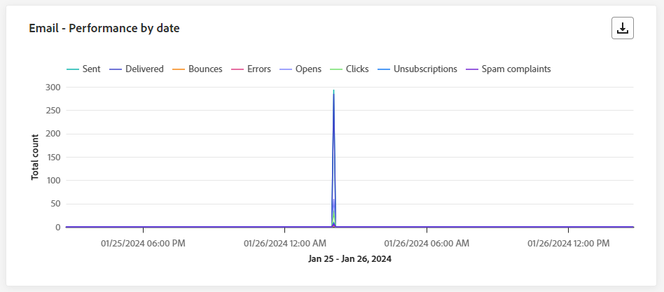
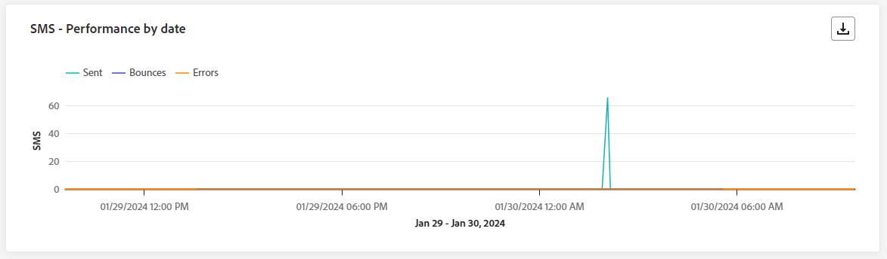

# 历程实时报告 {#journey-live-report}

>[!CONTEXTUALHELP]
>id="ajo_journey_live_report"
>title="历程实时报告"
>abstract="使用历程实时报告，您可以实时衡量和可视化历程的影响和绩效（仅限过去 24 小时）。报告分为不同的构件，详细说明历程中的成功和错误。可通过调整构件大小或删除构件而修改每个报告仪表板。"

>[!AVAILABILITY]
>
>当前的报告体验将从10月版起停用。 在此日期之后，新的报告体验将成为标准。 我们建议您熟悉新特性和功能，以确保顺利过渡。 [开始使用Journey Optimizer的新报告界面。](report-gs-cja.md)

实时报告可从“最近24小时”选项卡访问，它显示过去24小时内发生的事件，最小时间间隔为距事件发生两分钟。 相比之下，全局报告重点关注至少两小时前发生的事件，并涵盖选定时间段内的事件。

使用&#x200B;**[!UICONTROL 查看报告]**&#x200B;按钮，可以直接从旅程访问历程实时报告。

历程&#x200B;**[!UICONTROL 实时报告]**&#x200B;页面将显示以下选项卡：

* [历程](#journey-live)
* [电子邮件](#email-live)
* [推送](#push-live)
* [短信](#sms-live)
* [应用程序内](#in-app-live)

历程&#x200B;**[!UICONTROL 实时报告]**&#x200B;被分为多个小部件，其中详细说明了您的历程的成功和错误。 如果需要，可以调整每个小部件的大小并将其删除。 有关此内容的更多信息，请参阅此[部分](live-report.md#modify-dashboard)。

有关Adobe Journey Optimizer中可用的每个量度的详细列表，请参阅[此页面](live-report.md#list-of-components-live)。

## “历程”选项卡 {#journey-live}

从您的历程&#x200B;**[!UICONTROL 实时报告]**&#x200B;中，**[!UICONTROL 历程]**&#x200B;选项卡可让您清楚地查看有关历程的最重要跟踪数据。

### 历程表现 {#journey-performance}

>[!CONTEXTUALHELP]
>id="ajo_journey_performance_live"
>title="历程表现"
>abstract="“历程表现”构件使您能够直观地跟踪目标配置文件在过去 24 小时内在您的历程中的进展情况。"

**[!UICONTROL 历程性能]**&#x200B;允许您在历程中分步查看目标用户档案的路径。

请注意，节点的配置文件计数仅在配置文件完成节点后更新，而不是在输入节点后更新。 例如，**等待**&#x200B;节点上的配置文件仅在到达指定日期且配置文件已退出该节点时计算。

### 历程统计数据 {#journey-statistics}

>[!CONTEXTUALHELP]
>id="ajo_journey_statistics_live"
>title="历程统计数据"
>abstract="“历程统计”关键绩效指标 (KPI) 作为一种综合仪表板，可提供过去 24 小时内与您的历程相关的基本量度的深入分析。"

**[!UICONTROL 历程统计数据]**&#x200B;关键绩效指标(KPI)用作一个包含所有内容的仪表板，提供过去24小时内与您的旅程关联的基本量度分析。 其中包括已输入用户档案计数和失败的个人历程实例等详细信息，可全面了解历程的有效性和参与级别。

+++ 了解有关历程统计指标的更多信息

* **[!UICONTROL 输入的配置文件]**：到达历程的进入事件的个人总数。

* **[!UICONTROL 已退出配置文件]**：已退出历程的个人总数。

* **[!UICONTROL 失败的单个历程]**：未成功执行的单个历程总数。
+++

### 过去 24 小时内执行的操作 {#action-executed}

>[!CONTEXTUALHELP]
>id="ajo_journey_actions_executed_live"
>title="过去 24 小时内执行的操作"
>abstract="“过去 24 小时内执行的操作”构件提供了最近性能的快照，展示了过去 24 小时内执行的操作的有效性。"

过去24小时内执行的&#x200B;**[!UICONTROL 操作]**&#x200B;构件表示在触发操作时执行的最成功的操作。

+++ 了解有关过去24小时量度执行的操作的更多信息

* **[!UICONTROL 执行的操作]**：历程成功执行的操作总数。

* **[!UICONTROL 操作出错]**：操作发生的错误总数。

+++

### 执行的操作和错误 {#actions-errors}

>[!CONTEXTUALHELP]
>id="ajo_journey_actions_executed__errors_live"
>title="执行的操作和错误"
>abstract="“执行的操作和错误”构件显示过去 24 小时内最成功的操作以及触发操作期间发生的任何错误。该构件提供了成功执行和遇到的错误的全面概述，为您最近的操作表现提供了宝贵的见解。"

**[!UICONTROL 执行的操作和错误]**&#x200B;构件表示您的操作在过去24小时内触发时最成功的操作和发生的错误。

+++ 了解有关执行的操作和错误量度的更多信息

* **[!UICONTROL 执行的操作]**：历程成功执行的操作总数。

* **[!UICONTROL 操作出错]**：操作发生的错误总数。

+++

### 操作错误原因 {#actions-error-reasons}

>[!CONTEXTUALHELP]
>id="ajo_journey_actions_errors_live"
>title="操作错误原因"
>abstract="操作错误原因表格和图形提供了执行操作期间遇到的错误的完整摘要，从而全面概述了在过去 24 小时内可能发生的问题。"

**[!UICONTROL 操作错误原因]**&#x200B;表和图形提供了过去24小时内执行您的操作期间所发生错误的全面概述。

### 按操作显示的错误类型 {#error-type-actions}

>[!CONTEXTUALHELP]
>id="ajo_journey_actions_error_type_live"
>title="按操作显示的错误类型"
>abstract="“按操作显示的错误类型”表格和图形提供了过去 24 小时内每次执行操作期间发生的错误的全面概述。"

按操作&#x200B;]**列出的**[!UICONTROL &#x200B;错误类型表和图形提供了过去24小时内每次执行操作所发生的错误的全面概述。

### 过去 24 小时内执行的事件 {#event-executed-24hours}

>[!CONTEXTUALHELP]
>id="ajo_journey_event_24hours_live"
>title="过去 24 小时内执行的事件"
>abstract="“过去 24 小时内执行的事件”构件有助于确定哪些事件在过去 24 小时内成功执行。 "

过去24小时内执行的&#x200B;**[!UICONTROL 事件]**&#x200B;构件允许您识别过去24小时内成功执行了哪些事件。

### 事件 {#events}

>[!CONTEXTUALHELP]
>id="ajo_journey_events_live"
>title="事件"
>abstract="“事件”构件提供了哪些事件已成功执行的全面视图，并提供了过去 24 小时内详细见解的摘要数据、图形和表格。"

**[!UICONTROL 事件]**&#x200B;构件允许您查看通过摘要编号、图表和表成功执行了哪个事件。

### 按来源列出的事件 {#events-origin}

>[!CONTEXTUALHELP]
>id="ajo_journey_events_origin_live"
>title="按来源列出的事件"
>abstract="“按来源列出的事件”表格和图形提供了过去 24 小时内事件成功接收情况的视图。这些视觉表示内容有助于准确识别有效接收的事件，从而为您的历程中每个事件的表现和影响提供有价值的见解。"

**[!UICONTROL 按来源显示的事件]**&#x200B;表和图表提供了有关过去24小时内成功接收事件的详细透视。 通过这些可视化表示法，您可以准确地识别哪些事件已被有效接收，从而针对历程中各个事件的性能和影响提供宝贵的见解。

## 电子邮件选项卡 {#email-live}

在历程&#x200B;**[!UICONTROL 实时报告]**&#x200B;中，**[!UICONTROL 电子邮件]**&#x200B;选项卡详细列出了与历程中发送的电子邮件相关的主要信息。

### 电子邮件 - 发送效果 {#email-sending-performance}

>[!CONTEXTUALHELP]
>id="ajo_journey_email_sending_performance_live"
>title="电子邮件 - 发送效果"
>abstract="“电子邮件 - 发送统计数据”图表汇总有关电子邮件的基本数据，如过去 24 小时内定向邮件或已送达邮件。"

**[!UICONTROL 电子邮件 — 发送性能]**&#x200B;图形提供了与历程中发送的电子邮件相关的数据的综合视图，提供了对关键量度的洞察，例如过去24小时内发生的投放和跳出次数。 这样即可对电子邮件发送过程进行详细分析，从而提供关于历程效率和性能的宝贵信息。

+++ 了解有关电子邮件 — 发送性能指标的更多信息

* **[!UICONTROL 已投放]**：成功发送的电子邮件数。

* **[!UICONTROL 跳出次数]**：发送进程和自动返回处理期间累计的错误总数。

* **[!UICONTROL 错误]**：发送过程中发生的阻止将错误发送到用户档案的错误总数。

* **[!UICONTROL 重试]**：重试队列中的电子邮件数。

+++

### 电子邮件 - 统计数据 {#email-stat}

>[!CONTEXTUALHELP]
>id="ajo_journey_email_statistics_live"
>title="电子邮件 - 统计数据"
>abstract="“电子邮件 - 统计数据”表提供有关过去 24 小时内电子邮件的配置文件活动的数据。"

**[!UICONTROL 电子邮件 — 统计数据]**&#x200B;表提供有关过去24小时内历程中电子邮件的基本数据的全面摘要。 它详细说明了关键量度，例如目标受众规模以及成功投放的电子邮件数量，为您的电子邮件和历程的有效性和影响范围提供了有价值的见解。

+++ 了解有关电子邮件发送统计量度的更多信息

* **[!UICONTROL 目标]**：发送过程中处理的邮件总数。

* **[!UICONTROL 已排除]**： Adobe Journey Optimizer已排除的用户档案数。

* **[!UICONTROL 已发送]**：已发送的电子邮件总数。

* **[!UICONTROL 已投放]**：成功发送的电子邮件数与已发送的邮件总数相关。

* **[!UICONTROL 跳出次数]**：在发送进程和自动返回处理期间累计的错误总数与已发送消息的总数之比。

* **[!UICONTROL 错误]**：发送过程中发生的阻止将错误发送到用户档案的错误总数。

* **[!UICONTROL 打开次数]**：您的电子邮件被打开的次数。

* **[!UICONTROL 点击次数]**：在电子邮件中点击内容的次数。

* **[!UICONTROL 取消订阅]**：取消订阅链接的点击次数。

* **[!UICONTROL 垃圾邮件投诉次数]**：将邮件声明为垃圾邮件或垃圾邮件的次数。

* **[!UICONTROL 重试]**：重试队列中的电子邮件数。

+++

### 电子邮件 - 各日期的效果 {#email-perf-date}

>[!CONTEXTUALHELP]
>id="ajo_journey_email_performance_bydate_live"
>title="电子邮件 - 各日期的效果"
>abstract="“电子邮件 - 各日期的效果”图表显示过去 24 小时内有关已发送的电子邮件的全面数据，其中提供针对是否已送达和退回次数等关键量度的见解，从而可详细地分析电子邮件发送过程。"

**[!UICONTROL 电子邮件 — 按日期列出的性能]**&#x200B;构件通过图形详细概述了与您的电子邮件相关的关键信息，并提供了有关过去24小时性能趋势的见解。

+++ 了解有关电子邮件 — 按日期列出的性能指标的更多信息

* **[!UICONTROL 已发送]**：已发送的电子邮件总数。

* **[!UICONTROL 已投放]**：成功发送的电子邮件数。

* **[!UICONTROL 跳出次数]**：发送进程和自动返回处理期间累计的错误总数。

* **[!UICONTROL 错误]**：发送过程中发生的阻止将错误发送到用户档案的错误总数。

* **[!UICONTROL 打开次数]**：您的电子邮件被打开的次数。

* **[!UICONTROL 点击次数]**：内容在电子邮件中的点击次数。

* **[!UICONTROL 取消订阅]**：取消订阅链接的点击次数。

* **[!UICONTROL 垃圾邮件投诉次数]**：将邮件声明为垃圾邮件或垃圾邮件的次数。

+++

### 电子邮件 - 退回类别和原因 {#email-bounce-categories}

>[!CONTEXTUALHELP]
>id="ajo_journey_email_bounces_live"
>title="电子邮件 - 退回类别和原因"
>abstract="XX"

**[!UICONTROL 退回原因]**&#x200B;和&#x200B;**[!UICONTROL 退回类别]**&#x200B;小组件编译与退回邮件相关的可用数据，提供过去24小时内电子邮件退回背后的具体原因和类别的详细分析。

有关退回的详细信息，请参阅[禁止显示列表](../reports/suppression-list.md)页面。

+++ 了解有关电子邮件 — 退回类别和原因量度的更多信息

* **[!UICONTROL 硬退回]**：永久错误的总数，如电子邮件地址错误。 这涉及显式声明地址无效的错误消息，例如“未知用户”。

* **[!UICONTROL 软退回]**：临时错误的总数，如收件箱已满。

* **[!UICONTROL Ignored]**：临时总数，例如“不在办公室”或技术错误，例如，如果发件人类型为“邮递员”。

+++

### 电子邮件 - 错误原因 {#email-error-reasons}

>[!CONTEXTUALHELP]
>id="ajo_journey_email_errors_live"
>title="电子邮件 - 错误原因"
>abstract="通过“电子邮件 - 错误原因”图表，可了解过去 24 小时内在发送过程中发生的具体错误。"

**[!UICONTROL 错误原因]**&#x200B;图形和表提供了过去24小时内发送过程中发生的特定错误的可见性，提供了有关错误性质和发生情况的宝贵信息。

### 电子邮件 - 排除的原因 {#email-excluded}

>[!CONTEXTUALHELP]
>id="ajo_journey_email_excluded_live"
>title="电子邮件 - 排除的原因"
>abstract="“排除的原因”图表说明过去 24 小时内导致从目标受众中排除用户配置文件，从而收不到消息的各种因素。"

**[!UICONTROL 排除的原因]**&#x200B;图形和表全面介绍了导致从目标受众中排除用户配置文件，从而导致过去24小时内未收到该消息的各种因素。

有关排除原因的完整列表，请参阅[此页面](exclusion-list.md)。

### 电子邮件 - 最佳收件人域 {#email-best-recipient}

>[!CONTEXTUALHELP]
>id="ajo_journey_email_best_recipient_live"
>title="电子邮件 - 最佳收件人域"
>abstract="“电子邮件 - 最佳收件人域”图表详细地细分过去 24 小时内收件人最常用于打开电子邮件的域，并提供针对收件人行为的宝贵见解。"

**[!UICONTROL 电子邮件 — 最佳收件人域]**&#x200B;图形和表提供了过去24小时内用户档案最常用于打开您的电子邮件的域的详细细目。 这提供了有关用户档案行为的宝贵见解，可帮助您了解首选平台。

### 电子邮件 - 优惠 {#email-offers}

>[!CONTEXTUALHELP]
>id="ajo_journey_email_offers_live"
>title="电子邮件 - 优惠"
>abstract="“优惠统计”和“优惠详细统计”构件提供了过去 24 小时内对优惠绩效的全面洞察，提供了其随时间产生影响的详细分析，并提供了详细的统计数据，以供更深入的了解。"

>[!NOTE]
>
>仅在电子邮件中插入决策时，优惠小组件和量度才可用。 有关决策管理的详细信息，请参阅此[页面](../offers/get-started/starting-offer-decisioning.md)。

**[!UICONTROL 优惠统计数据]**&#x200B;和&#x200B;**[!UICONTROL 一段时间内的优惠统计数据]**&#x200B;小组件可衡量优惠的成功情况以及对目标受众的影响。 它会使用KPI详细描述与消息相关的主要信息。

+++ 了解有关电子邮件 — 优惠指标的更多信息

* **[!UICONTROL 已发送优惠]**：优惠的发送总数。

* **[!UICONTROL 优惠展示]**：优惠在电子邮件中的打开次数。

* **[!UICONTROL 优惠点击次数]**：优惠在电子邮件中的点击次数。

+++

###  电子邮件 - 优化  {#email-sto}

>[!CONTEXTUALHELP]
>id="ajo_journey_email_optimization_live"
>title=" 电子邮件 - 优化 "
>abstract="“发送时间优化”以及“已优化”和“未优化”构件提供了过去 24 小时内有关您的消息的详细信息，并突出显示它们是否已优化。"

>[!NOTE]
>
>仅当为您的投放激活发送时间优化选项时，**[!UICONTROL 发送时间优化]**&#x200B;和&#x200B;**[!UICONTROL 优化与未优化]**&#x200B;构件才可用。 有关发送时间优化的更多信息，请参阅[此页面](../building-journeys/journeys-message.md#send-time-optimization)。

**[!UICONTROL 发送时间优化]**&#x200B;和&#x200B;**[!UICONTROL 已优化与未优化]**&#x200B;构件根据发送方法（已优化或正常）详细列出您的电子邮件是否成功。

+++ 了解有关发送时间优化和已优化与未优化量度的更多信息

* **[!UICONTROL 已投放]**：成功发送的邮件数与已发送的邮件总数相关。
* **[!UICONTROL 跳出次数]**：在发送进程和自动返回处理期间累计的错误总数与已发送消息的总数之比。

* **[!UICONTROL 已发送]**：为历程发送的电子邮件总数。

* **[!UICONTROL 打开次数]**：您的电子邮件在历程中打开的次数。

* **[!UICONTROL 点击次数]**：在电子邮件中点击内容的次数。

+++

## 推送通知选项卡 {#push-live}

在历程&#x200B;**[!UICONTROL 实时报告]**&#x200B;中，**[!UICONTROL 推送通知]**&#x200B;选项卡详细介绍了与历程中发送的推送通知相关的主要信息。

### 推送通知 - 发送效果 {#push-sending-performance}

>[!CONTEXTUALHELP]
>id="ajo_journey_push_sending_performance_live"
>title="推送通知 - 发送效果"
>abstract="“推送通知发送效果”图表总结了有关推送通知的基本数据，例如过去 24 小时内的错误或已送达消息。"

**[!UICONTROL 推送通知发送性能]**&#x200B;图提供了与过去24小时内发送的推送通知相关的数据的全面概述。 它提供对基本量度（如投放和跳出）的见解，从而允许详细检查推送通知发送流程。

+++ 了解有关推送通知 — 发送性能指标的更多信息

* **[!UICONTROL 已投放]**：已成功发送的邮件数。

* **[!UICONTROL 跳出次数]**：发送进程和自动返回处理期间累计的错误总数。

* **[!UICONTROL 错误]**：发送过程中发生的阻止将错误发送到用户档案的错误总数。

+++

### 推送通知 - 统计数据 {#push-statistics}

>[!CONTEXTUALHELP]
>id="ajo_journey_push_statistics_live"
>title="推送通知 - 统计数据"
>abstract="“推送统计数据”表提供有关过去 24 小时内推送通知的收件人活动的数据。"

**[!UICONTROL 推送通知 — 统计数据]**&#x200B;表提供与推送通知相关的基本数据的简要摘要，包括关键量度，例如过去24小时内目标消息数和成功投放消息数。

+++ 了解有关推送通知 — 统计量度的更多信息

* **[!UICONTROL 目标]**：任何操作（如发送电子邮件或短信）的目标用户档案数。

* **[!UICONTROL 已排除]**： Adobe Journey Optimizer已排除的用户档案数。

* **[!UICONTROL 已发送]**：已发送的推送通知总数。

* **[!UICONTROL 已传递]**：已成功发送的推送通知数。

* **[!UICONTROL 跳出次数]**：发送进程和自动返回处理期间累计的错误总数。

* **[!UICONTROL 错误]**：发送过程中发生的阻止将错误发送到用户档案的错误总数。

* **[!UICONTROL 打开次数]**：推送通知的打开次数。
+++

### 推送通知 - 按平台细分 {#push-breakdown}

>[!CONTEXTUALHELP]
>id="ajo_journey_push_breakdown_live"
>title="推送通知 - 按平台细分"
>abstract="“按平台细分”图表根据收件人的操作系统提供细分过去 24 小时内推送通知的成功情况。"

**[!UICONTROL 推送通知 — 按平台]**&#x200B;划分图表和表提供了推送通知成功情况的详细分析，提供了基于用户档案操作系统的见解。 此划分可让您更好地了解推送通知在不同平台上的执行情况。

### 推送通知 - 发送摘要 {#push-sending-summary}

>[!CONTEXTUALHELP]
>id="ajo_journey_push_sending_summary_live"
>title="推送通知 - 发送摘要"
>abstract="“推送通知发送摘要”图表显示过去 24 小时内发送的推送通知的可用数据。"

**[!UICONTROL 推送通知摘要]**&#x200B;图形提供动态呈现，显示过去24小时内您的推送通知活动的分析。 此图形呈现提供了已发送推送通知的全面细分。

+++ 了解有关推送通知 — 发送摘要量度的更多信息

* **[!UICONTROL 已发送]**：已发送的推送通知总数。

* **[!UICONTROL 已传递]**：已成功发送的推送通知数。

* **[!UICONTROL 跳出次数]**：发送进程和自动返回处理期间累计的错误总数。

* **[!UICONTROL 错误]**：发送过程中发生的阻止将错误发送到用户档案的错误总数。

* **[!UICONTROL 打开]**：推送通知的打开次数。

* **[!UICONTROL 点击次数]**：在推送通知中点击内容的次数。

+++

### 推送通知 - 错误原因 {#push-error}

>[!CONTEXTUALHELP]
>id="ajo_journey_push_error_reasons_live"
>title="推送通知 - 错误原因"
>abstract="通过“错误原因”图表，可了解过去 24 小时内在发送过程中发生的具体错误。"

**[!UICONTROL 错误原因]**&#x200B;表和图形使您能够识别在推送通知发送过程中发生的特定错误，提供对过去24小时内遇到的任何问题的详细分析。

### 推送通知 - 排除的原因 {#push-excluded}

>[!CONTEXTUALHELP]
>id="ajo_journey_push_excluded_reasons_live"
>title="推送通知 - 排除的原因"
>abstract="“排除的原因”图表说明过去 24 小时内导致从目标受众中排除用户配置文件，从而收不到消息的各种因素。"

**[!UICONTROL 排除的原因]**&#x200B;图形和表显示了阻止从目标配置文件中排除的用户配置文件在最近24小时内接收推送通知的不同原因。

有关排除原因的完整列表，请参阅[此页面](exclusion-list.md)。

## 短信选项卡 {#sms-live}

### 短信 - 统计数据 {#sms-statistics}

>[!CONTEXTUALHELP]
>id="ajo_journey_sms_statistics_live"
>title="短信 - 统计数据"
>abstract="“短信发送统计数据”表汇总有关短信的基本数据，如过去 24 小时内定向消息或已送达消息。"

**[!UICONTROL SMS — 统计数据]**&#x200B;表提供与您的SMS消息相关的基本数据的简要摘要，包括关键量度，例如定向消息数和过去24小时内成功投放的消息计数。

+++ 了解有关短信 — 统计量度的更多信息

* **[!UICONTROL 目标]**：符合目标配置文件资格的用户配置文件数。

* **[!UICONTROL 已排除]**：未收到消息的用户配置文件数（从定向配置文件中排除）。

* **[!UICONTROL 已发送]**：已发送的短信消息总数。

* **[!UICONTROL 点击次数]**：短信消息中内容的点击次数。

* **[!UICONTROL 跳出次数]**：发送进程和自动返回处理期间累计的错误总数。

* **[!UICONTROL 错误]**：发送过程中发生的阻止将错误发送到用户档案的错误总数。

+++

### 短信 - 各日期的效果 {#sms-performance}

>[!CONTEXTUALHELP]
>id="ajo_journey_sms_performance_live"
>title="短信 - 各日期的效果"
>abstract="“短信 - 各日期的效果”构件以图形表示形式提供有关过去 24 小时内消息的关键信息。"

**[!UICONTROL SMS — 按日期列出的性能]**&#x200B;构件通过图形详细概述了与消息相关的关键信息，提供了过去24小时性能趋势的见解。

+++ 了解有关短信的更多信息 — 按日期列出的绩效指标

* **[!UICONTROL 已发送]**：已发送的短信消息总数。

* **[!UICONTROL 跳出次数]**：发送进程和自动返回处理期间累计的错误总数。

* **[!UICONTROL 错误]**：发送过程中发生的阻止将错误发送到用户档案的错误总数。

+++

### 短信 - 退回原因 {#sms-bounces}

>[!CONTEXTUALHELP]
>id="ajo_journey_sms_bounces_live"
>title="短信 - 退回原因"
>abstract="“退回原因”图表包含与过去 24 小时内与退回消息相关的可用数据。"

**[!UICONTROL SMS — 退回原因]**&#x200B;图形和表提供与退回的SMS消息相关的数据的全面概述，提供对过去24小时内短信消息退回实例背后的具体原因的宝贵见解。

### 短信 - 错误原因 {#sms-error}

>[!CONTEXTUALHELP]
>id="ajo_journey_sms_error_live"
>title="短信 - 错误原因"
>abstract="通过“短信 - 错误原因”图表，可了解过去 24 小时内在发送过程中发生的具体错误。"

**[!UICONTROL 短信 — 错误原因]**&#x200B;图形和表允许您识别在短信消息发送过程中发生的特定错误，从而便于对过去24小时内遇到的任何问题进行彻底分析。

### 短信 - 排除的原因 {#sms-excluded}

>[!CONTEXTUALHELP]
>id="ajo_journey_sms_excluded_live"
>title="短信 - 排除的原因"
>abstract="“排除的原因”图表说明过去 24 小时内导致从目标受众中排除用户配置文件，从而收不到消息的各种因素。"

**[!UICONTROL 短信 — 排除的原因]**&#x200B;图形和表直观地描述了导致从目标受众中排除用户个人资料的各种因素，阻止他们接收您的短信消息。

有关排除原因的完整列表，请参阅[此页面](exclusion-list.md)。

<!--
### SMS - Clicks by links {#sms-clicks}

The **[!UICONTROL SMS - Clicks by links]** widget offers essential insights into your visitors' engagement with the URLs included in your messages, providing valuable information about which links attract the most interaction within the last 24 hours.
-->

## 应用程序内选项卡 {#in-app-live}

### 应用程序内性能 {#inapp-performance}

>[!CONTEXTUALHELP]
>id="ajo_journey_inapp_performance_live"
>title="应用程序内性能"
>abstract="“应用程序内性能”KPI 提供有关过去 24 小时内访客与应用程序内消息的互动的基本见解。"

**[!UICONTROL 应用程序内性能]** KPI可提供过去24小时内用户档案与应用程序内消息互动情况的基本见解，从而提供评估历程中包含的应用程序内消息的有效性和影响的基本量度。

+++ 了解有关应用程序内 — 性能指标的更多信息

* **[!UICONTROL 展示次数]**：传递给所有用户的应用程序内消息总数。

  >[!NOTE]
  >
  >要确保计入展示次数，用户必须满足两个条件：
  >* 应用程序内体验中的资格，通过访问其历程中的特定应用程序内活动来实现。
  >* 满足触发器规则中指定的条件。
  > 
  >由于第二标准，目标用户档案的数量和独特展示次数之间可能存在显着差异。

* **[!UICONTROL 交互]**：与应用程序内消息的参与总数。 这包括用户执行的任何操作，例如单击、解除或任何其他交互。

+++

### 应用程序内摘要 {#inapp-summary}

>[!CONTEXTUALHELP]
>id="ajo_journey_inapp_summary_live"
>title="应用程序内摘要"
>abstract="“应用程序内摘要”图表显示过去 24 小时内应用程序内展示和交互的进展。"

**[!UICONTROL 应用程序内摘要]**&#x200B;图形说明了过去24小时内应用程序内展示和交互的进度，提供了应用程序内消息性能的全面概述。

+++ 了解有关应用程序内摘要量度的更多信息

* **[!UICONTROL 展示次数]**：传递给所有用户的应用程序内消息总数。

  >[!NOTE]
  >
  >要确保计入展示次数，用户必须满足两个条件：
  >* 应用程序内体验中的资格，通过访问其历程中的特定应用程序内活动来实现。
  >* 满足触发器规则中指定的条件。
  > 
  >由于第二标准，目标用户档案的数量和独特展示次数之间可能存在显着差异。

* **[!UICONTROL 交互]**：与应用程序内消息的参与总数。 这包括用户执行的任何操作，例如单击、解除或任何其他交互。

+++

### 各类型的交互 {#interactions-type}

>[!CONTEXTUALHELP]
>id="ajo_journey_inapp_interactions_live"
>title="各类型的交互"
>abstract="“各类型的交互”图表通过跟踪过去 24 小时内的任何点击、取消或交互而详述用户如何通过与应用程序内消息交互。"

**[!UICONTROL 按类型]**&#x200B;划分的交互图表和表通过跟踪任何点击、解除或交互来详细描述用户如何与您的应用程序内消息交互。
