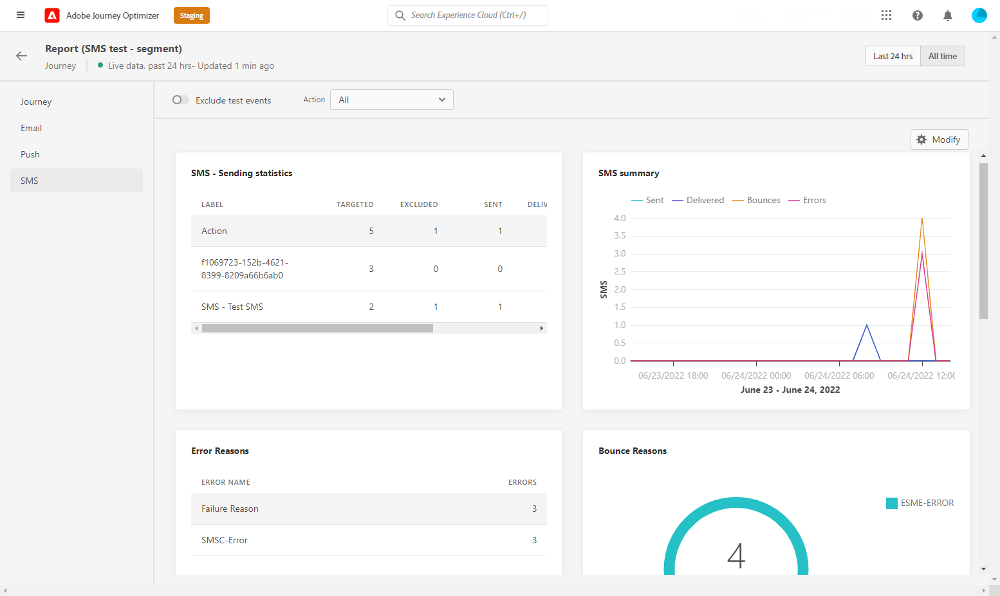

# 历程实时报告 {#journey-live-report}

历程实时报表可直接从您的历程中通过 **[!UICONTROL 查看报表]** 按钮。

历程 **[!UICONTROL 实时报表]** 页面中将显示以下选项卡：

* [历程](#journey-live)
* [电子邮件](#email-live)
* [推送](#push-live)
* [短信](#sms-live)

历程 **[!UICONTROL 实时报表]** 会分为不同的小组件，用于详细描述历程的成功和错误。 如果需要，可以调整每个小组件的大小并将其删除。 有关此内容的更多信息，请参阅此内容 [部分](live-report.md#modify-dashboard).

有关Adobe Journey Optimizer中可用的每个量度的详细列表，请参阅 [本页](live-report.md#list-of-components-live).

## 历程选项卡 {#journey-live}

从您的历程 **[!UICONTROL 实时报表]**, **[!UICONTROL 历程]** 选项卡可让您清楚地查看有关历程的最重要跟踪数据。

+++了解有关可用于历程报表的不同量度和小组件的更多信息。

**[!UICONTROL 历程性能]** 允许您分步查看目标用户档案在历程中的路径。

的 **[!UICONTROL 历程统计]** 小组件显示以下KPI:

* **[!UICONTROL 输入的用户档案]**:到达历程的登入事件的个人总数。

* **[!UICONTROL 退出用户档案]**:退出历程的个人总数。

* **[!UICONTROL 失败的单个历程]**:未成功执行的各个历程的总数。

的 **[!UICONTROL 过去24小时内执行的事件]** 和 **[!UICONTROL 事件]** 小组件允许您通过概要数字、图表和表格查看哪些事件成功执行。

的 **[!UICONTROL 过去24小时内执行的操作]** 和 **[!UICONTROL 执行的操作和错误]** 小组件表示在触发操作时发生的最成功操作和错误。 操作图、表和概要数字包含可用于操作的数据，例如：

* **[!UICONTROL 已执行的操作]**:为历程成功执行的操作总数。

* **[!UICONTROL 操作中出错]**:操作发生的错误总数。
+++

## “电子邮件”选项卡 {#email-live}

从您的历程 **[!UICONTROL 实时报表]**, **[!UICONTROL 电子邮件]** 选项卡详细列出了与历程中发送的电子邮件投放相关的主要信息。

+++了解有关电子邮件报表可用的不同量度和小组件的更多信息。

的 **[!UICONTROL 电子邮件发送统计信息]** 小组件详细介绍与您的消息相关的主要信息：

* **[!UICONTROL 已交付]**:成功发送的消息数。

* **[!UICONTROL 跳出次数]**:在投放和自动回访处理过程中累积的错误总数。

* **[!UICONTROL 错误]**:投放期间发生的阻止将其发送到用户档案的错误总数。

的 **[!UICONTROL 通过电子邮件发送量度]** 表格和 **[!UICONTROL 电子邮件摘要]** 图形详细说明了交付的成功：

* **[!UICONTROL 已发送]**:投放的发送总数。

* **[!UICONTROL 已交付]**:成功发送的消息数。

* **[!UICONTROL 跳出次数]**:在投放和自动回访处理过程中累积的错误总数。

* **[!UICONTROL 错误]**:投放期间发生的阻止将其发送到用户档案的错误总数。

* **[!UICONTROL 打开]**:投放中消息打开的次数。

* **[!UICONTROL 点击次数]**:在投放中点击内容的次数。

* **[!UICONTROL 取消订阅]**:退订链接的点击次数。

* **[!UICONTROL 垃圾邮件投诉]**:将消息声明为垃圾邮件或垃圾邮件的次数。

的 **[!UICONTROL 退回原因]**, **[!UICONTROL 跳出类别]** 和 **[!UICONTROL 硬退回 — 通过电子邮件退回]** 小组件包含与弹回的消息相关的可用数据，例如：

* **[!UICONTROL 硬退回]**:永久错误的总数，如错误的电子邮件地址。 这涉及显式声明地址无效的错误消息，如未知用户。

* **[!UICONTROL 软退回]**:临时错误（如完整收件箱）的总数。

* **[!UICONTROL 已忽略]**:临时（如“不在办公室”）或技术错误（例如，如果发件人类型为邮递员）的总数。

的 **[!UICONTROL 错误原因]** 和 **[!UICONTROL 排除原因]** 图形和表格允许您查看在投放期间发生的错误和排除项。

的 **[!UICONTROL 电子邮件 — 热门收件人域]** 图表和表格详细列出了收件人最常使用哪些域来打开电子邮件。

>[!NOTE]
>
>仅当在电子邮件中插入决策时，选件小组件和量度才可用。 有关决策管理的详细信息，请参阅此 [页面](../offers/get-started/starting-offer-decisioning.md).

的 **[!UICONTROL 优惠统计]** 和 **[!UICONTROL 提供统计信息]** 随着时间的推移，小组件可衡量选件的成功以及对目标受众的影响。 它使用KPI详细描述与消息相关的主要信息：

* **[!UICONTROL 已发送选件]**:选件的发送总数。

* **[!UICONTROL 优惠展示]**:在投放中打开选件的次数。

* **[!UICONTROL 选件点击量]**:在投放中点击选件的次数。
+++

## “推送通知”选项卡 {#push-live}

从您的历程 **[!UICONTROL 实时报表]**, **[!UICONTROL 推送通知]** 选项卡详细列出了与历程中发送的推送投放相关的主要信息。

+++了解有关可用于推送报表的不同量度和小组件的更多信息。

**[!UICONTROL 推送通知发送性能]**, **[!UICONTROL 推送通知摘要]** 和 **[!UICONTROL 发送量度 — 按推送]** 小组件详细介绍与您的消息相关的主要信息：

* **[!UICONTROL 已发送]**:投放的发送总数。

* **[!UICONTROL 已交付]**:成功发送的消息数。

* **[!UICONTROL 跳出次数]**:在投放和自动回访处理过程中累积的错误总数。

* **[!UICONTROL 错误]**:投放期间发生的阻止将其发送到用户档案的错误总数。

* **[!UICONTROL 打开]**:投放中消息打开的次数。

* **[!UICONTROL 操作]**:已送达推送通知的操作总数，例如按钮单击或解除。

* **[!UICONTROL 参与]**:此推送通知的打开和操作总数，例如用户档案打开推送或单击按钮时。

的 **[!UICONTROL 错误原因]** 和 **[!UICONTROL 排除原因]** 图形和表格允许您查看在投放期间发生的错误和排除项。

的 **[!UICONTROL 发送统计信息 — 失败]** 小组件允许您查看发生了多少错误和跳出。

的 **[!UICONTROL 按平台跟踪]**, **[!UICONTROL 按平台发送]** 和 **[!UICONTROL 按平台划分]** 图形和表格根据操作系统详细列出了推送通知的成功情况。
+++

## “短信”选项卡 {#sms-live}

+++了解有关可用于短信报表的不同量度和小组件的更多信息。

的 **[!UICONTROL 短信 — 发送统计信息]** 表格详细说明了交付的成功：

* **[!UICONTROL 目标]**:符合此投放目标用户档案的用户配置文件数。

* **[!UICONTROL 排除]**:未收到消息的从定向用户档案中排除的用户用户档案数。

* **[!UICONTROL 已发送]**:投放的发送总数。

* **[!UICONTROL 已交付]**:成功发送的消息数。

* **[!UICONTROL 打开]**:投放中消息打开的次数。

* **[!UICONTROL 点击次数]**:在投放中点击内容的次数。

* **[!UICONTROL 跳出次数]**:在投放和自动回访处理过程中累积的错误总数。

* **[!UICONTROL 错误]**:投放期间发生的阻止将其发送到用户档案的错误总数。

的 **[!UICONTROL 短信摘要]** 图形详细说明了交付的成功：

* **[!UICONTROL 已交付]**:成功发送的消息数。

* **[!UICONTROL 跳出次数]**:在投放和自动回访处理过程中累积的错误总数。

* **[!UICONTROL 错误]**:投放期间发生的阻止将其发送到用户档案的错误总数。

的 **[!UICONTROL 排除原因]** 图形和表格允许您查看在投放期间发生的错误和排除项。
+++
