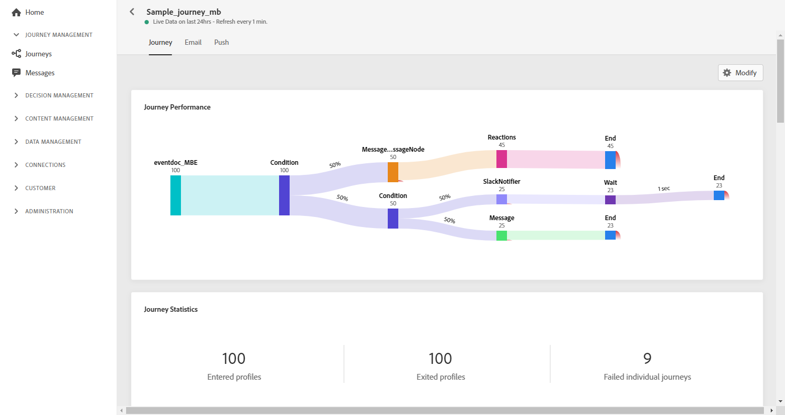

# 历程实时报告{#journey-live-report}

历程实时报告可通过&#x200B;**[!UICONTROL Live report]**&#x200B;按钮从您的旅程中直接访问。

旅程&#x200B;**[!UICONTROL Live report]**&#x200B;页面将显示以下选项卡：

* [历程](#journey-live)
* [电子邮件](#email-live)
* [推送](#push-live)

旅程&#x200B;**[!UICONTROL Live report]**&#x200B;分为不同的构件，详细描述您旅程的成功和错误。 如果需要，可以调整和删除每个Widget。 有关此内容的详细信息，请参阅此[部分](live-report.md#modify-dashboard)。

## 历程选项卡{#journey-live}

在您的旅程&#x200B;**[!UICONTROL Live report]**&#x200B;中，**[!UICONTROL Journey]**&#x200B;选项卡可以清晰地视图旅程中最重要的跟踪数据。

**[!UICONTROL Journey`s performance]** 使您能够分步了解目标用户档案的旅程。

**[!UICONTROL Journey`s statistics]**&#x200B;小部件显示以下KPI:

* **[!UICONTROL Entered profiles]**:到达旅程入口事件的总人数。

* **[!UICONTROL Exited profiles]**:退出旅程的个人总数。

* **[!UICONTROL Failed individual journey]**:未成功执行的个人旅程总数。

**[!UICONTROL Event executed over the last 24 hours]**、**[!UICONTROL Events executed]**&#x200B;和&#x200B;**[!UICONTROL Events]**&#x200B;构件允许您查看通过摘要编号、图表和表成功执行了哪个事件。

**[!UICONTROL Action executed over the last 24 hours]** 而构 **[!UICONTROL Actions executed and errors]** 件代表触发操作时发生的最成功的操作和错误。“操作”图表、表编号和摘要编号包含可用于操作的数据，例如：

* **[!UICONTROL Actions successfully executed]**:成功为旅程执行的操作总数。

* **[!UICONTROL Error in action]**:操作发生的错误总数。

## 电子邮件选项卡{#email-live}

在您的旅程&#x200B;**[!UICONTROL Live report]**&#x200B;中，**[!UICONTROL Email]**&#x200B;选项卡详细列出了与您旅程中发送的电子邮件投放相关的主要信息。

有关特定电子邮件投放的详细报告，请参阅[电子邮件实时报告](email-live-report.md)部分。

**[!UICONTROL Sending Statistics]**&#x200B;和&#x200B;**[!UICONTROL Sending metrics by Email]**&#x200B;构件详细说明了您的投放的成功：

* **[!UICONTROL Delivered]**:成功发送的消息数，与已发送消息的总数有关。

* **[!UICONTROL Bounces]**:在投放和自动返回处理期间累积的与已发送消息总数相关的错误总数。

* **[!UICONTROL Errors]**:在投放期间发生的错误总数，导致无法将错误发送给用户档案。

<!--Hard and bounce - by Email-->

**[!UICONTROL Email summary]**&#x200B;图表详细列出了与您的消息相关的主要信息：

* **[!UICONTROL Sent]**:投放的发送总数。

* **[!UICONTROL Delivered]**:成功发送的消息数，与已发送消息的总数有关。

* **[!UICONTROL Bounces]**:在投放和自动返回处理期间累积的与已发送消息总数相关的错误总数。

* **[!UICONTROL Errors]**:在投放期间发生的错误总数，导致无法将错误发送给用户档案。

* **[!UICONTROL Opens]**:在投放中打开消息的次数。

* **[!UICONTROL Clicks]**:在投放中单击内容的次数。

**[!UICONTROL Bounce Reasons]**&#x200B;和&#x200B;**[!UICONTROL Bounce categories]**&#x200B;构件包含与弹回邮件相关的可用数据，例如：

* **[!UICONTROL Hard bounce]**:永久错误的总数，如错误的电子邮件地址。这涉及显式声明地址无效的错误消息，如未知用户。

* **[!UICONTROL Soft bounce]**:临时错误的总数，如完整的收件箱。

* **[!UICONTROL Ignored]**:临时的总数，如“外出”或技术错误（例如，如果发送者类型是邮政主管）。

**[!UICONTROL Error Reasons]**&#x200B;图表和表允许您查看在投放期间发生的错误。

## 推送选项卡{#push-live}

在您的旅程&#x200B;**[!UICONTROL Live report]**&#x200B;中，**[!UICONTROL Push]**&#x200B;选项卡详细列出了与您旅程中发送的推送投放相关的主要信息。

有关特定推送投放的详细报告，请参阅[推送实时报告](push-live-report.md)部分。

**[!UICONTROL Push notification sending performance]**，和 **[!UICONTROL Push notification summary]** 构件 **[!UICONTROL Sending metrics - by Push]** 详细了与您的消息相关的主要信息：

* **[!UICONTROL Sent]**:投放的发送总数。

* **[!UICONTROL Delivered]**:成功发送的消息数，与已发送消息的总数有关。

* **[!UICONTROL Bounces]**:在投放和自动返回处理期间累积的与已发送消息总数相关的错误总数。

* **[!UICONTROL Errors]**:在投放期间发生的错误总数，导致无法将错误发送给用户档案。

* **[!UICONTROL Opens]**:在投放中打开消息的次数。

* **[!UICONTROL Actions]**:已传递的推送通知操作总数，如按钮单击或解除。

* **[!UICONTROL Engagements]**:此推送通知的打开和操作总数，即用户档案打开推送或单击按钮时。

**[!UICONTROL Error Reasons]**&#x200B;图表和表允许您查看在投放期间发生的错误。

**[!UICONTROL Tracking by platform]**、**[!UICONTROL Sending by platform]**&#x200B;和&#x200B;**[!UICONTROL Breakdown by platform]**&#x200B;图形和表根据操作系统详细说明了推送通知的成功与否。

**[!UICONTROL Sending statistics - Failed]**&#x200B;构件允许您查看发生了多少错误和弹回。
