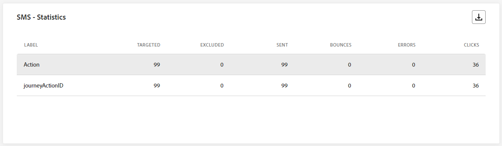

# 历程实时报告 {#journey-live-report}

>[!CONTEXTUALHELP]
>id="ajo_journey_live_report"
>title="历程实时报告"
>abstract="使用历程实时报告，您可以实时衡量和可视化历程的影响和绩效（仅限过去 24 小时）。报告分为不同的构件，详细说明历程中的成功和错误。可通过调整构件大小或删除构件而修改每个报告仪表板。"

实时报告可从“最近24小时”选项卡访问，它显示过去24小时内发生的事件，最小时间间隔为距事件发生两分钟。 相比之下，全局报告重点关注至少两小时前发生的事件，并涵盖选定时间段内的事件。

历程实时报告可通过以下方式直接从您的历程访问： **[!UICONTROL 查看报告]** 按钮。

历程 **[!UICONTROL 实时报告]** 页面将显示以下选项卡：

* [历程](#journey-live)
* [电子邮件](#email-live)
* [推送](#push-live)
* [短信](#sms-live)
* [应用程序内](#in-app-live)

历程 **[!UICONTROL 实时报告]** 分为多个构件，其中详细描述历程的成功和错误。 如果需要，可以调整每个小部件的大小并将其删除。 有关详细信息，请参阅此 [部分](live-report.md#modify-dashboard).

有关Adobe Journey Optimizer中可用的每个量度的详细列表，请参阅 [此页面](live-report.md#list-of-components-live).

## “历程”选项卡 {#journey-live}

在您的历程中 **[!UICONTROL 实时报告]**， **[!UICONTROL 历程]** 选项卡让您清楚地了解历程最重要的跟踪数据。

### 历程性能 {#journey-performance}

>[!CONTEXTUALHELP]
>id="ajo_journey_performance_live"
>title="历程性能"
>abstract="XX"

**[!UICONTROL 历程性能]** 允许您查看定向用户档案的路径，以逐步了解您的历程。

### 历程统计数据 {#journey-statistics}

>[!CONTEXTUALHELP]
>id="ajo_journey_statistics_live"
>title="历程统计数据"
>abstract="XX"

此 **[!UICONTROL 历程统计数据]** 关键绩效指标(KPI)作为包罗万象的功能板，提供过去24小时内与您的历程关联的基本量度分析。 其中包括已输入用户档案计数和失败的个人历程实例等详细信息，可全面了解历程的有效性和参与级别。

+++ 了解有关历程统计指标的更多信息

* **[!UICONTROL 输入的配置文件]**：到达历程的进入事件的个人总数。

* **[!UICONTROL 退出的配置文件]**：退出历程的个人总数。

* **[!UICONTROL 失败的个人历程]**：未成功执行的各个历程的总数。
+++

### 过去24小时内执行的操作 {#action-executed}

>[!CONTEXTUALHELP]
>id="ajo_journey_actions_executed_live"
>title="过去24小时内执行的操作"
>abstract="XX"

此 **[!UICONTROL 过去24小时内执行的操作]** 构件表示在触发操作时执行的最成功的操作。

+++ 了解有关过去24小时量度执行的操作的更多信息

* **[!UICONTROL 执行的操作]**：为历程成功执行的操作总数。

* **[!UICONTROL 操作出错]**：操作发生的错误总数。

+++

### 执行的操作和错误 {#actions-errors}

>[!CONTEXTUALHELP]
>id="ajo_journey_actions_executed__errors_live"
>title="执行的操作和错误"
>abstract="XX"

此 **[!UICONTROL 执行的操作和错误]** 构件表示在触发操作时最成功的操作和发生的错误。

+++ 了解有关执行的操作和错误量度的更多信息

* **[!UICONTROL 执行的操作]**：为历程成功执行的操作总数。

* **[!UICONTROL 操作出错]**：操作发生的错误总数。

+++

### 操作错误原因 {#actions-error-reasons}

>[!CONTEXTUALHELP]
>id="ajo_journey_actions_errors_live"
>title="操作错误原因"
>abstract="XX"

此 **[!UICONTROL 操作错误原因]** 表格和图形全面概述了在过去24小时内执行您的操作期间发生的错误。

### 按操作显示的错误类型 {#error-type-actions}

>[!CONTEXTUALHELP]
>id="ajo_journey_actions_error_type_live"
>title="按操作显示的错误类型"
>abstract="XX"

此 **[!UICONTROL 按操作显示的错误类型]** 表和图形全面概述了过去24小时内每次执行您的操作时发生的错误。

### 过去24小时内执行的事件 {#event-executed-24hours}

>[!CONTEXTUALHELP]
>id="ajo_journey_event_24hours_live"
>title="过去24小时内执行的事件"
>abstract="XX"

此 **[!UICONTROL 过去24小时内执行的事件]** 通过小组件，您可以确定在过去24小时内成功执行了哪些事件。

### 事件 {#events}

>[!CONTEXTUALHELP]
>id="ajo_journey_events_live"
>title="事件"
>abstract="XX"

此 **[!UICONTROL 活动]** 利用小组件，您可以通过摘要编号、图表和表格查看成功执行了哪一个事件。

### 按来源显示的事件 {#events-origin}

>[!CONTEXTUALHELP]
>id="ajo_journey_events_origin_live"
>title="按来源显示的事件"
>abstract="XX"

此 **[!UICONTROL 按来源显示的事件]** 表和图形提供了有关过去24小时内事件成功接收的详细视角。 通过这些可视化表示法，您可以准确地识别哪些事件已被有效接收，从而针对历程中各个事件的性能和影响提供宝贵的见解。

## 电子邮件选项卡 {#email-live}

在您的历程中 **[!UICONTROL 实时报告]**， **[!UICONTROL 电子邮件]** 选项卡详细介绍与旅程中发送的电子邮件相关的主要信息。

### 电子邮件 - 发送性能 {#email-sending-performance}

>[!CONTEXTUALHELP]
>id="ajo_journey_email_sending_performance_live"
>title="电子邮件 - 发送性能"
>abstract="XX"

此 **[!UICONTROL 电子邮件 — 发送性能]** graph全面查看与旅程中发送的电子邮件相关的数据，并深入分析关键量度，例如过去24小时内投放的邮件和跳出次数。 这样即可对电子邮件发送过程进行详细分析，从而提供关于历程效率和性能的宝贵信息。

+++ 了解有关电子邮件 — 发送性能指标的更多信息

* **[!UICONTROL 已投放]**：成功发送的电子邮件数。

* **[!UICONTROL 跳出次数]**：发送流程和自动返回处理期间累计的错误总数。

* **[!UICONTROL 错误]**：发送过程中发生的阻止将消息发送到用户档案的错误总数。

* **[!UICONTROL 重试]**：重试队列中的电子邮件数。

+++

### 电子邮件 - 统计数据 {#email-stat}

>[!CONTEXTUALHELP]
>id="ajo_journey_email_statistics_live"
>title="电子邮件 - 统计数据"
>abstract="XX"

此 **[!UICONTROL 电子邮件 — 统计数据]** 该表提供过去24小时内历程中电子邮件相关基本数据的全面摘要。 它详细说明了关键量度，例如目标受众规模以及成功投放的电子邮件数量，为您的电子邮件和历程的有效性和影响范围提供了有价值的见解。

+++ 了解有关电子邮件发送统计量度的更多信息

* **[!UICONTROL 已定位]**：发送过程中处理的消息总数。

* **[!UICONTROL 已排除]**：Adobe Journey Optimizer已排除的用户档案数。

* **[!UICONTROL 已发送]**：已发送的电子邮件总数。

* **[!UICONTROL 已投放]**：成功发送的电子邮件数，与已发送消息的总数相关。

* **[!UICONTROL 跳出次数]**：在发送流程和自动返回处理期间累计的错误总数与已发送消息总数相关。

* **[!UICONTROL 错误]**：发送过程中发生的阻止将消息发送到用户档案的错误总数。

* **[!UICONTROL 打开次数]**：您的电子邮件被打开的次数。

* **[!UICONTROL 点击次数]**：在电子邮件中单击内容的次数。

* **[!UICONTROL 取消订阅]**：取消订阅链接的点击次数。

* **[!UICONTROL 垃圾邮件投诉数]**：将消息声明为垃圾邮件或垃圾邮件的次数。

* **[!UICONTROL 重试]**：重试队列中的电子邮件数。

+++

### 电子邮件 - 按日期列出的效果 {#email-perf-date}

>[!CONTEXTUALHELP]
>id="ajo_journey_email_performance_bydate_live"
>title="电子邮件 - 按日期列出的效果"
>abstract="XX"

此 **[!UICONTROL 电子邮件 — 按日期列出的性能]** 构件通过图表详细概述了与电子邮件相关的关键信息，提供了过去24小时内性能趋势的见解。

+++ 了解有关电子邮件 — 按日期列出的性能指标的更多信息

* **[!UICONTROL 已发送]**：已发送的电子邮件总数。

* **[!UICONTROL 已投放]**：成功发送的电子邮件数。

* **[!UICONTROL 跳出次数]**：发送流程和自动返回处理期间累计的错误总数。

* **[!UICONTROL 错误]**：发送过程中发生的阻止将消息发送到用户档案的错误总数。

* **[!UICONTROL 打开次数]**：您的电子邮件被打开的次数。

* **[!UICONTROL 点击次数]**：在电子邮件中点击内容的次数。

* **[!UICONTROL 取消订阅]**：取消订阅链接的点击次数。

* **[!UICONTROL 垃圾邮件投诉数]**：将消息声明为垃圾邮件或垃圾邮件的次数。

+++

### 电子邮件 — 退回类别和原因 {#email-bounce-categories}

>[!CONTEXTUALHELP]
>id="ajo_journey_email_bounces_live"
>title="电子邮件 — 退回类别和原因"
>abstract="XX"

此 **[!UICONTROL 退回原因]** 和 **[!UICONTROL 退回类别]** 小组件编译与退回邮件相关的可用数据，提供对过去24小时内电子邮件退回背后的具体原因和类别的详细分析。

有关退回的详细信息，请参阅 [禁止显示列表](../reports/suppression-list.md) 页面。

+++ 了解有关电子邮件 — 退回类别和原因量度的更多信息

* **[!UICONTROL 硬退回]**：永久错误的总数，如错误的电子邮件地址。 这涉及显式声明地址无效的错误消息，例如“未知用户”。

* **[!UICONTROL 软退回]**：临时错误的总数，如收件箱已满。

* **[!UICONTROL 已忽略]**：临时总数，例如外出或技术错误，例如，如果发件人类型是邮递员。

+++

### 电子邮件 - 错误原因 {#email-error-reasons}

>[!CONTEXTUALHELP]
>id="ajo_journey_email_errors_live"
>title="电子邮件 - 错误原因"
>abstract="XX"

此 **[!UICONTROL 错误原因]** 利用图形和表格可查看过去24小时内发送过程中发生的特定错误，并提供有关错误性质和发生情况的宝贵信息。

### 电子邮件 - 排除原因 {#email-excluded}

>[!CONTEXTUALHELP]
>id="ajo_journey_email_excluded_live"
>title="电子邮件 - 排除原因"
>abstract="XX"

此 **[!UICONTROL 排除的原因]** 图表和表格全面介绍了导致从目标受众中排除用户配置文件，从而导致消息在过去24小时内未接收的不同因素。

请参阅 [此页面](exclusion-list.md) 以获取排除原因的完整列表。

### 电子邮件 - 最佳收件人域 {#email-best-recipient}

>[!CONTEXTUALHELP]
>id="ajo_journey_email_best_recipient_live"
>title="电子邮件 - 最佳收件人域"
>abstract="XX"

此 **[!UICONTROL 电子邮件 — 最佳收件人域]** 图表提供过去24小时内用户档案最常用于打开电子邮件的域的详细细分。 这提供了有关用户档案行为的宝贵见解，可帮助您了解首选平台。

### 电子邮件 — 优惠 {#email-offers}

>[!CONTEXTUALHELP]
>id="ajo_journey_email_offers_live"
>title="电子邮件 — 优惠"
>abstract="XX"

>[!NOTE]
>
>仅在电子邮件中插入决策时，优惠小组件和量度才可用。 有关决策管理的更多信息，请参阅此 [页面](../offers/get-started/starting-offer-decisioning.md).

此 **[!UICONTROL 优惠统计数据]** 和 **[!UICONTROL 一段时间内的优惠统计数据]** 构件用于衡量优惠的成功情况以及对定向受众的影响。 它会使用KPI详细描述与消息相关的主要信息。

+++ 了解有关电子邮件 — 优惠指标的更多信息

* **[!UICONTROL 已发送优惠]**：选件的发送总数。

* **[!UICONTROL 优惠展示]**：选件在电子邮件中打开的次数。

* **[!UICONTROL 优惠点击次数]**：选件在电子邮件中被点按的次数。

+++

### 电子邮件 — 优化 {#email-sto}

>[!CONTEXTUALHELP]
>id="ajo_journey_email_optimization_live"
>title="电子邮件 — 优化"
>abstract="XX"

>[!NOTE]
>
>此 **[!UICONTROL 发送时间优化]** 和 **[!UICONTROL 已优化和未优化]** 仅当为您的投放激活发送时间优化选项时，构件才可用。 有关发送时间优化的详细信息，请参阅 [此页面](../building-journeys/journeys-message.md#send-time-optimization).

此 **[!UICONTROL 发送时间优化]** 和 **[!UICONTROL 已优化和未优化]** 小组件根据发送方法（优化或正常）详细描述电子邮件的成功与否。

+++ 了解有关发送时间优化和已优化与未优化量度的更多信息

* **[!UICONTROL 已投放]**：成功发送的消息数，与已发送消息的总数相关。
* **[!UICONTROL 跳出次数]**：在发送流程和自动返回处理期间累计的错误总数与已发送消息总数相关。

* **[!UICONTROL 已发送]**：为历程发送的电子邮件总数。

* **[!UICONTROL 打开次数]**：您的电子邮件在历程中打开的次数。

* **[!UICONTROL 点击次数]**：在电子邮件中单击内容的次数。

+++

## 推送通知选项卡 {#push-live}

在您的历程中 **[!UICONTROL 实时报告]**， **[!UICONTROL 推送通知]** 选项卡详细列出了与旅程中发送的推送通知相关的主要信息。

### 推送通知 - 发送性能 {#push-sending-performance}

>[!CONTEXTUALHELP]
>id="ajo_journey_push_sending_performance_live"
>title="推送通知 - 发送性能"
>abstract="“推送通知发送性能”图表总结了有关推送通知的基本数据，例如过去 24 小时内的错误或已送达消息。"

此 **[!UICONTROL 推送通知发送性能]** 图表全面概述了过去24小时内发送的与推送通知相关的数据。 它提供对基本量度（如投放和跳出）的见解，从而允许详细检查推送通知发送流程。

+++ 了解有关推送通知 — 发送性能指标的更多信息

* **[!UICONTROL 已投放]**：成功发送的消息数。

* **[!UICONTROL 跳出次数]**：发送流程和自动返回处理期间累计的错误总数。

* **[!UICONTROL 错误]**：发送过程中发生的阻止将消息发送到用户档案的错误总数。

+++

### 推送通知 - 统计数据 {#push-statistics}

>[!CONTEXTUALHELP]
>id="ajo_journey_push_statistics_live"
>title="推送通知 - 统计数据"
>abstract="XX"

**[!UICONTROL 推送通知 — 统计数据]** 该表简要概述了与推送通知相关的基本数据，包括关键量度，例如过去24小时内目标消息数量和成功投放消息数量。

+++ 了解有关推送通知 — 统计量度的更多信息

* **[!UICONTROL 已定位]**：任何操作（如发送电子邮件或短信）的目标用户档案数。

* **[!UICONTROL 已排除]**：Adobe Journey Optimizer已排除的用户档案数。

* **[!UICONTROL 已发送]**：发送的推送通知总数。

* **[!UICONTROL 已投放]**：成功发送的推送通知数。

* **[!UICONTROL 跳出次数]**：发送流程和自动返回处理期间累计的错误总数。

* **[!UICONTROL 错误]**：发送过程中发生的阻止将消息发送到用户档案的错误总数。

* **[!UICONTROL 打开次数]**：推送通知的打开次数。
+++

### 推送通知 - 按平台细分 {#push-breakdown}

>[!CONTEXTUALHELP]
>id="ajo_journey_push_breakdown_live"
>title="推送通知 - 按平台细分"
>abstract="XX"

此 **[!UICONTROL 推送通知 — 按平台细分]** 图表提供推送通知成功情况的详细分析，并根据用户档案的操作系统提供见解。 此划分可让您更好地了解推送通知在不同平台上的执行情况。

### 推送通知 - 发送摘要 {#push-sending-summary}

>[!CONTEXTUALHELP]
>id="ajo_journey_push_sending_summary_live"
>title="推送通知 - 发送摘要"
>abstract="XX"

此 **[!UICONTROL 推送通知摘要]** 图形提供动态呈现，显示过去24小时内推送通知活动的分析。 此图形呈现提供了已发送推送通知的全面细分。

+++ 了解有关推送通知 — 发送摘要量度的更多信息

* **[!UICONTROL 已发送]**：发送的推送通知总数。

* **[!UICONTROL 已投放]**：成功发送的推送通知数。

* **[!UICONTROL 跳出次数]**：发送流程和自动返回处理期间累计的错误总数。

* **[!UICONTROL 错误]**：发送过程中发生的阻止将消息发送到用户档案的错误总数。

* **[!UICONTROL 打开次数]**：推送通知的打开次数。

* **[!UICONTROL 点击次数]**：在推送通知中点击内容的次数。

+++

### 推送通知 - 错误原因 {#push-error}

>[!CONTEXTUALHELP]
>id="ajo_journey_push_error_reasons_live"
>title="推送通知 - 错误原因"
>abstract="XX"

此 **[!UICONTROL 错误原因]** 通过表格和图形，您可以识别在发送推送通知过程中发生的特定错误，并提供有关过去24小时内遇到的任何问题的详细见解。

### 推送通知 - 排除原因 {#push-excluded}

>[!CONTEXTUALHELP]
>id="ajo_journey_push_excluded_reasons_live"
>title="推送通知 - 排除原因"
>abstract="XX"

此 **[!UICONTROL 排除的原因]** 图形和表格可显示阻止从定向用户档案中排除的用户用户档案在最近24小时内接收推送通知的不同原因。

请参阅 [此页面](exclusion-list.md) 以获取排除原因的完整列表。

## 短信选项卡 {#sms-live}

### 短信 - 统计数据 {#sms-statistics}

>[!CONTEXTUALHELP]
>id="ajo_journey_sms_statistics_live"
>title="短信 - 统计数据"
>abstract="XX"

此 **[!UICONTROL 短信 — 统计数据]** 表提供与短信消息相关的基本数据的简要摘要，其中包括关键量度，例如定向消息数量和过去24小时内成功投放消息的数量。

+++ 了解有关短信 — 统计量度的更多信息

* **[!UICONTROL 已定位]**：符合目标配置文件资格的用户配置文件数。

* **[!UICONTROL 已排除]**：从定向用户档案中排除且未收到消息的用户用户档案数。

* **[!UICONTROL 已发送]**：发送的短信消息总数。

* **[!UICONTROL 打开次数]**：短信消息的打开次数。

* **[!UICONTROL 点击次数]**：在短信消息中点击内容的次数。

* **[!UICONTROL 跳出次数]**：发送过程和自动返回处理期间累计的错误总数。

* **[!UICONTROL 错误]**：发送过程中发生的阻止将消息发送到用户档案的错误总数。

+++

### 短信 - 按日期显示效果 {#sms-performance}

>[!CONTEXTUALHELP]
>id="ajo_journey_sms_performance_live"
>title="短信 - 按日期显示效果"
>abstract="XX"

此 **[!UICONTROL 短信 — 按日期列出的性能]** 构件通过图表详细概述了与报文相关的关键信息，深入分析了过去24小时的性能趋势。

+++ 了解有关短信的更多信息 — 按日期列出的绩效指标

* **[!UICONTROL 已发送]**：发送的短信消息总数。

* **[!UICONTROL 跳出次数]**：发送流程和自动返回处理期间累计的错误总数。

* **[!UICONTROL 错误]**：发送过程中发生的阻止将消息发送到用户档案的错误总数。

+++

### 短信 - 退回原因 {#sms-bounces}

>[!CONTEXTUALHELP]
>id="ajo_journey_sms_bounces_live"
>title="短信 - 退回原因"
>abstract="XX"

此 **[!UICONTROL 短信 — 退回原因]** 图形和表格提供了与弹回SMS消息相关的全面数据概述，针对过去24小时内SMS消息退回实例背后的具体原因提供了宝贵的洞察。

### 短信 - 错误原因 {#sms-error}

>[!CONTEXTUALHELP]
>id="ajo_journey_sms_error_live"
>title="短信 - 错误原因"
>abstract="XX"

此 **[!UICONTROL 短信 — 错误原因]** 利用图表和表格，可识别在短信消息发送过程中发生的特定错误，便于对过去24小时内遇到的任何问题进行彻底分析。

### 短信 - 排除原因 {#sms-excluded}

>[!CONTEXTUALHELP]
>id="ajo_journey_sms_excluded_live"
>title="短信 - 排除原因"
>abstract="XX"

此 **[!UICONTROL 短信 — 排除的原因]** 图表和表格直观地描述了导致从目标受众中排除用户配置文件，阻止他们接收短信消息的各种因素。

请参阅 [此页面](exclusion-list.md) 以获取排除原因的完整列表。

<!--
### SMS - Clicks by links {#sms-clicks}

The **[!UICONTROL SMS - Clicks by links]** widget offers essential insights into your visitors' engagement with the URLs included in your messages, providing valuable information about which links attract the most interaction within the last 24 hours.
-->

## 应用程序内选项卡 {#in-app-live}

### 应用程序内性能 {#inapp-performance}

>[!CONTEXTUALHELP]
>id="ajo_journey_inapp_performance_live"
>title="应用程序内性能"
>abstract="XX"

此 **[!UICONTROL 应用程序内性能]** KPI可提供过去24小时内用户档案与应用程序内消息互动情况的基本信息，从而提供评估历程中包含的应用程序内消息的有效性和影响的基本指标。

+++ 了解有关应用程序内 — 性能指标的更多信息

* **[!UICONTROL 展示次数]**：交付给所有用户的应用程序内消息总数。

  >[!NOTE]
  >
  >要确保计入展示次数，用户必须满足两个条件：
  >* 应用程序内体验中的资格，通过访问其历程中的特定应用程序内活动来实现。
  >* 满足触发器规则中指定的条件。
  > 
  >由于第二标准，目标用户档案的数量和独特展示次数之间可能存在显着差异。

* **[!UICONTROL 交互]**：应用程序内消息的参与总数。 这包括用户执行的任何操作，例如单击、解除或任何其他交互。

+++

### 应用程序内摘要 {#inapp-summary}

>[!CONTEXTUALHELP]
>id="ajo_journey_inapp_summary_live"
>title="应用程序内摘要"
>abstract="XX"

此 **[!UICONTROL 应用程序内摘要]** 图形可展示过去24小时内应用程序内展示和交互的进展情况，全面概述应用程序内消息的性能。

+++ 了解有关应用程序内摘要量度的更多信息

* **[!UICONTROL 展示次数]**：交付给所有用户的应用程序内消息总数。

  >[!NOTE]
  >
  >要确保计入展示次数，用户必须满足两个条件：
  >* 应用程序内体验中的资格，通过访问其历程中的特定应用程序内活动来实现。
  >* 满足触发器规则中指定的条件。
  > 
  >由于第二标准，目标用户档案的数量和独特展示次数之间可能存在显着差异。

* **[!UICONTROL 交互]**：应用程序内消息的参与总数。 这包括用户执行的任何操作，例如单击、解除或任何其他交互。

+++

### 按类型列出的交互 {#interactions-type}

>[!CONTEXTUALHELP]
>id="ajo_journey_inapp_interactions_live"
>title="按类型列出的交互"
>abstract="XX"

此 **[!UICONTROL 按类型列出的交互]** 图表和表详细介绍了用户如何通过跟踪任何点击、解除或交互来与您的应用程序内消息进行交互。
