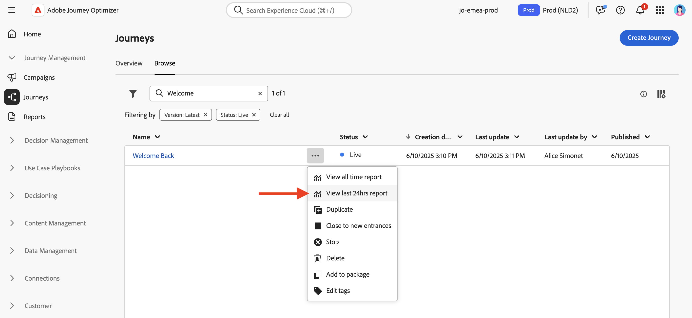
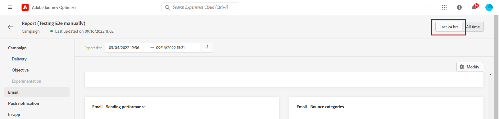
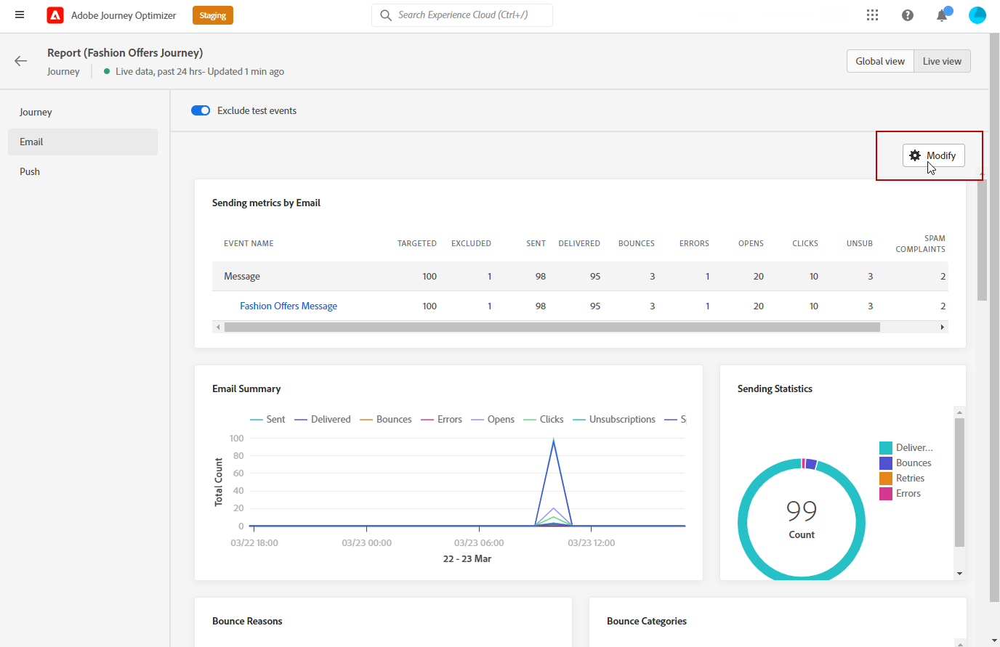
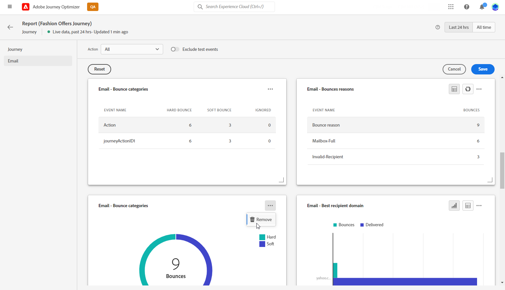

# 实时报告入门 {#live-report}

使用 **[!UICONTROL 实时报表]** 可在内置仪表板中实时测量和显示历程和消息的影响和性能。
数据在 **[!UICONTROL 实时报表]** 发送投放或从执行旅程后 **[!UICONTROL 最近24小时]** 选项卡。

* 如果要在历程上下文中定位历程，请从 **[!UICONTROL 历程]** 菜单，访问您的历程并单击 **[!UICONTROL 查看报表]** 按钮。

   

* 如果要定位营销活动，请从 **[!UICONTROL 促销活动]** 菜单，访问您的营销活动并单击 **[!UICONTROL 报表]** 按钮。

   

* 如果要从 **[!UICONTROL 全局报告]** 到 **[!UICONTROL 实时报表]** 对于投放，单击 **[!UICONTROL 最近24小时]** 切换器。

   

有关Adobe Journey Optimizer中可用的每个量度的详细列表，请参阅 [本页](#list-of-components-live).

## 自定义功能板 {#modify-dashboard}

可通过调整大小或删除小组件来修改每个报表功能板。 更改小组件仅会影响当前用户的功能板。 其他用户将看到他们自己的功能板或默认设置的功能板。

1. 选择是否要使用切换栏从报表中排除测试事件。 有关测试事件的更多信息，请参阅 [本页](../building-journeys/testing-the-journey.md).

   请注意， **[!UICONTROL 排除测试事件]** 选项仅可用于历程报表。

   

1. 要调整小组件大小或删除小组件，请单击 **[!UICONTROL 修改]**.

   

1. 通过拖动小组件的右下角来调整其大小。

   

1. 单击 **[!UICONTROL 删除]** 删除您不需要的任何小组件。

   

1. 当您对小组件的显示顺序和大小感到满意后，单击 **[!UICONTROL 保存]**.

功能板现已保存。 您的不同更改将重新应用，以便日后使用您的实时报表。 如果需要，请使用 **[!UICONTROL 重置]** 用于恢复默认小组件和小组件顺序的选项。

## 组件列表 {#list-of-components-live}

下表提供了报表中使用的量度列表及其定义，具体取决于投放类型。

### 历程量度 {#journey-metrics}

<table> 
 <thead> 
  <tr> 
   <th> 量度  </th> 
   <th> 定义  </th> 
</tr>
 </thead> 
 <tbody> 
  <tr> 
   <td>已成功执行操作  </td> 
   <td> 为历程成功执行的操作总数。  </td> 
</tr> 
  <tr> 
   <td> 输入的用户档案  </td> 
   <td> 到达历程的登入事件的个人总数。  </td> 
</tr>
  <tr> 
   <td> 操作错误  </td> 
   <td>操作发生的错误总数。  </td> 
</tr> 
  <tr> 
   <td> 退出用户档案  </td> 
   <td> 退出历程的个人总数。  </td> 
</tr> 
  <tr> 
   <td> 失败的单个历程  </td> 
   <td> 未成功执行的各个历程的总数。  </td> 
</tr> 
 </tbody> 
</table>

### 电子邮件和短信量度 {#email-and-sms-metrics}

<table> 
 <thead> 
  <tr> 
   <th> 量度  </th> 
   <th> 定义  </th> 
</tr>
 </thead> 
 <tbody>
  <tr> 
   <td> 退信数  </td> 
   <td> 在投放和自动回访处理过程中累积的错误总数。  </td> 
</tr> 
  <tr> 
   <td> 跳出率  </td> 
   <td> 退回的电子邮件与发送的电子邮件的百分比。  </td> 
</tr>
  <tr> 
   <td> 单击次数  </td> 
   <td> 电子邮件中内容的点击次数。  </td> 
</tr> 
  <tr> 
   <td> 已送达   </td> 
   <td> 成功发送的消息数。 </td> 
</tr> 
  <tr> 
   <td> 投放率  </td> 
   <td> 成功发送的消息的百分比。  </td> 
</tr>
  <tr> 
   <td> 错误  </td> 
   <td> 投放期间发生的阻止将其发送到用户档案的错误总数。  </td> 
</tr> 
  <tr> 
   <td> 错误率  </td> 
   <td> 与发送的电子邮件相比，在阻止发送投放的投放期间发生的错误百分比。  </td> 
</tr>
  <tr> 
   <td> 排除  </td> 
   <td> 已被Adobe Journey Optimizer排除的用户档案数。  </td> 
</tr>
  <tr> 
   <td> 硬退回  </td> 
   <td> 永久错误的总数，如错误的电子邮件地址。 这涉及显式声明地址无效的错误消息，如未知用户。  </td>
</tr>
  <tr> 
   <td> 已忽略  </td> 
   <td> 临时（如“不在办公室”）或技术错误（例如，如果发件人类型为邮递员）的总数。  </td> 
</tr>
   <tr> 
   <td>选件点击率  </td> 
   <td>与选件进行交互的用户百分比。  </td> 
</tr>
   <tr> 
   <td>优惠展示率  </td> 
   <td>已打开选件与已发送选件数的百分比。  </td> 
</tr>
   <tr> 
   <td>选件名称  </td> 
   <td> 在投放中添加的选件的名称。 有关版面的更多信息，请参阅 <a href="../offers/offer-library/creating-personalized-offers.md">页面</a>.  </td> 
</tr>
   <tr> 
   <td>已发送选件  </td> 
   <td>选件的发送总数。  </td> 
</tr> 
  <tr>
   <td>打开次数  </td> 
   <td> 消息的打开次数。  </td> 
</tr> 
  <tr> 
   <td> 打开率  </td> 
   <td> 已打开的电子邮件总数与已投放电子邮件的数量相比较。  </td> 
</tr>
  <tr> 
   <td>版面名称  </td> 
   <td> 用于显示选件的版面名称。 有关版面的更多信息，请参阅 <a href="../offers/offer-library/creating-placements.md">页面</a>. </td> 
</tr> 
  <tr> 
   <td> 重试  </td> 
   <td> 队列中要重试的电子邮件数量。  </td> 
</tr> 
  <tr> 
   <td> 已发送  </td> 
   <td> 投放的发送总数。  </td> 
</tr>
  <tr> 
   <td> 软退回  </td> 
   <td> 临时错误（如完整收件箱）的总数。  </td> 
</tr>
  <tr> 
   <td> 垃圾邮件投诉次数  </td> 
   <td> 将消息声明为垃圾邮件或垃圾邮件的次数。  </td> 
</tr>
  <tr> 
   <td> 目标  </td> 
   <td> 在投放分析期间处理的消息总数。  </td> 
</tr> 
  <tr> 
   <td> 唯一点击次数  </td> 
   <td> 单击电子邮件中内容的收件人数量。  </td> 
</tr> 
  <tr> 
   <td>独特点击率  </td> 
   <td> 与投放进行交互的用户百分比。  </td> 
</tr>
  <tr> 
   <td> 唯一打开次数  </td> 
   <td>打开投放的收件人数。  </td> 
</tr> 
  <tr> 
   <td> 取消订阅  </td> 
   <td> 退订链接的点击次数。  </td> 
</tr> 
 </tbody> 
</table>

### 登陆页面量度 {#landing-page-metrics}

<table> 
 <thead> 
  <tr> 
   <th> 量度  </th> 
   <th> 定义  </th> 
</tr>
 </thead> 
 <tbody>
 <tr> 
  <td>退信数  </td> 
   <td>未与登陆页面进行交互且未完成订阅操作的人员数。  </td> 
</tr>
 <tr> 
   <td>跳出率  </td> 
   <td>未与登陆页面进行交互且未完成订阅操作的人员数。  </td> 
</tr>
 <tr>
  <tr> 
   <td>单击次数  </td> 
   <td>内容在登陆页面中的点击次数。  </td> 
</tr>
 <tr> 
   <td>点击率  </td> 
   <td>登陆页面中的点击次数百分比。  </td>
</tr>
<tr>
<td>转化  </td> 
   <td>与登陆页面进行交互（例如订阅了表单）的人数。  </td> 
</tr>
<tr>
   <td>转化率  </td> 
   <td>与登陆页面进行交互（例如订阅了表单）的人数。  </td> 
</tr>
 <tr> 
   <td>历程  </td> 
   <td>历程对登陆页面的访问次数。  </td> 
</tr>
 <tr> 
   <td>其他来源  </td> 
   <td>来自外部源而非历程的登陆页面访问次数。  </td> 
</tr>
 <tr> 
   <td>总访问量  </td> 
   <td> 来自历程和外部源对您登陆页面的访问总数，包括一个收件人的多次访问。  </td> 
</tr>
 <tr> 
   <td>独特访客  </td> 
   <td>访问您的登陆页面的人数，则不会考虑一个收件人的多次访问。  </td> 
</tr>
 <tr> 
   <td>访问次数  </td> 
   <td>登陆页面的访问次数，包括一个收件人的多次访问。  </td> 
</tr>
 </tbody> 
</table>

