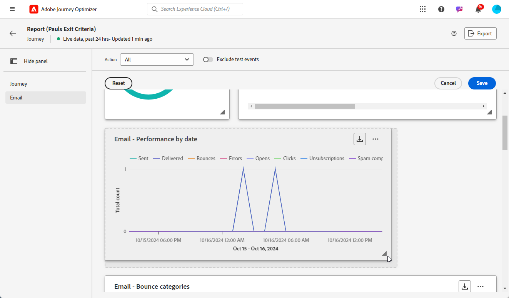

# 实时报告入门 {#live-report}

使用&#x200B;**[!UICONTROL 实时报告]**在内置仪表板中实时衡量和可视化您的历程和消息的影响和性能。
在发送投放或从**[!UICONTROL 最近24小时]**&#x200B;选项卡执行历程后，**[!UICONTROL 实时报告]**&#x200B;中的数据可用。

* 如果要在历程上下文中定位历程，请从&#x200B;**[!UICONTROL 历程]**&#x200B;菜单访问历程的&#x200B;**[!UICONTROL 更多操作]**&#x200B;菜单，然后单击&#x200B;**[!UICONTROL 查看过去24小时报告]**&#x200B;按钮。

  

* 如果要定位促销活动，请从&#x200B;**[!UICONTROL 促销活动]**&#x200B;菜单中访问您的促销活动，然后单击&#x200B;**[!UICONTROL 报告]**&#x200B;按钮，然后单击&#x200B;**[!UICONTROL 查看最近24小时报告]**。

  

有关Adobe Journey Optimizer中可用的每个量度的详细列表，请参阅[此页面](#list-of-components-live)。

## 自定义仪表板 {#modify-dashboard}

可以通过调整小部件的大小或删除小部件来修改每个报表仪表板。 更改构件只会影响当前用户的仪表板。 其他用户将看到自己的功能板或默认设置的功能板。

1. 从&#x200B;**[!UICONTROL 操作]**&#x200B;下拉列表中，选择是否要报告历程的一个特定操作。

1. 选择是否要通过切换栏从报表中排除测试事件。 有关测试事件的详细信息，请参阅[此页面](../building-journeys/testing-the-journey.md)。

   请注意，**[!UICONTROL 排除测试事件]**&#x200B;选项仅适用于历程报表。

   

1. 要调整小部件的大小或删除小部件，请单击&#x200B;**[!UICONTROL 修改]**。

   

1. 通过拖动小部件的右下角调整其大小。

   

1. 单击&#x200B;**[!UICONTROL 删除]**&#x200B;可删除不需要的任何构件。

   

1. 如果对显示顺序和小部件的大小满意，请单击&#x200B;**[!UICONTROL 保存]**。

1. 要自定义数据的显示方式，可以从不同的可视化选项（如图形、表格和圆环图）进行切换。

   

您的信息板现已保存。 您的不同更改将重新应用以供以后使用实时报告。 如果需要，请使用&#x200B;**[!UICONTROL 重置]**&#x200B;选项恢复默认小部件和小部件的顺序。

## 导出您的报告 {#export-reports}

您可以轻松地将不同的报表导出为PDF或CSV格式，以便您共享或打印它们。

>[!BEGINTABS]

>[!TAB 将报告导出为PDF文件]

1. 在报表中，单击&#x200B;**[!UICONTROL 导出]**&#x200B;并选择&#x200B;**[!UICONTROL PDF文件]**。

   

1. 在“打印”窗口中，根据需要配置文档。 请注意，选项可能因您的浏览器而异。

1. 选择打印报表或将报表另存为PDF。

1. 找到要保存文件的文件夹，根据需要重命名它，然后单击“保存”。

您的报表现在可以在PDF文件中查看或共享。

>[!TAB 将报告导出为CSV文件]

1. 在报表中，单击&#x200B;**[!UICONTROL 导出]**&#x200B;并选择&#x200B;**[!UICONTROL CSV文件]**&#x200B;以生成整个报表级别的CSV文件。

   

1. 您还可以选择从特定构件导出数据。 单击所选小组件旁边的&#x200B;**[!UICONTROL 下载CSV文件]**。

   

1. 您的文件会自动下载，并位于本地文件中。

   如果在报表级别生成文件，则它包含每个小组件的详细信息，包括其标题和数据。

   如果在小组件级别生成文件，则它会专门提供选定小组件的数据。

>[!ENDTABS]
