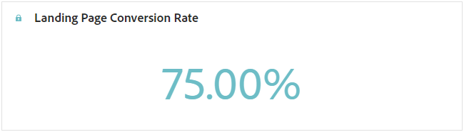

# 登陆页面报告 {#lp-report-global-cja}

**登陆页面**&#x200B;报表提供了有关用户行为、参与模式、转化率和其他关键量度的宝贵见解，使您能够做出明智决策并有效优化登陆页面性能。

要访问您的报告，请从所选登陆页面的高级菜单中选择&#x200B;**[!UICONTROL 报告]**。

要了解有关Customer Journey Analytics工作区以及如何过滤和分析数据的更多信息，请参阅[此页面](https://experienceleague.adobe.com/en/docs/analytics-platform/using/cja-workspace/home)。

## 登陆页面转化率 {#lp-conversion}

通过&#x200B;**[!UICONTROL 登陆页面转化率]** KPI，您可以根据访问次数和交互次数评估登陆页面的有效性。

* **[!UICONTROL 登陆页面转化率]**：与登陆页面进行交互（例如订阅了表单）的人数，与访问总数相关。

## 登陆页面跳出率 {#lp-bounce-rate}

**[!UICONTROL 登陆页面跳出率]** KPI提供了查看登陆页面的用户档案的相关信息，这些用户档案没有进行交互或单击“任何”元素。

* **[!UICONTROL 登陆页面跳出率]**：未与登陆页面交互且未完成订阅操作的人数，与访问总数相关。

## 登陆页面查看次数 {#lp-views}

**[!UICONTROL 登陆页面查看次数]** KPI允许您查看登陆页面的影响。

* **[!UICONTROL 登陆页面查看次数]**：来自历程和外部源的登陆页面访问总数，包括一个用户档案的多次访问。

## 独特登陆页面查看次数 {#lp-unique-views}

**[!UICONTROL 独特登陆页面查看次数]** KPI允许您通过从同一配置文件中排除多个查看次数来衡量登陆页面的影响。

* **[!UICONTROL 独特登陆页面查看次数]**：访问过您的登陆页面的人员数量，不考虑一个用户档案的多次访问。

## 随时间变化的登陆页面性能 {#lp-performance-overtime}

**[!UICONTROL 登陆页面一段时间内的性能]**&#x200B;图可衡量您的登陆页面是否成功以及对目标受众的影响。

* **[!UICONTROL 登陆页面查看次数]**：来自历程和外部源的登陆页面访问总数，包括一个用户档案的多次访问。

* **[!UICONTROL 登陆页面转换]**：与登陆页面进行交互（例如订阅了表单）的人员数，与访问总数相关。

## 登陆页面绩效 {#lp-performance}

**[!UICONTROL 登陆页面性能]**&#x200B;表用作综合仪表板，提供与您的登陆页面相关的关键量度的详细细目。

* **[!UICONTROL 登陆页面转化率]**：与登陆页面进行交互（例如订阅了表单）的人数，与访问总数相关。

* **[!UICONTROL 登陆页面跳出率]**：未与登陆页面交互且未完成订阅操作的人数，与访问总数相关。

* **[!UICONTROL 独特登陆页面查看次数]**：访问过您的登陆页面的人员数量，不考虑一个用户档案的多次访问。

* **[!UICONTROL 独特登陆页面转化]**：与登陆页面交互的人数，未考虑一个用户档案的多次交互。

* **[!UICONTROL 登陆页面查看次数]**：来自历程和外部源的登陆页面访问总数，包括一个用户档案的多次访问。

* **[!UICONTROL 登陆页面转换]**：与登陆页面交互（例如订阅了表单）的人数。

## 历程 {#lp-journeys}

**[!UICONTROL 历程]**&#x200B;表提供了全面的概述，详细说明了用户历程上下文中访问登陆页面的频率。 这种富有洞察力的呈现方式提供了有关用户交互的有价值数据，让您能够了解访客如何在您的网站中导航并与您的内容互动。

* **[!UICONTROL 登陆页面查看次数]**：来自历程和外部源的登陆页面访问总数，包括一个用户档案的多次访问。

* **[!UICONTROL 登陆页面转换]**：与登陆页面交互（例如订阅了表单）的人数。

## 营销活动 {#lp-campaigns}

**[!UICONTROL 促销活动]**&#x200B;表提供了因特定促销活动而定向到登陆页面的访问次数的见解，从而全面了解促销活动效果以及登陆页面内容的参与情况。

* **[!UICONTROL 登陆页面查看次数]**：来自历程和外部源的登陆页面访问总数，包括一个用户档案的多次访问。

* **[!UICONTROL 登陆页面转换]**：与登陆页面交互（例如订阅了表单）的人数。

## 渠道 {#lp-channels}

**[!UICONTROL 渠道]**&#x200B;表显示按每个渠道分类的登陆页面访问次数。

* **[!UICONTROL 登陆页面查看次数]**：来自历程和外部源的登陆页面访问总数，包括一个用户档案的多次访问。

* **[!UICONTROL 登陆页面转换]**：与登陆页面交互（例如订阅了表单）的人数。

## 热门点击链接 {#lp-top-clicked}

**[!UICONTROL 热门点击链接]**&#x200B;表提供了有关访客如何与投放交互的分析，其中突出显示哪些链接获得的参与度和受众关注度最高。

* **[!UICONTROL 登陆页面点击次数]**：在登陆页面中点击内容的次数。
