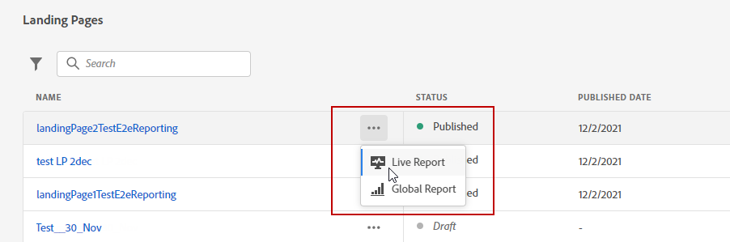

# Landing page live report {#lp-report-live}

The landing page **[!UICONTROL Live report]** report displays details about the impact of your landing pages over the last 24 hours only. To measure your landing page data over a selected time period, refer to the [Landing page global report](lp-report-global.md).

要访问您的报表，请选择 **[!UICONTROL Live report]** ，从选定登陆页面的高级菜单访问。

The landing page **[!UICONTROL Live report]** is divided into different widgets detailing your delivery’s success and errors. 如果需要，可以调整每个小组件的大小并将其删除。 For more information on this refer to this [section](live-report.md).

The **[!UICONTROL Landing page performance]** widget details the main information relative to your message over the last 24 hours through KPIs:

* **[!UICONTROL Total visits]**:从历程或其他来源访问登陆页面的总次数，包括一个收件人的多次访问。

* **[!UICONTROL Conversions]**:与登陆页面进行交互（例如订阅了表单）的人数。

* **[!UICONTROL Bounces]**: Number of persons who didn&#39;t interact with the landing page and didn&#39;t complete the action of subscribing.

的 **[!UICONTROL Visit sources]** 小组件表示访客如何访问您的登陆页面：

* **[!UICONTROL Journey(s)]**:历程对登陆页面的访问次数。

* **[!UICONTROL Other sources]**:来自外部源而非历程的登陆页面访问次数。

The **[!UICONTROL Top clicked links]** identifies the visitors&#39; interaction with the landing page:

* **[!UICONTROL Clicks]**:内容在登陆页面中的点击次数。

的 **[!UICONTROL Journey(s)]** 小组件表示从历程到登陆页面的访问次数。

的 **[!UICONTROL Other sources]** 小组件表示从外部源而不是历程访问登陆页面的次数。

The **[!UICONTROL Visits by messages]** / **[!UICONTROL Conversions by messages]** graphs represent the total number of visits and persons who interacted successfully with your landing page in the last 24 hours depending on the sent messages.

的 **[!UICONTROL Visits by channels]** / **[!UICONTROL Conversions by channels]** 图形表示过去24小时内与您的登陆页面成功交互的访问和人员总数，具体取决于渠道。
