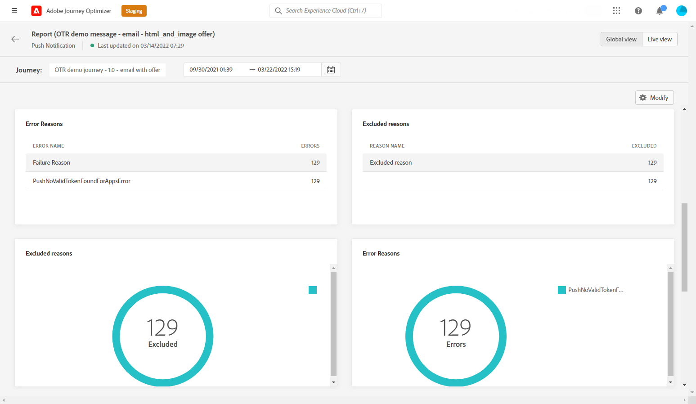
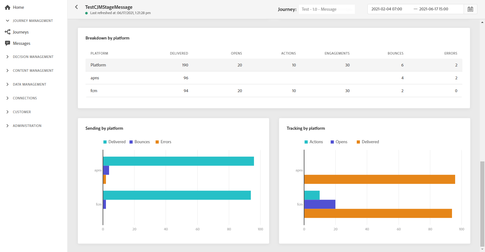

# 推送全局报告 {#push-global-report}

推送 **[!UICONTROL Global report]** 仅定向一个特定的推送投放。

从 **[!UICONTROL Executions]** 选项卡 **[!UICONTROL Messages]** 菜单，选择 **[!UICONTROL Global view]** 然后，从选定投放的高级菜单中选择 **[!UICONTROL Global report]**.

推送 **[!UICONTROL Global report]** 会分为不同的小组件，用于详细描述投放的成功和错误。 如果需要，可以调整每个小组件的大小并将其删除。 有关此内容的详细信息，请参阅 [部分](global-report.md#modify-dashboard).

的 **[!UICONTROL Push notification performance]** 小组件通过KPI详细介绍与推送通知相关的主要信息：

* **[!UICONTROL Sent]**:投放的发送总数。

* **[!UICONTROL Bounce Rate]**:与发送的推送通知相比，已退回的推送通知的百分比。

* **[!UICONTROL Error Rate]**:与发送的推送通知相比，在阻止发送投放的投放期间发生的错误百分比。

* **[!UICONTROL Actions Rate]**:已提交推送通知的操作百分比，例如单击按钮或解除。

* **[!UICONTROL Engagement Rate]**:此推送通知的打开次数和操作的百分比，例如用户档案打开了推送或单击了按钮。

的 **[!UICONTROL Push notification summary]** 图表包含可用于已发送推送通知的数据，例如：

* **[!UICONTROL Opens]**:投放中消息打开的次数。

* **[!UICONTROL Actions]**:已送达推送通知的操作总数，例如按钮单击或解除。

* **[!UICONTROL Bounces]**:在投放和自动回访处理过程中累积的与已发送消息总数有关的错误总数。

* **[!UICONTROL Delivered]**:已成功发送的消息数，与已发送消息的总数有关。

* **[!UICONTROL Errors]**:投放期间发生的阻止将其发送到用户档案的错误总数。

的 **[!UICONTROL Error Reasons]** 和 **[!UICONTROL Exclude Reasons]** 图形和表格允许您查看在投放期间发生的错误和排除项。

的 **[!UICONTROL Tracking by platform]**, **[!UICONTROL Sending by platform]** 和 **[!UICONTROL Breakdown by platform]** 图形和表格根据收件人的操作系统详细列出了推送通知的成功情况。
