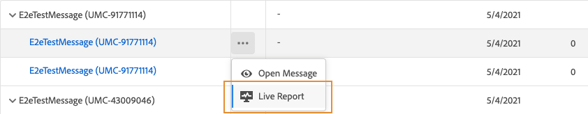

# 推送实时报告{#push-live-report}

推送&#x200B;**[!UICONTROL Live report]**&#x200B;仅目标一个特定的推送投放。

从&#x200B;**[!UICONTROL Messages]**&#x200B;菜单的&#x200B;**[!UICONTROL Executions]**&#x200B;选项卡中，选择&#x200B;**[!UICONTROL Live view]**，然后从选定投放的高级菜单中选择&#x200B;**[!UICONTROL Live report]**。

推送&#x200B;**[!UICONTROL Live report]**&#x200B;被分为不同的构件，详细描述投放的成功和错误。 如果需要，可以调整和删除每个Widget。 有关此内容的详细信息，请参阅此[部分](live-report.md#modify-dashboard)。

**[!UICONTROL Push notification performance]** 和小 **[!UICONTROL Push notification summary]** 组件通过图表和KPI详细了解与您的消息相关的主要信息：

* **[!UICONTROL Sent]**:投放的发送总数。

* **[!UICONTROL Delivered]**:成功发送的消息数，与已发送消息的总数有关。

* **[!UICONTROL Bounces]**:在投放和自动返回处理期间累积的与已发送消息总数相关的错误总数。

* **[!UICONTROL Errors]**:在投放期间发生的错误总数，导致无法将错误发送给用户档案。

* **[!UICONTROL Opens]**:在投放中打开消息的次数。

* **[!UICONTROL Actions]**:已传递的推送通知操作总数，如按钮单击或解除。

* **[!UICONTROL Engagements]**:此推送通知的打开和操作总数，即用户档案打开推送或单击按钮时。

**[!UICONTROL Tracking by platform]**、**[!UICONTROL Sending by platform]**&#x200B;和&#x200B;**[!UICONTROL Breakdown by platform]**&#x200B;图形和表根据操作系统详细说明了推送通知的成功与否。

**[!UICONTROL Sending statistics - Failed]**&#x200B;构件允许您查看发生了多少错误和弹回。

**[!UICONTROL Error Reasons]**&#x200B;图表和表允许您查看在投放期间发生的错误。
