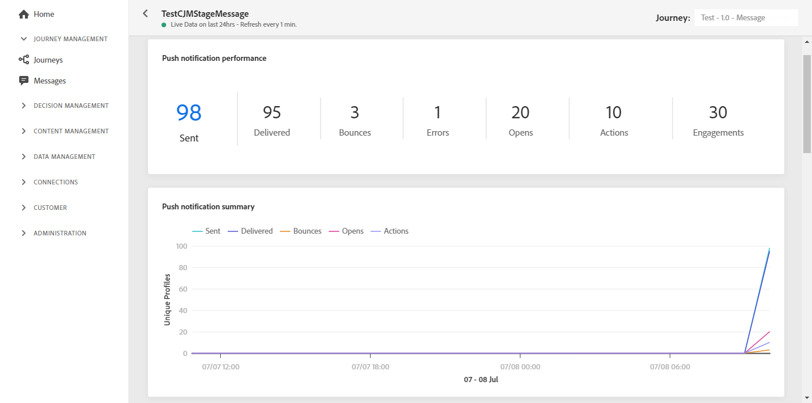

# 推送实时报告 {#push-live-report}

推送 **[!UICONTROL Live report]** 仅定向一个特定的推送投放。

从 **[!UICONTROL Executions]** 选项卡 **[!UICONTROL Messages]** 菜单，选择 **[!UICONTROL Live view]** 然后，从选定投放的高级菜单中选择 **[!UICONTROL Live report]**.

推送 **[!UICONTROL Live report]** 会分为不同的小组件，用于详细描述投放的成功和错误。 如果需要，可以调整每个小组件的大小并将其删除。 有关此内容的详细信息，请参阅 [部分](live-report.md#modify-dashboard).

**[!UICONTROL Push notification performance]** 和 **[!UICONTROL Push notification summary]** 小组件使用图形和KPI详细描述与消息相关的主要信息：

* **[!UICONTROL Sent]**:投放的发送总数。

* **[!UICONTROL Delivered]**:已成功发送的消息数，与已发送消息的总数有关。

* **[!UICONTROL Bounces]**:在投放和自动回访处理过程中累积的与已发送消息总数有关的错误总数。

* **[!UICONTROL Errors]**:投放期间发生的阻止将其发送到用户档案的错误总数。

* **[!UICONTROL Opens]**:投放中消息打开的次数。

* **[!UICONTROL Actions]**:已送达推送通知的操作总数，例如按钮单击或解除。

* **[!UICONTROL Engagements]**:此推送通知的打开和操作总数，例如用户档案打开推送或单击按钮时。

的 **[!UICONTROL Sending metrics - by push]** 表格详细说明了交付的成功：

* **[!UICONTROL Targeted]**:符合此投放目标用户档案的用户配置文件数。

* **[!UICONTROL Excluded]**:未收到消息的从定向用户档案中排除的用户用户档案数。

* **[!UICONTROL Sent]**:投放的发送总数。

* **[!UICONTROL Delivered]**:已成功发送的消息数，与已发送消息的总数有关。

* **[!UICONTROL Bounces]**:在投放和自动回访处理过程中累积的与已发送消息总数有关的错误总数。

* **[!UICONTROL Errors]**:投放期间发生的阻止将其发送到用户档案的错误总数。

* **[!UICONTROL Opens]**:投放中消息打开的次数。

的 **[!UICONTROL Tracking by platform]**, **[!UICONTROL Sending by platform]** 和 **[!UICONTROL Breakdown by platform]** 图形和表格根据操作系统详细列出了推送通知的成功情况。

的 **[!UICONTROL Sending statistics - Failed]** 小组件允许您查看发生了多少错误和跳出。

的 **[!UICONTROL Error Reasons]** 通过图表和表格，可查看在投放期间发生的错误。
