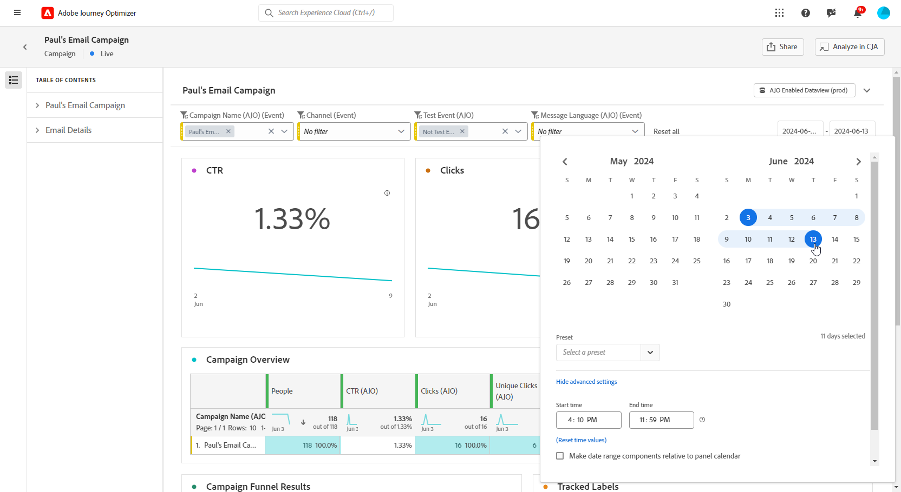
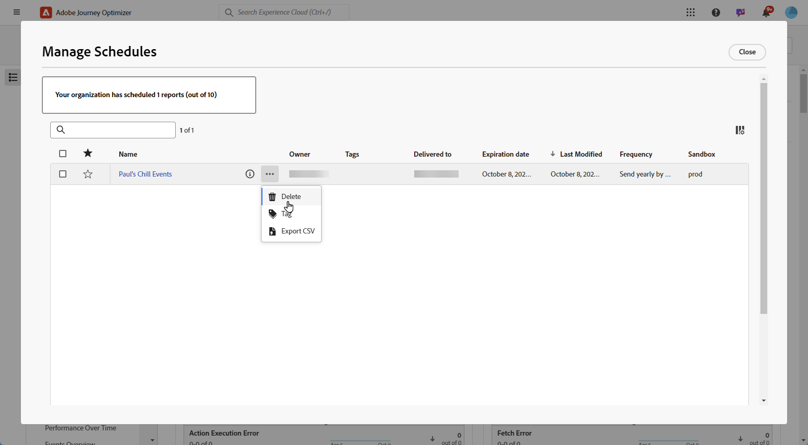

# 管理您的报告 {#channel-cja-manage}

## 在Customer Journey Analytics中分析 {#analyze}

利用所有报告中提供的&#x200B;**[!UICONTROL 在CJA中分析]**&#x200B;功能，使用您的&#x200B;**[!DNL Customer Journey Analytics]**&#x200B;许可证增强您的数据分析体验。

此功能强大的选项可将您无缝重定向到您的&#x200B;**[!DNL Customer Journey Analytics]**&#x200B;环境，使您能够对报告进行广泛个性化。 您可以使用专门的Customer Journey Analytics指标丰富您的构件，将您的见解提升到全新的水平。

[了解有关Customer Journey Analytics界面的详细信息。](https://experienceleague.adobe.com/en/docs/analytics-platform/using/cja-overview/cja-getting-started)

## 定义报告周期 {#report-period}

访问报告时，您可以应用位于报告右上角的时间段过滤器。

默认情况下，营销活动或历程的过滤期限设置为其开始和结束日期。 如果没有结束日期，则过滤器将默认为当前日期。

要修改过滤器，您可以选择自定义开始日期和持续时间，也可以从预设选项（如上周或两个月前）中进行选择。

在应用或修改筛选器后，报表将自动更新。

## 导出您的报告 {#export-reports}

您可以轻松地将不同的报表导出为PDF或CSV格式，以便您共享或打印它们。 导出报告的步骤详见以下选项卡。

>[!BEGINTABS]

>[!TAB 将报告导出为CSV文件]

1. 在报表中，单击&#x200B;**[!UICONTROL 共享]**&#x200B;并选择&#x200B;**[!UICONTROL 下载CSV]**&#x200B;以在整个报表级别生成CSV文件。

   

1. 您的文件会自动下载，并位于本地文件中。

   如果在报表级别生成文件，则它包含每个小组件的详细信息，包括其标题和数据。

>[!TAB 将报告导出为PDF文件]

1. 在报表中，单击&#x200B;**[!UICONTROL 共享]**&#x200B;并选择&#x200B;**[!UICONTROL 下载PDF]**。

   

1. 请求下载后，单击&#x200B;**[!UICONTROL 下载]**。

   

1. 您的文件将自动在浏览器中打开。

您的报表现在可用于查看、下载或共享PDF文件。

>[!ENDTABS]

## 计划导出 {#schedule-export}

通过&#x200B;**计划导出**，您可以每周、每月或每年自动投放最多10个报告。 您还可以通过更新、编辑、取消或删除任何计划导出的选项轻松管理计划报表。

1. 在报表中，单击&#x200B;**[!UICONTROL 共享]**&#x200B;并选择&#x200B;**[!UICONTROL 计划导出]**。

   

1. 在CSV和PDF之间选择您的&#x200B;**[!UICONTROL 文件类型]**。

1. 如果需要，您可以向导出添加&#x200B;**[!UICONTROL 描述]**。

1. 输入将接收此自动投放的收件人的名称。

   

1. 选择&#x200B;**[!UICONTROL 频率]**。

1. 根据选定的频率，提供相关的计划详细信息，例如：

   * 开始和结束日期

   * 间隔（例如，每几周）

   * 一周中的特定日期

   * 一个月中的周

   * 一个月中的日

   * 月份

1. 单击&#x200B;**[!UICONTROL 按计划]**&#x200B;发送。

1. 要编辑以前创建的计划导出，请单击&#x200B;**[!UICONTROL 共享]**，然后选择&#x200B;**[!UICONTROL 管理计划]**。

   

1. 从计划导出列表中，选择要更新的导出并进行必要的更改。

1. 要删除计划报表，请从托管计划列表中选择一个计划，然后单击&#x200B;**[!UICONTROL 删除]**。

   

## 创建简单量度 {#create-simple-metric}

您可以直接在报表中创建自定义计算指标。 您可以生成更量身定制的洞察信息，并以适合您特定报告需求的方式组合两个现有量度，从而更好地分析您的数据。

1. 首先，访问要添加新量度的报表。

1. 在报表的表中，通过按住`Shift`或`CTRL/CMD`键并单击所需的量度来选择它们。 然后，右键单击并选择&#x200B;**[!UICONTROL 从所选内容创建量度]**。

   如果选择两个以上的量度，则量度生成器中只使用前两个量度。

   

1. 在计算量度生成器中，通过键入&#x200B;**[!UICONTROL 标题]**&#x200B;字段为新量度命名。 您还可以添加&#x200B;**[!UICONTROL 描述]**。

   >[!NOTE]
   >
   >如果您拥有Customer Journey Analytics，则可以使用其他选项进一步个性化您的量度。 [了解详情](https://experienceleague.adobe.com/en/docs/analytics-platform/using/cja-components/cja-calcmetrics/cm-workflow/cm-build-metrics#areas-of-the-calculated-metrics-builder)

1. 选择适当的&#x200B;**[!UICONTROL 小数位]**，并根据您希望量度的显示方式选择&#x200B;**[!UICONTROL 格式]**（小数、时间、百分比或货币）。

1. 选择将决定如何计算指标的运算符，例如加、减、乘或除。

   

1. 如果需要，可以重新排列组件。

1. 对设置感到满意后，单击&#x200B;**[!UICONTROL 应用]**&#x200B;以完成新量度。

1. 您的新指标将显示在报表中的原始指标旁边。

   

在将报表导出为PDF或CSV时，将包含您新创建的指标。 但是，一旦退出，它就会从报表中删除。

## 使用探索性分析探索数据 {#exploratory}

使用探索性分析工具，根据您选择的&#x200B;**[!UICONTROL Dimension]**&#x200B;和&#x200B;**[!UICONTROL 量度]**&#x200B;轻松创建表和可视化图表。 此工具简化了数据探索，允许您轻松自动自定义和分析信息。 请参阅[此文档](https://experienceleague.adobe.com/en/docs/analytics/analyze/analysis-workspace/panels/quickinsight)以了解详情。

1. 首先，访问您要使用探索性分析的报表。

1. 从左边栏菜单中选择Exploration Analysis菜单。

   

1. 使用下拉菜单选择&#x200B;**[!UICONTROL Dimension]**&#x200B;和&#x200B;**[!UICONTROL 量度]**&#x200B;以生成查询。 如果需要，您还可以选择&#x200B;**[!UICONTROL 区段]**。

   

1. 定义分析的日期范围，以指定要关注的期间。 默认情况下，日期范围将设置为报表面板中使用的日期范围。

1. 使用&#x200B;**[!UICONTROL 添加细分]**&#x200B;或&#x200B;**[!UICONTROL 添加量度]**&#x200B;选项以包含其他维度，从而允许更详细的数据细分。

   请注意，您最多只能添加三个&#x200B;**[!UICONTROL Dimension]**、**[!UICONTROL 量度]**&#x200B;和&#x200B;**[!UICONTROL 区段]**。

您现在可以使用自定义表格和可视化工具分析数据。

<!--## Create a down-funnel metric {#down-funnel}

1. Create a new journey or open an existing one. [Learn more on journey creation](../building-journeys/journey-gs.md)

1. On the canvas editor, select the option to "add a metric".

c. In the metric selector, choose whichever conversion metric seems appropriate and publish your journey

d. Open the report for the journey that you added the metric to and ensure that the metric has been added to the table alongside all the other pre-configured metrics.
-->

## 从报表数据创建受众 {#create-audience}

>[!IMPORTANT]
>
>每个组织仅限发布25个受众。 此外，用户每小时最多可发布5个受众，每天最多可发布20个受众。
> 一次性受众的生命周期为48小时。 因此，如果在该时间范围内发布了25个受众，则仅在48小时后才能发布其他受众。

现在，您可以选择表中的特定数据并直接从这些选择创建受众，从而简化和简化受众创建过程。

1. 首先，导航到包含要转换为受众的数据的报表表。

1. 右键单击所需的单元格并选择&#x200B;**[!UICONTROL 创建受众]**。

   或者，您也可以从&#x200B;**[!UICONTROL 历程画布]**&#x200B;构件开始创建受众，方法是选择一个节点并右键单击该节点。

1. 在&#x200B;**[!UICONTROL 创建受众]**&#x200B;窗口中，输入&#x200B;**[!UICONTROL 名称]**&#x200B;并为您计划发布的受众设置&#x200B;**[!UICONTROL 一次性日期范围]**。

   >[!NOTE]
   >
   >如果您拥有Customer Journey Analytics，则可以使用其他选项进一步个性化您的量度。 [了解详情](https://experienceleague.adobe.com/en/docs/analytics-platform/using/cja-components/audiences/publish)

   

1. 单击&#x200B;**[!UICONTROL 创建]**&#x200B;按钮以完成受众创建。 请注意，此过程可能需要一些时间才能完成。

您现在可以继续将新创建的受众与历程或营销活动结合使用。

