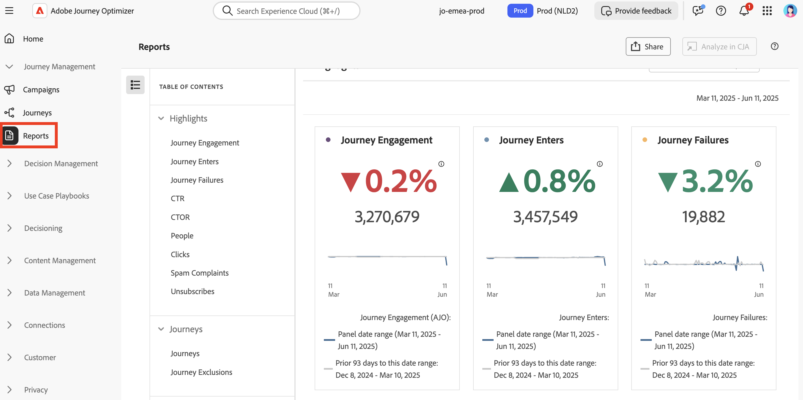

# 开始使用更新的报告体验 {#channel-report-gs-cja}

>[!IMPORTANT]
>
>Adobe Journey Optimizer中的报表当前标准化为UTC时区。 自定义报表时区的功能将在未来版本中引入。

Journey Optimizer 的报告功能具有改进的与 Customer Journey Analytics 的互操作性，在两个平台之间实现了报告标准化，并提高了数据一致性和可靠性。Journey Optimizer 与 Customer Journey Analytics 之间的这种无缝集成能够帮助更清晰地了解绩效指标，使用户能够做出更加明智的决策。

* 如果要在历程上下文中定位历程或投放，请从&#x200B;**[!UICONTROL 历程]**&#x200B;菜单访问您的历程，然后单击&#x200B;**[!UICONTROL 查看报告]**&#x200B;按钮。

  从现有历程的列表中，您还可以从所选历程的高级菜单中选择&#x200B;**[!UICONTROL 报告]**。 [了解有关历程报告的更多信息](journey-global-report-cja.md)

  

* 如果要定位促销活动，请从&#x200B;**[!UICONTROL 促销活动]**&#x200B;菜单中访问您的促销活动，然后单击&#x200B;**[!UICONTROL 报表]**&#x200B;按钮，然后&#x200B;**[!UICONTROL 查看所有时间报表]**。

  从现有营销活动的列表中，您还可以从所选营销活动的高级菜单中选择&#x200B;**[!UICONTROL 报告]**。 [了解有关营销活动报告的更多信息](campaign-global-report-cja.md)

  

* 如果要定位环境中所有营销活动和历程的量度，请导航到&#x200B;**[!UICONTROL 历程管理]**&#x200B;部分中的&#x200B;**[!UICONTROL 报表]**&#x200B;菜单，以访问&#x200B;**概述**&#x200B;报表。 [了解有关概述报告的更多信息](channel-report-cja.md)

  

## 先决条件 {#prerequisites}

* 如果您&#x200B;**没有**&#x200B;自己的Customer Journey Analytics，或者如果您拥有该帐户但&#x200B;**没有**&#x200B;访问任何Customer Journey Analytics产品配置文件的权限，则权限在Journey Optimizer中进行管理。 在这种情况下，您将需要：

   * **[!UICONTROL 查看渠道报表]**&#x200B;权限或相关角色。 [了解详情](../administration/permissions.md)

* 如果您&#x200B;**拥有** Customer Journey Analytics并有权访问Customer Journey Analytics产品配置文件，您将需要：

   * Customer Journey Analytics的&#x200B;**[!UICONTROL 受众创建]**&#x200B;和&#x200B;**[!UICONTROL 受众视图]**&#x200B;权限。 [了解详情](https://experienceleague.adobe.com/en/docs/analytics-platform/using/technotes/access-control)

   * **[!UICONTROL 管理Adobe Journey Optimizer的用户档案]**&#x200B;权限。 [了解详情](../administration/permissions.md)

* 需要使用以下设置配置您的Customer Journey Analytics数据视图： **在Adobe Journey Optimizer中设置为默认数据视图**。 [了解有关数据视图的更多信息](https://experienceleague.adobe.com/en/docs/analytics-platform/using/cja-dataviews/create-dataview)

## 操作方法视频{#video}

以下视频介绍了如何在Customer Journey Analytics中使用增强的Journey Optimizer报表。

>[!VIDEO](https://video.tv.adobe.com/v/3430413)