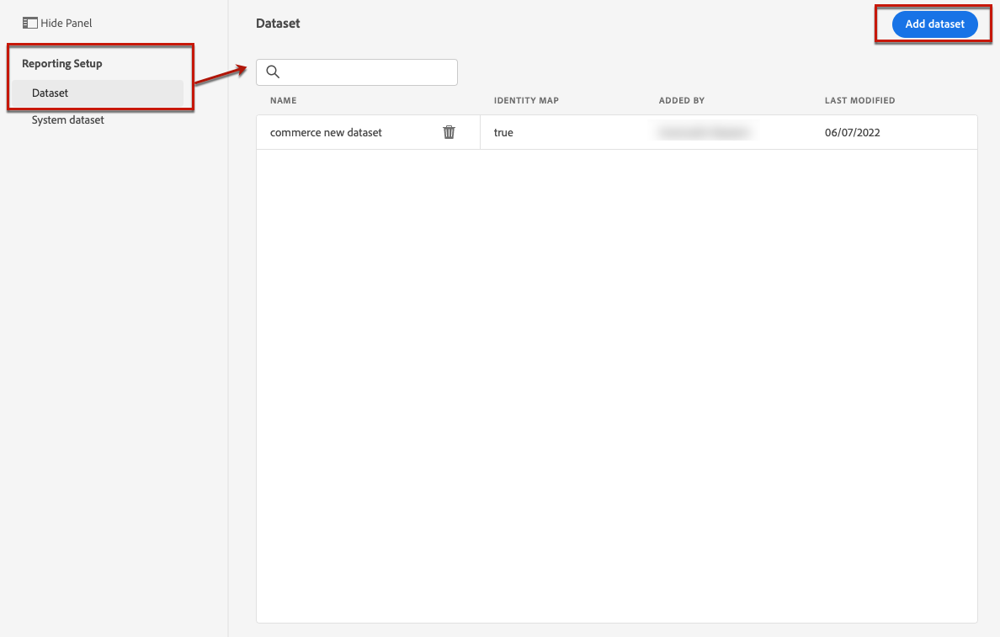
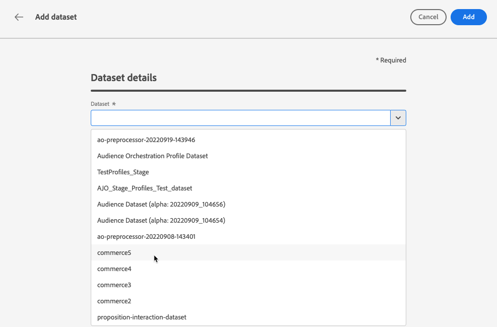

# 报告和试验先决条件 {#reporting-configuration}

>[!CONTEXTUALHELP]
>id="ajo_admin_reporting_config"
>title="设置报表数据集"
>abstract="通过报告配置，可检索将在营销活动报告中使用的其他量度。该操作必须由技术用户执行。"

>[!CONTEXTUALHELP]
>id="ajo_admin_reporting_dataset"
>title="选择数据集"
>abstract="您只能选择一个事件类型的数据集，该数据集必须至少包含一个支持的字段组：应用程序详细信息、商务详细信息、Web 详细信息。"

>[!NOTE]
>
>报表配置必须由技术用户执行。

通过报表数据源配置可以定义与系统的连接，以检索要在报表中使用的其他信息。

对于此配置，您需要添加一个或多个包含要用于报表的其他元素的数据集。 为此，请按照以下[步骤](#add-datasets)执行操作。

请注意，对于Web、基于代码和应用程序内渠道，您需要确保为数据收集配置的[数据集](../data/get-started-datasets.md)也添加到此报表配置中。 否则，Web和应用程序内数据将不会显示在内容试验报表中。

## 先决条件

必须先创建该数据集，然后才能将数据集添加到报表配置。 在[Adobe Experience Platform文档](https://experienceleague.adobe.com/docs/experience-platform/catalog/datasets/user-guide.html#create){target="_blank"}中了解更多信息。

* 您只能添加事件类型数据集。

* 这些数据集必须包括`Experience Event - Proposition Interactions` [字段组](https://experienceleague.adobe.com/docs/experience-platform/xdm/tutorials/create-schema-ui.html?lang=zh_Hans#field-group){target="_blank"}。

* 这些数据集可能还包含以下[字段组](https://experienceleague.adobe.com/docs/experience-platform/xdm/tutorials/create-schema-ui.html?lang=zh_Hans#field-group){target="_blank"}之一： `Application Details`、`Commerce Details`、`Web Details`。

  >[!NOTE]
  >
  >其中可能还包括其他字段组，但Journey Optimizer报表当前仅支持上述字段组。

  例如，如果您想要了解电子邮件促销活动对商务数据（如购买或订购）的影响，则需要使用`Commerce Details`字段组创建体验事件数据集。

  同样，如果要报告移动交互，则需要使用`Application Details`字段组创建体验事件数据集。

  <!--The metrics corresponding to each field group are listed [here](#objective-list).-->

* 您可以将这些字段组添加到一个或多个架构中，这些架构将用于一个或多个数据集。

>[!NOTE]
>
>在[XDM系统概述文档](https://experienceleague.adobe.com/docs/experience-platform/xdm/home.html){target="_blank"}中了解有关XDM架构和字段组的更多信息。

<!--
## Objectives corresponding to each field group {#objective-list}

The table below shows which metrics will be added to the **[!UICONTROL Objectives]** tab of your campaign reports for each field group.

| Field group | Objectives |
|--- |--- |
| Commerce Details | Price Total Payment Amount (Unique) Checkouts (Unique) Product List Adds (Unique) Product List Opens (Unique) Product List Removal (Unique) Product List Views (Unique) Product Views (Unique) Purchases (Unique) Save For Laters Product Price Total Product Quantity |
| Application Details | (Unique) App Launches First App Launches (Unique) App Installs (Unique) App Upgrades |
| Web Details | (Unique) Page Views |
-->

## 添加数据集 {#add-datasets}

1. 从&#x200B;**[!UICONTROL 管理]**&#x200B;菜单中选择&#x200B;**[!UICONTROL 配置]**。 在&#x200B;**[!UICONTROL 报表]**&#x200B;部分中，单击&#x200B;**[!UICONTROL 管理]**。

   

   此时会显示已添加的数据集列表。

1. 在&#x200B;**[!UICONTROL 数据集]**&#x200B;选项卡中，单击&#x200B;**[!UICONTROL 添加数据集]**。

   

   >[!NOTE]
   >
   >如果选择&#x200B;**[!UICONTROL 系统数据集]**&#x200B;选项卡，则仅显示由系统创建的数据集。 您将无法添加其他数据集。

1. 从&#x200B;**[!UICONTROL 数据集]**&#x200B;下拉列表中，选择要用于报表的数据集。

   >[!CAUTION]
   >
   >您只能选择事件类型数据集，该数据集必须至少包含一个受支持的[字段组](https://experienceleague.adobe.com/docs/experience-platform/xdm/tutorials/create-schema-ui.html?lang=zh_Hans#field-group){target="_blank"}： **应用程序详细信息**、**Commerce详细信息**、**Web详细信息**。 如果选择的数据集与这些条件不匹配，您将无法保存所做的更改。

   

   在[Adobe Experience Platform文档](https://experienceleague.adobe.com/docs/experience-platform/catalog/datasets/overview.html?lang=zh_Hans){target="_blank"}中了解关于数据集的更多信息。

1. 从&#x200B;**[!UICONTROL 配置文件ID]**&#x200B;下拉列表中，选择将用于标识报告中每个配置文件的数据集字段属性。

   

   >[!NOTE]
   >
   >只显示可用于报表的 ID。

1. 默认情况下启用&#x200B;**[!UICONTROL 使用主ID命名空间]**&#x200B;选项。 如果所选的&#x200B;**[!UICONTROL 配置文件ID]**&#x200B;是&#x200B;**[!UICONTROL 标识映射]**，则可以禁用此选项，然后从显示的下拉列表中选择其他命名空间。

   

   在[Adobe Experience Platform文档](https://experienceleague.adobe.com/docs/experience-platform/identity/namespaces.html?lang=zh-Hans){target="_blank"}中了解关于命名空间的更多信息。

1. 保存您所做的更改，以将选定的数据集添加到报表配置列表。

   >[!CAUTION]
   >
   >如果您选择了非事件类型的数据集，则将无法继续。

<!--
When building your campaign reports, you can now see the metrics corresponding to the field groups used in the datasets you added. Go to the **[!UICONTROL Objectives]** tab and select the metrics of your choice to better fine-tune your reports. [Learn more](content-experiment.md#objectives-global)

>[!NOTE]
>
>If you add several datasets, all data from all datasets will be available for reporting.

## How-to video {#video}

Understand how to configure Experience Platform reporting data sources.

>[!VIDEO]()
-->
