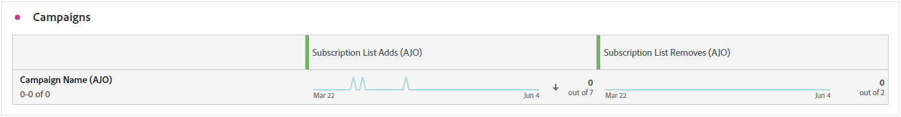

# 订阅报告 {#subscription-report-global-cja}

**订阅报告**&#x200B;提供了与特定列表关联的用户档案订阅和退订的基本见解，可帮助您了解不同的订阅活动和计划对于提高参与度和转化率的有效性。

要访问您的报告，请从高级菜单中单击所选订阅列表的&#x200B;**[!UICONTROL 报告]**&#x200B;图标。

要了解有关Customer Journey Analytics工作区以及如何过滤和分析数据的更多信息，请参阅[此页面](https://experienceleague.adobe.com/zh-hans/docs/analytics-platform/using/cja-workspace/home)。

## 订阅列表添加

**[!UICONTROL 订阅列表添加]** KPI提供了在指定时间段内获得的订阅总数的全面概述。 此量度突出显示新订阅者的增长和获取，为您的订阅活动或计划的有效性提供有价值的见解。

## 订阅列表已删除

**[!UICONTROL 订阅列表删除]** KPI提供了在指定时间段内发生的取消订阅总数的明细。 此量度提供了有关订阅者脱离参与的宝贵见解。

## 一段时间内的订阅增长

**[!UICONTROL 订阅随时间的增长]**&#x200B;图形直观地描述了指定时间段内订阅的进展，从而清楚地了解订阅者群的演变情况。

* **[!UICONTROL 订阅列表添加]**：相关期间的订阅总数。

* **[!UICONTROL 订阅列表删除了]**：相关期间的取消订阅总数。

* **[!UICONTROL 订阅列表增长]**：订阅者列表在特定时间段内增长的速率。

## 订阅列表

**[!UICONTROL 订阅列表]**&#x200B;表提供了与特定订阅列表关联的配置文件订阅和退订的基本见解。 此信息可帮助您了解不同订阅列表在提高参与度和转化率方面的有效性。

* **[!UICONTROL 订阅列表添加]**：相关期间的订阅总数。

* **[!UICONTROL 订阅列表删除了]**：相关期间的取消订阅总数。

## 历程

**[!UICONTROL 历程]**&#x200B;表提供了广泛的视图，在访客的用户历程中提供了访客订阅的复杂详细信息。

* **[!UICONTROL 订阅列表添加]**：相关期间的订阅总数。

* **[!UICONTROL 订阅列表删除了]**：相关期间的取消订阅总数。

## 营销活动

**[!UICONTROL 促销活动]**&#x200B;表提供了有关特定促销活动触发的用户档案订阅和退订的宝贵见解。 通过这个全面的视图，您可以衡量营销活动的有效性并有效跟踪与登陆页面内容的互动。

* **[!UICONTROL 订阅列表添加]**：相关期间的订阅总数。

* **[!UICONTROL 订阅列表删除了]**：相关期间的取消订阅总数。

## 渠道

**[!UICONTROL 渠道]**&#x200B;表显示按每个渠道分类的个人资料订阅和取消订阅的数量。

* **[!UICONTROL 订阅列表添加]**：相关期间的订阅总数。

* **[!UICONTROL 订阅列表删除了]**：相关期间的取消订阅总数。
