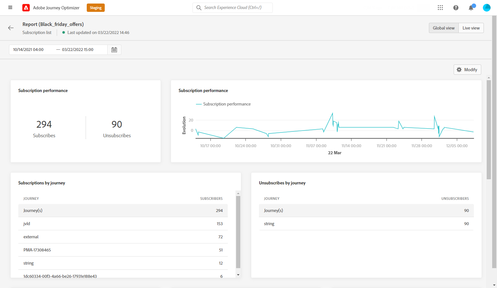

# 订阅全局报告 {#subscription-report-global}

订阅 **[!UICONTROL 全局报告]** 显示有关选定时间段内订阅者活动的详细信息。 要仅测量过去24小时内的订阅，请参阅 [订阅实时报告](subscription-report-live.md).

要访问您的报表，请单击 **[!UICONTROL 报表]** 图标。

订阅 **[!UICONTROL 全局报告]** 分为不同的小组件，用于详细介绍您的订阅和退订。 如果需要，可以调整每个小组件的大小并将其删除。 有关此内容的详细信息，请参阅 [部分](global-report.md).

的 **[!UICONTROL 订阅性能]** KPI和 **[!UICONTROL 按历程的订阅]**/**[!UICONTROL 按历程取消订阅]** 表格详细列出了与访客对登陆页面的参与度相关的主要信息。 表和KPI包含与登陆页面相关的可用数据，例如：

* **[!UICONTROL 订阅]**:有关期间的订购总数。

* **[!UICONTROL 取消订阅]**:有关期间的退订总数。

的 **[!UICONTROL 订阅性能]** 图表显示了相关期间订阅的演变。

的 **订阅 — 划分** 和 **取消订阅 — 划分** 根据消息、登陆页面和渠道，表示在选定时间段内订阅或取消订阅的总人数。
