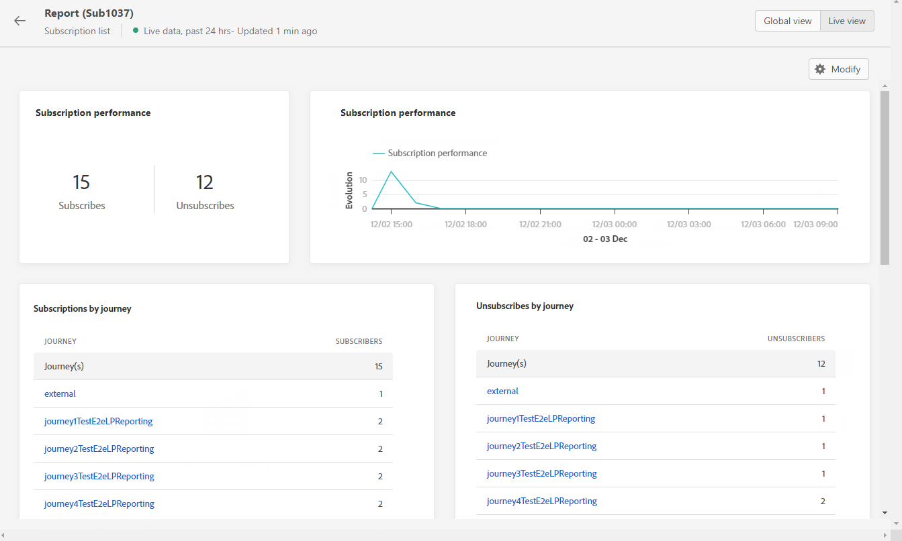

# 订阅实时报告 {#subscription-report-live}

>[!CONTEXTUALHELP]
>id="ajo_subscription_live_report"
>title="订阅实时报告"
>abstract="使用订阅实时报告，您可以实时衡量和可视化订阅者的活动（仅限过去 24 小时）。报告分为不同的构件，详细说明了订阅和取消订阅情况。每个报告仪表板都可以修改，您可以调整构件大小或删除构件。"

订阅 **[!UICONTROL 实时报告]** 仅显示过去24小时内订阅者的活动详细信息。 要测量选定时间段内的订阅，请参阅 [订阅全局报告](subscription-report-global.md).

要访问报告，请单击 **[!UICONTROL 报告]** 图标。

订阅 **[!UICONTROL 实时报告]** 分为多个构件，其中详细说明了您的订阅和退订。 如果需要，可以调整每个小部件的大小并将其删除。 有关详情，请参阅此 [部分](live-report.md).

此 **[!UICONTROL 订阅性能]** KPI和 **[!UICONTROL 按历程显示的订阅]**/**[!UICONTROL 按历程取消订阅]** 表详细介绍了与访客对登陆页面的参与度相关的主要信息。 表和KPI包含与登陆页面相关的可用数据，例如：

* **[!UICONTROL 订阅次数]**：过去24小时内的订阅总数。

* **[!UICONTROL 取消订阅]**：过去24小时内的退订总数。

此 **[!UICONTROL 订阅性能]** 图表显示过去24小时内订阅的演变情况。

此 **订阅 — 细分** 和 **取消订阅 — 细分** 图表表示过去24小时内订阅或取消订阅的总人数，具体取决于消息、登陆页面和渠道。
