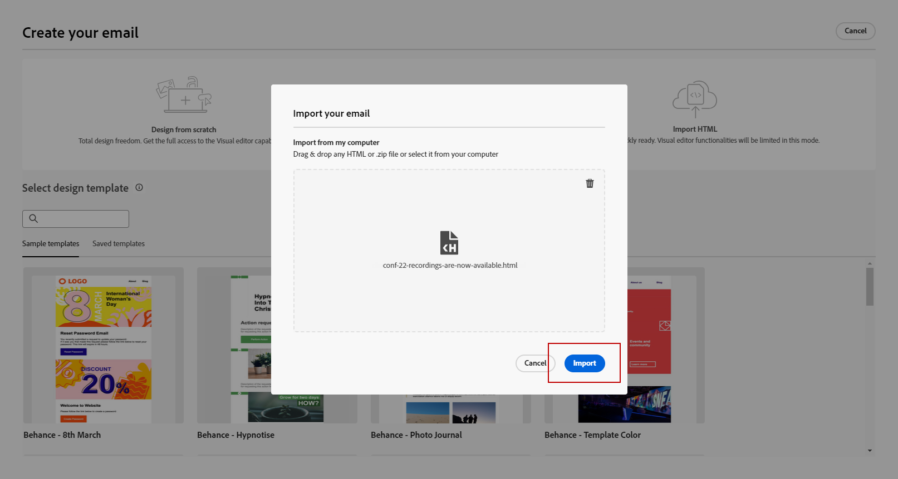

# 早期发行说明 {#e-release-notes}

[!DNL Adobe Journey Optimizer] 不断地提供新功能、对现有功能进行增强和修复错误。所有更改都将在每月的最后一周整合到 [发行说明](release-notes.md).

在发布之日前，以下早期发行说明可能会有所变更，恕不另行通知。 链接、屏幕和更新文档发布在 [发行说明](release-notes.md)，发布日期。

## 2023年7月早期发行说明 {#july-rn-2023}

**发行日期**： 7月26日至27日

### 新功能{#july-2023-features}

此版本新增了下面列出的功能。

<table>
<thead>
<tr>
<th><strong>受众构成</strong> </th>
</tr>
</thead>
<tbody>
<tr>
<td>

您现在可以创建组合工作流，将现有 Adobe Experience Platform 受众组合到可视画布中，并利用各种活动（拆分、扩充等）来创建新受众。新创建的受众与现有受众会被一起保存回 Adobe Experience Platform 中，并可在 Journey Optimizer 营销活动中利用它们来定位客户。

有关更多信息，请参阅<a href="../audience/get-started-audience-orchestration.md">详细文档</a>。

受众构成与新的Adobe Experience Platform“受众”菜单完全集成，该菜单用作受众的集中门户。 您现在可以使用包含新仪表板（带有区段趋势和重叠）的浏览页面来查找新见解，并探索用于折叠和标记的组织工具。 此体验中嵌入了用于标准化受众标签的管理控件以及用于管理激活工作流的受众生命周期管理功能。 有了这种新的管理体验，您现在可以从一个位置轻松安全地管理受众。 有关更多信息，请参阅 <a href="https://experienceleague.adobe.com/docs/experience-platform/segmentation/ui/overview.html?lang=zh-Hans" target="_blank">Adobe Experience Platform文档</a>.

</td>
</tr>
</tbody>
</table>

<!--table>
<thead>
<tr>
<th><strong>Direct mail channel</strong> </th>
</tr>
</thead>
<tbody>
<tr>
<td>

You can now add direct mail messages in your campaigns. Direct mail is an offline channel that allows you to personalize and generate the files required by direct mail providers to send mail to your customers.

When you prepare a direct mail delivery, Journey Optimizer generates a file including all the targeted profiles and the chosen contact information (postal address for example). You will then be able to send this file to your direct mail provider who will take care of the actual sending.

For more information, refer to the <a href="../direct-mail/create-direct-mail.md">detailed documentation</a>.

</tr>
</tbody>
</table-->

<table>
<thead>
<tr>
<th><strong>为电子邮件设计器转换HTML内容</strong> </th>
</tr>
</thead>
<tbody>
<tr>
<td>

您现在可以在Journey Optimizer的电子邮件编辑器中导入和转换任何HTML内容。 内容块是自动标识的，并且可在Email Designer中使用：利用其强大的设计功能对其进行更新和个性化！

<!--p>For more information, refer to the <a href="../audience/get-started-audience-orchestration.md">detailed documentation</a>.</p-->
</td>
</tr>
</tbody>
</table>

<table>
<thead>
<tr>
<th><strong>使用Journey Optimizer中的标记</strong> </th>
</tr>
</thead>
<tbody>
<tr>
<td>

除了营销活动和历程之外，您现在还可以将Adobe Experience Platform统一标记分配给登陆页面、内容模板、片段和订阅列表。 这使您能够轻松地对它们进行分类，并改进所有列表中的搜索和导航。 

有关更多信息，请参阅<a href="../start/search-filter-categorize.md#tags">详细文档</a>。

</td>
</tr>
</tbody>
</table>

<table>
<thead>
<tr>
<th><strong>内容模板API</strong> </th>
</tr>
</thead>
<tbody>
<tr>
<td>

您现在可以使用专用API创建和管理Adobe Journey Optimizer内容模板，从而提供与现有内容系统的无缝集成。

<!--
For more information, refer to the <a href="../start/search-filter-categorize.md#tags">detailed documentation</a>.
-->
</td>
</tr>
</tbody>
</table>

### 改进 {#july-2023-improvements}

此版本具有下面列出的改进。

**历程**

<!--* You can now leverage API call responses in custom actions and orchestrate your journey based on these responses.-->
* 介绍了一种新型的系统报警。 现在，您可以在自定义操作失败时收到通知。

**营销活动**

* 现在，可在个性化编辑器“上下文属性”菜单中使用与营销活动相关的上下文事件。

**受众**

在历程或营销策划中对受众选取器进行了增强，添加了显示受众来源和更新频率的新列。

随着受众构成门户的发布，Adobe Experience Platform和Adobe Journey Optimizer更新了系统和文档中“受众”和“区段”的使用。

* 受众：一组具有共同特征和行为的人员、帐户、家庭或其他实体。
* 区段定义：在 Adobe Experience Platform 中，用于描述目标受众关键特征或行为的规则。此术语以前称为“区段”。

因此，在 Adobe Journey Optimizer 和 Adobe Experience Platform UI 中，“受众”将取代“区段”，这体现出了这种创建和管理受众的新方式。

**API**

Adobe Journey Optimizer API身份验证 — 已弃用用于生成访问令牌的JWT方法。 必须使用OAuth服务器到服务器身份验证方法创建所有新集成。 Adobe还建议您将现有集成迁移到OAuth方法。 [了解详情](https://developer.adobe.com/journey-optimizer-apis/references/authentication/)

**其他更改**

现在，所有客户都可以在公共测试版中获取Journey Optimizer数据集导出到Cloud Storage目标的功能。 此功能允许您与云存储位置建立实时连接，以导出数据集的内容。 [了解详情](../data/export-datasets.md)

