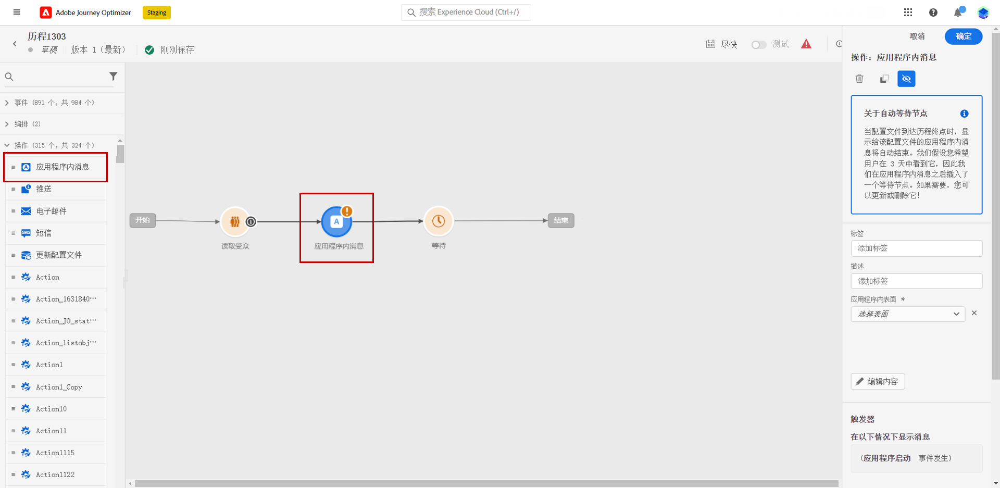

# 早期发行说明 {#e-release-notes}

[!DNL Adobe Journey Optimizer] 不断地提供新功能、对现有功能进行增强和修复错误。所有更改会在每月的最后一周整合到[发行说明](release-notes.md)中。

以下早期发行说明可能会在正式发行日期之前发生更改，恕不另行通知。链接、屏幕和更新文档，会在发行之日发布于[发行说明](release-notes.md)中。

## 2023年8月早期发行说明 {#aug-rn-2023}

**发行日期**： 2023年8月23日至24日

### 新功能{#aug-2023-features}

此版本引入了下方列出的新功能。

<table>
<thead>
<tr>
<th><strong>历程中的应用程序内渠道</strong> </th>
</tr>
</thead>
<tbody>
<tr>
<td>

现在，您可以在历程中向应用程序用户发送个性化的应用程序内消息。 使用 Journey Optimizer 设计通知并自定义消息布局、显示、文本和按钮，以创造无缝体验。

有关更多信息，请参阅<a href="../in-app/get-started-in-app.md">详细文档</a>。

</tr>
</tbody>
</table>

<table>
<thead>
<tr>
<th><strong>使用种子列表验证电子邮件</strong> </th>
</tr>
</thead>
<tbody>
<tr>
<td>

您现在可以在Journey Optimizer中创建和管理种子列表。 种子列表包含测试电子邮件地址，您可以先向这些地址发送电子邮件，然后再将其发送给实际受众。 使用此功能可监控发出的电子邮件副本，并确保所有显示格式、URL、图像和链接均正确无误。

<!--p>For more information, refer to the <a href="../audience/get-started-audience-orchestration.md">detailed documentation</a>.</p-->
</td>
</tr>
</tbody>
</table>

<table>
<thead>
<tr>
<th><strong>文本和图像的内容助手</strong> </th>
</tr>
</thead>
<tbody>
<tr>
<td>

创建消息并使其个性化后，使用内容助手将您的内容提升到新的级别。 您现在可以使用内容助手，通过尝试不同的主标题和图像来优化消息的影响。 每个变体都作为独特的处理方式进行管理，以衡量和比较哪个标题可以有效生成更多点击次数。

<!--p>For more information, refer to the <a href="../start/search-filter-categorize.md#tags">detailed documentation</a>.</p-->
</td>
</tr>
</tbody>
</table>

### 改进 {#aug-2023-improvements}

此版本包含下方列出的改进。

**API**

现在提供了用于创建和管理内容片段的新API。 [了解详情](https://developer.adobe.com/journey-optimizer-apis/references/content-templates/#tag/Content-fragment-API){target="_blank"}.

**电子邮件渠道**

* 电子邮件界面设置中提供了一个新选项，用于包含由于事务型消息受众中投诉垃圾邮件而被禁止使用的电子邮件地址。 即使他们将营销消息标记为垃圾邮件，这些用户档案随后仍可以接收事务型消息，例如密码重置或帐户报表。 此选项默认处于禁用状态。

**历程**

* 您现在可以在自定义操作中利用 API 调用响应，并根据这些响应编排历程。
* 推出了一种新型的系统警报。现在，您会在自定义操作失败时收到通知。
