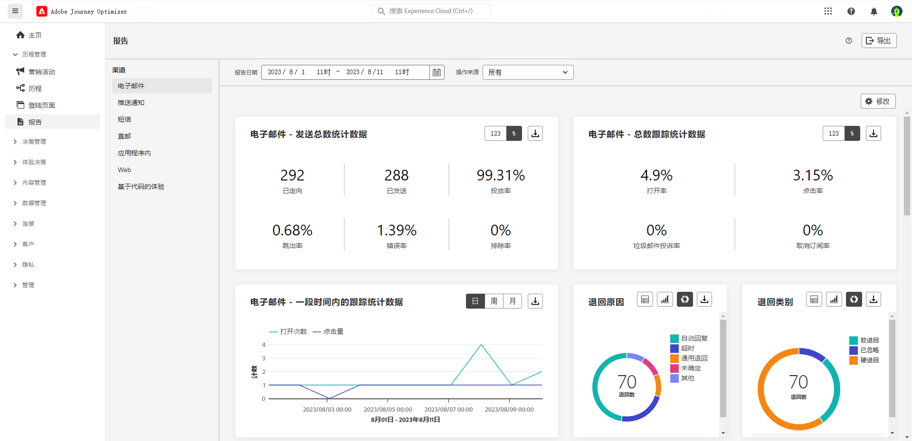

# 早期发行说明 {#e-release-notes}

[!DNL Adobe Journey Optimizer] 不断地提供新功能、对现有功能进行增强和修复错误。所有更改会在每月的最后一周整合到[发行说明](release-notes.md)中。

以下早期发行说明可能会在正式发行日期之前发生更改，恕不另行通知。链接、屏幕和更新文档，会在发行之日发布于[发行说明](release-notes.md)中。

## 2023年9月早期发行说明 {#sept-rn-2023}

**发行日期**： 2023年9月26日至27日

### 新功能{#sept-2023-features}

此版本引入了下方列出的新功能。

<table>
<thead>
<tr>
<th><strong>合并的渠道报表</strong> </th>
</tr>
</thead>
<tbody>
<tr>
<td>

渠道报表功能为分析师和营销人员提供了渠道级别的流量和参与量度的全面概述。 要访问“报表”菜单，您必须具有**查看渠道报表**权限。

<!--p>For more information, refer to the <a href="../in-app/get-started-in-app.md">detailed documentation</a>.</p-->
</tr>
</tbody>
</table>

<table>
<thead>
<tr>
<th><strong>数据集导出生成(GA)</strong> </th>
</tr>
</thead>
<tbody>
<tr>
<td>

现在可以将Journey Optimizer数据集导出到Cloud Storage目标。 通过此功能，您可以与云存储位置建立实时连接，以导出数据集的内容。

<!--p>For more information, refer to the <a href="../audience/get-started-audience-orchestration.md">detailed documentation</a>.</p-->
</td>
</tr>
</tbody>
</table>

### 改进 {#sept-2023-improvements}

此版本包含下方列出的改进。

**受众**

* 您现在可以将从CSV文件上传的受众定位到历程和营销活动中。
* 已对历程或营销活动中的受众选择器进行增强，新增了显示受众来源和更新频率的新列。
* 现在，您可以将合成工作流产生的受众定位到历程中。

**个性化**

* 除了可视片段之外，现在还可以通过表达式编辑器从Journey Optimizer界面创建、保存和重用表达式片段。 表达式片段替换以前保存的表达式。
* 您现在可以在Journey Optimizer中使用Adobe Experience Platform计算属性进行个性化。 计算属性是根据引入到Adobe Experience Platform中的支持配置文件的体验事件数据集计算的聚合值。

**警报**

推出了一种新型的系统警报。现在，您可以在读取区段失败时收到通知。

**Web 渠道**

* 您现在可以选择要将网页修改应用于的特定视图。 视图可定义为整个网站或网站上的一组可视化元素，例如主页、整个产品网站或所有结账页面上的投放首选项框架。
* 使用Web设计器编辑页面时，您现在可以直接从“修改”窗格向内容添加新更改，而无需从设计器界面中选择组件并进行编辑。
* 在设置Web子域时，除了使用已委派给Adobe的子域之外，您现在可以选择添加自己的子域。

**历程**

* 推出了一种新型的系统警报。现在，您会在自定义操作失败时收到通知。
* 复制历程时，您现在可以定义历程副本的名称。

**电子邮件渠道**

利用电子邮件平面配置中的新选项，可选择向用户档案发送事务型消息，即使其电子邮件地址在Adobe Journey Optimizer禁止列表上也是如此。

**决策管理**

已对历程或营销活动中的受众选择器进行增强，新增了显示受众来源和更新频率的新列。