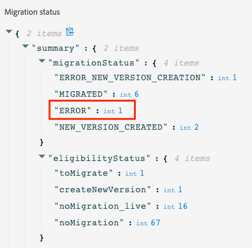

# 内联创作迁移步骤{#migration-steps}

有关在Adobe Journey Optimizer中创作内容的新过程，请参阅 [页面](../rn/inline-messages.md). 将为您执行历程的自动转换。 话虽如此，我们需要你的帮助。

>[!VIDEO](https://video.tv.adobe.com/v/344699)

以下是主要阶段和步骤：

**[迁移之前](../rn/inline-messages-steps.md#migration-step-1)**

1. 在非生产沙盒上，停止所有实时和已关闭的历程。 [了解详情](../rn/inline-messages-steps.md#migration-step-1-1)
1. 在生产沙盒中，停止所有实时临时历程，而配置文件将不会仍处于中。 [了解详情](../rn/inline-messages-steps.md#migration-step-1-2)

**[首次迭代后](../rn/inline-messages-steps.md#migration-step-2)**

1. 检查您迁移的实时历程中是否存在任何错误。 [了解详情](../rn/inline-messages-steps.md#migration-step-2-1)
1. 列出迁移创建的所有新版本。 [了解详情](../rn/inline-messages-steps.md#migration-step-2-2)
1. 逐一测试并发布它们。 [了解详情](../rn/inline-messages-steps.md#migration-step-2-3)
1. 列出所有实时版本。 [了解详情](../rn/inline-messages-steps.md#migration-step-2-4)
1. 检查已迁移的草稿版本中是否存在错误。 [了解详情](../rn/inline-messages-steps.md#migration-step-2-5)

**[第二次迭代后](../rn/inline-messages-steps.md#migration-step-3)**

1. 检查两个迁移阶段。 [了解详情](../rn/inline-messages-steps.md#migration-step-3-1)
1. 停止以前的版本。 [了解详情](../rn/inline-messages-steps.md#migration-step-3-2)

**[第三次和上次迭代之前](../rn/inline-messages-steps.md#migration-step-4)**

在弃用之前验证所有内容是否已迁移。

  

## 迁移前（7月25日）{#migration-step-1}

### 1.停止所有实时和已关闭的历程{#migration-step-1-1}

开 **非生产沙箱**，停止所有实时和已关闭的历程。 这样，自动迁移过程就可以从这些沙箱迁移所有历程，而无需您执行任何操作。 迁移后，您将能够复制并使用已停止的历程版本。

### 2.停止所有实时临时历程，而用户档案仍不在{#migration-step-1-2}

在 **生产沙盒**，停止所有不包含用户档案的实时ad-hoc历程。

+++如何查找这些历程？

要查找这些历程，请导航到 **历程** 菜单中，并过滤“状态=实时”和“类型=读取区段”上的列表。 您还可以按时间顺序从最早日期到最新“已发布”日期对历程进行排序。

从上到下打开它们。

* 检查历程是否包含消息。
* 检查它们不是重复历程。 这些不是临时的。 你最想让他们活下去。 例如，此历程属于重复历程（而非临时历程）：

   

* 如果在这些历程中使用了等待侦听器或事件侦听器，则用户档案可能仍位于内部。 查看历程执行日期，并添加您在等待或事件侦听器中定义的任何小时/天，以推断内部没有用户档案的实际日期。 如果日期已过，您可以停止历程。 否则，此历程将在历程执行日期后30天自动变为“已完成”状态。

+++

**重要说明**

* 避免在迁移日期（7月25日）之前结束历程。 由于知道迁移脚本不会迁移实时或已关闭的历程，因此限制生产沙盒中已关闭的历程的数量将限制迁移后所需的手动操作数量。

* 如果您的实时历程不是最新版本，则意味着您在草稿中创建了另一个历程版本，然后将其发布或删除。

* 如果您的消息未在历程中使用且要保留，请将其另存为模板。 请参阅 [页面](../design/email-templates.md#save-as-template). 请注意，在弃用之前，您仍然可以访问这些组件。

## 迁移首次迭代后（7月25日）{#migration-step-2}

迁移分两个阶段进行：自动化阶段（在夜间，7月25日至7月26日）和手动阶段（从7月26日开始），需要行动项目。

对于自动化阶段，请参阅 [页面](../rn/inline-messages.md#process). 对于手动阶段，以下是要在 **生产沙盒**:

<!--
_On non-production sandboxes:_

**1. Check the migration status report for any error**

Click the **Check status** button in the top banner and check that there has been no error during the automatic migration and that there is nothing left to migrate. 

Look for the "ERROR" status. 

* If there is no error, you are good to go.
* If there are errors, look for the error by searching "errorMessage". The following error is expected as migration of multi-channel messages is not supported: "Migration of multi-channel messages is not supported". You will have to rebuild this journey.

    

_On the production sandbox:_

-->

### 1.检查迁移的实时历程上是否存在任何错误{#migration-step-2-1}

在状态报表中检查自动迁移的实时历程中是否存在任何错误([了解更多](../rn/inline-messages.md#status). 单击 **检查状态** 按钮。

查找“ERROR_NEW_VERSION_CREATION”：

* 如果没有错误，则表示已处理所有需要迁移的实时历程版本，并自动创建新的迁移草稿版本。

* 如果您看到错误，则可以搜索“errorMessage”并检查日志中的错误消息。 不迁移多渠道消息。 您必须创建另一个历程。

   

* 如果遇到其他错误，请联系您的客户成功经理或任何Adobe代表以获取指导。

### 2.列出迁移创建的所有新版本{#migration-step-2-2}

标记为 [已迁移] 历程标签和创建日期中的更新。

### 3.逐一测试和发布这些组件{#migration-step-2-3}

确保历程仍需在生产中运行。 如果 [迁移前准备](../rn/inline-messages-steps.md#migration-step-1) 未正确执行，则可能已为不再需要的一次性历程创建新版本。

测试现在包含内联渠道操作的历程的草稿版本。

发布新历程版本。 然后，您之前的实时版本将变为“已关闭”状态。

### 4.列出所有实时版本{#migration-step-2-4}

它们都应标记为最新。 如果没有，请查找较新版本，测试并发布它们。

### 5.检查已迁移草稿版本上的错误 {#migration-step-2-5}

单击 **检查状态** 按钮([了解更多](../rn/inline-messages.md#status) 并检查自动迁移期间没有错误，以及没有可迁移的内容。 请注意，任何出错历程（包含消息）将在9月5日之后（在所有沙箱上）被弃用。

查找“ERROR”状态。

* 如果没有错误，你就可以走了。

* 如果存在错误，请通过搜索“errorMessage”来查找错误。 由于不支持多渠道消息的迁移，因此需要出现以下错误：“不支持多渠道消息的迁移”。 您必须重建此历程。

## 第二次迭代（8月1日）后{#migration-step-3}

第二次迭代发生在8月1日到8月2日之间的夜间。

<!--
_On non-production sandboxes:_

**1. Check at the status report**

Click the **Check status** button in the top banner and check that all journeys have been migrated and there's nothing left to migrate. If there is an error or something left to migrate, please reach out to your CSM or Adobe representative for guidance.

-->

如果之前的所有步骤均及时执行，则除已关闭的步骤和出错的步骤外，所有历程都已迁移。 以下是要在 **生产沙盒**:

### 1.检查两个迁移阶段{#migration-step-3-1}

如果没有错误，则在“toMigrate”和“createNewVersion”下的“igilityStatus”中不应包含历程。 在以下示例中，有一个“ERROR”和一个“ERROR_NEW_VERSION_CREATION”。

### 2.停止以前的版本{#migration-step-3-2}

如果您尚未发布较新的历程版本(请参阅 [部分](../rn/inline-messages-steps.md#migration-step-2-3))，然后发布较新版本。

>[!NOTE]
>
>停止之前的版本，否则您将丢失该版本及其关联的报表。

## 第三次和上次迭代之前（9月5日）{#migration-step-4}

8月1日至9月5日，您将需要验证是否已迁移所有内容，并且没有剩余的旅程仍在使用消息，否则，将在9月5日弃用它们。

