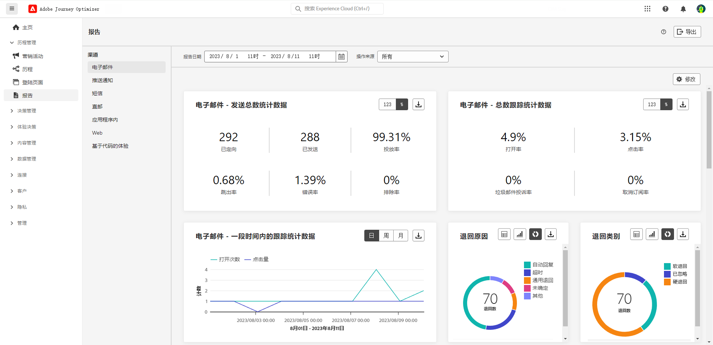
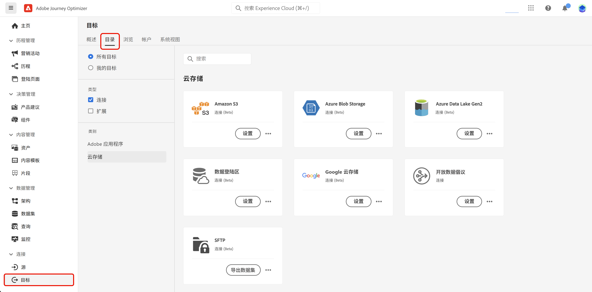
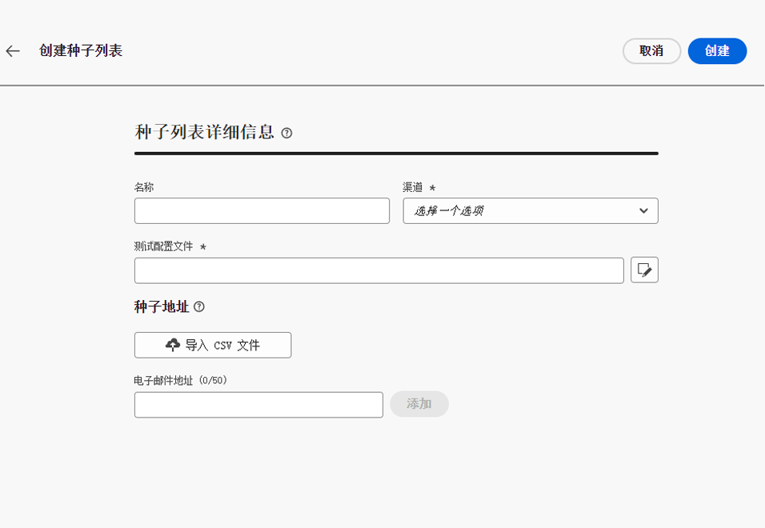
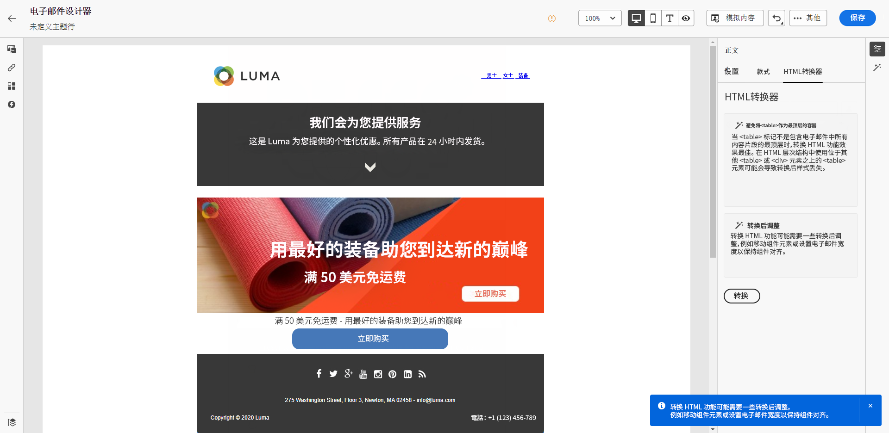

# 2023 年发行说明 {#release-notes-2023}

本页列出了 [!DNL Journey Optimizer] 于 2023 年发布的功能和改进。

## 2023 年 9 月发行说明 {#sept-rn-2023}

### 新功能{#sept-2023-features}

此版本引入了下方列出的新功能。

<table>
<thead>
<tr>
<th><strong>计算属性</strong> </th>
</tr>
</thead>
<tbody>
<tr>
<td>

计算属性使您可以通过直观的用户界面轻松地将事件数据汇总到配置文件属性中，以增强基于行为的分段、个性化和激活。借助此功能，您可以以自助方式创建计算属性，管理这些属性，并在分段、实时客配置文件目标或 Journey Optimizer 中进行使用。  
此外，计算属性简化了分段和历程工作流，帮助您完美投放相关体验。有关更多信息，请参阅<a href="../audience/computed-attributes.md">详细文档</a>。

</tr>
</tbody>
</table>

<table>
<thead>
<tr>
<th><strong>整合的渠道报告</strong> </th>
</tr>
</thead>
<tbody>
<tr>
<td>

渠道报告功能为分析师和营销人员在渠道级别提供了流量和参与量度的全面概述。

要访问<b>报告</b>菜单，您必须拥有<b>查看渠道报告</b>权限。

有关更多信息，请参阅<a href="../reports/channel-report.md">详细文档</a>和<a href="../reports/channel-report.md#channel-report-video">教程视频</a>。

</tr>
</tbody>
</table>

<table>
<thead>
<tr>
<th><strong>数据集导出目标 (GA)</strong> </th>
</tr>
</thead>
<tbody>
<tr>
<td>

现在，一般可以将 Journey Optimizer 数据集导出到云存储目标。通过此功能，您可以与云存储位置建立实时连接，以导出数据集的内容。

有关更多信息，请参阅<a href="../data/export-datasets.md">详细文档</a>。

</td>
</tr>
</tbody>
</table>

<table>
<thead>
<tr>
<th><strong>基于单个沙盒的移动应用程序凭据存储</strong> </th>
</tr>
</thead>
<tbody>
<tr>
<td>

这项新功能允许您轻松管理推送凭据，并将其与应用程序表面中的专用沙盒关联。

有关更多信息，请参阅<a href="../in-app/inapp-configuration.md#channel-prerequisites">详细文档</a>。

</tr>
</tbody>
</table>

### 改进 {#sept-2023-improvements}

此版本包含下方列出的改进。

**决策管理**

* 用于创建和管理决策管理对象的新 API 现已推出。这些 API 提高了性能并改善了用户体验。旧版 API 支持的截止日期为 2024 年 3 月 27 日。[了解详情](../offers/api-reference/getting-started.md)

**个性化**

* 除了可视片段之外，现在还可以通过表达式编辑器从 Journey Optimizer 界面创建、保存和重用表达式片段。表达式片段替换以前保存的表达式。[了解详情](../personalization/use-expression-fragments.md)

**警报**

* 一种新型的系统警报现已推出。现在，您会在&#x200B;**读取受众**&#x200B;活动失败时收到通知。[了解详情](../reports/alerts.md)。

**Web 渠道**

* 现在可以在 Web 可视编辑器中创作单页应用程序 (SPA)，该编辑器允许您选择要应用网页修改的特定视图。视图可定义为整个网站或网站上的一组可视化元素，例如主页、整个产品网站或所有结账页面上的投放首选项框架。在 Adobe Experience Platform Web SDK 实施中定义视图需要进行一次性开发人员设置；这使营销人员能够在 SPA 上创建并运行 Adobe Journey Optimizer Web 营销活动。[了解详情](../web/web-spa.md)

* 使用 Web 设计器编辑页面时，您现在可以直接从“修改”窗格向内容添加新更改，而无需从设计器界面中选择组件并进行编辑。[了解详情](../web/manage-web-modifications.md#add-modifications)

* 在设置 Web 子域时，除了使用已委派给 Adobe 的子域之外，您现在可以选择添加自己的子域。[了解详情](../web/web-delegated-subdomains.md#web-configure-new-subdomain)

**历程**

* 复制历程时，您现在可以定义历程副本的名称。[了解详情](../building-journeys/journey-gs.md#uplicate-a-journey)

* 自定义操作响应功能现已普遍可用。这项功能允许您在自定义操作中对 API 调用响应加以利用，并根据这些响应编排历程。此外，还新增了护栏，以将所有自定义操作限制为每 30 秒每个端点 150,000 次调用。[了解详情](../action/action-response.md)
<!--
* The maximum duration that you can define in the Wait activity is now 29 days instead of 30.
-->

**电子邮件渠道**

* 利用电子邮件表面配置中的新选项，可选择向用户档案发送事务型消息，即使其电子邮件地址在 Adobe [!DNL Journey Optimizer] 禁止列表中。[了解详情](../email/email-settings.md#send-to-suppressed-email-addresses)

**短信渠道**

* **选择加入消息**&#x200B;和&#x200B;**帮助消息**&#x200B;这两个新字段已添加到 API 配置屏幕，允许用户自定义针对入站关键词的响应。请注意，这仅适用于 Sinch 短信提供商。[了解详情](../sms/sms-configuration.md#create-api)

* 不再在渠道级别进行管理短信选择退出。现在，这是特定于号码的，这意味着如果某些用户档案选择退出给定的号码或短代码，您仍然能够通过您可能用于发送短信消息的其他在用号码向其发送消息。新增一个选项，使您可以选择要用于特定表面的&#x200B;**选择退出号码**。[了解详情](../sms/sms-configuration.md#message-preset-sms)

**直邮渠道**

* 现在，您可以在将直邮服务提供商使用的文件传输到服务器时对其进行加密。为此，文件路由配置屏幕中提供了一个新字段，允许您复制粘贴加密密钥。[了解详情](../direct-mail/direct-mail-configuration.md)

**报告**

* 您现在可以将 Journey Optimizer 报告导出为 CSV 文件。有关详细信息，请参阅[详细文档](../reports/global-report.md#export-reports)和[操作方法视频](../reports/global-report.md#video-csv)。

**资源**

* 新增一个“资源”的新选项，您可以借以在 Journey Optimizer 中选择资源的存储库。 如果您拥有此解决方案，则可以选择 Assets Essentials 存储库或 Assets as a Cloud Service 存储库。 [了解详情](../content-management/assets.md)

<!--**Decision management**

Enhancements have been made to the audience picker in journeys or campaigns, with the addition of new columns displaying the origin and update frequency of audiences.    -->

## 2023 年 8 月发行说明 {#aug-rn-2023}

### 新功能{#aug-2023-features}

此版本引入了下方列出的新功能。

<table>
<thead>
<tr>
<th><strong>在您的历程中发送应用程序内消息</strong> </th>
</tr>
</thead>
<tbody>
<tr>
<td>

现在，您可以在历程中向应用程序用户发送个性化的应用程序内消息。使用 Journey Optimizer 设计通知并自定义消息布局、显示、文本和按钮，以创造无缝体验。

有关更多信息，请参阅<a href="../in-app/create-in-app.md">详细文档</a>。

</tr>
</tbody>
</table>

<table>
<thead>
<tr>
<th><strong>使用种子列表验证电子邮件</strong> </th>
</tr>
</thead>
<tbody>
<tr>
<td>

您现在可以在 Journey Optimizer 中创建和管理种子列表。种子列表包含内部地址，这些地址可以添加到实际受众，并在投放执行时收到与目标个人资料完全相同的消息。 使用此功能可监控发出的通信，并确保所有显示格式、URL、图像和链接均正确无误。

有关更多信息，请参阅<a href="../configuration/seed-lists.md">详细文档</a>。

</td>
</tr>
</tbody>
</table>

<!--table>
<thead>
<tr>
<th><strong>Generate text and images with the Content assistant</strong> </th>
</tr>
</thead>
<tbody>
<tr>
<td>

Once you have created and personalized your message, take your content to the next level with the Content assistant. You can now use the Content assistant to optimize your message's impact by experimenting with different main titles, and images. Each variant is managed as a unique Treatment, to measure and compare which title effectively generates more clicks.

This capability is currently available as a private beta.

For more information, refer to the <a href="../start/search-filter-categorize.md#tags">detailed documentation</a>.

</td>
</tr>
</tbody>
</table-->

### 改进 {#aug-2023-improvements}

此版本包含下方列出的改进。

<!--
**APIs**

A new API to create and manage Content Fragments is now available. [Learn more](https://developer.adobe.com/journey-optimizer-apis/references/content-templates/#tag/Content-fragment-API){target="_blank"}.-->

<!--**Email channel**

A new option is available in the email surface settings to include email addresses suppressed due to spam complaint in your transactional messages audiences. Even if they marked marketing messages as spam, these profiles can then receive transactional messages, such as password reset or account statements. This option is disabled by default.-->

**历程**

* 您现在可以在自定义操作中利用 API 调用响应，并根据这些响应编排历程。此功能目前作为独享 Beta 版提供。[了解详情](../action/action-response.md)。
* 推出了一种新型的系统警报。现在，您会在自定义操作失败时收到通知。[了解详情](../reports/alerts.md)。
  <!--* When duplicating a journey, you can now define the name of the journey copy.-->

**直邮**

* 现在可以在文件路由配置中选择 Azure 作为服务器类型。[了解详情](../direct-mail/direct-mail-configuration.md#file-routing-configuration)
* 现在 &amp; 符号可用作直邮表面设置中的列分隔符字段。[了解详情](../direct-mail/direct-mail-configuration.md#direct-mail-surface)

## 2023 年 7 月发行说明 {#july-rn-2023}

### 新功能{#july-2023-features}

<table>
<thead>
<tr>
<th><strong>受众组合</strong> </th>
</tr>
</thead>
<tbody>
<tr>
<td>

您现在可以创建组合工作流，将现有 Adobe Experience Platform 受众组合到可视画布中，并利用各种活动（拆分、扩充等）来创建新受众。新创建的受众与现有受众会被一起保存回 Adobe Experience Platform 中，并可在 Journey Optimizer 营销活动中利用它们来定位客户。

有关更多信息，请参阅<a href="../audience/get-started-audience-orchestration.md">详细文档</a>。

受众组合与新的 Adobe Experience Platform“受众”菜单完全集成，该菜单可作为受众的集中式门户。您现在可以使用包含新仪表板（带有区段趋势和区段重叠功能）的浏览页面来寻获新见解并探索用于折叠和标记的组织工具。此体验中嵌入了用于标准化受众标签的管理控制以及受众生命周期管理功能，可管理激活工作流程。凭借这种新的管理体验，您现在可以从一个位置轻松安全地管理受众。有关更多信息，请参阅 <a href="https://experienceleague.adobe.com/docs/experience-platform/segmentation/ui/overview.html?lang=zh-Hans" target="_blank">Adobe Experience Platform 文档</a>。

</td>
</tr>
</tbody>
</table>

<table>
<thead>
<tr>
<th><strong>直邮渠道</strong> </th>
</tr>
</thead>
<tbody>
<tr>
<td>

您现在可以在营销活动中添加直邮消息。直邮是一种离线渠道，允许您生成直邮服务提供商向客户发送邮件所需的文件并进行个性化。

在准备直邮投放时，Journey Optimizer 会生成一个文件，其中包含了所有定向的用户档案和选定的联系信息（例如邮政地址）。然后，您可以将此文件发送给直邮提供商，由其负责发送纸质信函。

目前，直邮渠道不适用于已购买 Adobe Healthcare Shield 附加产品的组织。

有关更多信息，请参阅<a href="../direct-mail/get-started-direct-mail.md">详细文档</a>。

</tr>
</tbody>
</table>

<table>
<thead>
<tr>
<th><strong>转换 HTML 内容以在电子邮件设计器中使用</strong> </th>
</tr>
</thead>
<tbody>
<tr>
<td>

您现在可以在 Journey Optimizer 的电子邮件编辑器中导入和转换任何 HTML 内容。内容块会被自动标识，并且可在电子邮件设计器中使用：利用其强大的设计功能对其进行更新和个性化！

有关更多信息，请参阅<a href="../email/existing-content.md">详细文档</a>。

</td>
</tr>
</tbody>
</table>

<table>
<thead>
<tr>
<th><strong>使用 Journey Optimizer 中的标记</strong> </th>
</tr>
</thead>
<tbody>
<tr>
<td>

除了营销活动和历程之外，您现在还可以将 Adobe Experience Platform 统一标记分配给登陆页面、内容模板、片段和订阅列表。这让您能够轻松对其进行分类，并改进所有列表中的搜索和导航。 

有关更多信息，请参阅<a href="../start/search-filter-categorize.md#tags">详细文档</a>。

</td>
</tr>
</tbody>
</table>

<table>
<thead>
<tr>
<th><strong>内容模板 API</strong> </th>
</tr>
</thead>
<tbody>
<tr>
<td>

您现在可以使用专用 API 创建和管理 Adobe Journey Optimizer 内容模板，体验与现有内容系统的无缝集成。

有关更多信息，请参阅<a href="https://developer.adobe.com/journey-optimizer-apis/references/content/">详细文档</a>。

</td>
</tr>
</tbody>
</table>

### 改进 {#july-2023-improvements}

此版本包含下方列出的改进。

**营销活动**

现在，可在个性化编辑器“上下文属性”菜单中使用与营销活动相关的上下文事件。

**受众**

已对历程或营销活动中的受众选择器进行增强，新增了显示受众来源和更新频率的新列。随着受众组合门户的发布，更新了 Adobe Experience Platform 和 Adobe Journey Optimizer 的系统和文档中“受众”和“区段”的使用说明。

* 受众：一组具有共同特征和行为的人员、帐户、家庭或其他实体。
* 区段定义：在 Adobe Experience Platform 中，用于描述目标受众关键特征或行为的规则。此术语以前称为“区段”。

因此，在 Adobe Journey Optimizer 和 Adobe Experience Platform UI 中，“受众”将取代“区段”，这体现出了这种创建和管理受众的新方式。

**API**

已弃用为 Adobe Journey Optimizer API 身份验证生成访问令牌的 JWT 方法。必须使用 OAuth 服务器到服务器身份验证方法创建所有新集成。Adobe 还建议您将现有集成迁移到 OAuth 方法。[了解详情](https://developer.adobe.com/journey-optimizer-apis/references/authentication/){target="_blank"}。

**其他更改**

现在作为公开 Beta 功能，所有客户都可以将 Journey Optimizer 数据集导出到云存储目标。通过此功能，您可以与云存储位置建立实时连接，以导出数据集的内容。[了解详情](../data/export-datasets.md)

## 2023 年 6 月发行说明 {#june-rn-2023}

<table>
<thead>
<tr>
<th><strong>针对营销用例的 API 触发营销活动</strong> </th>
</tr>
</thead>
<tbody>
<tr>
<td>

您现在可以使用 API 从外部系统触发 Adobe Journey Optimizer 中的营销活动。

在此版本之前，API 触发营销活动功能涵盖了多种操作和事务性消息传递需求（如密码重置或 OTP 令牌），但无法用于创建营销活动。API 触发营销活动的可用渠道包括：电子邮件、短信和推送消息。

有关更多信息，请参阅<a href="../campaigns/api-triggered-campaigns.md">详细文档</a>。
</td>
</tr>
</tbody>
</table>

<!--
### Improvements {#june-2023-improvements}

**Audiences**

Enhancements have been made to the audience picker in journeys or campaigns, with the addition of new columns displaying the origin and update frequency of audiences.

**Journeys**

You can now leverage API call responses in custom actions and orchestrate your journey based on these responses.
-->

<!--
## June 2023 early release notes {#june-rn-2023}

Information below is subject to change without prior notice until the release availability date. Updated documentation will be published at the release date, and direct links will be added in this page.

**Audiences**

Enhancements have been made to the audience picker in journeys or campaigns, with the addition of new columns displaying the origin and update frequency of audiences.    

**Journeys**

* You can now leverage API call responses in custom actions and orchestrate your journey based on these responses.     

* A new type of system alert has been introduced. You can now get notified when a custom action fails.
-->

## 2023 年 5 月发行说明 {#may-rn-2023}

### 新功能{#may-2023-features}

<table>
<thead>
<tr>
<th><strong>营销活动中的内容试验</strong> </th>
</tr>
</thead>
<tbody>
<tr>
<td>

现在，Adobe Journey Optimizer 在营销活动中支持试验。试验是开展在线测试时进行的随机试用，这意味着您将为给定的消息试验接触部分随机选择的用户，并为其他试验或试验组接触另外一组随机选择的用户。公开后，您可以衡量感兴趣的结果指标，如电子邮件打开次数、订阅次数或购买次数。

有关更多信息，请参阅<a href="../campaigns/content-experiment.md">详细文档</a>。

</td>
</tr>
</tbody>
</table>

<!--
<table>
<thead>
<tr>
<th><strong>Objective reporting and performance measurement in campaigns</strong> </th>
</tr>
</thead>
<tbody>
<tr>
<td>

You can now measure the performance of your campaigns across inbound and outbound through dedicated reports. Adobe Journey Optimizer reports can retrieve additional metrics to use in the Objectives tab of your campaign reports.

For more information, refer to the <a href="../reports/campaign-global-report.md">detailed documentation</a>.

</td>
</tr>
</tbody>
</table>
-->

<table>
<thead>
<tr>
<th><strong>在电子邮件内容中创建和使用片段</strong> </th>
</tr>
</thead>
<tbody>
<tr>
<td>

您现在可以创作、使用和管理片段，以快速组合电子邮件和内容模板。片段是预建的可重复使用的组件，可以在跨 Journey Optimizer 营销活动和历程的多个电子邮件中引用，以改进和加快设计过程。

有关更多信息，请参阅<a href="../content-management/fragments.md">详细文档</a>。

</td>
</tr>
</tbody>
</table>

<table>
<thead>
<tr>
<th><strong>在营销活动中使用标记（Beta 版）</strong> </th>
</tr>
</thead>
<tbody>
<tr>
<td>

您现在可以为营销活动分配 Adobe Experience Platform 统一标记。这样，您就可以轻松地对营销活动进行分类，并改进营销活动列表中的搜索。请注意，统一标记功能目前为 Beta 版。

有关更多信息，请参阅<a href="../start/search-filter-categorize.md#tags">详细文档</a>。

</td>
</tr>
</tbody>
</table>

<table>
<thead>
<tr>
<th><strong>个性化优化 AI 排名模型（正式发布）</strong> </th>
</tr>
</thead>
<tbody>
<tr>
<td>

个性化优化 AI 排名模型现在通常可在决策管理中使用。利用这种新型模型可根据受众和优惠表现对优惠进行优化和个性化设置。

有关更多信息，请参阅<a href="../offers/ranking/personalized-optimization-model.md">详细文档</a>。

</td>
</tr>
</tbody>
</table>

### 改进 {#may-2023-improvements}

**受众**

* 为使 Audience Portal 功能顺利正式发布，Adobe Experience Platform 将会更新系统和文档中“受众”和“区段”的使用说明。

   * 受众：一组具有共同特征和行为的人员、帐户、家庭或其他实体。
   * 区段定义：在 Adobe Experience Platform 中，用于描述目标受众关键特征或行为的规则。此术语以前称为“区段”。

  因此，在 Adobe Journey Optimizer 和 Adobe Experience Platform UI 中，“受众”将取代“区段”，这体现出了这种创建和管理受众的新方式。

  “受众”一词在指代一组向其发送消息的目标个人资料时，对于部分语言，其含义在所有数字体验产品中是统一的：

   * 德语：Zielgruppe
   * 巴西葡萄牙语：público-alvo
   * 西班牙语：público destinatario

<!--* Enhancements have been made to the audience picker in journeys or campaigns, with the addition of new columns displaying the origin and update frequency of audiences.-->

**短信渠道**

* 在配置短信渠道平面时，Infobip 已添加为供应商提供商。[了解详情](../sms/sms-configuration.md)
* Twilio - API 凭据设置现在包括添加消息服务 SID 的功能，以便与您的 Twilio 帐户无缝集成。[了解详情](../sms/sms-configuration.md)

**应用程序内渠道**

* 为 Adobe Places Service 添加了新消息触发规则。[了解详情](../in-app/inapp-configuration.md)
* 添加了新的 Adobe Experience Platform 保证功能，用于捕获设备事件以添加为触发规则。

<!--
**Journeys**

* You can now leverage API call responses in custom actions and orchestrate your journey based on these responses.
-->

**营销活动**

* 现在，可以使用省略号操作菜单从库屏幕复制营销活动。[了解详情](../campaigns/modify-stop-campaign.md#duplicate)
* 您现在可以删除对实时营销活动的草稿修改。
* 激活营销活动的步骤现已简化。[了解详情](../campaigns/modify-stop-campaign.md)

**决策管理**

* 如果优惠为&#x200B;**[!UICONTROL 草稿]**&#x200B;状态且之前从未在启用频率封顶的情况下发布，您现在可以编辑频率封顶。[了解详情](../offers/offer-library/add-constraints.md#frequency-capping)

**个性化**

* 在处理 HTML 内容时，您现在可以直接从个性化编辑器中选择和插入资源引用。

### 修复{#may-2023-fixes}

* 应用程序内消息 – 修复了营销活动计划与消息频率设置冲突的问题。

## 2023 年 4 月发行说明 {#apr-rn-2023}

<!--Information below is subject to change without prior notice until the release availability date. Updated documentation will be published at the release date, and direct links will be added in this page.

**Release date**: April 27, 2023-->

### 新功能{#apr-2023-features}

<table>
<thead>
<tr>
<th><strong>Web 渠道（正式发布）</strong> </th>
</tr>
</thead>
<tbody>
<tr>
<td>

Adobe Journey Optimizer 正通过增加对 Web 渠道的支持来扩展其跨渠道功能。您现在可以通过智能且直观的可视化界面创作、更改和预览 Web 体验，像任何其他渠道一样，从而为最终用户提供个性化体验。请注意，目前在 Journey Optimizer 中，您只能在营销活动中创建 Web 体验。

有关更多信息，请参阅<a href="../web/get-started-web.md">详细文档</a>。

</tr>
</tbody>
</table>

<table>
<thead>
<tr>
<th><strong>移动端加入快速入门工作流程（Beta 版）</strong> </th>
</tr>
</thead>
<tbody>
<tr>
<td>

现已推出新的移动端加入快速入门工作流程。使用此新产品功能可快速配置 Mobile SDK，从而开始收集和验证移动端事件数据，并使用 Adobe Journey Optimizer 发送移动端推送通知。作为公开测试版，此功能可通过数据收集主页访问。

有关更多信息，请参阅<a href="../push/mobile-onboarding-wf.md">详细文档</a>。

</td>
</tr>
</tbody>
</table>

<table>
<thead>
<tr>
<th><strong>新历程仪表板（Beta 版）</strong> </th>
</tr>
</thead>
<tbody>
<tr>
<td>

 历程仪表板现在分为两个选项卡：

<ul><li>使用<strong>概述</strong>选项卡，可访问显示与历程有关的关键量度的新仪表板。</li>
<li>使用<strong>浏览</strong>选项卡，可访问所有历程列表。</li></ul>

此功能为公开 Beta 版，可在所有历程中使用。

有关更多信息，请参阅<a href="../building-journeys/journey-gs.md#journey-access">详细文档</a>。

</td>
</tr>
</tbody>
</table>

### 改进 {#april-2023-improvements}

**历程**

* 现在，历程画布会显示消息活动的活动 ID 和结束标记。这可改进报表和重定位。
* 配置窗格的布局（显示在操作、数据源、事件和历程中）已得到改进。
* 针对画布上的节点数提供了新的洞察力，并提供了有助于增长的保护措施：使历程易于阅读、进行 QA 检查和故障排除，每个历程的最大节点数为 50。[了解详情](../start/guardrails.md#journeys-guardrails-journeys)
* 默认情况下，在历程中添加[电子邮件](../email/create-email.md)、[短信](../sms/create-sms.md)或[推送](../push/create-push.md)操作时，该平面会在当前历程中使用该渠道的最后一个使用平面进行预填充。
* 您现在可以在自定义操作中定义静态或动态查询参数。[了解详情](../action/about-custom-action-configuration.md#url-configuration)

**报告**

* 您现在可以将 Journey Optimizer 报表导出为 PDF。[了解详情](../reports/global-report.md#export-reports)

**内容设计器**

* 对 Adobe Journey Optimizer 内容设计器进行了更新，现在可以更轻松地访问设计样式和组件。此新版本提供了改进的用户体验，并且具有更优秀的性能，对深色模式部分兼容，还支持新的辅助功能标准。

## 2023 年 3 月发行说明 {#mar-2023}

### 新功能{#mar-2023-features}

<table>
<thead>
<tr>
<th><strong>应用程序内渠道（正式发布）</strong> </th>
</tr>
</thead>
<tbody>
<tr>
<td>

现在，您可以在营销活动中向应用程序用户发送个性化的应用程序内消息。使用 Journey Optimizer 设计通知并自定义消息布局、显示、文本和按钮，以创造无缝体验。

有关更多信息，请参阅<a href="../in-app/get-started-in-app.md">详细文档</a>。

</tr>
</tbody>
</table>

<table>
<thead>
<tr>
<th><strong>短信点击跟踪</strong> </th>
</tr>
</thead>
<tbody>
<tr>
<td>

借助短信点击跟踪功能，您可以监控缩短 URL 的效果，识别点击者，并利用此数据在后续营销活动中重新定位这些客户。

有关更多信息，请参阅<a href="../sms/create-sms.md#sms-content">详细文档</a>。

</td>
</tr>
</tbody>
</table>

<table>
<thead>
<tr>
<th><strong>在您的历程中使用标记（Beta 版）</strong> </th>
</tr>
</thead>
<tbody>
<tr>
<td>

作为使用 Journey Optimizer 的专业人员，您现在可以使用标记组织业务对象。标记是用于进行对象分类的一种快速而简单的方法，能够改进搜索。此功能目前为 Beta 版，仅适用于历程。

有关更多信息，请参阅<a href="../start/search-filter-categorize.md#tags">详细文档</a>。

</td>
</tr>
</tbody>
</table>

### 改进 {#mar-2023-improvements}

**历程**

* 借助全新的&#x200B;**限制 API** 功能，您可以对每秒发送的事件数量设置限制，以防止外部系统或 API 出现流量激增。达到设置限制后，所有后续 API 调用将按接收到的顺序尽快排入队列并进行处理。请注意，此功能仅支持在所有沙箱中配置一个限制。[了解详情](../configuration/external-systems.md)
* 历程画布已得到改进，可提供更简单、更优质的用户体验。移除了在画布中每个路径的末尾的空占位符。现在，您只需将活动拖动到路径末尾即可添加活动。
* 在历程画布中，**结束**&#x200B;标记的标签不再使用之前的活动名称自动设置。用户可以根据需要手动添加自定义标签。
* 历程属性中的默认超时和错误持续时间已从 5 秒更改为 30 秒。[了解详情](../configuration/external-systems.md#timeout)
* 读取受众活动中的默认限制速率已从每秒 20000 条消息更改为每秒 5000 条消息。[了解详情](../building-journeys/read-audience.md#configuring-segment-trigger-activity)
* 测试模式中添加了护栏，以仅侦听通过界面发送的事件。不会侦听通过外部工具发送的事件。[了解详情](../building-journeys/testing-the-journey.md)

<!-- 
* When adding an Email, SMS or Push action in a journey, the surface is now pre-filled, by default, with the last used surface for that channel.
* A new type of system alert has been introduced. You can now get notified when a custom action fails. [Learn more](../reports/alerts.md)
* Timeout and error management has been improved in journeys. Timeout and error paths are now always added on the canvas. A new toolbar button is available to show/hide these paths. [Learn more](../building-journeys/journey-gs.md#timeout_and_error)
* The Journey dashboard is now split in two tabs:
    * Use the **Overview** tab to access a new dashboard which displays key metrics related to your journeys.
    * Use the **Browse** tab to access list of all journeys.
-->

**决策管理**

* 为了防止与最近发布的 Adobe Experience Platform 中的标记功能混淆，决策管理标记已重命名为“收藏集限定符”。

  请注意，尽管术语“标记”不再用于“决策管理”用户界面中，但仍然在后端服务中使用，例如 API 和数据集。

* 您现在可以每日、每周或每月重置优惠上限计数器。[了解详情](../offers/offer-library/add-constraints.md#capping)

* 您还可以选择应查看哪个 Adobe Experience Platform 事件来设置 Offer Decisioning 上限。[了解详情](../offers/offer-library/add-constraints.md#capping)

* 投放位置创建屏幕中添加了更多参数。通过这些参数，您可以控制是否能在多个投放位置中复制某个优惠，并指定是否应将该优惠的内容和元数据包含在 API 响应中。[了解详情](../offers/offer-library/creating-placements.md)

**个性化**

* 现在，您可以在“表达式编辑器”中包含基于字符串的个人资料属性的默认回退文本。如果选定的属性未返回任何结果，则将显示这些值。[了解详情](../personalization/personalization-build-expressions.md#add)

**报告**

* 报表小组件功能已得到改进，允许自定义用户查看其数据的方式。通过这项改进，用户现在可以在多个可视化选项（包括图形、表格和圆环图）之间进行选择。

  要访问最新的小组件，请注意，您必须重置不同的报告仪表板。有关仪表板自定义的更多信息，请参阅[详细文档](../reports/global-report.md#modify-dashboard)。

## 2023 年 2 月发行说明 {#feb-2023}

### 新功能{#feb-2023-features}

<table>
<thead>
<tr>
<th><strong>应用程序内渠道（Beta 版）</strong> </th>
</tr>
</thead>
<tbody>
<tr>
<td>

现在，您可以在营销活动中向应用程序用户发送个性化的应用程序内消息。使用 Journey Optimizer 设计通知并自定义消息布局、显示、文本和按钮，以创造无缝体验。

<strong>注意</strong> - 此功能目前为 Beta 版，仅供 Beta 版客户使用。要加入 Beta 版计划，请联系 Adobe 客户关怀团队。

有关更多信息，请参阅<a href="../in-app/get-started-in-app.md">详细文档</a>。

</td>
</tr>
</tbody>
</table>

<table>
<thead>
<tr>
<th><strong>将 Journey Optimizer 数据集导出到云存储目标（Beta 版）</strong> </th>
</tr>
</thead>
<tbody>
<tr>
<td>

您现在可以与云存储位置建立实时连接，以导出数据集的内容。可用目标包括：Amazon S3 云存储、Azure Blob、Azure Data Lake 第 2 代、数据登陆区、Google 云存储、SFTP。

<strong>注意</strong> - 此功能目前为 Beta 版，可供所有 Adobe Journey Optimizer 用户使用。如果您尚未拥有访问权限，请与 Adobe 代表联系，获取目标的访问权限。

有关更多信息，请参阅<a href="../data/export-datasets.md">详细文档</a>。

</td>
</tr>
</tbody>
</table>

<!--

<table>
<thead>
<tr>
<th><strong>Performance Measurement in campaigns</strong> </th>
</tr>
</thead>
<tbody>
<tr>
<td>

You can now measure the performance of your campaigns across inbound and outbound through dedicated reports. Adobe Journey Optimizer reports can retrieve additional metrics to use in the <strong>Objective</strong> tab of your campaign reports. 

For more information, refer to the <a href="../privacy/data-hygiene.md">detailed documentation</a>.

</td>
</tr>
</tbody>
</table>

+++ Learn more about Performance Measurement

The **[!UICONTROL Objective]** tab of your Campaign report allows you to better fine-tune your deliveries' reports by targeting one specific metric. With this feature, you can effectively track and analyze your campaign's performance and make informed decisions to improve your results.

The **[!UICONTROL Objectives]** listed are linked to **[!UICONTROL Datasets]** that define a connection to a system in order to retrieve additional information. A list of pre-configured **[!UICONTROL Objectives]** is available, but you can also customize your report by adding new **[!UICONTROL Datasets]** and defining your own objectives. 

By selecting the desired Objectives, the **[!UICONTROL Performance overview]** and **[!UICONTROL Campaign objective]** widgets provide a comprehensive and insightful summary of your delivery performance, allowing you to closely monitor and evaluate the success of your campaign.

With the **[!UICONTROL Campaign objective]** widget, you can also choose to compare your primary objective against another performance metric.

Note that each widget can be resized and deleted as needed.
+++

<table>
<thead>
<tr>
<th><strong>Use Tags in your Journeys</strong> </th>
</tr>
</thead>
<tbody>
<tr>
<td>

As a Journey Optimizer practitioner, you can now organize your business objects using tags. Tags are a quick and easy way of classifying objects to improve search. Tags are currently only available for Journeys.

</td>
</tr>
</tbody>
</table>

-->

### 改进 {#feb-2023-improvements}

**历程**

* **重新进入等待期**&#x200B;字段已添加到历程属性。使用该字段，您可以定义允许用户档案再次进入单一历程（以事件或受众鉴别开始）之前等待的时间。这可防止同一事件多次错误触发历程。默认情况下，字段设置为 5 分钟。[了解详情](../building-journeys/journey-gs.md#entrance)

* 对&#x200B;**历程开始和结束日期**&#x200B;做出了一些改进。如果您未指定开始日期，现在会在发布时自动添加。对于&#x200B;**读取受众**&#x200B;历程，您现在可以添加结束日期。这允许用户档案在到期时自动退出。[了解详情](../building-journeys/journey-gs.md#dates)

<!--

* The Journey canvas has been enhanced for a simpler and improved user experience. At the end of each path in the canvas, the empty placeholders have been removed. You can now simply add your activities by dragging them anywhere between nodes. [Learn more](../building-journeys/using-the-journey-designer.md)

* Timeout and error management has been improved in journeys. Timeout and error paths are now always added on the canvas. A new toolbar button is available to show/hide these paths. [Learn more](../building-journeys/journey-gs.md#timeout_and_error)

* A new type of system alert has been introduced. You can now get notified when a custom action fails. [Learn more](../reports/alerts.md)

* The Journey dashboard is now split in two tabs:
    * Use the **Overview** tab to access a new dashboard which displays key metrics related to your journeys.
    * Use the **Browse** tab to access list of all journeys.
-->

**管理**

* **允许列表** - 您现在可以将允许列表下载为 .csv 文件。[了解详情](../configuration/allow-list.md#download-allowed-list)

* **电子邮件平面** - 向电子邮件平面设置添加了额外的检查：如果&#x200B;**回复（电子邮件）地址**&#x200B;或&#x200B;**密送电子邮件地址**&#x200B;中使用的子域 MX 记录未正确配置，则无法再创建电子邮件平面。您必须对其进行配置或使用其他记录。[了解详情](../email/email-settings.md#reply-to-email)

* **电子邮件平面** - 在电子邮件平面设置的 **URL 跟踪参数**&#x200B;部分，每个&#x200B;**值**&#x200B;字段的限制已从 255 个字符更新为 5 KB，以便与 Adobe Analytics 跟踪兼容。[了解详情](../email/email-settings.md#url-tracking)

**决策管理**

* **投放位置** - 投放位置创建屏幕中添加了更多参数。通过这些参数，您可以控制是否能在多个投放位置中复制某个优惠，并指定是否应将该优惠的内容和元数据包含在 API 响应中。[了解详情](../offers/offer-library/creating-placements.md)

* **URL 个性化** - 现在，在将 URL 作为内容添加到优惠呈现中时，您可以使用表达式编辑器对这些 URL 进行个性化设置。[了解详情](../offers/offer-library/add-representations.md)

## 2023 年 1 月发行说明{#jan-2023-release}

### 新功能{#jan-2023-features}

<table>
<thead>
<tr>
<th><strong>数据安全机制</strong> </th>
</tr>
</thead>
<tbody>
<tr>
<td>

Adobe Experience Platform 提供了一整套数据安全功能，允许您通过程序化删除客户记录和数据集来管理存储的数据。Adobe Journey Optimizer 现已提供此功能。 

您可以管理数据存储，以确保按预期使用信息，在需要修复错误数据时更新信息，并在组织策略认为有必要时删除信息。

<strong>注意</strong> - 目前，数据安全功能仅适用于已购买 <strong>Healthcare Shield</strong> 和 <strong>Privacy and Security Shield</strong> 附加产品的组织。

有关更多信息，请参阅<a href="../privacy/data-hygiene.md">详细文档</a>。
</td>
</tr>
</tbody>
</table>

<table>
<thead>
<tr>
<th><strong>电子邮件内容模板</strong> </th>
</tr>
</thead>
<tbody>
<tr>
<td>

您现在可以创建独立的内容模板，这些模板可供跨历程和营销活动使用，方便快速重复利用。
 

通过<a href="https://experienceleague.adobe.com/docs/journey-optimizer-learn/tutorials/email-channel/content-templates.html?lang=zh-Hans">此视频</a>了解如何创建、编辑和使用内容模板。有关更多信息，请参阅<a href="../content-management/content-templates.md">详细文档</a>。

</td>
</tr>
</tbody>
</table>

### 改进 {#jan-2023-improvements}

**历程**

* 在历程中添加&#x200B;**受众鉴别**&#x200B;或&#x200B;**读取受众**&#x200B;时，现在会默认使用上次用过的命名空间预填充命名空间。请参阅[受众鉴别](../building-journeys/audience-qualification-events.md#about-segment-qualification)和[读取受众](../building-journeys/read-audience.md#configuring-segment-trigger-activity)部分。

* 在历程画布中，工具栏中新增了一个按钮，用于下载历程的屏幕截图。

**电子邮件设计工具**

* 您现在可以从&#x200B;**导出 HTML** 菜单导出电子邮件内容。导出的文件可使用存档 (.ZIP) 格式。

**管理**

* 在新增添的小节中，针对&#x200B;**回复（电子邮件）**&#x200B;地址和确保正确回复管理提供了建议。[了解详情](../email/email-settings.md#reply-to-email)

* 现在，创建或编辑 **IP 池**&#x200B;时，将鼠标悬停在选定的 IP 地址上，关联的 PTR 记录会显示在 IP 列表中。[了解详情](../configuration/ip-pools.md#create-ip-pool)

* 现在，在渠道界面中选择了 IP 池后，将鼠标悬停在 IP 地址上时，可以看到 PTR 记录信息。[了解详情](../email/email-settings.md#subdomains-and-ip-pools)

* 用于编辑 [PTR 记录](../configuration/ptr-records.md#edit-ptr-record)和[执行字段](../configuration/primary-email-addresses.md)的用户界面已更新。

* 用于创建和编辑子域的用户界面已得到改进。[了解详情](../configuration/delegate-subdomain.md)

* 禁止列表&#x200B;**最近上传**&#x200B;屏幕已更新。[了解详情](../configuration/manage-suppression-list.md#recent-uploads)

**营销活动**

* 现在会自动生成一个示例 cURL 请求，允许执行 API 触发的营销活动，并可在营销活动屏幕中获得。[了解详情](../campaigns/api-triggered-campaigns.md)

**个性化**

* 提供了新的辅助函数：formatCurrency、charCodeAt、stringToDate、toString、formatNumber 和 toHexString。此外，toDateTimeOnly 函数现在可接受字符串、日期、长字段和整数字段类型。[了解详情](../personalization/functions/functions.md)
