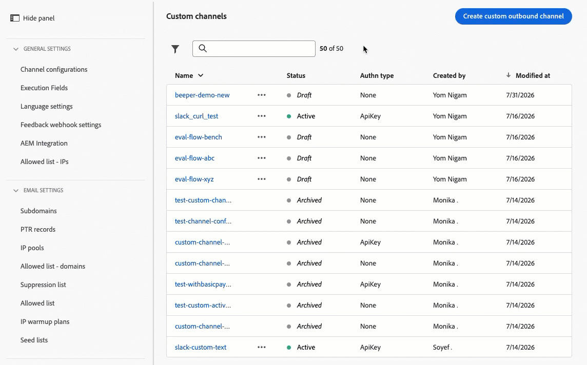
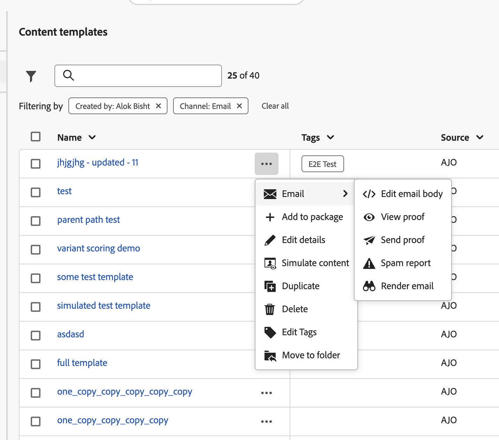
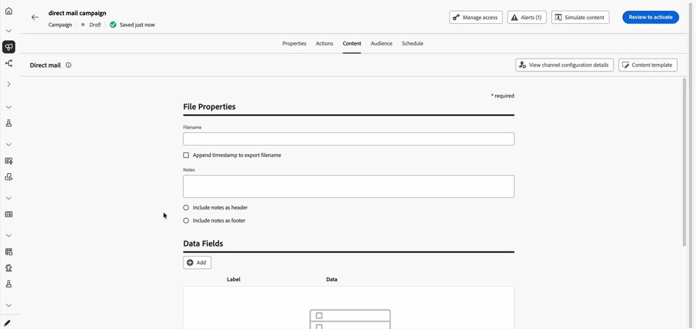
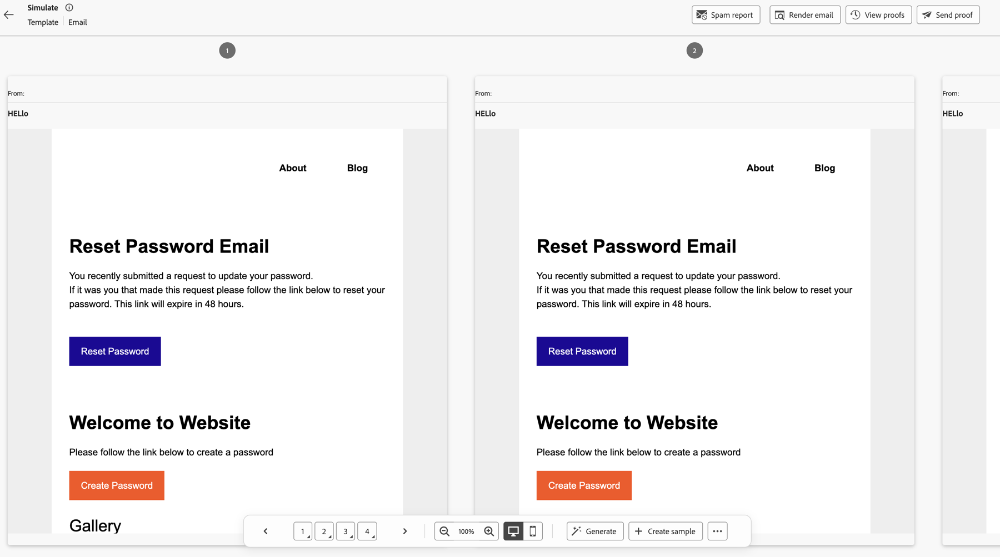
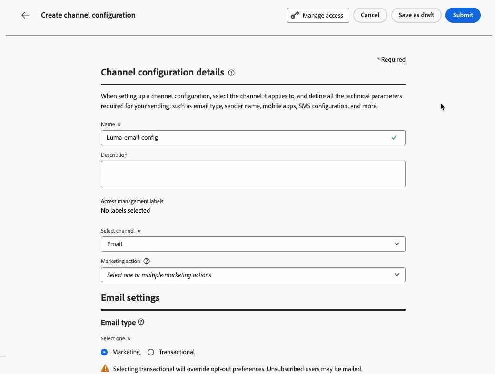
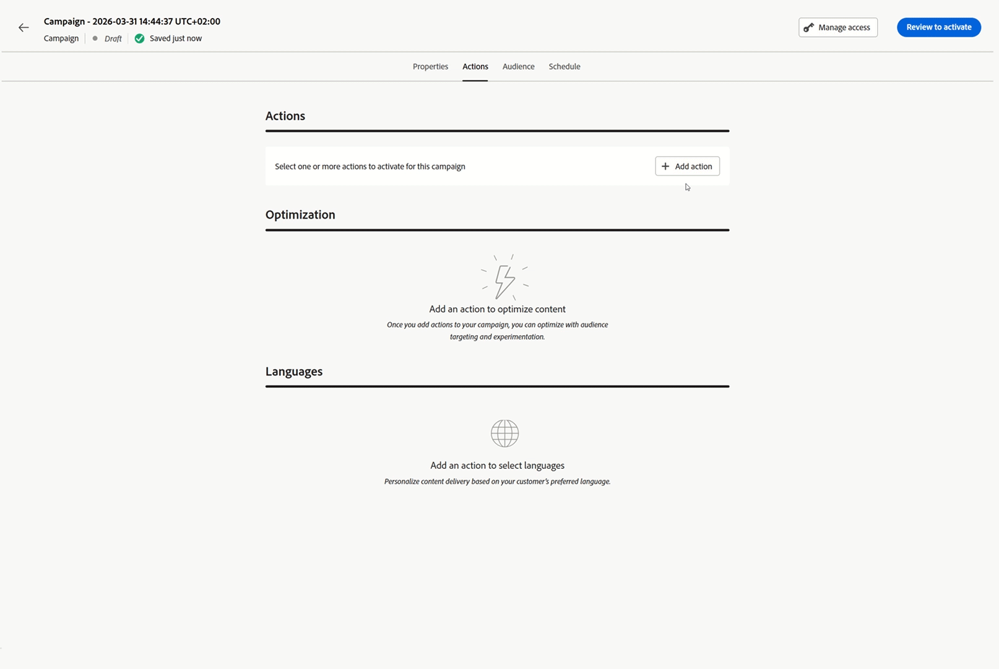
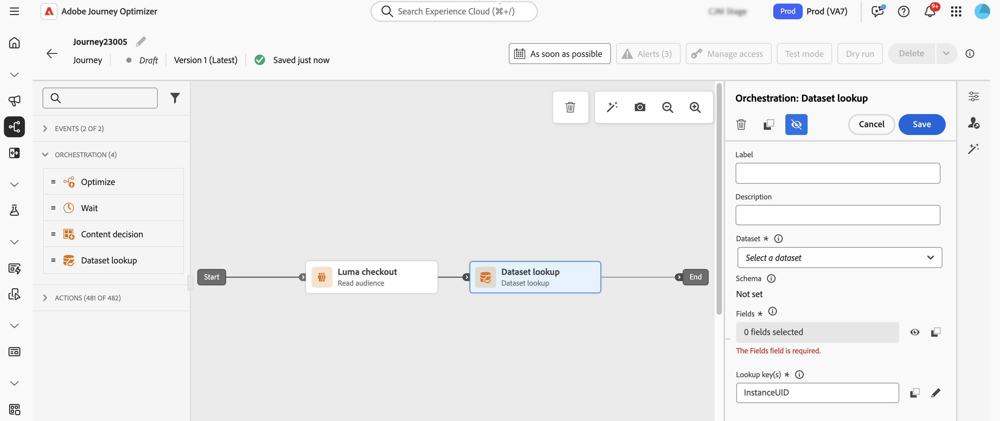
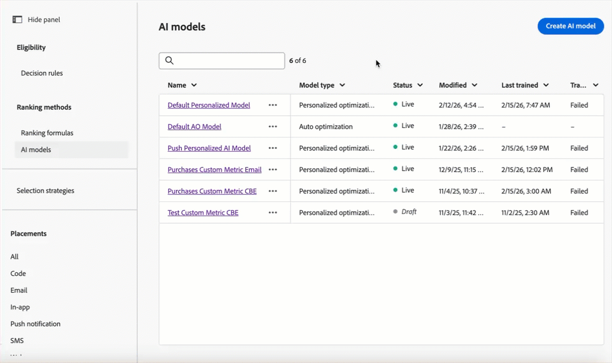

# 2026 年发行说明 {#release-notes-2026}

本页列出了于 2026 年发布的 [!DNL Journey Optimizer] 功能和改进。

## 2026年7月发行说明 {#july-26-updates}

### 忠诚度挑战 {#july-26-loyalty}

Journey Optimizer引入了忠诚度挑战，这是此版本中的一项新功能。

<table>
<thead>
<tr>
<th><strong>忠诚度挑战</strong> </th>
</tr>
</thead>
<tbody>
<tr>
<td>

忠诚度挑战可将忠诚度计划转化为引人入胜的游戏化体验，从而激励客户采取有价值的行动，例如进行购买、撰写评论或任何期望的行为。

管理员可以使用“忠诚度配置”菜单将Journey Optimizer与您的忠诚度生态系统连接，包括奖励履行API、事件定义、产品库存、排除和身份设置。 然后，营销人员可以设计标准、连续或顺序挑战，定义任务和奖励，提供品牌内容卡和消息，并使用AI支持的报告仪表板监控性能。 Journey Optimizer生成在后台编排每个挑战的历程，因此团队可以专注于客户体验和业务目标。

忠诚度还引入了同事技能，使团队能够更有效地执行关键挑战操作，包括创建挑战、设置挑战属性、管理受众和相关配置，以及查看见解以监控挑战参与情况和奖励表现。

此功能仅适用于获得Journey Optimizer Loyalty许可的组织。 要获得访问权限，请与 Adobe 代表联系。

有关更多信息，请参阅<a href="../loyalty-challenges/get-started.md">详细文档</a>。

 发布日期： 2026年7月28日

</td>
</tr>
</tbody>
</table>

### 渠道 {#july-26-channels}

此版本中引入了以下功能和改进。

<table>
<thead>
<tr>
<th><strong>自定义出站频道</strong> </th>
</tr>
</thead>
<tbody>
<tr>
<td>

Journey Optimizer现在引入了“自定义渠道”这一新功能，管理员可以通过无代码渠道生成器，将任何基于HTTP的出站消息渠道（如WeChat、Kakao Talk、Messenger或专有提供商）直接引入Journey Optimizer。

配置后，自定义渠道可在营销活动、历程和编排的营销活动中使用，并具有与本机渠道相同的完整功能集：使用表达式编辑器进行个性化、内容实验、预览和验证、现成的报告以及同意和治理实施。

这填补了以前由自定义操作填补的空白，这些操作仅适用于历程，并且缺乏专用渠道功能。

自定义出站渠道当前以“有限可用”的形式提供。 要获得访问权限，请与 Adobe 代表联系。

有关更多信息，请参阅<a href="../custom-channel/get-started-custom-channel.md">详细文档</a>。

 发布日期：2026年7月31日

</td>
</tr>
</tbody>
</table>

<table>
<thead>
<tr>
<th><strong>渠道优化</strong> </th>
</tr>
</thead>
<tbody>
<tr>
<td>

您现在可以将历程或营销活动操作配置为包含多个出站渠道（电子邮件、推送、短信），并让Journey Optimizer通过最佳渠道为每个客户自动投放。 提供了三种优化模式：

<ul>
<li>手动排名：指定您的首选渠道顺序。</li>
<li>客户偏好设置：使用客户个人资料中的偏好渠道（体验数据模型同意和偏好设置属性）。</li>
<li>基于人工智能模型的排名：使用机器学习倾向分数推断每位客户最有效的渠道。</li>
</ul>

当排名最前的渠道不可用（未选择启用、频率限制或未配置）时，系统回退到下一个可用渠道。

此功能仅面向一部分组织（限量发布）。 要获得访问权限，请与 Adobe 代表联系。

有关更多信息，请参阅<a href="../building-journeys/channel-optimization.md">详细文档</a>。

发布日期： 2026年7月22日

</td>
</tr>
</tbody>
</table>

* **WhatsApp渠道：支持WhatsApp流量模板** — 您现在可以在Adobe Journey Optimizer中发送WhatsApp流量模板，以提供交互式多屏幕体验，如调查和商机捕获。 响应在提交时捕获，并作为原始JSON有效负载存储在新的Journey Optimizer渠道跟踪事件数据集中：

  * **AJO渠道跟踪事件数据集**：捕获所有入站WhatsApp响应，包括通过WhatsApp流量模板提交的响应。

  [了解详情](../data/get-started-datasets.md#system-datasets)

* **增强的自定义提供程序集成 — 移动设备** — 自定义提供程序集成现在通过关键消息传递和标头更新提供了扩展的灵活性：

  * 标头自定义：您现在可以编辑默认的Content-Type标头值并添加最多10个自定义标头参数。

  * SMS有效负载支持：在SMS有效负载中添加了对Adobe Journey Optimizer帮助程序函数的支持，包括编码64。

### 管理 {#july-26-administration}

此版本中的管理和数据管理添加了以下功能和改进。

<table>
<thead>
<tr>
<th><strong>Web应用程序防火墙IP 列入允许列表</strong> </th>
</tr>
</thead>
<tbody>
<tr>
<td>

Adobe Journey Optimizer现在支持登陆页面的Web应用程序防火墙IP列入允许列表，使组织能够强制要求所有传入请求都通过它们配置的Web应用程序防火墙基础架构进行独家路由。 借助这项增强功能，客户可以将Journey Optimizer配置为拒绝任何绕过Web应用程序防火墙层的直接请求，从而确保始终如一地应用在Imperva等工具中定义的安全策略。

此功能增强了具有严格网络访问要求的企业的安全状况，使它们能够完全控制流向Journey Optimizer托管的登陆页面的流量。

有关更多信息，请参阅<a href="../configuration/waf-ip-allowlist.md">详细文档</a>。

发布日期： 2026年7月30日

</td>
</tr>
</tbody>
</table>

* **管理用于完整/基本URL个性化的域** — 您现在可以直接从Adobe Journey Optimizer中的“管理”设置创建和管理用于完整/基本URL个性化的已批准域，而无需联系Adobe支持。 [了解详情](../email/url-personalization.md#personalize-complete-base-url)

  发布日期： 2026年7月30日

* **数据集生存时间(TTL)护栏 — 现有沙盒** — 从&#x200B;**2026年10月1日**&#x200B;开始，将在&#x200B;**现有客户沙盒和组织**&#x200B;上强制实施Journey Optimizer系统生成的数据集的生存时间(TTL)护栏（配置文件存储区为90天，数据湖为13个月）。 [了解详情](../data/datasets-ttl.md#ttl-guardrail)

### 电子邮件设计 {#july-26-email}

此版本中的电子邮件设计添加了以下功能和改进。

<table>
<thead>
<tr>
<th><strong>电子邮件设计器中的模块</strong> </th>
</tr>
</thead>
<tbody>
<tr>
<td>

Email Designer 现在内置了一个现成的布局模块库——包括页眉、产品卡片、信息块和页脚等——您可以将这些模块直接拖放到电子邮件画布中。

每个模块都预先配置了可编辑的属性（图像、标题、文本、按钮、链接），并且可以通过 WYSIWYG 界面完全自定义，从而加快电子邮件创建速度，而无需您从头开始构建结构。

有关更多信息，请参阅<a href="../email/email-modules.md">详细文档</a>。

发布日期： 2026年7月29日

</td>
</tr>
</tbody>
</table>

<table>
<thead>
<tr>
<th><strong>电子邮件Designer中的内容检查（正式发布）</strong> </th>
</tr>
</thead>
<tbody>
<tr>
<td>

Journey Optimizer 现在包括直接在电子邮件设计器中进行的自动技术验证，可帮助您在发送之前捕获 HTML 和 CSS 问题。

检查涵盖不支持的元素，例如 <code>&lt;script&gt;</code> 和 <code>&lt;base&gt;</code> 标记、可中断 Microsoft Outlook 中布局的空 div、HTML Meta Refresh 标记，以及触发 Gmail 渲染失败的 CSS 或 HTML 大小阈值。

结果直接在创作面板中显示为错误、警告或信息性声明，其中包含上下文详细信息和一键式修复（如果可用），因此无需离开编辑器即可解决问题。

此功能此前以“有限可用版”形式推出，现已对所有客户可用。

有关更多信息，请参阅<a href="../email/content-check.md">详细文档</a>。

发布日期： 2026年7月16日

</td>
</tr>
</tbody>
</table>

* **在`<head>`**&#x200B;中支持表达式片段 — 现在可以在电子邮件模板的`<head>`中使用表达式片段。 这允许您在一个片段中集中设置样式或任何自定义代码，并在多个模板中重复使用。 更新并重新发布片段后，所有基于引用该片段的模板构建的电子邮件都会自动继承最新代码，而无需分别手动更新每封电子邮件。 [了解详情](../personalization/use-expression-fragments.md)

  发布日期： 2026年7月29日

### 历程 {#july-26-journeys}

在此版本中，历程中添加了以下功能和改进。
<table>
<thead>
<tr>
<th><strong>新用户界面</strong> </th>
</tr>
</thead>
<tbody>
<tr>
<td>

为历程画布引入了<b>新用户界面</b>，提高了大型历程的性能、提供了自动布局以提高可读性，并提供了引导式创作体验。

要切换到新UI，请单击<b>新体验</b>按钮。 此设置会在历程级别保存，因此默认情况下，历程会在新体验中重新打开。 要还原，请单击<b>旧体验</b>。 <a href="../building-journeys/using-the-journey-designer.md#canvas-capabilities">了解详情</a>。

 发布日期： 2026年7月16日

</td>
</tr>
</tbody>
</table>

* [!BADGE 弃用]{type=Negative} **受众资格节点和退出标准不再支持批量受众** — 从2026年9月开始，Journey Optimizer将阻止在“受众资格”节点或退出标准中使用批量受众的任何历程的发布。 历程画布中已显示验证警告。  现有的实时历程不受影响。 包含此配置的新历程、草稿历程和重复历程必须在2026年9月之前更新。 在“受众资格”节点中使用流式受众，或切换到“读取受众”活动。 对于退出标准，请使用流式受众。 [了解如何迁移您的历程](../building-journeys/aq-batch-audiences-migration.md)

* 历程模拟中的&#x200B;**外部受众** -历程模拟现在支持外部受众。 在模拟面向CSV或联合受众组合受众的历程时，您可以直接通过UI表单或JSON导入来模拟这些受众的扩充属性。 UI仅动态显示历程逻辑中使用的特定扩充属性，从而能够在决策分支和个性化规则上线之前进行精确验证。 [了解详情](../building-journeys/simulate-journey.md)

  发布日期： 2026年7月29日

* **针对慢速自定义操作端点的断路器保护** — 对于通过慢速自定义操作服务路由的端点，如果120秒观察时段内至少有200次调用，则Journey Optimizer现在会在120秒观察时段内超过20%的调用超过5秒时，将所有调用临时限制在5分钟内。 这有助于防止过载已较慢的端点。 [了解详情](../configuration/external-systems.md#response-time)

  发布日期：2026年7月29日。 此功能正在跨区域逐步推出。

### 编排的营销活动 {#july-26-oc}

在此版本中，编排的营销活动中即将提供以下功能和改进。

<table>
<thead>
<tr>
<th><strong>在编排的营销活动中基于文件的定位</strong> </th>
</tr>
</thead>
<tbody>
<tr>
<td>

现在，编排的营销活动支持直接将<strong>CSV或TXT文件</strong>加载到营销活动画布中作为定向受众，而无需先将文件摄取到Adobe Experience Platform。 文件数据在执行时消耗，并且不作为Adobe Experience Platform数据集保留。 在文件设置过程中，可以定义列映射、数据类型、NULL处理和每列错误策略。 验证失败的行会被拒绝，并在营销活动运行之前进行记录，这样可保持受众干净，而无需手动预处理。 这尤其适用于临时发送或合作伙伴列表营销活动，这些活动构建完整摄取管道不现实。

有关更多信息，请参阅<a href="../orchestrated/activities/load-file.md">详细文档</a>。

 发布日期：2026年7月6日

</td>
</tr>
</tbody>
</table>

* **查看编排的营销活动过渡权限** — 添加了新的&#x200B;**查看编排的营销活动过渡**&#x200B;权限，以替换旧版&#x200B;**在编排的营销活动中查看文件**&#x200B;选项。 此更改允许您隐藏促销活动过渡中的预览结果，以支持个人身份信息合规性。

  发布日期： 2026年7月29日

  [了解详情](../administration/ootb-permissions.md)

### 决策 {#decisioning}

* **从自然语言表达式创建决策规则** — 您现在可以简单语言描述要创建的决策规则，并让AI为您生成它。 此功能面向有权访问Adobe AI功能的客户提供。

  此功能适用于有权访问Adobe AI功能的组织。 它仅适用于一组组织（限量发布）。 要获得访问权限，请与 Adobe 代表联系。

  发布日期： 2026年7月29日

  [了解详情](../experience-decisioning/rules.md#build-rule-with-ai)

* **决策项目的动态自定义属性** — 决策项目自定义属性现在可以在交付时使用配置文件、上下文和受众数据进行个性化。 这消除了维护次要内容变体的重复选件的需要，使营销人员管理更少、更灵活的决策项。 [了解详情](../experience-decisioning/items.md#attributes)

  发布日期： 2026年7月27日

* **决策规则和排名公式模拟** — 您现在可以直接从规则编辑器或公式编辑器模拟决策规则和排名公式。 添加手动测试变体或使用AI生成它们，然后对测试数据运行表达式以验证资格并查看排名结果，所有这些都是在部署到生产环境之前完成的。 具有访问Adobe AI功能的客户可以生成变体。

  此功能仅面向一部分组织（限量发布）。 要获得访问权限，请与 Adobe 代表联系。

  发布日期： 2026年7月29日

  [了解有关规则模拟的更多信息](../experience-decisioning/rules.md) | [了解有关排名公式模拟的更多信息](../experience-decisioning/ranking/ranking-formulas.md)

### 内容管理 {#july-26-content}

此版本中的内容管理添加了以下功能和改进。

<table>
<thead>
<tr>
<th><strong>引导式采用功能</strong> </th>
</tr>
</thead>
<tbody>
<tr>
<td>

通过引导式功能，可帮助您将现有电子邮件内容和历程移入Journey Optimizer，更轻松地从另一个营销平台转换到Adobe Journey Optimizer。 专用工作区可让您重复利用现有资源，而不是从头开始重建。

此功能仅面向一部分组织（限量发布）。 要获得访问权限，请与 Adobe 代表联系。

有关更多信息，请参阅<a href="../start/migrate-content-and-journeys.md">详细文档</a>。

 发布日期： 2026年7月30日

</td>
</tr>
</tbody>
</table>

* **个性化表达式中的新辅助函数** — 个性化表达式中现在有新辅助函数：

  * `appendQueryParams`：将查询参数附加到URL，如果键已存在，则替换该参数。
  * `dateBetween`：检查日期是否在开始和结束日期范围内（包括）。
  * `equalsAnyIgnoreCase`：当字符串与任何提供的值匹配时返回true，忽略大小写。
  * `getUrlFragment`：提取URL的片段部分（#之后的部分）。
  * `join`：使用分隔符将数组元素串联为单个字符串。
  * `decode64`：对Base64编码的字符串进行解码。 如果输入无效Base64，则原始输入字符串将保持不变。
  * `parseJson`：将JSON字符串解析为可在模板中使用的结构化变量。
  * `valueAtPath`：将数据路径中的值分配给模板变量，并通过可选索引从数组或集合中提取特定元素。
  * `abort`：在呈现期间到达时停止消息投放。

  `concat`函数也得到了增强，现在支持两个或更多参数。

  此外，以下模板迁移函数现在可用于协助将现有模板迁移到Journey Optimizer：

  * `ampCompare`：使用指定的比较运算符比较两个值。
  * `ampSubstr`：返回指定开始索引和结束索引之间的字符串的一部分。
  * `compareTo`：按词典比较两个字符串。

  [了解有关辅助函数的更多信息](../personalization/functions/functions.md)

  发布日期： 2026年7月28日

* 将&#x200B;**“AI助手”重命名为“生成内容”** - AI助手已重命名为“在整个Adobe Journey Optimizer中生成内容”。 此更新仅限于命名和术语；未引入任何功能更改。 内容生成、图像生成、个性化表达式和内容实验的导航标签、按钮、菜单和对话框已从“AI助手”重命名为“生成内容”。

  发布日期： 2026年7月30日

* **多语言改进** — 语言设置现在可以从现有的活动设置复制，因此您不再需要完全重建配置以进行更改。 在创作语言设置时，您还可以将条件从一个区域设置复制到另一个区域设置，从而简化具有多种语言的网站的设置。

  发布日期： 2026年7月30日

### 内容 &amp; 集成 {#july-26-integration}

此版本中的内容管理和集成即将进行以下改进。

<table>
<thead>
<tr>
<th><strong>使用Dynamic Media的倒计时器</strong> </th>
</tr>
</thead>
<tbody>
<tr>
<td>

<strong>Journey Optimizer和Adobe Experience Manager Dynamic Media集成</strong>为Dynamic Media模板启用开放时间个性化，解锁超个性化用例。 客户可以在Adobe Experience Manager中创建和发布个性化模板，并在Journey Optimizer中使用这些模板，并在打开时呈现数据。

有关更多信息，请参阅<a href="../integrations/aem-dynamic.md#countdown">详细文档</a>。

 发布日期： 2026年7月30日

</td>
</tr>
</tbody>
</table>

* **AJO MCP服务器新工具** - [!DNL Adobe Journey Optimizer] MCP服务器现在公开五个额外的只读&#x200B;**渠道配置工具**，使您可直接从AI助手查询渠道配置、支持资源和营销操作。 您现在可以使用&#x200B;**列表渠道配置**（跨所有AJO渠道）、**获取渠道配置**、**列表配置资源**、**获取配置资源**&#x200B;和&#x200B;**列表营销操作**。 [了解更多](../integrations/ajo-mcp.md#mcp-tools)

  发布日期： 2026年7月9日

### 报表 {#july-26-reporting}

此版本的报告将进行以下改进。

* **电子邮件报告的新估计点击量度** — 为了更准确地查看实际客户参与情况，现在提供了跨历程、营销活动和渠道实时报告的新估计量度。

  * 预计CTR（点进率）：计算为相对于已投放消息总数的预计点击。

  * 预计CTOR（点击打开率）：计算为预计点击次数与预计打开总数的比率。

    发布日期： 2026年7月29日

### 可用性改进 {#july-26-usability}

* **片段清单中的快速启动快捷方式** — 您现在可以使用&#x200B;**[!UICONTROL 更多操作]**&#x200B;按钮从片段列表中快速访问常用操作。 可用的快捷方式包括编辑片段、打开其详细信息以及放弃草稿版本。 [了解详情](../content-management/manage-fragments.md#quick-launch-fragments)

  

* 模板清单中的&#x200B;**快速启动快捷方式** — “内容模板”列表中的&#x200B;**[!UICONTROL 更多操作]**&#x200B;按钮现在提供对常用操作的快速访问：编辑模板详细信息、模拟内容和删除模板。 此外，还提供其他特定于渠道的快捷键：对于电子邮件模板，编辑电子邮件正文，查看或发送验证，运行垃圾邮件报告，以及呈现电子邮件；对于短信模板，检查字符计数和区段数。 [了解详情](../content-management/access-content-templates.md#edit)

  

## 2026年6月发行说明 {#june-26-rn}

### 历程 {#june-26-journeys}

在此版本中，历程中添加了以下功能和改进。 预计未来几天或几周内还将进行其他更改。

<table>
<thead>
<tr>
<th><strong>历程模拟（正式发布版）</strong> </th>
</tr>
</thead>
<tbody>
<tr>
<td>

您现在可以将历程设置为“模拟”模式。 此模式允许您使用模拟用户验证逻辑。 这些是为了模拟而专门创建的临时轮廓，让您可以自由测试，而无需在 Adobe Experience Platform 中管理长期保留的测试轮廓。 

此功能之前为限量发布版，历程模拟现在可供所有环境使用。 在此正式发布版中，您现在可以使用 Journey 代理直接在模拟菜单中生成模拟用户和事件。

有关更多信息，请参阅<a href="../building-journeys/simulate-journey-gs.md">详细文档</a>。

发布日期：2026 年 6 月 9 日

</td>
</tr>
</tbody>
</table>

<table>
<thead>
<tr>
<th><strong>历程片段（正式发布版）</strong> </th>
</tr>
</thead>
<tbody>
<tr>
<td>

您现在可以在 Adobe Journey Optimizer 中创建<strong>历程片段</strong>。 历程片段是可重用的历程节点集，您可以一次性生成此节点，然后将其放到沙盒的任意历程中。 无论是资格检查、首选渠道路由逻辑还是欢迎序列，片段都可以帮助团队提高效率并保持一致，无需每次都从头开始重新生成相同的逻辑。

创建后，片段会被存储在专用的<strong>片段清单</strong>中，并可使用<strong>历程片段</strong>活动将其插入任何历程。

此功能此前以“有限可用版”形式推出，现已对所有客户可用。 历程片段还支持<strong>沙盒工具</strong>，允许您跨沙盒打包和导出片段。

有关更多信息，请参阅<a href="../building-journeys/journey-fragments.md">详细文档</a>。

发布日期：2026 年 6 月 9 日

</td>
</tr>
</tbody>
</table>

<table>
<thead>
<tr>
<th><strong>历程路径优化 - 定位（正式发布版）</strong> </th>
</tr>
</thead>
<tbody>
<tr>
<td>

<strong>优化活动</strong>现在支持<strong>定向规则</strong>，利用这些规则，可根据受众区段或轮廓属性定义客户必须满足的特定条件，以符合特定历程路径的资格。

与试验性做法（将客户随机分配给路径）不同，定位使用确定性逻辑来确保将适当的受众或客户轮廓路由到预期路径。

此功能此前为有限发布版，现已可供所有环境使用（正式发布版）。

有关更多信息，请参阅<a href="../building-journeys/path-targeting.md">详细文档</a>。

发布日期：2026 年 6 月 8 日

</td>
</tr>
</tbody>
</table>

<table>
<thead>
<tr>
<th><strong>历程表达式的 AI 助手（公共 Beta 版）</strong> </th>
</tr>
</thead>
<tbody>
<tr>
<td>

AI 助手现在在历程高级表达式编辑器中运行，以将自然语言提示转换为有效的表达式和条件逻辑。 描述您要生成的表达式，AI 助手便会生成可直接使用的代码。您可以立即应用这些代码，或通过后续提示对其进一步优化。

此功能目前为公开 Beta 版，向所有客户开放。

有关更多信息，请参阅<a href="../building-journeys/expression/generate-expression.md">详细文档</a>。

发布日期：2026 年 6 月 3 日
 
</td>
</tr>
</tbody>
</table>

* [!BADGE 弃用]{type=Negative} **受众资格节点和退出标准中不再支持批量受众** — 从2026年9月开始，Journey Optimizer阻止在“受众资格”节点或退出标准中使用批量受众的任何历程的发布。 现有的实时历程不受影响。 包含此配置的新历程、草稿历程和重复历程必须在2026年9月之前更新。 在“受众资格”节点中使用流式受众，或切换到“读取受众”活动。 对于退出标准，请使用流式受众。 [了解如何迁移您的历程](../building-journeys/aq-batch-audiences-migration.md)

* **直接停止暂停的历程** — 您现在可以直接从&#x200B;**已暂停**&#x200B;状态停止历程。 以前，暂停的历程必须先恢复到&#x200B;**实时**，然后才能停止。 [了解更多](../building-journeys/journey-pause.md#stop-close-paused)

  发布日期：2026年6月18日至22日

* **外部受众的补充标识符支持** – 历程中的补充标识符现在支持外部受众，包括从 CSV 文件导入的受众和通过联合受众构成创建的受众。 您可以将受众中的任何非身份属性或非人员身份属性指定为补充 ID，无需进行模式标记。 [了解更多信息](../building-journeys/supplemental-identifier.md)

  发布日期：2026 年 6 月 11 日

* **非重复性读取受众历程的自动停止** – 现在，非重复性&#x200B;**读取受众**&#x200B;历程会在最后一个活跃轮廓退出后自动转换为&#x200B;**已停止**&#x200B;状态。 以前，这些历程会保持&#x200B;**活跃**&#x200B;状态，直到 91 天的全局超时期限结束，即使此时已没有轮廓在历程中流转。 经过此改进后，历程状态会在完成时反映实际的执行状态，从而无需手动干预即可保持历程清单的准确性。

  请注意，此行为不适用于包含导致等待期的节点的历程，例如等待节点、反应节点或事件触发的过渡。 这些历程仍受标准 91 天全局超时限制。 [了解详情](../building-journeys/end-journey.md#auto-stop-non-recurring)

  发布日期：2026 年 6 月 9 日

* **自定义操作中基于证书的自定义身份验证** — 自定义操作现在支持基于证书的自定义身份验证。 通过将 `subType: "certificateCredential"` 添加到自定义授权配置，Journey Optimizer 使用 Adobe 的受管证书对 JWT 客户端断言进行签名，并将其交换为访问令牌，无需客户端密钥。 专为实施基于证书的身份验证的企业 API（如 Microsoft Entra ID）而设计。 [了解详情](../datasource/external-data-sources.md#certificate-credential)

  发布日期：2026 年 6 月 4 日

* **增加了实时历程限制和新护栏** — 您现在最多可以有 **200 个活动历程**，比之前的 100 个限制有所增加。 [了解更多](../start/guardrails.md#journeys-guardrails-journeys)

  发布日期：2026年6月18日。 此功能将在未来几天内逐步推广到所有地区。

### 编排的营销活动 {#june-26-oc}

在此版本中，编排的营销活动中即将提供以下功能和改进。

* **关系数据的基于循环的个性化** — 个性化编辑器现在支持循环块，该循环块遍历关系集合（如订单、帐户或预订），并在单个电子邮件或短信中为每个记录呈现一个内容块。 收藏集是使用个性化令牌通过数据选取器配置的，无需编写表达式。 [了解更多](../orchestrated/add-personalization.md#enrichment-collections)

  发布日期：2026年6月26日

### 决策 {#june-26-decisioning}

在此版本中，Decisioning 中添加了以下功能和改进。

<table>
<thead>
<tr>
<th><strong>直邮渠道中的决策支持</strong> </th>
</tr>
</thead>
<tbody>
<tr>
<td>

您现在可以将决策策略添加到直邮历程和营销活动中。 决策策略是产品建议的容器，利用决策引擎为每个受众动态返回最佳内容。 直邮决策还支持批量决策用例，使您能够导出给定 Adobe Experience Platform 受众中每个配置文件的相应产品建议项目。 

有关更多信息，请参阅<a href="../experience-decisioning/use-decision-policy.md">详细文档</a>。

发布日期：2026 年 6 月 3 日

</td>
</tr>
</tbody>
</table>

* **在Decisioning中利用Adobe Experience Manager内容片段** — 您现在可以将Adobe Experience Manager内容片段映射到Decisioning中的决策项，并在决策策略中利用它们，以便在适当的时间将适当的片段提供给适当的客户。 此功能此前为有限发布版，现已可供所有环境使用（正式发布版）。 [了解更多信息](../experience-decisioning/fragments-decision-policies.md)

  发布日期：2026年6月18日

### 内容管理 {#june-26-content}

此版本中的内容管理添加了以下功能和改进。

<table>
<thead>
<tr>
<th><strong>模拟内容变体 — 更新的体验和 AI 变体生成</strong> </th>
</tr>
</thead>
<tbody>
<tr>
<td>

<strong>模拟内容</strong>工作流现在有两个更新可用：

<ul>
<li><strong>新的默认路径</strong> — 单击<strong>模拟内容</strong>将默认打开<strong>模拟内容变体</strong>体验。 在单个屏幕中，您可以手动添加或从 CSV/JSON 文件添加样本输入、重复使用模拟的用户、预览渲染和发送校样。 若要使用 Adobe Experience Platform 测试轮廓进行预览、发送包含测试轮廓数据的校样，或检查电子邮件收件箱渲染和垃圾邮件报告，请单击<strong>模拟内容</strong>，然后从下拉列表中选择<strong>模拟内容（AEP 轮廓）</strong>。</li>
<li><strong>AI 生成的内容变体</strong> — 在<strong>模拟内容变体</strong>体验中，单击<strong>生成</strong>以使用 AI 自动创建内容变体。 系统将分析您的消息，检测个性化字段和条件分支，并填充实际值，以便您无需手动构建每个变体即可验证渲染。</li>
</ul>

有关更多信息，请参阅<a href="../test-approve/simulate-sample-input.md">详细文档</a>。

发布日期：2026 年 6 月 9 日

</td>
</tr>
</tbody>
</table>

### 电子邮件渠道 {#june-26-email}

此版本中的电子邮件渠道添加了以下改进。

* **URL 参数加密** — 您现在可以加密添加到电子邮件消息中的跟踪和登陆页链接中的 URL 参数。 这为敏感参数数据提供了额外的安全层。 此功能此前为有限发布版，现已可供所有环境使用（正式发布版）。 [了解更多信息](../personalization/url-parameter-encryption.md)

  可用日期：2026 年 6 月 1 日

* **密钥注册表的新权限** – 现在需要具有两项新权限才能访问和管理 URL 参数加密所需的密钥：**管理密钥注册表**&#x200B;和&#x200B;**查看密钥注册表**。 [了解更多信息](../administration/high-low-permissions.md#administration-permissions)

  可用日期：2026 年 6 月 1 日

<table>
<thead>
<tr>
<th><strong>电子邮件大小优化</strong> </th>
</tr>
</thead>
<tbody>
<tr>
<td>

Journey Optimizer 现在包含一个选项，该选项通过去除不必要的空格、注释和冗余代码来减小电子邮件的 HTML 大小，而不会影响电子邮件的渲染方式。

这可避免某些电子邮件提供商用于标记或拒绝邮件的大小阈值，从而提高可投放性，并可能缩短收件人的加载时间。

有关更多信息，请参阅<a href="../email/create-email.md#optimize-html-size">详细文档</a>。

发布日期：2026年6月26日

</td>
</tr>
</tbody>
</table>

<table>
<thead>
<tr>
<th><strong>片段可编辑字段中的富文本</strong> </th>
</tr>
</thead>
<tbody>
<tr>
<td>

您现在可以将富文本添加到电子邮件内容中使用的可自定义片段。

例如，在将文本组件用作电子邮件设计器中的可编辑字段时，您可以直接设置内容格式（例如，粗体和斜体）并插入超链接。

有关更多信息，请参阅<a href="../content-management/customizable-fragments.md#rich-text-visual">详细文档</a>。

发布日期：2026年6月19日

</td>
</tr>
</tbody>
</table>

<table>
<thead>
<tr>
<th><strong>Email Designer中的内容检查（限量发布）</strong> </th>
</tr>
</thead>
<tbody>
<tr>
<td>

Journey Optimizer 现在包括直接在电子邮件设计器中进行的自动技术验证，可帮助您在发送之前捕获 HTML 和 CSS 问题。

检查涵盖不支持的元素，例如 <code>&lt;script&gt;</code> 和 <code>&lt;base&gt;</code> 标记、可中断 Microsoft Outlook 中布局的空 div、HTML Meta Refresh 标记，以及触发 Gmail 渲染失败的 CSS 或 HTML 大小阈值。

结果直接在创作面板中显示为错误、警告或信息性声明，其中包含上下文详细信息和一键式修复（如果可用），因此无需离开编辑器即可解决问题。

此功能仅面向一部分组织（限量发布）。 要获得访问权限，请与 Adobe 代表联系。

有关更多信息，请参阅<a href="../email/content-check.md">详细文档</a>。

发布日期：2026年6月18日

</td>
</tr>
</tbody>
</table>

* **增强的图像转 HTML 转换器** — 现已提供新版本的图像转 HTML 转换器功能，从而提高生成 HTML 的准确性。 此更新利用更高层的 LLM 模型，从图像输入提供更精确、更可靠的 HTML 输出。

  发布日期：2026年6月18日

### 内容 &amp; 集成 {#june-26-integration}

此版本将为内容管理和集成带来以下功能和改进。

<table>
<thead>
<tr>
<th><strong>Journey Optimizer 中 Adobe Experience Manager 内容片段的改进</strong> </th>
</tr>
</thead>
<tbody>
<tr>
<td>

此版本带来了多项增强功能，使<strong>Adobe Experience Manager 内容片段</strong>在 Journey Optimizer 创作工作流中更具可用性、更易于治理，且更适合投入生产环境：

<ul>
<li>Journey Optimizer 现在支持从多个 Adobe Experience Manager 配置中获取内容片段，包括创作层、发布层和经过身份验证的发布层。</li>
<li>选择片段后，其上下文将在整条消息中保留，使创作者能够跨内容块重复使用片段字段，无需重新选择。</li>
<li>Journey Optimizer 中新增了专用的内容片段列表页面，可改进生命周期管理；用户可以识别不同步的片段，并触发手动同步以保持最新状态。</li>
<li>区域设置和变体支持功能现在让营销人员能够更有针对性地使用同一内容片段的不同版本。</li>
<li>现在，您可以灵活控制 Adobe Journey Optimizer 访问 Adobe Experience Manager 内容的方式。 此版本带来了为历程和营销活动中使用的内容片段<strong>切换源存储库</strong>的功能。</li>
<li>现已兼容<b>Managed Services</b>，您可以直接在 Journey Optimizer 中查看、访问和使用 Adobe Experience Manager 内容片段以进行个性化。 只需在配置设置中添加您的 Adobe Experience Manager Managed Services 存储库 URL 即可完成一次性设置。</li>
</ul>

有关更多信息，请参阅<a href="../integrations/aem-fragments-gs.md">详细文档</a>。

发布日期：2026年6月18日

</td>
</tr>
</tbody>
</table>

<!--
+++ Coming soon — **Information below is subject to change.**

<table>
<thead>
<tr>
<th><strong>AI assistant integration with Adobe Experience Manager Asset Essentials</strong> </th>
</tr>
</thead>
<tbody>
<tr>
<td>

The AI Assistant now automatically fetches <b>brand-approved images</b> directly from your Adobe Experience Manager Assets when generating Emails, Web pages, and Push notifications. This eliminates the need to manually search the Assets or rely on generic AI fallbacks, ensuring every visual is perfectly accurate and brand-compliant.

</td>
</tr>
</tbody>
</table>

<table>
<thead>
<tr>
<th><strong>AI Assistant for content generation enhancements</strong> </th>
</tr>
</thead>
<tbody>
<tr>
<td>

This release improves the <strong>AI Assistant</strong> content generation experience with stronger image editing, more reliable brand extraction, and content authenticity support in the image flow:

<ul>
<li><strong>AI image editing</strong> is now available in the image generation flow, including Firefly third-party model support, so you can refine source images without leaving the assistant.</li>
<li><strong>Brand signal extraction</strong> delivers higher-quality results. When selected pages lack sufficient signal, improved fallbacks now populate colors, typography, writing guidelines, and other brand attributes.</li>
<li><strong>Web-based brand extraction</strong> is more reliable. Improved timeout handling helps prevent slow pages, popups, and cookie banners from blocking extraction.</li>
<li><strong>Content authenticity (CAI)</strong> is now supported in the image flow. This release also fixes reference image upload issues and improves handling for images without an existing C2PA manifest.</li>
</ul>
</td>
</tr>
</tbody>
</table>

+++
-->

### 报表 {#june-26-reporting}

此版本中的报表添加了以下改进。

* **电子邮件报表的新估计点击量度** — 为了更准确地查看实际客户参与情况，现在提供了跨历程、营销活动和渠道报表的新估计量度。

  * **预计的CTR**（点进率）：计算为相对于已投放邮件总数的预计点击。

  * **预计的CTOR**（点击打开率）：计算为预计点击次数与预计打开总数的比率。

  发布日期：2026年6月25日

### 管理 {#june-26-administration}

此版本中的管理和数据管理添加了以下改进。

* [!BADGE 重要]{type=Informative}**AJO 消息反馈事件数据集正在迁移至批量摄取** — **AJO 消息反馈事件数据集**&#x200B;正在从流式摄取模式迁移至批量摄取模式。 因此，预计此数据集的数据延迟最长为 2 小时。 如果您在 Customer Journey Analytics 中构建报告或使用此数据集运行查询，请在未来将这种增加的延迟考虑在内。 [了解更多信息](../data/datasets-query-examples.md#message-feedback-event-dataset)

  发布日期：2026 年 6 月 10 日

* **营销活动生命周期事件的客户警报** — 新的系统警报现在会通知您有关操作和 API 触发的营销活动的关键生命周期事件。 在沙盒级别进行订阅。 [了解更多信息](../reports/alerts.md)

  可用日期：2026 年 6 月 1 日

<!--
+++ Coming soon — **Information below is subject to change**

* **Web Application Firewall (WAF) IP whitelisting** - Adobe Journey Optimizer now supports Web Application Firewall (WAF) IP whitelisting for landing pages, enabling organizations to enforce that all incoming requests are routed exclusively through their configured WAF infrastructure. With this enhancement, customers can configure Journey Optimizer to reject any direct requests that bypass the WAF layer, ensuring that security policies defined in tools such as Imperva are consistently applied. This capability strengthens the security posture for enterprises with strict network access requirements, giving them full control over the traffic flow to their AJO-hosted landing pages.
  
  Availability date: Late June, 2026

+++
-->

### Mobile 消息（短信、彩信、RCS &amp; LINE） {#june-26-mobile}

此版本将为 Mobile 消息传递带来以下改进。

* **短信报告的唯一点击次数**：短信报告新增了&#x200B;**唯一点击次数**&#x200B;模块，将电子邮件报告现有的细粒度效果跟踪能力，同样带到了短信。

* **短信：显示使用情况指标**：对于直接通过 Adobe Journey Optimizer 购买短信的客户，新增了&#x200B;**短信使用情况仪表板**。 您现在可以查看和跟踪最近 90 天的消息发送指标，并按移动始发 (MO) 和移动终止 (MT) 消息进行分类。 此数据也支持通过 CSV 下载，让您更全面地掌握和控制短信支出。 [了解详情](../mobile/sms-usage-report.md)

* **短信的预计点击量报表** — 现在，历程、营销活动和渠道报表中针对电子邮件和短信提供了新的预计点击量量量度。 此指标不包括已识别的机器人和非人工交互 (NHI) 流量，以便更清楚地了解真实的客户参与情况。 现有的&quot;点击量&quot;指标仍然可用，并将继续报告总点击量。

### 可用性改进 {#june-26-usability}

* **历程文件夹** — 您现在可以将历程组织到&#x200B;**文件夹**&#x200B;中，以改进界面中的导航和管理。 [了解更多](../building-journeys/journey-ui.md#journeys-folders)

  发布日期：2026年6月30日

<!--
+++ Coming soon — **Information below is subject to change.**

* **Override the default execution field in campaigns** - Previously available at the journey level, you can now override the default execution field set globally for your Email, SMS and WhatsApp deliveries in the campaign parameters.

  Availability date: Early June, 2026

+++
-->

## 2026 年 5 月发行说明 {#may-26-rn}

### 历程 {#may-26-journeys}

在此版本中，历程中添加了以下功能和改进。
<table>
<thead>
<tr>
<th><strong>历程片段（有限发布）</strong> </th>
</tr>
</thead>
<tbody>
<tr>
<td>

您现在可以在 Adobe Journey Optimizer 中创建<strong>历程片段</strong>。 历程片段是可重用的历程节点集，您可以一次性生成此节点，然后将其放到沙盒的任意历程中。 无论是资格检查、首选渠道路由逻辑还是欢迎序列，片段都可以帮助团队提高效率并保持一致，无需每次都从头开始重新生成相同的逻辑。

创建后，片段会被存储在专用的<strong>片段清单</strong>中，并可使用<strong>历程片段</strong>活动将其插入任何历程。

<!--

-->

此功能仅面向一部分组织（限量发布）。 要获得访问权限，请与 Adobe 代表联系。

有关更多信息，请参阅<a href="../building-journeys/journey-fragments.md">详细文档</a>。

可用日期：2026 年 5 月 13 日

</td>
</tr>
</tbody>
</table>

<table>
<thead>
<tr>
<th><strong>历程模拟（有限可用）</strong> </th>
</tr>
</thead>
<tbody>
<tr>
<td>

您现在可以将历程设置为<strong>模拟</strong>模式。 此模式允许您使用<strong>模拟用户</strong>验证逻辑。 这些是为了模拟而专门创建的临时轮廓，让您可以自由测试，而无需在 Adobe Experience Platform 中管理长期保留的测试轮廓。

此功能以限量发布版的形式提供给所有客户，仅具备基础能力。

有关更多信息，请参阅<a href="../building-journeys/simulate-journey.md">详细文档</a>。

可用日期：2026 年 5 月 5 日

</td>
</tr>
</tbody>
</table>

<!--
<table>
<thead>
<tr>
<th><strong>Journey path optimization – Targeting (General Availability)</strong> </th>
</tr>
</thead>
<tbody>
<tr>
<td>

Use the new <strong>Optimize</strong> node to target specific audiences to determine the best path to meet your business-centric KPIs.

This tool allows you to develop more effective marketing campaigns that are more likely to resonate at the 1:1 level, improve marketing personalization efforts for customers and enhance critical customer engagement KPIs, such as conversions and revenue.

Previously available in Limited Availability, this capability is now available to all environments.

Availability date: June 1, 2026

</td>
</tr>
</tbody>
</table>

<table>
<thead>
<tr>
<th><strong>Journey Arbitration – ranking formulas (General Availability)</strong> </th>
</tr>
</thead>
<tbody>
<tr>
<td>

You can now use formulas to automatically boost journey priority scores based on customer profile attributes and contextual factors, ensuring customers enter the most relevant journeys.

Previously available in Limited Availability, this capability is now available to all environments.

Availability date: June 1, 2026

</td>
</tr>
</tbody>
</table>
-->

### 编排的营销活动 {#may-26-oc}

在此版本中，编排的营销活动中添加了以下功能和改进。

<table>
<thead>
<tr>
<th><strong>链式编排的营销活动</strong> </th>
</tr>
</thead>
<tbody>
<tr>
<td>

编排的营销活动现在可以通过一个编排的营销活动的<strong>结束活动</strong>直接触发另一个编排的营销活动，从而将它们链接在一起。

这使得将复杂的编排逻辑分解为更小、可重用的流程成为可能，这些流程可以从多个父营销活动中调用，而无需每次都重新构建。 运行时传递的负载可用于下游营销活动中的分段和个性化，因此每个链接的营销活动都可以根据其接收的上下文来运行。

有关更多信息，请参阅<a href="../orchestrated/trigger-orchestrated-campaign.md#signal-end">详细文档</a>。

发布日期：2026 年 5 月 20 日

</td>
</tr>
</tbody>
</table>

* **在扩充活动中添加链接** — 添加链接功能现已可用于编排的营销活动的扩充活动中。 这使您能够在工作表数据与现有数据库表之间建立直接关联。

  发布日期：2026 年 5 月 20 日

<!--
+++ Coming soon — **Information below is subject to change.**

The following orchestrated campaign capability is expected in the upcoming days or weeks.

<table>
<thead>
<tr>
<th><strong>File-based targeting for orchestrated campaigns (Limited Availability)</strong> </th>
</tr>
</thead>
<tbody>
<tr>
<td>

Orchestrated campaigns now support loading a CSV or TXT file directly into the campaign canvas as the targeting audience, without first ingesting the file into Adobe Experience Platform. The file data is consumed at execution time and is not persisted as an Adobe Experience Platform dataset. During file setup, you can define column mappings, data types, NULL handling, and per-column error policies. This supports ad-hoc sends or partner list campaigns where building a full ingestion pipeline is not practical.

This capability is only available for a set of organizations (Limited Availability). To gain access, contact your Adobe representative.

Availability date: June 1, 2026

</td>
</tr>
</tbody>
</table>

* **Loop-based personalization for relational data** - The personalization editor now supports a Loop block that iterates over relational collections, such as orders, accounts, or bookings, and renders one content block per record inside a single email or SMS. Collections are configured through the data picker using personalization tokens, with no expression writing required.

  Availability date: Early June, 2026

* **Personalize email sender details per recipient and campaign** - Orchestrated campaigns now support personalization of email header fields, including From name, From address, and Reply-To, using profile attributes or relational data. This allows sender details to reflect the relevant advisor, location, or branch for each recipient, rather than routing all sends through a single corporate address.

  Header values can be set at the channel level and overridden per campaign using contextual data for more precise control.

  Availability date: Early June, 2026

+++
-->

### 决策 {#may-26-decisioning}

在此版本中，Decisioning 中添加了以下功能和改进。

<table>
<thead>
<tr>
<th><strong>决策规则和排名公式 AI 优化</strong> </th>
</tr>
</thead>
<tbody>
<tr>
<td>

[!DNL Adobe Journey Optimizer] 现在会使用 AI 来检测可以简化的决策规则和排名公式。 在库存中，AI 识别到优化机会的任何规则上都会出现一个红色指示器。 单击该指示器会显示原始表达式和 AI 建议的版本。 然后，您可以下载一个文件来查看每个版本如何评估模拟配置文件并确认其行为是否一致，之后再用优化后的表达式替换原表达式。

有关更多信息，请参阅<a href="../start/ai-features.md#decisioning-optimization">详细文档</a>。

可用日期：2026 年 5 月 5 日

</td>
</tr>
</tbody>
</table>

* **Decisioning 中的 Adobe Experience Manager 内容片段** — 您现在可以将 Adobe Experience Manager 内容片段映射到 Decisioning 中的决策项，并在决策策略中利用它们，以便在适当的时间将适当的片段提供给适当的客户。 [了解详情](../integrations/aem-fragments.md#aem-decisioning)

  此功能仅面向一部分组织（限量发布）。 要获得访问权限，请与 Adobe 代表联系。

  发布日期：2026 年 5 月 20 日

* **来自营销活动摘要的决策策略详细信息** — 现在，您可以在营销活动摘要页面中查看每个决策策略的完整结构，包括选择策略、决策项和备用产品建议，而无需复制或编辑该营销活动。 您还可以将 JSON 摘要复制到剪贴板，以便 Adobe 支持或您的工程团队进行故障诊断。 [了解更多信息](../experience-decisioning/use-decision-policy.md#decision-policy-summary)

  发布日期：2026 年 5 月 20 日

* **决策迁移工作流 API** – 用于创建依赖项分析和迁移工作流的 API 合约已更新：在请求 URL（`sandbox`、`offer` 或 `decision`）上将 **`request-level`** 作为&#x200B;**查询参数**&#x200B;传递。 请求级别不再需要在 JSON 正文中发送。 [了解详情](../experience-decisioning/decisioning-migration-api.md)

  发布日期：2026 年 5 月 6 日

### 电子邮件渠道 {#may-26-email}

在此版本中，电子邮件渠道中添加了以下功能和改进。

<table>
<thead>
<tr>
<th><strong>电子邮件设计器中的深度链接</strong> </th>
</tr>
</thead>
<tbody>
<tr>
<td>

现在，可以通过电子邮件设计器中的专用选项向电子邮件内容添加深度链接。 这可确保用户直接被带到正确的应用程序内内容，而不是重定向到浏览器或应用商店，从而保持上下文和参与度。

请注意，尽管深度链接选项对所有客户开放，但深度链接仅在您完成了必要的配置和移动应用实施步骤后才能生效。

有关更多信息，请参阅<a href="../email/deeplinks.md">详细文档</a>。

发布日期：2026 年 5 月 12 日

</td>
</tr>
</tbody>
</table>

* **限制片段中的继承中断** — 现在，创建或编辑片段时，您可以选择在电子邮件中使用时是否可以修改片段。 锁定片段可确保片段在出现的所有地方均保持同步，从而防止可能违反品牌标准或合规要求的本地编辑。 此设置可稍后更新，并应用于未来的使用。 [了解更多信息](../content-management/create-fragments.md#lock-visual-fragment)

  发布日期：2026 年 5 月 21 日

### 移动消息（短信、彩信和 RCS） {#may-26-mobile}

在此版本中，移动消息中添加了以下功能和改进。

<table>
<thead>
<tr>
<th><strong>新增移动消息渠道和增强的 RCS 消息</strong> </th>
</tr>
</thead>
<tbody>
<tr>
<td>

短信、彩信和 RCS 现已在 Adobe Journey Optimizer 中统一归入<strong>移动消息</strong>操作项下，从而更易于从一个位置管理所有移动消息类型。 作为此更新的一部分，您现在可以通过新的原生创作体验直接在 Journey Optimizer 中创作富媒体 RCS 消息，包括图像、轮播和推荐操作。

有关更多信息，请参阅<a href="../mobile/get-started-mobile.md">详细文档</a>。

发布日期：2026 年 5 月 20 日

</td>
</tr>
</tbody>
</table>

* **字符数** – 在 Adobe Journey Optimizer 中，您现在可以使用字符数实时监控短信消息的长度。 它有助于您了解消息何时会被拆分为多个片段，以便更好地管理格式并避免发送成本意外增加。 [了解详情](../mobile/create-mobile-message.md)

* **使短信进入自定义数据集** – 在&#x200B;**短信 API 凭据**&#x200B;中，将&#x200B;**入站短信**&#x200B;路由到您选择的&#x200B;**启用了轮廓的自定义体验事件数据集**，而不仅仅路由到默认的跟踪数据集。 [了解详情](../mobile/mobile-webhook.md)

* **Webhook 界面增强功能** – 在配置短信 Webhook 时，用户界面现在包含带有实用示例的内置设置指南，让您无需离开配置流程，即可更轻松地对齐提供商负载和解决问题。 [了解更多](../mobile/mobile-webhook.md)

* **短信内容中的深度链接** — 现在可以使用 URL 辅助函数在短信内容中添加深度链接。 这可以确保直接将收件人导向到所需的应用程序内内容，而无需通过 Web 浏览器或应用商店路由收件人 — 前提是您已完成所需的配置和移动应用实施步骤。 [了解更多信息](../email/deeplinks.md)

### WhatsApp 渠道 {#may-26-whatsapp}

在此版本中，WhatsApp 渠道中添加了以下改进。

* **WhatsApp 按钮支持和跟踪** – WhatsApp 模板现在支持&#x200B;**快速回复**、**行动号召 – URL**&#x200B;和&#x200B;**行动号召 – 电话**，不支持&#x200B;**复制代码**。 Journey Optimizer 会发送所支持按钮并跟踪与其他渠道报告的交互情况。

* **WhatsApp 渠道上下文数据** - Journey Optimizer 现在可捕获从 WhatsApp 渠道返回的其他交互数据，并将其存储在 `whatsAppChannelContext` 字段组下的 **AJO EmailTrackingExperienceEvent 数据集**&#x200B;中。 [了解更多信息](../whatsapp/send-whatsapp.md#whatsapp-channel-context)

  +++ 捕获了以下字段，可用于构建受众和分析 WhatsApp 参与度

  * **`messageType`** — WhatsApp 消息类型（如 `templateBased`、`response`）
  * **`inboundMessage`** — 入站回复内容（如 `stop`、`start`、`subscribe`）
  * **`inboundNumber`** — 接收入站消息的发件人 ID
  * **`channelType`** — 渠道类别（`Utility`、`Marketing` 或 `Promotional`）
  * **`profileNumber`** — 接收入站消息的电话号码
  * **`origTimestamp`** — 来自 Meta / WhatsApp 的原始时间戳
  * **`status`** – 包含标准化提供商反馈（`sent`、`delivered`、`bounce`、`error`、`delay`、`duplicate`、`denylist`、`exclude` 或 `unknown`）的投放状态以及原始提供商状态消息
  * **`reactionEvent`** — 用户回复内容：用于回应的表情符号，或用于回复特定消息的消息文本
  * **`reactionMessageID`** — 正在回复的原始消息的 ID
  * **`reactionActionName`** — 回复操作的类型（`react`、`unreact` 或 `reply`）
  * **`interactiveSelectedTitle`** — 用户从 WhatsApp 交互式消息中选择的标题
  * **`interactiveType`** — 交互式消息类型（`list reply`、`button reply` 或 `button`）
  * **`interactiveSelectedDescription`** — 所选 WhatsApp 交互式选项的说明
  * **`interactiveSelectedID`** — WhatsApp 中所选选项的 ID

  +++

### 内容 &amp; 集成 {#may-26-content}

在此版本中，内容管理和集成中添加了以下功能和改进。

<table>
<thead>
<tr>
<th><strong>内容审查程序选择器</strong> </th>
</tr>
</thead>
<tbody>
<tr>
<td>

Journey Optimizer 现在使用<strong>内容顾问选择器</strong>，这是一个用于选择 Experience Manager 资产和内容片段的统一模态窗口。 新增选择器包括：

<ul>
<li><strong>浏览、搜索和筛选</strong>所有资产和片段。</li>
<li><strong>AI 语义搜索</strong>：以自然语言描述您需要的内容，例如“山间咖啡”，即可根据含义和内容（而不仅仅是文本匹配）呈现与上下文相关的资产。 还支持多语言查询。</li>
<li><strong>简报上传</strong>：上传营销简报，以根据其内容和要求自动显示与营销活动上下文一致的资产。</li>
<li><strong>Dynamic Media 演绎版</strong>：在不离开选择器的情况下，为动态资产选取并应用图像演绎版。</li>
</ul>

有关更多信息，请参阅<a href="../integrations/aem-content-advisor.md">详细文档</a>。

发布日期：2026 年 5 月 19 日

</td>
</tr>
</tbody>
</table>

<table>
<thead>
<tr>
<th><strong>集成</strong> </th>
</tr>
</thead>
<tbody>
<tr>
<td>

<b>集成</b>功能允许您直接将第三方数据源连接到 Adobe Journey Optimizer。 该功能简化了拉取外部数据和<b>可组合内容</b>的方式，使您能够更轻松地在所有渠道中提供个性化、动态的消息。

此功能之前作为 Beta 版发布，现在可供在所有环境中使用（正式发布）。

有关更多信息，请参阅<a href="../integrations/integrations.md">详细文档</a>。

发布日期：2026 年 5 月 4 日

</td>
</tr>
</tbody>
</table>

* **资产选择器中的跨组织存储库访问** — 您现在可以直接在 Adobe Experience Manager 资产选择器中，从多个组织的存储库中无缝选择资产。

<!--
+++ Coming soon — **Information below is subject to change.**

* **Message Feedback Event Dataset moving to batch ingestion** - The `AJO Message Feedback Event Dataset` is transitioning from streaming to batch ingestion mode. This change ensures that data ingestion does not exceed streaming ingestion limits. If you use this dataset in Customer Journey Analytics reports or run queries against it, expect an increase in data latency of up to 2 hours going forward.

  Availability date: June 1, 2026

+++
-->

### 可用性改进 {#may-26-usability}

2026 年 5 月还发布了以下可用性改进。

#### 列表

* **批量操作** - 您现在可以在&#x200B;**促销活动**、**片段**&#x200B;和&#x200B;**模板**&#x200B;列表中同时选择多个项目，并通过单个操作栏执行批量操作，包括向包中添加项目、将项目移动到文件夹、编辑标记、管理访问权限，以及存档或删除项目。 [了解详情](../start/search-filter-categorize.md#bulk-actions)

  

* **排序和调整列大小** – **营销活动**、**片段**&#x200B;和&#x200B;**模板**&#x200B;列表现在支持通过单击任何列标题进行排序。 在“营销活动”文件夹视图中，还可按&#x200B;**[!UICONTROL 优先级]**&#x200B;和&#x200B;**[!UICONTROL 渠道配置]**&#x200B;进行排序和筛选。 还可以调整&#x200B;**片段**&#x200B;和&#x200B;**模板**&#x200B;列表中的列宽 - 拖动列边框使其与您最关注的数据匹配。 [了解详情](../start/search-filter-categorize.md#filter-lists)

#### 内容创作

* **内联配置文件属性编辑** - 电子邮件设计器中的内联配置文件属性编辑功能最初于 4 月发布。 在 5 月版本中，此功能已从 AI 助手中分离，并扩展到推送渠道编辑器。 [了解详情](../personalization/personalize.md#inline-personalization)

  

* **推送渠道编辑器中的链接 URL 工具提示** - 当任何链接或媒体字段中的 URL 因太长而无法显示时，该字段旁边始终会显示工具提示图标 - 将鼠标悬停在该字段上即可查看完整的 URL。 [了解详情](../push/design-push.md#on-click-behavior)

  

<!--
#### Simulation & Preview

* **Redesigned preview experience** - The content preview screen has been redesigned with a side-by-side layout that lets you compare how your content renders across multiple profiles at a glance, enabling quicker and more confident reviews before sending. [Learn more](../test-approve/simulate-sample-input.md#preview)

  
-->

<!--
+++ Coming soon — **Information below is subject to change.**

* **Folders for journeys and campaigns** - You can now organize your journeys and campaigns into folders to improve navigation and management in the interface.

  Availability date: Early June, 2026

+++
-->

## 2026 年 4 月发行说明 {#april-26-rn}

### 新功能 {#april-26-features}

以下功能于 2026 年 4 月发布。

<table>
<thead>
<tr>
<th><strong>编排的营销活动中的增量查询活动</strong> </th>
</tr>
</thead>
<tbody>
<tr>
<td>

<strong>编排的营销活动</strong>现在支持<strong>增量查询</strong>活动，该活动仅定向到自上次执行以来新符合条件的轮廓或事件。

这使得重复性营销活动始终专注于全新受众（新注册、新符合条件的忠诚度会员和类似区段），同时减少查询工作负载，并避免随时间推移而出现的冗余发送。

有关更多信息，请参阅<a href="../orchestrated/activities/incremental-query.md#incremental-query-configuration">详细文档</a>。

发布日期：2026 年 4 月 30 日

</td>
</tr>
</tbody>
</table>

<table>
<thead>
<tr>
<th><strong>电子邮件标头中的发件人参数</strong> </th>
</tr>
</thead>
<tbody>
<tr>
<td>

凭借 Journey Optimizer，您现在可以在发送实体（发件人）与撰写实体（来自）不同的情况下发送电子邮件。 支持此功能的电子邮件客户端通常将其呈现为“发件人 代表 来自”或显示一个“经由”指示标记。 填写电子邮件渠道设置中可选的<strong>发件人标头</strong>字段以配置此功能。

有关更多信息，请参阅<a href="../email/header-parameters.md#sender-header">详细文档</a>。

</td>
</tr>
</tbody>
</table>

<table>
<thead>
<tr>
<th><strong>电子邮件渠道设置中的“抄送”字段</strong> </th>
</tr>
</thead>
<tbody>
<tr>
<td>

您现在可以在电子邮件渠道设置中配置可选的“抄送”字段。 与密件抄送不同，抄送收件人对主要收件人可见，从而实现透明的通信和更清晰的责任归属。

这样，您就可以自动将正确的利益相关者（如客户关系经理或客户负责人）添加到每封邮件的抄送列表，同时确保客户知道应联系谁进行跟进。

抄送字段支持个性化，因此单个配置可以根据用户轮廓数据动态路由邮件副本，无需额外设置即可扩展至多种用例。

有关更多信息，请参阅<a href="../configuration/cc-email-field.md">详细文档</a>。

</td>
</tr>
</tbody>
</table>

<table>
<thead>
<tr>
<th><strong>跨沙盒复制编排的营销活动</strong> </th>
</tr>
</thead>
<tbody>
<tr>
<td>

沙盒工具现在支持将编排的营销活动从一个沙盒打包并复制到另一个沙盒。 这样便无需在每个环境中手动重建营销活动。 打包营销活动时，其核心依赖对象（如合并策略、消息）会自动包含在内，因此营销活动在导入后即可直接进行配置和验证。 为了保护生产环境，所有导入的营销活动都会在目标沙盒中进入草稿状态，从而使团队可以在任何营销活动上线之前执行审查和审批步骤。

有关更多信息，请参阅<a href="../configuration/copy-objects-to-sandbox.md">详细文档</a>。

</td>
</tr>
</tbody>
</table>

<table>
<thead>
<tr>
<th><strong>通过 MCP 集成 Journey Optimizer AI 代理</strong> </th>
</tr>
</thead>
<tbody>
<tr>
<td>

Adobe Journey Optimizer 现在提供了一个 <strong>MCP（模型上下文协议）服务器</strong>，该服务器可在任何兼容 MCP 的应用程序中直接呈现营销活动、渠道配置以及沙盒操作。 通过这种集成，不同的角色可以围绕相同的编排数据进行协作。 您可以用对话方式描述您的意图，让 LLM 调用相应的 MCP 工具，无需编写针对 Adobe Journey Optimizer REST API 的查询，也无需在多个 UI 界面之间来回导航。 此功能当前在 Claude Web 端和桌面端中可用。

此功能已向使用公开 Beta 版的所有客户开放。

有关更多信息，请参阅<a href="../integrations/ajo-mcp.md">详细文档</a>。

</td>
</tr>
</tbody>
</table>

<table>
<thead>
<tr>
<th><strong>历程仲裁 – AI 模型</strong> </th>
</tr>
</thead>
<tbody>
<tr>
<td>

您现在可以在排名公式中使用 <strong>AI 模型</strong>，以根据客户轮廓属性和上下文因素自动提升历程优先级分数，确保客户进入最相关的历程。

此功能仅面向一部分组织（限量发布）。 要获得访问权限，请与 Adobe 代表联系。

有关更多信息，请参阅<a href="../conflict-prioritization/journey-ai-models.md">详细文档</a>。

</td>
</tr>
</tbody>
</table>

<table>
<thead>
<tr>
<th><strong>Adobe Express 集成</strong> </th>
</tr>
</thead>
<tbody>
<tr>
<td>

Adobe Journey Optimizer 中的 <b>Adobe Express 集成</b>允许您在内容创建过程中直接使用 Adobe Express 的编辑工具，从而能够调整大小、删除背景、进行裁切以及将资产转换为 JPEG 或 PNG 格式。

此功能此前为有限发布版，现已可供所有环境使用（正式发布版）。

有关更多信息，请参阅<a href="../integrations/express.md">详细文档</a>。

发布日期：2026 年 4 月 23 日

</td>
</tr>
</tbody>
</table>

<table>
<thead>
<tr>
<th><strong>针对 AI 收件箱优化电子邮件</strong> </th>
</tr>
</thead>
<tbody>
<tr>
<td>

Adobe Journey Optimizer 现新增了一项功能，可确保您的电子邮件拥有优化的结构，能够很好地适应采用 AI 技术的收件箱，例如 Apple Intelligence 以及 Gmail 中的 Google Gemini。

随着 AI 助手越来越多地左右收件人阅读和处理电子邮件的方式，此功能可帮助您生成和创作出在各类下游 AI 任务（包括摘要生成、分类、优先级排序和意图提取）中表现良好的内容。

有关更多信息，请参见<a href="../email/llm-email-optimizer.md">为 AI 收件箱优化电子邮件</a>。

发布日期：2026 年 4 月 17 日

</td>
</tr>
</tbody>
</table>

<table>
<thead>
<tr>
<th><strong>用于个性化表达式的 AI 助手</strong> </th>
</tr>
</thead>
<tbody>
<tr>
<td>

[!DNL Adobe Journey Optimizer] 现在，<strong>AI 助手</strong>已直接集成到个性化编辑器和电子邮件设计器中，可将自然语言提示转换为有效的个性化表达式和条件逻辑，无需具备语法专业知识。 描述您想要实现的个性化效果，AI 便会生成可直接使用的代码。您可以立即应用这些代码，或通过后续的提示对其进行优化完善。

AI 助手也能反向工作。 选择任何现有的表达式，要求它解释逻辑、识别问题或提出改进建议。 这不仅使其可用于编写新的表达式，还可用于跨团队审查和调试现有的表达式。

有关详细信息，请参阅<a href="../content-management/generative-personalization-expressions.md">用于个性化表达式的 AI 助手</a>。

发布日期：2026 年 4 月 13 日

</td>
</tr>
</tbody>
</table>

<table>
<thead>
<tr>
<th><strong>历程路径试验</strong> </th>
</tr>
</thead>
<tbody>
<tr>
<td>

使用新的<strong>优化</strong>节点，运行 A/B 测试或多臂老虎机实验，确定达成以业务为中心的 KPI 的最佳路径。 此工具允许您测试、更改和自定义通信、顺序和时间，以便最好地触及客户。

此功能此前为有限发布版，现已可供所有环境使用（正式发布版）。

作为正式发布的一部分，此版本引入了针对单一历程的<strong>试验类型</strong>选择（A/B 或多臂老虎机）和<strong>入选者扩展</strong>功能。

有关更多信息，请参阅<a href="../building-journeys/path-experimentation.md">详细文档</a>。

发布日期：2026 年 4 月 7 日

</td>
</tr>
</tbody>
</table>

<table>
<thead>
<tr>
<th><strong>收件箱</strong> </th>
</tr>
</thead>
<tbody>
<tr>
<td>

<strong>收件箱</strong>是随内容卡一起提供的移动功能，它使客户能够在其应用程序或网站中创建一个集中的位置，用于显示发送给其用户的消息。 这确保了消息在被关闭后仍然可访问，从而延长了营销通信的存留期。

有关更多信息，请参阅<a href="../inbox/inbox-gs.md">详细文档</a>。

发布日期：2026 年 4 月 7 日

</td>
</tr>
</tbody>
</table>

<table>
<thead>
<tr>
<th><strong>电子邮件渠道中的决策支持</strong> </th>
</tr>
</thead>
<tbody>
<tr>
<td>

您现在可以使用<strong>决策</strong>功能对电子邮件信息的内容进行个性化设置和优化。 利用优先级分数、公式或 AI 模型，向每位收件人显示最相关的产品建议和内容。

此功能此前为有限发布版，现已可供所有环境使用（正式发布版）。 在此限量发布版中，现在支持镜像页面。

有关更多信息，请参阅<a href="../experience-decisioning/create-decision-policy.md">详细文档</a>。

发布日期：2026 年 4 月 6 日

</td>
</tr>
</tbody>
</table>

### 改进 {#april-26-improv}

以下改进也已于 2026 年 4 月发布。

#### AI

<!--
* **Brand alignment score in Campaign dashboard** - You can now assess your brand alignment score directly within your Campaign dashboard to ensure content stays on-brand. This allows you to verify guidelines at a glance without having to open the content designer.
-->

* **提示助手增强功能** – 提示助手可实时分析用户提示并识别清晰度、完整度和上下文方面的不足，从而增强 AI 内容的生成。 它会提出优化的改写建议，并提供可操作的指导，帮助您在提示中补充受众、语气、意图等关键细节。 此功能还会提出有针对性的澄清问题，以帮助用户在生成之前优化其输入。 这样可以生成更准确、高质量的输出，迭代次数更少。 [了解详情](../content-management/ai-assistant-prompting-guide.md#prompt-assistant)

  可用日期：2026 年 5 月 5 日

#### 推送

* **在渠道设置中个性化应用程序 ID** – 在“推送”渠道配置设置中，您现在可以对&#x200B;**应用程序 ID** 字段进行个性化设置，从而基于每个收件人的轮廓信息，向他们发送相应品牌的推送通知。 [了解详情](../push/push-configuration.md#app-id-personalization)

#### 决策

* **决策迁移工作流 API** - 用于创建依赖关系分析和迁移工作流的 API 合约已更新：请在请求 URL 上传递 **`request-level`** 作为 **查询参数**（`sandbox`、`offer` 或 `decision`）。 请求级别不再需要在 JSON 正文中发送。 [了解详情](../experience-decisioning/decisioning-migration-api.md)

  发布日期：2026 年 5 月 6 日

* **将片段附加到决策项** – Journey Optimizer 现在提供将片段附加到决策项的功能，可通过决策策略，在基于代码的体验和电子邮件营销活动中利用这些片段。 [了解详情](../experience-decisioning/fragments-decision-policies.md)

  此功能此前为有限发布版，现已可供所有环境使用（正式发布版）。

* **跳过暂时不可用的片段** – 在决策项中使用片段时，如果某个片段在 Edge 上暂时不可用，则会跳过该片段，并且历程或营销活动将继续渲染而不会失败。 [了解详情](../experience-decisioning/fragments-decision-policies.md#temporary-unavailable-fragments)

  发布日期：2026 年 4 月 14 日

#### Adobe Experience Manager 集成

* **Adobe Experience Manager 内容片段变体支持** – 在插入 Adobe Experience Manager 内容片段时，您可以选择&#x200B;**内容片段变体**（例如语言或渠道变体），并且改进了区域设置和多语言场景的处理。 [了解详情](../integrations/aem-fragments.md#aem-variations)

  此功能此前为有限发布版，现已可供所有环境使用（正式发布版）。

* **创作时的 Adobe Experience Manager 内容片段上下文** – 在文本字段和内容块之间移动时，您的内容片段选择将保持活跃状态，以便您可以添加更多片段字段，而无需每次都重新调出&#x200B;**打开 AEM 内容顾问**。 [了解详情](../integrations/aem-fragments.md)

  此功能此前为有限发布版，现已可供所有环境使用（正式发布版）。

#### 电子邮件设计

* **电子邮件内容的高级 HTML 编辑器** – 借助高级 HTML 模式，您可以在电子邮件设计器中编辑内容的 HTML 源，在源中添加高级表达式（如条件），还能在 HTML 视图和桌面视图之间切换，而不会丢失所做的更改。

  此功能之前仅可用于电子邮件内容模板，现已部署到电子邮件设计器中的&#x200B;**电子邮件**&#x200B;内容（例如，在历程和营销活动中创作的电子邮件）以及电子邮件内容模板。 它目前处于限量发布状态，请联系您的 Adobe 代表以获取访问权限。 [了解详情](../email/email-expert-mode.md)

  发布日期：2026 年 4 月 9 日

#### 历程

* **历程属性中可查看当前的历程负载大小** — 历程属性面板现在会显示当前历程负载大小与配置限制的对比 — 例如，*1.5 MB（限制为 4 MB）*。 这个指示器在发布之前帮助您监控历程复杂度，避免因超出负载大小的限制而导致出错。 [了解详情](../building-journeys/journey-properties.md#journey-payload-size)

  发布日期：2026 年 4 月 30 日

#### 历程路径优化

* **试验类型** – 在配置路径试验时，您现在可以在 A/B 试验（开始时固定比例分配）或多臂老虎机（自动分配比例并每周更新权重）之间进行选择。 [了解详情](../building-journeys/path-experimentation.md)

  发布日期：2026 年 4 月 7 日

* **路径试验：扩展入选者** – 您现在可以自动或手动将试验的入选路径扩展到全体受众。 确定入选者后，即可扩大其覆盖范围并增强其效果，而无需持续监控试验。 [了解详情](../building-journeys/path-experimentation.md#scale-winner)

  此功能仅在单一历程（事件触发和受众资格认定）中可用。 它不适用于读取受众历程。

  发布日期：2026 年 4 月 7 日

* **条件** – [优化](../building-journeys/optimize.md)活动是用于在历程中创建条件路径的新工具。 它取代了以前的&#x200B;**条件**&#x200B;活动，该活动已从 UI 中移除。 所有条件逻辑都得以保留，现在通过&#x200B;**优化**&#x200B;活动的条件进行处理。 [了解详情](../building-journeys/conditions.md)

  此功能此前为有限发布版，现已可供所有环境使用（正式发布版）。

  发布日期：2026 年 4 月 7 日

#### 编排的营销活动

* **编排的营销活动中的全局变量** – 编排的营销活动现在支持全局变量，这些变量只需定义一次，就能在工作流内的所有活动中重复使用，从而简化配置并确保动态值、表达式和内容个性化的一致性。 [了解详情](../orchestrated/global-variables.md)
* **数据建模器增强功能** – 编排的关系架构现在支持跨多个字段的组合键。 从 DDL 文件加载架构时还会引入明细列表，从 DDL 或 Excel 文件加载时会自动创建表之间的组合关系。 在实体关系视图中，复合链接现在会在上传文件后显示表之间的完整字段配对集。 [了解详情](../orchestrated/gs-schemas.md)

## 2026 年 3 月发行说明 {#march-26-rn}

[新功能](#march-26-features)和[改进](#march-26-improv)部分包含已推出的功能。<!--The [Coming soon](#coming-soon) section lists features and improvements scheduled for release later in March.-->

<!--
**The pre-release notes below are subject to change without prior notice until the release availability date**. Links, screens and updated documentation are published in the release notes, at the release date.

See also [Adobe Experience Platform pre-release notes](https://experienceleague.adobe.com/en/docs/experience-platform/release-notes/pre-release-notes){target="_blank"}.
-->

**发布日期**：2026 年 3 月 24-25 日

### 新功能 {#march-26-features}

<table>
<thead>
<tr>
<th><strong>URL 参数加密</strong> </th>
</tr>
</thead>
<tbody>
<tr>
<td>

现在，可以对添加到电子邮件的跟踪和登陆页面链接中的 URL 参数进行加密，从而为敏感参数数据提供额外一层安全保护。

<ul>
<li>在专用<strong>管理</strong>注册表中注册和管理加密密钥。</li>
<li>在表达式中使用新的 `Encrypt` 辅助函数，可在渲染时对您希望保护的 URL 查询参数中的敏感数据进行加密。</li>
</ul>

此功能仅面向一部分组织（限量发布）。 要获得访问权限，请与 Adobe 代表联系。

有关更多信息，请参阅<a href="../personalization/url-parameter-encryption.md">详细文档</a>。

发布日期：2026 年 3 月 31 日

</td>
</tr>
</tbody>
</table>

<table>
<thead>
<tr>
<th><strong>将图像转换为电子邮件内容模板</strong> </th>
</tr>
</thead>
<tbody>
<tr>
<td>

您现在可以直接在 Journey Optimizer 中将图像转换为电子邮件内容模板。 利用 AI 驱动的分析功能，从视觉参考中自动生成结构化 HTML 模板，显著缩短电子邮件设计时间。

此功能此前为有限发布版，现已可供所有环境使用（正式发布版）。

有关更多信息，请参阅<a href="../content-management/image-to-html.md">详细文档</a>。

发布日期：2026 年 3 月 31 日

</td>
</tr>
</tbody>
</table>

<table>
<thead>
<tr>
<th><strong>登陆页面自定义表单</strong> </th>
</tr>
</thead>
<tbody>
<tr>
<td>

使用 [!DNL Journey Optimizer]，您可以通过登陆页面捕获轮廓属性。

根据特定的数据集，创建、设计和管理适合您需求的自定义表单。 然后，您可以在登陆页面中利用这些表单，将您选择的轮廓属性添加到为每个表单定义的数据集中。

此功能之前仅面向美国和澳大利亚的客户限量发布，现已可供所有环境使用（正式发布）。

有关更多信息，请参阅<a href="../landing-pages/lp-forms.md">详细文档</a>。

发布日期：2026 年 3 月 26 日。

</td>
</tr>
</tbody>
</table>

<table>
<thead>
<tr>
<th><strong>编排的营销活动中的测试活动</strong> </th>
</tr>
</thead>
<tbody>
<tr>
<td>

新的<strong>测试</strong>活动现在可在编排的营销活动中使用。 此活动根据定义的条件将工作流执行路由到不同的分支，让您能够在激活实时投放之前验证营销活动逻辑和配置。

有关更多信息，请参阅<a href="../orchestrated/activities/test.md">详细文档</a>。

</td>
</tr>
</tbody>
</table>

<table>
<thead>
<tr>
<th><strong>支持在历程中查找数据集</strong> </th>
</tr>
</thead>
<tbody>
<tr>
<td>

历程中新增的<strong>数据集查找</strong>活动允许您在运行时动态检索 Adobe Experience Platform 记录数据集中的数据，让您能够访问不属于轮廓或事件负载的信息，确保客户互动的相关性与及时性。

历程中的数据集查找活动此前仅以限量发布的形式向部分组织提供，现已向所有拥有 [dataset lookup](../data/lookup-aep-data.md) 的客户开放，但仍处于限量发布阶段。

有关更多信息，请参阅<a href="../building-journeys/dataset-lookup.md">详细文档</a>。

</td>
</tr>
</tbody>
</table>

<table>
<thead>
<tr>
<th><strong>操作活动取代了特定于渠道的历程活动</strong> </th>
</tr>
</thead>
<tbody>
<tr>
<td>

随着<strong>操作活动</strong>于 2026 年 2 月正式发布，历程画布中的旧版原生渠道活动（电子邮件、推送、短信、应用程序内、Web、基于代码的体验和内容卡）现已弃用。

现在，您必须使用单个操作活动来配置所有渠道操作，不再需要针对不同渠道的单独节点。

使用旧版渠道活动的现有历程可以继续正常运行，而无需进行任何更改或迁移。

有关更多信息，请参阅<a href="../building-journeys/journey-action.md">详细文档</a>。

</td>
</tr>
</tbody>
</table>

<table>
<thead>
<tr>
<th><strong>电子邮件模板的高级 HTML 编辑器</strong> </th>
</tr>
</thead>
<tbody>
<tr>
<td>

电子邮件内容模板的高级 HTML 模式使您可以在电子邮件设计器中编辑内容的 HTML 源，在源中添加高级表达式（如条件），还能在 HTML 视图和桌面视图之间切换，而不会丢失所做的更改。

此功能仅在电子邮件渠道的内容模板中可用。 它目前处于限量发布状态，请联系您的 Adobe 代表以获取访问权限。

有关更多信息，请参阅<a href="../email/email-expert-mode.md">详细文档</a>。

发布日期：2026 年 3 月 10 日

</td>
</tr>
</tbody>
</table>

<table>
<thead>
<tr>
<th><strong>自定义 Firefly 模型与第三方图像生成模型的集成</strong> </th>
</tr>
</thead>
<tbody>
<tr>
<td>

启用标准和自定义 Firefly 模型以及经过批准的第三方图像模型的无缝集成，从而在生成图像时提供更大的灵活性、控制力以及品牌一致性。

根据您的需求选择合适的模型：

<ul><li> <strong>Adobe 模型</strong>（由 Firefly Image Model 4 提供支持），无需执行额外设置即可立即生成图像</li><li> <strong>合作伙伴模型</strong>（由 Gemini 2.5 Flash 提供支持）提供专业功能</li><li><strong>自定义模型</strong>（基于您自己的资产训练的品牌特定模型），用于生成与您的品牌标识、风格和视觉准则精确匹配的符合品牌形象的内容。</li></ul>

有关更多信息，请参阅<a href="../content-management/generative-models.md">详细文档</a>。

发布日期：2026 年 3 月 2 日

</td>
</tr>
</tbody>
</table>

<table>
<thead>
<tr>
<th><strong>iOS 的实时活动</strong> </th>
</tr>
</thead>
<tbody>
<tr>
<td>

通过 Adobe Journey Optimizer 中的 <strong>iOS 实时活动</strong>，将实时体验直接引入客户的锁屏界面和灵动岛。 无需用户打开您的应用程序，即可提供各种实时更新，从订单跟踪、航班状态到事件倒计时、实时比分和配送进度。 在恰当时机，就在受众所在之处，随时向他们传递信息并保持互动。

此功能之前作为 Beta 版发布，现在可供在所有环境中使用（正式发布版）。

有关更多信息，请参阅<a href="../mobile-live/get-started-mobile-live.md">详细文档</a>。

发布日期：2026 年 3 月 3 日

</td>
</tr>
</tbody>
</table>

<table>
<thead>
<tr>
<th><strong>Journey 代理：渠道内容创建</strong> </th>
</tr>
</thead>
<tbody>
<tr>
<td>

由 <strong>Adobe Experience Platform Agent Orchestrator</strong> 提供支持的 <strong>Journey 代理</strong>现已在 Journey Optimizer 中推出，使您能够通过自然语言界面分析历程。 您现在还可以直接在 Journey 代理中生成和管理渠道专属内容，为电子邮件和推送等渠道创建内容，应用和预览模板，通过提示优化语气和风格，还能在<strong>内容设计器</strong>中打开内容以进行上下文内编辑。

此功能仅面向一部分组织（限量发布）。 要获得访问权限，请与 Adobe 代表联系。

有关更多信息，请参阅<a href="https://experienceleague.adobe.com/docs/experience-cloud-ai/experience-cloud-ai/agents/ajo-agent.html?lang=zh-hans" target="_blank">详细文档</a>。

发布日期：2026 年 3 月 4 日

</td>
</tr>
</tbody>
</table>

<table>
<thead>
<tr>
<th><strong>AI 模型监控</strong> </th>
</tr>
</thead>
<tbody>
<tr>
<td>

Journey Optimizer 现在允许您监控决策 AI 模型的运行状况、训练状态和性能。 这使您可以验证训练是否成功、排除故障，并了解对业务结果的影响，从而借助 AI 为每位客户选择最合适的产品建议。 请注意，此功能仅适用于<strong>决策</strong>（不适用于旧版决策管理模型）。

此功能当前仅适用于<strong>个性化优化</strong>模型（非自动优化）。

有关更多信息，请参阅<a href="../experience-decisioning/ranking/ai-model-observability.md">详细文档</a>。

发布日期：2026 年 3 月 9 日

</td>
</tr>
</tbody>
</table>

<table>
<thead>
<tr>
<th><strong>使用信号触发编排的营销活动</strong> </th>
</tr>
</thead>
<tbody>
<tr>
<td>

现在可以通过 <strong>API 信号</strong>触发编排的营销活动。 若要进行此设置，请将目标营销活动配置为<strong>由信号触发</strong>，发布该营销活动，然后使用 API 调用触发它。 API 调用中包含的任何参数都可在运行中的营销活动中作为变量使用。 请注意，信号触发的编排的营销活动仍是<strong>批量</strong>营销活动，并且与 API 触发的营销活动不同。

有关更多信息，请参阅<a href="../orchestrated/trigger-orchestrated-campaign.md">详细文档</a>。

</td>
</tr>
</tbody>
</table>

<table>
<thead>
<tr>
<th><strong>编排的营销活动中的事务性类别</strong> </th>
</tr>
</thead>
<tbody>
<tr>
<td>

在编排的营销活动中，您现在可以将渠道活动设置为<strong>事务性</strong>类别。 这会将事务性渠道配置应用于该活动，并且在业务规则不适用或不需要客户选择启用的场景下非常有用。

有关更多信息，请参阅<a href="../orchestrated/activities/channels.md#add">详细文档</a>。

此功能将在接下来的几天内逐步推广到所有区域。

</td>
</tr>
</tbody>
</table>

### 改进 {#march-26-improv}

此版本包含的改进如下所述。

#### 个性化

* **完整/基本 URL 个性化** – 您可以使用轮廓属性（比如域或路径部分）来对目标 URL 进行个性化设置。 要启用此功能，请向 Adobe 提供您的接受域列表。 [了解详情](../personalization/personalization-build-expressions.md#where)

  此功能之前为用于历程的限量发布版，现已可供所有环境使用（正式发布）。

  发布日期：2026 年 4 月 1 日

#### 报告

* **发送时间优化：更新了控件位置和新的提升报告** – 发送时间优化 (STO) 控件已重新定位到操作配置菜单。 此外，历程报告中现在提供了新的提升报告，以衡量 STO 对营销活动绩效指标的影响。 [了解详情](../reports/channel-report-cja.md#optimization-models)

  发布日期：2026 年 3 月 27 日

<!--
* **Exclude bot clicks for email and SMS reporting** - Email and SMS reporting now automatically filters out bot clicks from click metrics, providing more accurate engagement data and preventing automated traffic from inflating your performance figures.

#### Email Designer

* **Email Designer displayed in Unified Shell** - The Email Designer is now displayed within the Unified Shell experience, providing a consistent navigation and header experience that aligns with other Adobe applications.

* **Text mode support in fragments** - To support text-based email workflows, you can now create and manage text versions of your visual fragments for optimal use in the plain text version of emails that include that fragment.

  **Caution:** When using a fragment that was created before the current release, the fragment text version may be incorrectly rendered—both in the Email Designer and in the final email delivered to your recipients. For best results with older fragments, edit, save and republish each fragment.
-->

#### 配置

<!--* **Folders for journeys and campaigns** - You can now organize your journeys and campaigns into folders, enabling structured navigation and easier management for teams working with large volumes of content. This capability is only available for a set of organizations (Limited Availability). To gain access, contact your Adobe representative.-->

* **AJO 域证书续订失败** – 现在，当用于电子邮件投放的域证书即将过期或已过期时，您可以通过电子邮件或 Journey Optimizer 通知中心订阅接收系统警报。 [了解详情](../reports/alerts.md#alert-certificates-renewal-unsuccessful)

  发布日期：2026 年 3 月 26 日

* **AJO 次要收件人反馈事件数据集重命名** – `AJO Email BCC Feedback Event` 数据集已重命名为 `AJO Secondary Recipient Feedback Event` 数据集。 具体影响取决于您的情况：

  * **现有用户**：只更新显示名称。 基础表名称保持不变。
  * **新用户和沙盒**：显示名称和表名称都反映新名称。
  * **具有新沙盒的现有用户**：显示名称和表名称都会更新为新名称。

  >[!NOTE]
  >
  >新数据集立即显示新名称。 对于较旧的数据集名称，回填和核对会逐步进行，并且可能需要几周才能完成。

  发布日期：2026 年 3 月 2 日

#### 历程

* **更新轮廓操作：支持多个轮廓属性** – **更新轮廓**&#x200B;操作活动现在支持在单个节点中更新最多五个轮廓属性。 以前，每个操作一次只能更新一个属性，需要多个节点更新多个属性。 使用新的&#x200B;**更新其他字段**&#x200B;按钮添加额外的字段/值对，从而降低画布复杂性并提高性能。 [了解详情](../building-journeys/update-profiles.md)

* **按波次发送历程中的出站消息** – 您现在可以对 Journey Optimizer 历程中的消息进行计划安排，以受控的分批形式随时间推移进行投放。 [了解详情](../delivery/send-using-waves.md)

  此功能之前为用于历程的限量发布版，现已可供所有环境使用（正式发布）。

  发布日期：2026 年 3 月 16 日

* **历程技术详细信息中的暂停和恢复详细信息** – 历程&#x200B;**技术详细信息**&#x200B;现在包含额外的暂停和恢复信息：上次暂停和恢复的日期和时间、执行每个操作的用户的显示名称和内部标识符，以及暂停行为、最长暂停持续时间和自动恢复状态等整套暂停历程设置。 [了解详情](../building-journeys/journey-properties.md)

  发布日期：2026 年 3 月 2 日

#### 决策

* **决策迁移 – 产品建议和上下文属性** – 迁移 API 实体映射现在列出了&#x200B;**产品建议属性**（个性化产品建议项架构中的 `migratedofferattributes`）和&#x200B;**上下文属性**（迁移数据集架构中的 `migratedcontextattributes`）。 [了解详情](../experience-decisioning/decisioning-migration-api.md#entity-mapping)

  发布日期：2026 年 3 月 31 日

<!--
## Coming soon {#coming-soon}

The features and improvements below are planned for release later in March/early April. Release dates and scope are **subject to change without prior notice**.

WAITING RELEASE DATE CONFIRMATION * **Target dimension simplification in Orchestrated Campaigns** - The active targeting dimension is now shown on the workflow canvas, so you can see which dimension is used by a channel activity. The multi-entity segmentation flow is simpler as you no longer need a separate "Change dimension" activity. Moreover, you can now choose explicitly whether messages are sent at the profile level or at a secondary dimension level.

WAITING RELEASE DATE CONFIRMATION
* **Target dimension simplification in Orchestrated Campaigns** - The active targeting dimension is now shown on the workflow canvas, so you can see which dimension is used by a channel activity. The multi-entity segmentation flow is simpler as you no longer need a separate "Change dimension" activity. Moreover, you can now choose explicitly whether messages are sent at the profile level or at a secondary dimension level.
-->

## 2026 年 2 月发行说明 {#feb-26-01-rn}

### 新功能 {#feb-26-01-features}

<table>
<thead>
<tr>
<th><strong>历程仲裁</strong> </th>
</tr>
</thead>
<tbody>
<tr>
<td>

您现在可以使用<strong>排名公式</strong>根据客户轮廓属性和上下文因素自动提升历程优先级分数，确保客户进入最相关的历程。

此功能仅面向一部分组织（限量发布）。 要获得访问权限，请与 Adobe 代表联系。

有关更多信息，请参阅<a href="../conflict-prioritization/journey-ranking-formulas.md">详细文档</a>。

发布日期：2026 年 2 月 24 日

</td>
</tr>
</tbody>
</table>

<table>
<thead>
<tr>
<th><strong>历程中的操作活动</strong> </th>
</tr>
</thead>
<tbody>
<tr>
<td>

Journey Optimizer 支持新的通用<strong>操作活动</strong>，让您能够配置单一操作和多操作入站操作组，从而简化历程画布中的操作配置。 特别需要指出，通过这项新功能可以：

<ul>
<li>简化历程画布中的原生操作配置。</li>
<li>创建多操作入站操作组的功能。</li>
<li>将优化设置添加到任何内置渠道操作。</li>
<li>向任何操作添加试验选项和多语言选项。</li>
</ul>

此功能此前为有限发布版，现已可供所有环境使用（正式发布版）。

有关更多信息，请参阅<a href="../building-journeys/journey-action.md">详细文档</a>。

发布日期：2026 年 2 月 20 日

<strong>注意：</strong>现在可以通过“操作”历程活动访问所有原生渠道。 3 月版将弃用旧版原生渠道活动。 包含旧版操作的现有历程将继续正常运行，而无需进行迁移。

</td>
</tr>
</tbody>
</table>

<table>
<thead>
<tr>
<th><strong>按波次发送出站消息</strong> </th>
</tr>
</thead>
<tbody>
<tr>
<td>

您现在可以对 Journey Optimizer 营销活动或历程中的消息进行计划安排，以受控的分批形式随时间推移进行投放。

波次发送具备以下优势：

<ul>
<li>更好的可投放性 — 随着时间的推移，分布发送有助于保持发件人的良好信誉并降低被标记为垃圾邮件的风险。</li>
<li>负载控制 — 通过限制同时传出多少条消息，避免使下游系统（例如呼叫中心、登陆页面）不堪重负。</li>
<li>大容量、时效性强的用例 — 适用于大规模的受众或需要控制计时的情况（例如，呼叫中心容量、流量逐步增加或限时产品建议）。</li>
</ul>

在<strong>营销活动</strong>中，此功能对所有环境都可用（正式发布版）。 有关更多信息，请参阅<a href="../campaigns/send-using-waves.md">详细文档</a>。

在<strong>历程</strong>中，此功能仅对一部分组织提供（限量发布）– 要获得访问权限，请联系您的 Adobe 代表。 有关更多信息，请参阅<a href="../building-journeys/send-using-waves.md">详细文档</a>。

发布日期：2026 年 2 月 19 日

</td>
</tr>
</tbody>
</table>

<table>
<thead>
<tr>
<th><strong>将子域迁移至自定义委派</strong> </th>
</tr>
</thead>
<tbody>
<tr>
<td>

您现在可以直接在界面上使用 CNAME 委派模式将子域迁移至自定义委派，从而在无需重新创建渠道配置的情况下，满足符合公司指南的更严格安全策略。

此功能仅面向一部分组织（限量发布）。 要获得访问权限，请与 Adobe 代表联系。

有关更多信息，请参阅<a href="../configuration/custom-subdomain-migration.md">详细文档</a>。

发布日期：2026 年 2 月 19 日

</td>
</tr>
</tbody>
</table>

<table>
<thead>
<tr>
<th><strong>Web 推送通知渠道</strong> </th>
</tr>
</thead>
<tbody>
<tr>
<td>

Adobe Journey Optimizer 现在支持 <strong>Web 推送通知</strong>，将推送渠道从移动设备扩展到更多平台。 您可以无缝地向<strong>移动设备浏览器和桌面设备浏览器</strong>发送通知，使您无需依赖应用程序即可通过客户的设备直接与其联系。 通过此增强功能，您可以利用与移动设备推送相同的创作工作流和定位功能，实时向用户发送及时的个性化消息与其互动。

此功能此前为 Beta 版，现在可供在所有环境中使用（正式发布版）。

有关更多信息，请参阅<a href="../push/push-configuration-web.md">详细文档</a>。

发布日期：2026 年 2 月 13 日

</td>
</tr>
</tbody>
</table>

<table>
<thead>
<tr>
<th><strong>内容决策活动</strong> </th>
</tr>
</thead>
<tbody>
<tr>
<td>

历程画布中现已推出全新<strong>内容决策活动</strong>，可将个性化产品建议直接集成到您的客户历程中。 此活动可让您投放基于决策的内容并在整个历程中引用这些产品建议 - 例如在创建基于资格的分支时，向外部系统传递产品建议数据的自定义操作中，以及在生成完全个性化客户体验的其他活动中均可实现。

此功能此前为有限发布版，现已可供所有环境使用（正式发布版）。

有关更多信息，请参阅<a href="../building-journeys/content-decision.md">详细文档</a>。

发布日期：2026 年 2 月 10 日

</td>
</tr>
</tbody>
</table>

<table>
<thead>
<tr>
<th><strong>自助迁移工具 API</strong> </th>
</tr>
</thead>
<tbody>
<tr>
<td>

现已推出迁移工具 API，支持以编程方式将<strong>决策管理</strong>实体迁移到 <strong>Decisioning</strong>，其具备：

<ul>
<li>灵活的迁移范围（沙盒、产品建议或决策级别）</li>
<li>自动执行依赖关系分析和验证</li>
<li>对已完成的迁移提供回滚支持</li>
<li>具有对象映射的详细迁移报告</li>
</ul>

有关更多信息，请参阅<a href="../experience-decisioning/decisioning-migration-api.md">详细文档</a>。

发布日期：2026 年 2 月 3 日

</td>
</tr>
</tbody>
</table>

<table>
<thead>
<tr>
<th><strong>自定义操作监控</strong> </th>
</tr>
</thead>
<tbody>
<tr>
<td>

通过新的监控仪表板和丰富的历程步骤事件数据，更深入地了解自定义操作端点的运行状况和性能。 跟踪成功的调用、错误、吞吐量、响应时间和队列等待时间，以快速了解发生异常的时间、位置和原因。

此功能此前为有限发布版，现已可供所有环境使用（正式发布版）。

有关更多信息，请参阅<a href="../action/reporting.md">详细文档</a>。

发布日期：2026 年 2 月 3 日

</td>
</tr>
</tbody>
</table>

<table>
<thead>
<tr>
<th><strong>短信渠道中的决策支持</strong> </th>
</tr>
</thead>
<tbody>
<tr>
<td>

您现在可以通过 Decisioning 个性化设置并优化短信消息的内容。 使用优先级评分、公式或 AI 模型向客户显示最佳内容。

有关更多信息，请参阅<a href="../experience-decisioning/create-decision.md">详细文档</a>。

发布日期：2026 年 2 月 2 日

</td>
</tr>
</tbody>
</table>

### 改进 {#feb-26-01-improv}

此版本包含的改进如下所述。

#### 配置

* **历程表达式中的体验事件用法** — 自 2026 年 4 月 1 日开始，过去 90 天内未使用此功能的组织将不再支持在历程表达式中使用体验事件属性。 自 2025 年 7 月 8 日以来，此功能已不适用于新客户组织。 有关替代项，请参阅[在历程中查找体验事件](../building-journeys/exp-event-lookup.md)。

#### 内容管理

<!--
* **Update brands with new color tab** - Brand guidelines help ensure your brand is presented consistently across all touchpoints. The new <strong>Colors</strong> section defines the standards for your brand's color system, outlining how colors are selected, organized, and applied across experiences. It ensures consistent use of primary, secondary, accent, and neutral colors to support a cohesive, accessible, and recognizable brand identity. [Read more](../content-management/brands.md)
-->

* **使用主题将图像转换为电子邮件模板** — 在 Journey Optimizer 中将图像转换为电子邮件模板时，您现在可以使用主题作为输入，以便生成的 HTML 遵循您的品牌参数。 样式（例如背景颜色、按钮颜色、字体、行距、边距和填充）会自动应用，从而减少手动设计工作，并提供只需少量编辑即可使用的模板。 [了解详情](../content-management/image-to-html.md)

  发布日期：2026 年 2 月 17 日。

<!--* **Text mode for fragments** - You can now create and manage text versions of your fragments, supporting workflows that rely on plain text content and providing the same flexibility as in email content. [Read more](../content-management/create-fragments.md)-->

#### 电子邮件设计器

* **文本缩进** — 您现在可以直接从属性面板将可自定义的向左缩进应用到文本组件中段落的第一行。 <!--The new **Indentation** control lets you define indentation in pixels or percentage via a numeric input or slider, with live preview on the canvas. -->这提高了长文本内容（例如社论和文章）的可读性。 [了解详情](../email/get-started-email-style.md)

  发布日期：2026 年 2 月 18 日。

#### 决策

* **在 Decisioning 中使用 Adobe Experience Platform 数据的 Edge 入站支持** — 现在，在 Decisioning 中使用 Adobe Experience Platform 数据除了支持历程中的电子邮件和自定义操作之外，还支持边缘入站用例。 [了解详情](../experience-decisioning/aep-data-exd.md)

  此功能仅面向一部分组织（限量发布）。 要获得访问权限，请与 Adobe 代表联系。

* **基于代码的体验渠道中的决策预览** — 在使用基于代码的体验渠道配置决策时，您现在可以预览决策项目。 上线之前，可以直接在创作界面中预览。 [了解详情](../code-based/test-code-based.md#preview-code-based)

  发布日期：2026 年 2 月 18 日

<!--
THIS WAS FINALLY NOT RELEASED IN FEBRUARY

* **Attach fragments to decision items** - Journey Optimizer now provides the ability to attach fragments to decision items which can be leveraged in code-based experience campaigns through decision policies. [Read more](../experience-decisioning/fragments-decision-policies.md)

  Previously released in Limited Availability, this capability is now available to all environments (General Availability).

  Availability date: February 12, 2026.
-->

#### 个性化

* **执行元数据助手** — `executionMetadata`助手函数现在可供所有 Journey Optimizer 客户使用。 利用该功能，可将上下文信息附加到任何本机操作，并将其捕获到数据集中以导出到外部系统。 [了解详情](../personalization/functions/helpers.md#execution-metadata)

  此功能此前为有限发布版，现已可供所有环境使用（正式发布版）。

  发布日期：2026 年 2 月 20 日。

#### 短信

* **SMS Webhook** — 现在，所有短信服务提供商都支持 Webhook。 您可以根据预期用途配置以下两种 Webhook：用于捕获传入消息的入站 Webhook，以及用于接收送达回执、状态更新和其他消息相关事件的反馈 Webhook。 [了解详情](../mobile/mobile-webhook.md)

  发布日期：2026 年 2 月 2 日。

## 2026 年 1 月发行说明 {#jan-26-rn}

<!--**Release date**: January 27-28, 2026-->

### 新功能 {#jan-26-01-features}

<table>
<thead>
<tr>
<th><strong>推送渠道中的决策支持</strong> </th>
</tr>
</thead>
<tbody>
<tr>
<td>

您现在可以通过<strong>决策</strong>功能来个性化和优化<strong>推送通知</strong>的内容。 使用优先级评分、公式或 AI 模型向客户显示最佳内容。

包含推送通知的 Experience Decisioning 需要特定版本的 Mobile SDK。 在实施此功能之前，请查阅<a href="https://developer.adobe.com/client-sdks/home/release-notes" target="_blank">发行说明</a>以确定所需的版本，并确保您已相应地进行升级。 您还可以在<a href="https://developer.adobe.com/client-sdks/home/current-sdk-versions" target="_blank">此部分</a>中查看适用于您平台的所有可用 SDK 版本。

有关更多信息，请参阅<a href="../experience-decisioning/create-decision.md">详细文档</a>。

发布日期：2026 年 1 月 30 日

</td>
</tr>
</tbody>
</table>

<table>
<thead>
<tr>
<th><strong>历程中的直邮渠道</strong> </th>
</tr>
</thead>
<tbody>
<tr>
<td>

<strong>直邮</strong>渠道此前仅在 Campaign 中可用，现已在历程画布上推出，使您能够将直邮合并入历程。 现在，可以在<strong>批处理和 1:1 历程场景</strong>中使用直邮，并支持文件提取配置和基于时间的频率设置。

此功能此前为有限发布版，现已可供所有环境使用（正式发布版）。

有关更多信息，请参阅<a href="../direct-mail/get-started-direct-mail.md">详细文档</a>。

发布日期：2026 年 1 月 29 日

</td>
</tr>
</tbody>
</table>

<table>
<thead>
<tr>
<th><strong>免打扰时间（基于时间的排除项）</strong> </th>
</tr>
</thead>
<tbody>
<tr>
<td>

利用<strong>免打扰时间</strong>，您可以针对电子邮件、短信、推送和 WhatsApp 渠道定义基于时间的排除项。 这可确保在特定时间段内不发送任何消息，从而帮助您尊重客户偏好并满足合规性要求。 您可以通过<strong>规则集</strong>应用免打扰时间并分配给营销活动或历程中的单个操作，以实现精确控制。

此功能之前为限量发布版，现在可供所有环境使用。 随着该正式发布版的发布，该功能现在能够让客户对营销活动操作进行排队，直到免打扰时间结束，以及能够预览已激活的免打扰时间规则。

有关更多信息，请参阅<a href="../conflict-prioritization/quiet-hours.md">详细文档</a>。

发布日期：2026 年 1 月 29 日

</td>
</tr>
</tbody>
</table>

<table>
<thead>
<tr>
<th><strong>消息导出</strong> </th>
</tr>
</thead>
<tbody>
<tr>
<td>

现已针对电子邮件和短信渠道推出新的<strong>消息导出</strong>功能。 此功能允许您自动将已发送的消息内容导出到专用的 Experience Platform 数据集，从而使您能够：

<ul>
<li>满足合规性要求（如 HIPAA ）</li>
<li>存档用于法律索赔和客户关怀查询的消息</li>
<li>保留发送给个人的个性化内容的副本</li>
</ul>

记录在 AJO 消息导出数据集中保留 7 个日历日（自引入之日起）。 在此保留期内，您可以通过 Experience Platform 目标将数据导出到您自己的存储中。 该功能在渠道配置级别启用，使您能够<strong>精细控制</strong>要导出的消息。

此功能适用于已购买消息导出附加组件产品的组织，且仅限于电子邮件和短信渠道。 有关更多信息，请与您的 Adobe 代表联系。

有关更多信息，请参阅<a href="../configuration/message-export.md#message-export">详细文档</a>。

发布日期：2026 年 1 月 28 日

</td>
</tr>
</tbody>
</table>

<table>
<thead>
<tr>
<th><strong>编排的营销活动中的直邮渠道</strong> </th>
</tr>
</thead>
<tbody>
<tr>
<td>

编排的营销活动中现已推出直邮渠道。 <strong>直邮活动</strong>有助于在编排的营销活动中以直邮方式发送消息，支持一次性发送和定期发送。 它用于自动生成直邮服务提供商所需的<strong>提取文件</strong>，从而实现直邮流程的自动化。 您可以在编排的营销活动画布中组合各类渠道活动，构建跨渠道营销活动，以根据客户行为和数据触发相应操作。

有关更多信息，请参阅<a href="../orchestrated/activities/channels.md#channel">详细文档</a>。

发布日期：2026 年 1 月 28 日

</td>
</tr>
</tbody>
</table>

<table>
<thead>
<tr>
<th><strong>Journey Agent - 创建历程</strong> </th>
</tr>
</thead>
<tbody>
<tr>
<td>

Journey 代理现在提供创建功能，可让 Journey Optimizer 用户通过<strong>自然语言界面</strong>生成和配置营销历程。 凭借这些新技能，从业人员只需在<strong>对话提示</strong>中描述其要求即可快速创建历程。 这一创新简化了历程创建过程，使营销人员能够专注于战略而不是技术配置。

有关更多信息，请参阅<a href="../start/ai-features.md#journey-agent">详细文档</a>。

发布日期：2026 年 1 月 12 日

</td>
</tr>
</tbody>
</table>

<table>
<thead>
<tr>
<th><strong>操作营销活动检索 API</strong> </th>
</tr>
</thead>
<tbody>
<tr>
<td>

新的 Journey Optimizer API 现已推出，可让您以编程方式检索和检查<strong>与营销活动相关的数据</strong>，如详细信息、版本和配置。

有关更多信息，请参阅<a href="https://developer.adobe.com/journey-optimizer-apis/references/campaigns-retrieve" target="_blank">详细文档</a>。

发布日期：2025 年 11 月 24 日

</td>
</tr>
</tbody>
</table>

<table>
<thead>
<tr>
<th><strong>电子邮件设计器主题</strong> </th>
</tr>
</thead>
<tbody>
<tr>
<td>

您现在可以快速应用<strong>预批准的主题</strong>，以确保在所有电子邮件中实现<strong>品牌一致性</strong>、加快营销活动创建流程，并独立生成高品质电子邮件，同时减少对设计团队的依赖。

此功能之前以 Beta 发布，现在可供一部分组织使用（有限发布）。 要获得访问权限，请与 Adobe 代表联系。

有关更多信息，请参阅<a href="../email/apply-email-themes.md">详细文档</a>。

发布日期：2025 年 11 月 5 日

</td>
</tr>
</tbody>
</table>

### 改进 {#jan-26-01-improv}

#### AI

* **AI 助手内容质量检查** - 除品牌一致性之外，您现在还可以评估整体<strong>内容质量</strong>，独立于品牌准则识别其在<strong>可读性</strong>、连贯性和有效性方面的潜在问题。 这些自动化检查有助于识别消息表述不清、语调不一致或结构性差距问题。 [了解详情](../content-management/brands-score.md#validate-quality)。

  [观看视频了解此功能](https://video.tv.adobe.com/v/3470544/?learn=on)。

#### 历程

* **将原生和 Adobe Campaign 消息操作结合使用** – Journey Optimizer 现在允许您在同一历程中将 <strong>Adobe Campaign v7/v8</strong> 消息操作与<strong>原生渠道操作</strong>结合使用。 [了解详情](../building-journeys/using-adobe-campaign-v7-v8.md)

  发布日期：2026 年 1 月 27 日

* **自定义操作错误响应有效负载** - 您现在可以为自定义操作定义可选的<strong>错误响应有效负载</strong>。 如果调用失败，错误有效负载会在历程上下文中显示（在操作的 errorResponse 节点下），同时显示在<strong>超时/错误分支</strong>以及`jo_status_code`中，以支持更丰富的回退逻辑和调试。 [了解详情](../action/about-custom-action-configuration.md#define-the-message-parameters)

  发布日期：2026 年 1 月 27 日

* **历程中的历程有效负载大小验证** - Journey Optimizer 现在可验证<strong>有效负载大小</strong>，以确保实现最佳性能和系统稳定性。 生成或发布历程时，如果有效负载的大小接近或超过建议的限制，您会收到明确的<strong>警告和错误</strong>，并获得可操作的指导以优化历程配置。 这种主动验证可帮助您尽早识别潜在问题并保持历程性能。 [了解详情](../start/guardrails.md#journey-payload-size)

  发布日期：2026 年 1 月 27 日

* **历程警报** - 现已推出面向历程的新<strong>预配置警报</strong>。
  * <strong>用户档案丢弃率超限</strong> - 过去 5 分钟内，用户档案丢弃数与进入历程的档案数的比率超过阈值
  * <strong>自定义操作错误率超限</strong>：过去 5 分钟内，自定义操作错误与成功 HTTP 调用的比率超过阈值
  * <strong>用户档案错误率超限</strong>：过去 5 分钟内，错误用户档案数与进入历程的用户档案数的比率超过阈值

  有关更多信息，请参阅[详细文档](../reports/alerts.md)。

  发布日期：2025 年 10 月 14 日。

#### 编排的营销活动

* **受众的数据使用标签继承** - 在编排的营销活动中保存<strong>受众</strong>时，Adobe Experience Platform 中应用的标签现在会自动延续，从而减少手动进行 <strong>DULE 标记</strong>。 [了解详情](../orchestrated/activities/save-audience.md)

* **带参数的预定义过滤器** - 您现在可以在编排的营销活动中为可重用、可编辑的规则创建带<strong>参数</strong>的<strong>预定义过滤器</strong>。 [了解详情](../orchestrated/predefined-filters.md)

* **选择属性和复制分发值** - 您现在可以直接从编排营销活动的<strong>值的分发</strong>视图<strong>中选择或复制值</strong>。 [了解详情](../orchestrated/build-query.md)

* **发送前的消息确认** - 发送编排的营销活动之前默认将启用<strong>确认步骤</strong>，以减少意外发送。 [了解详情](../orchestrated/activities/channels.md#confirm-message-sending)

* **预定义的重定位过滤器** - 此版本引入了新的<strong>营销活动反馈过滤器</strong>，用以更轻松地针对编排的营销活动用例进行重定位。 这些过滤器允许您根据<strong>消息参与度</strong>（例如已发送、仅打开、已打开或已单击，或已打开并已单击）直接定位受众，并选择要重新定位的特定营销活动或过渡中营销活动。 [了解详情](../orchestrated/retarget.md)

* **速率控制支持** - 编排的营销活动现在支持<strong>速率控制</strong>，以帮助您加快投放速度并适配<strong>容量限制</strong>。 [了解详情](../orchestrated/activities/channels.md#rate-control)

* **重新启动按钮** - 编排的营销活动现在包含<strong>重新启动按钮</strong>，因此您可以在发布营销活动之前根据需要快速<strong>重新启动运行</strong>。 [了解详情](../orchestrated/start-monitor-campaigns.md)

* **用户生成的元数据支持** - 编排的营销活动的个性化编辑器中现已推出 <strong>executionMetadata 帮助程序函数</strong>，使您能够将上下文信息附加到任何本机操作并将其存储在数据集中，以导出到外部系统。 [了解详情](../personalization/functions/helpers.md#execution-metadata)

  发布日期：2026 年 1 月 27 日

* **将实时营销活动还原为草稿状态** — 当实时编排的营销活动遇到执行错误时，或者在开始执行之前需要修改计划的营销活动时，您现在可以将实时编排的营销活动还原为草稿状态。 在发送第一条消息之前，此选项可用。 [了解详情](../orchestrated/start-monitor-campaigns.md#back-to-draft)

#### 营销活动

* **使用轮廓时区安排营销活动** – 营销活动安排现在可根据每个轮廓的<strong>时区</strong>进行，从而在预定的当地时间投放消息。 [了解详情](../campaigns/campaign-schedule.md)

  **注意**：此改进仅面向一部分组织（有限发布版）。

  发布日期：2026 年 1 月 27 日

#### 权限

* **阻止自行审批历程和营销活动** - 创建或设置<strong>审批策略</strong>时添加了一个选项，用于阻止历程或营销活动创建者<strong>审批他们自己的对象</strong>。 [了解详情](../test-approve/approval-policies.md)

  发布日期：2026 年 1 月 27 日
