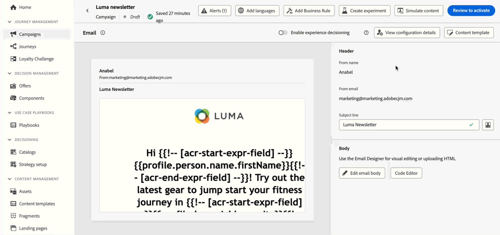

# 发行说明 {#release-notes}

>[!CONTEXTUALHELP]
>id="ajo_homepage_card1"
>title="新增功能？"
>abstract="**Adobe Journey Optimizer** 不断地提供新功能、对现有功能的增强和错误修复。会在每月的最后一周将所有更改整合到发行说明中。"

[!DNL Adobe Journey Optimizer] 不断地提供新功能、对现有功能进行增强和修复错误。会在每月的最后一周将所有更改整合到发行说明中。[!DNL Adobe Journey Optimizer] 原生构建于 [!DNL Adobe Experience Platform] 之上并继承了其所具备的最新创新技术和改进。在 [Adobe Experience Platform 发行说明](https://experienceleague.adobe.com/docs/experience-platform/release-notes/latest.html?lang=zh-Hans){target="_blank"}中，进一步了解这些更改。

## 2025年2月版 {#25-02-rn}

**发行日期**： 2025年2月18日至19日

### 新功能 {#25-02-features}

此版本随附的新功能详述如下。

<table>
<thead>
<tr>
<th><strong>创建和管理业务规则</strong> </th>
</tr>
</thead>
<tbody>
<tr>
<td>

您现在可以使用规则集创建业务规则。 规则集是一组规则，可帮助您限制营销活动中的已发送消息和跨渠道的历程操作，并控制用户档案条目进入历程。

<ul><li>创建渠道规则集以限制跨一个或多个渠道发送的消息数。 将它们应用于营销活动或历程操作，以强制实施规则集中定义的规则。 渠道规则集允许您根据通信类型应用上限规则。 例如，设置规则集以限制“促销消息”，并为“新闻稿”设置另一个规则。 根据发送的通信类型，在营销活动或历程操作中应用相应的规则集。</li>
<li> 创建历程规则集以控制用户档案条目进入历程。 限制用户档案在给定时间段内进入历程的频率或用户档案可同时注册的历程数。 在历程级别应用这些变量以确保正确的条目管理。</li>

以前，业务规则可用于一组组织(LA)，现在则可用于所有用户(GA)。

<!--p>For more information, refer to the <a href="../configuration/business-rules.md">detailed documentation</a>.</p-->
</td>
</tr>
</tbody>
</table>

<table>
<thead>
<tr>
<th><strong>使用AI助手生成登陆页面</strong> </th>
</tr>
</thead>
<tbody>
<tr>
<td>

您现在可以借助AI助手为登陆页面制作引人注目的内容，包括全页设计、个性化文本和自定义可视化图表。

<!--p>For more information on AI Assistant, refer to the <a href="../email/generative-lp.md">detailed documentation</a>.</p-->
</td>
</tr>
</tbody>
</table>

<table>
<thead>
<tr>
<th><strong>品牌指南（测试版）</strong> </th>
</tr>
</thead>
<tbody>
<tr>
<td>

您现在可以设置自己的品牌指南来定义品牌的视觉和语言标识。 请注意，品牌功能作为私有测试版向有限的一组客户发布。 它将在未来版本中逐步向所有客户提供。

<!--p>For more information, refer to the <a href="../content-management/brands.md">detailed documentation</a>.</p-->
</td>
</tr>
</tbody>
</table>

<table>
<thead>
<tr>
<th><strong>客户历程分析模板</strong> </th>
</tr>
</thead>
<tbody>
<tr>
<td>

您现在可以选择利用“客户历程分析”模板来增强 Journey Optimizer 报告。通过这项新功能，您可以通过根据分析需求定制的预设计模板来简化报告流程。

有关更多信息，请参阅<a href="../reports/report-cja-manage.md#cja-template">详细文档</a>。

可用日期：2025年1月15日起

</tr>
</tbody>
</table>

<table>
<thead>
<tr>
<th><strong>灵活的受众评估（限量发布）</strong> </th>
</tr>
</thead>
<tbody>
<tr>
<td>

灵活的受众评估允许您按需为选定的受众运行分段作业，确保在将受众定位到Journey Optimizer历程和营销活动之前始终具有最新的受众数据。

有关更多信息，请参阅<a href="../audience/about-audiences.md#flexible">详细文档</a>。

 灵活的受众评估仅适用于一组组织（限量发布）。 要获得访问权限，请与 Adobe 代表联系。

可用日期：2025年1月28日

</tr>
</tbody>
</table>
</table>

### 改进 {#25-02-improvements}

2月更新随附以下改进。

* **历程** — 您现在可以通过从管理部分发送API调用来测试自定义操作。 此新功能可帮助您在历程中使用自定义操作之前或之后对其进行故障排除。

* **数据集生存时间(TTL)** — 从本月开始，将在新沙盒和新组织中向Journey Optimizer系统生成的数据集推出生存时间(TTL)护栏，如下所示：

   * 配置文件存储中的数据为 90 天
   * 数据湖中的数据为 13 个月

  此更改将在后续阶段中推出到现有客户沙盒。

  在[专用常见问题解答](../data/datasets-ttl.md#frequently-asked-questions)中了解有关此更新的更多信息。

<!--* **Playbooks** - You can now create and publish your own Use Case Playbooks in Journey Optimizer.-->

* **直邮** — 现在支持在直邮渠道配置中进行文件路由的新服务器类型“数据登录区”。

* **短信** — 您现在可以通过覆盖投放、反馈、入站和回调URL来管理来自多区域端点的短信消息投放。 为了支持此功能，已在API凭据配置中添加了新字段覆盖URL 。 此更改仅适用于Sinch提供程序。 [了解详情](../sms/sms-configuration-sinch.md)

* **Personalization**（推出日期：2025年1月29日） — 新的日期/时间帮助程序功能可在个性化编辑器中使用。 [了解详情](../personalization/functions/dates.md)

<!--
* The personalization editor has been enhanced with new capabilities such as Auto-complete, Search, and filtering options. You can also show or hide deprecated attributes.-->

* **电子邮件配置**（发布日期：2025年2月12日） — 如果您在Adobe之外管理同意，则现在可以设置自定义取消订阅电子邮件地址和自定义一键式取消订阅URL，作为电子邮件渠道配置设置的一部分。 [阅读更多](../email/list-unsubscribe.md#custom-managed)

  {width="80%"}

* **Decisioning**（可用日期：2025年1月28日） — 现在，在编辑项目目录的架构时，Decisioning支持“对象”数据类型。 [了解详情](../experience-decisioning/catalogs.md)

## 2024 年 10 月版本 {#24-10-rn}

**发布日期**：2024 年 10 月 29-30 日

### 新功能 {#24-10-features}

此版本引入了下方详述的新功能：

<table>
<thead>
<tr>
<th><strong>电子邮件内容锁定</strong> </th>
</tr>
</thead>
<tbody>
<tr>
<td>

Journey Optimizer 现在允许您通过锁定整个模板或特定结构和组件来锁定电子邮件模板中的内容。这样可防止无意中编辑或删除内容，让您更好地控制模板自定义，并提高电子邮件营销活动的效率和可靠性。

有关更多信息，请参阅<a href="../content-management/content-locking.md">详细文档</a>。

自 2024 年 10 月 24 日起发布

</td>
</tr>
</tbody>
</table>

<table>
<thead>
<tr>
<th><strong>历程中基于代码的体验</strong> </th>
</tr>
</thead>
<tbody>
<tr>
<td>

借助基于代码的体验渠道，Adobe Journey Optimizer 允许您对任何入站属性进行高级个性化和测试，从而向不同的接触点无缝投放定制化体验，如 Web 应用程序、移动应用程序、桌面应用程序、视频游戏机、电视连接设备、智能电视、网亭、ATM、物联网设备等。现在，历程画布中提供了基于代码的体验渠道。

有关更多信息，请参阅<a href="../code-based/create-code-based.md">详细文档</a>。

自 2024 年 10 月 1 日起发布

</tr>
</tbody>
</table>

<table>
<thead>
<tr>
<th><strong>历程中的 Web 体验</strong> </th>
</tr>
</thead>
<tbody>
<tr>
<td>

借助 Web 渠道，Adobe Journey Optimizer 允许您通过入站 Web 历程为客户提供个性化 Web 体验。现在，可在历程画布中使用 Web 渠道。

有关更多信息，请参阅<a href="../web/create-web.md">详细文档</a>。

自 2024 年 10 月 1 日起发布

</tr>
</tbody>
</table>

<table>
<thead>
<tr>
<th><strong>冲突和优先级管理（限量发布）</strong> </th>
</tr>
</thead>
<tbody>
<tr>
<td>

在 Journey Optimizer 中，管理营销活动和历程的数量和时间至关重要，这样才能避免因过多的交互而让客户不堪重负。Journey Optimizer 现在提供多种冲突管理和优先级设置工具。 
有关更多信息，请参阅<a href="../conflict-prioritization/gs-conflict-prioritization.md">详细文档</a>。

<ul><li><b>历程频率上限</b>：您现在可以创建要应用于历程的规则集，从而限制每日、每周或每月可以向用户档案发送历程的次数，并控制同时运行的并行历程数量。</li>
<li><b>优先级分数</b>：您现在可以为营销活动或历程分配优先级分数，范围在 0 到 100 之间。数字越大，表示优先级越高。当两个营销活动或历程操作使用同一渠道配置时，Journey Optimizer 将选择具有最高优先级分数的一个。如果营销活动优先级分数相同，则将选择在最早时间修改的营销活动。</li>
<li><b>查看潜在冲突</b>：现在，通过历程和营销活动中新的“查看潜在冲突”按钮，可识别与其他历程或营销活动的重叠部分，例如开始日期、目标受众或所选渠道配置。</li>
<li><b>历程仲裁</b>：此新功能使您能够优先考虑对客户最重要的历程。当客户有资格参加即将到来的更高优先级的历程时，您可以创建一个规则来阻止客户访问较低优先级的历程。</li>
<li><b>按通信类型设置频率上限：</b>通过规则集，您现在可以按通信类型（如销售、促销）设置粒度规则，防止向客户发送过多的内容相似的消息。您可以跨多个渠道控制频率，自动排除过度联系的用户档案，以确保获得更好的客户体验。</li></ul>

冲突和优先级管理功能面向部分客户限量发布。请注意，未来将会逐步面向更多用户推出这些功能。如果有兴趣加入这些功能的试用候选名单，请联系您的客户团队。

</td>
</tr>
</tbody>
</table>

<table>
<thead>
<tr>
<th><strong>Mobile Ink 与 Adobe Journey Optimizer 集成</strong> </th>
</tr>
</thead>
<tbody>
<tr>
<td>

您现在可以将 Mobile Ink Da Vinci 与 Adobe Journey Optimizer 集成。通过此新集成，您可以： 

<ul><li>利用 Mobile Ink Da Vinci 产品中的强大功能，为批量营销活动编写并个性化电子邮件变体</li>
<li>使用 Da Vinci 进行创作，使用 Adobe Journey Optimizer 进行优化和投放，加快 Journey Optimizer 客户的从业人员工作流程</li>
<li>使用 Adobe 数据优化 Da Vinci 模型。</li></ul>

有关详细信息，请参阅 <a href="https://movableink.com/adobe-and-movable-ink">Movable Ink Da Vinci 文档</a>。

</tr>
</tbody>
</table>

以下功能此前面向一部分组织提供 (LA)，现在面向所有用户提供 (GA)：

<table>
<thead>
<tr>
<th><strong>电子邮件配置个性化（正式发布） </strong> </th>
</tr>
</thead>
<tbody>
<tr>
<td>

为增强电子邮件设置的灵活性和控制，您可以在创建电子邮件渠道配置时定义动态子域和个性化标头参数。

有关更多信息，请参阅<a href="../email/surface-personalization.md">详细文档</a>。

自 2024 年 10 月 23 日起发布

</tr>
</tbody>
</table>

<table>
<thead>
<tr>
<th><strong>历程和营销活动中的审批（正式发布）</strong> </th>
</tr>
</thead>
<tbody>
<tr>
<td>

现在，通过审批策略，您可以在 Journey Optimizer 中设置审批流程，从而使营销团队可以确保营销活动及历程在投入使用之前由相应的负责人审查和签署。

有关更多信息，请参阅<a href="../test-approve/gs-approval.md">详细文档</a>。

自 2024 年 10 月 22 日起发布

</td>
</tr>
</tbody>
</table>

<table>
<thead>
<tr>
<th><strong>历程中的内容试验（正式发布）</strong> </th>
</tr>
</thead>
<tbody>
<tr>
<td>

已经可用于营销活动，Adobe Journey Optimizer 现在支持历程中的试验。试验是开展在线测试时进行的随机试用，这意味着您将为给定的消息试验接触部分随机选择的用户，并为其他试验或试验组接触另外一组随机选择的用户。公开后，您可以衡量感兴趣的结果指标，如电子邮件打开次数、订阅次数或购买次数。

有关更多信息，请参阅<a href="../content-management/content-experiment.md">详细文档</a>。

</td>
</tr>
</tbody>
</table>

<table>
<thead>
<tr>
<th><strong>决策（正式发布）</strong> </th>
</tr>
</thead>
<tbody>
<tr>
<td>

决策在以前称为体验决策且仅面向一部分组织提供 (LA)，现在面向所有用户提供 (GA)，包括已购买 Adobe Healthcare Shield 或 Privacy and Security Shield 附加产品的组织。

通过提供称为“决策项”的集中式营销产品建议目录和复杂的决策引擎，决策简化了个性化流程。此引擎利用规则和排名标准来选择最相关的决策项并将其呈现给每个人。这些决策项通过基于代码的体验渠道无缝集成到广泛的入站表面中。

有关更多信息，请参阅<a href="../experience-decisioning/gs-experience-decisioning.md">详细文档</a>。

</td>
</tr>
</tbody>
</table>

<table>
<thead>
<tr>
<th><strong>历程和营销活动中的多语言消息（正式发布）</strong> </th>
</tr>
</thead>
<tbody>
<tr>
<td>

现在，您可以在单个营销活动或历程中轻松创建多种语言的内容。利用此功能，您可以在编辑营销活动或历程时切换语言，简化整个编辑过程，并提高有效管理多语言内容的能力。

有关更多信息，请参阅<a href="../content-management/multilingual-gs.md">详细文档</a>。

</td>
</tr>
</tbody>
</table>

<table>
<thead>
<tr>
<th><strong>更新的报告体验（正式发布）</strong> </th>
</tr>
</thead>
<tbody>
<tr>
<td>

Journey Optimizer 报告功能现已正式发布 (GA)，改善了与客户历程分析的互操作性，可在两个平台之间实现报告标准化，并提高了数据一致性和可靠性。Journey Optimizer 与 Customer Journey Analytics 之间的这种无缝集成能够帮助更清晰地了解绩效指标，使用户能够做出更加明智的决策。

在正式发布后，引入了四个新功能：创建简单量度、创建和发布受众、使用洞察生成器提出临时问题以及将报告通过电子邮件自动发送给关键收件人。

有关更多信息，请参阅<a href="../reports/report-cja-manage.md">详细文档</a>。

重要说明：当前的报告体验将从 2025 年 1 月起停用。在此日期之后，新的报告体验将成为标准。我们建议您熟悉新特性和功能，以确保顺利过渡。<a href="../reports/report-gs-cja.md">了解如何开始使用 Journey Optimizer 的新报告界面</a>

自 2024 年 10 月 16 日起发布

</tr>
</tbody>
</table>

<!--The following capabilities are available to all customers in public beta:-->

<table>
<thead>
<tr>
<th><strong>使用範例輸入資料來測試內容 (測試版)</strong> </th>
</tr>
</thead>
<tbody>
<tr>
<td>

Journey Optimizer 现在允许您测试内容的多种变体，方法是预览内容并使用从文件上传或手动添加的示例输入数据发送电子邮件验证。系统会自动检测内容中用于个性化的所有用户档案属性，可使用这些属性进行测试以创建多个变体。

此功能目前以公开 Beta 版的形式面向所有客户提供，可用于电子邮件、短信和推送通知渠道。

有关更多信息，请参阅<a href="../test-approve/simulate-sample-input.md">详细文档</a>。

</td>
</tr>
</tbody>
</table>

<table>
<thead>
<tr>
<th><strong>使用 Adobe Experience Platform 数据进行个性化设置（Beta 版）</strong> </th>
</tr>
</thead>
<tbody>
<tr>
<td>

在个性化编辑器中利用 Adobe Experience Platform 中的数据来对内容进行个性化。为此，必须首先通过 API 调用启用查找个性化所需的数据集。完成后，可以使用其数据对您的内容进行个性化并将它们引入到 [!DNL Journey Optimizer] 中。

此功能目前为公开 Beta 版，可供所有客户使用。

有关更多信息，请参阅<a href="../personalization/lookup-aep-data.md">详细文档</a>。

</td>
</tr>
</tbody>
</table>

### 改进 {#24-10-improvements}

此版本包含下方列出的改进。

**短信渠道**

* 您现在可以编辑或删除短信 API 渠道配置。[了解详情](../sms/sms-configuration.md)

* 已引入以下增强功能，从而使用 Infobip 和 Sinch 改善您的短信消息传递功能：

   * 您可以为短信营销活动和历程定义和管理唯一的关键字，从而实现更加个性化和高效的通信。

   * 当关键字无法识别时，您可以创建和投放默认短信消息。

  要了解有关这些改进的更多信息，请参阅 [Infobip](../sms/sms-configuration-infobip.md) 和 [Sinch](../sms/sms-configuration-sinch.md) 的短信配置文档。

<!--**Journeys**-->

<!--* **Path experiment in journeys** - With the journey path experiment, you can now define and track key metrics for your journey paths, allowing you to measure the impact of your activities and to provide clearer insights into your performance. -->

<!--* **Max number of Live journeys** - Journey Optimizer now has a guardrail of 500 live journeys on production sandboxes, instead of 100. The number of live journeys is visible in the journey canvas. (DOCAC-10977) -->

**Web 渠道**

* **Web 设计器的非可视化编辑模式** - 作为 Journey Optimizer Web 设计器的替代工具，您现在可以使用非可视化编辑器向网站添加修改内容。这允许您手动进行更改，而无需在可视化编辑器中打开页面。在 Web 设计器中加载页面时，如果您无法安装所需的 Adobe Experience Cloud 可视化帮助程序等浏览器扩展，这种非可视化编辑模式将很有帮助。[了解详情](../web/web-non-visual-editor.md)

**数据集**

* **发送和打开事件** - 从 2024 年 11 月 1 日起，流式分段将不再支持在 Journey Optimizer 跟踪和反馈数据集中使用发送和打开事件。此更改将适用于所有客户沙盒和组织。[了解详情](../data/datasets-ttl.md#segmentation-update)

* **数据集生存时间 (TTL)** - 从 2025 年 2 月起，将在新沙盒和新组织中推出用于 Journey Optimizer 系统生成的数据集的生存时间 (TTL) 护栏，如下所示：

   * 配置文件存储中的数据为 90 天
   * 数据湖中的数据为 13 个月

  此更改将在后续阶段推广到现有的客户沙盒。[了解详情](../data/datasets-ttl.md#ttl)

* **自定义操作中的参数** - 发布日期：2024 年 10 月 3 日 - 自定义操作现在支持 NULL 和可选参数。[了解详情](../action/about-custom-action-configuration.md#define-the-message-parameters)

**报告**

* **决策报告**&#x200B;现已可用，可提供关于访客如何与体验进行交互的基本洞察。[了解详情](../reports/campaign-global-report-cja-code.md#decisioning-kpis)

**数据治理和同意策略** - 发布日期：2024 年 10 月 7 日

* 现在，Journey Optimizer 中的所有渠道都会实施&#x200B;**数据治理策略**。对于在 Adobe Experience Platform 中创建了策略的客户，这些策略将作为渠道配置设置的一部分应用于营销操作。使用配置创建内容时，系统会检查所有个性化字段是否存在任何数据治理违规。如果发现违规，将无法发布历程或营销活动。[了解详情](../action/action-privacy.md)

* **自定义同意政策**&#x200B;现在适用于所有 Journey Optimizer 渠道。在发送消息或投放入站体验之前执行时，系统会检查用户是否同意在接收的内容中使用个性化字段。如果未获得同意，则不会显示体验。[了解详情](../action/consent.md)

  >[!NOTE]
  >
  >目前，同意策略仅适用于已购买 Adobe **Healthcare Shield** 或 **Privacy and Security Shield** 附加产品的组织。

**受众** - 发布日期：2024 年 10 月 8 日

* 定位 CSV 文件受众时，您现在可以在个性化编辑器以及历程和营销活动规则构建器中使用来自文件的属性。[了解详情](../audience/about-audiences.md)

* 现在可以将自定义上传（CSV 文件）中的受众和属性与 Healthcare Shield 或 Privacy and Security Shield 一起使用。

**配置** - 发布日期：2024 年 10 月 23 日

* 在营销活动或历程中使用个性化配置时，您现在可以预览电子邮件内容，以检查您定义的动态设置是否存在潜在错误。[了解详情](../email/surface-personalization.md#check-configuration)

**基于代码的渠道**

* 内容模板现已可用。您可以从开发人员构建的内容模板开始，加快基于代码的体验的创作速度。通过使用内容模板，营销人员可以只修改某些值或字段，而无需构建整个 HTML 或 JSON 内容负载。[了解详情](../content-management/content-templates.md)

**决策**

* [Adobe Customer Journey Analytics](https://experienceleague.adobe.com/docs/analytics-platform/using/cja-overview/cja-overview.html?lang=zh-Hans) 用户现在可以在决策（以前称为体验决策）中设置 AI 模型时选择用于进行优化的自定义模型。例如，这允许您在自定义“购买”表格上进行优化，而不是使用定义的约束（如点击率）。[了解详情](../experience-decisioning/ranking.md)

* 当使用决策功能将决策策略添加到基于代码的营销活动时，除了选择策略之外，您现在还可以手动选择单个决策项。此外，您现在可以选择多个后备产品建议。这可保证返回一定数量的决策项。[了解详情](../experience-decisioning/create-decision.md)
