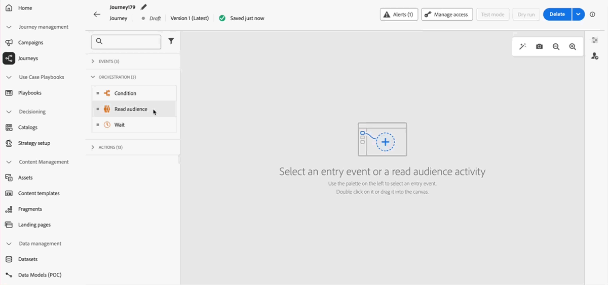

# 发行说明 {#release-notes}

>[!CONTEXTUALHELP]
>id="ajo_homepage_card1"
>title="新增功能"
>abstract="**Adobe Journey Optimizer** 不断地提供新功能、对现有功能的增强和错误修复。会在每月的最后一周将所有更改整合到发行说明中。"

[!DNL Adobe Journey Optimizer] 不断地提供新功能、对现有功能进行增强和修复错误。会在每月的最后一周将所有更改整合到发行说明中。[!DNL Adobe Journey Optimizer] 原生构建于 [!DNL Adobe Experience Platform] 之上并继承了其所具备的最新创新技术和改进。在 [Adobe Experience Platform 发行说明](https://experienceleague.adobe.com/docs/experience-platform/release-notes/latest.html?lang=zh-Hans){target="_blank"}中进一步了解这些更改。

## 营销活动编排

**可用日期**：2025年8月4日

Journey Optimizer现在包括&#x200B;**Campaign Orchestration**，这是一项专门为品牌启动的批量营销活动构建的新功能。 此版本引入了营销活动编排画布和增强的数据建模，它们可协同工作，让营销人员规划、定位和提供个性化的跨渠道营销活动。

它包括[关系架构和数据集](#oc-relational)和[促销活动画布](#oc-canvas)。 这两项创新共同为Journey Optimizer中的批量活动编排开启了一个新标准。 下面列出了关键功能。

### 主要功能 {#oc-capabilities}

* **多步骤工作流**

  使用专门构建的全新活动编排画布，推动复杂的多渠道批量活动。

* **按需受众**

  按需细分受众以立即激活。

* **多实体分段**

  使用业务上下文（非人员维度）（如产品、商店、续订、预订等）构建受众。

* **预发送可见性**

  在启动之前和营销活动运行时，审查、优化和优化受众和营销活动

### 营销活动画布 {#oc-canvas}

专为批量营销活动构建的全新可视化编排界面。 此画布可启用：

* 多步骤、多渠道营销活动流的可视化规划

* 支持通过关系查询构建的按需受众

* 高级受众拆分、等待和条件逻辑

* 应用业务规则和过滤器后的精确预发送计数

### 关系架构和数据集 {#oc-relational}

Adobe Experience Platform现在支持链接到基于人员的配置文件的关系实体（例如，产品、商店、预订、合同）。 这允许跨多维数据结构进行分段和个性化，支持如下用例：

* 每个预订、订阅或合同发送一条消息

* 基于相关实体属性（例如，产品类别或商店位置）的分段

* 增强的可寻址性（例如，发送到与实体绑定的所有已知联系人）

### 为什么它很重要

此版本使营销人员能够完全控制品牌启动的、基于受众的批量营销，并将灵活的数据建模与专门构建的编排体验相结合。 它专为实时历程中的批量活动编排而设计，同时提供高级个性化和可扩展性。

### 了解详情

请参阅[Campaign编排文档](../orchestrated/gs-orchestrated-campaigns.md)以了解详情。

<!--
## August '25 pre release notes {#25-7-rn}

**Pre release notes below are subject to change without prior notice until the release availability date**. Links, screens and updated documentation are published at the release date.

See also [Adobe Experience Platform Pre-release notes](https://experienceleague.adobe.com/en/docs/experience-platform/release-notes/pre-release-notes){target="_blank"}.

**Release date**: August 19, 2025

### New capabilities {#Aug-25-8-features}

New capabilities coming with this release are detailed below.

### Improvements {#Aug-25-8-improv}

Improvements coming with this release are listed below.
-->

## 2025年7月发行说明 {#25-7-rn}

**发行日期**： 2025年7月29日

### 新功能 {#features-25-7}

此版本包含的新功能详述如下。

#### 功能

<table>
<thead>
<tr>
<th><strong>WhatsApp渠道</strong> </th>
</tr>
</thead>
<tbody>
<tr>
<td>

Journey Optimizer现在支持直接的WhatsApp消息传送，从而能够顺利地集成到您的历程和营销活动中，以改进收件人的沟通和参与。 此本机渠道提供现成的WhatsApp模板集成、消息预览、个性化、投放报告、Webhook、选择加入和选择退出同意管理等。

此功能以前在Beta中发布，但现在对所有环境可用（正式发布）。

有关更多信息，请参阅<a href="../whatsapp/get-started-whatsapp.md">详细文档</a>。

</td>
</tr>
</tbody>
</table>

<table>
<thead>
<tr>
<th><strong>品牌</strong> </th>
</tr>
</thead>
<tbody>
<tr>
<td>

您现在可以创建并个性化自定义品牌，在所有沟通中清晰传达您的视觉风格与语言特征。借助品牌一致性评分，您可以实时获得内容是否符合品牌语调、风格和规范的反馈，帮助您在每一次沟通中始终保持品牌一致性。

此功能以前在Beta中发布，但现在对所有环境可用（正式发布）。

有关更多信息，请参阅<a href="../content-management/brands.md">详细文档</a>。

</td>
</tr>
</tbody>
</table>

<table>
<thead>
<tr>
<th><strong>在电子邮件渠道中使用Decisioning</strong> </th>
</tr>
</thead>
<tbody>
<tr>
<td>

您现在可以将决策策略添加到电子邮件历程和营销活动中。 决策策略是优惠的容器，它们利用决策引擎动态返回为每个受众成员提供的最佳内容。

此功能在“有限可用性”中可用。 请联系您的Adobe代表以获取访问权限。

有关详细信息，请参阅<a href="../experience-decisioning/create-decision.md">详细文档</a>

</td>
</tr>
</tbody>
</table>

<table>
<thead>
<tr>
<th><strong>LINE 渠道</strong> </th>
</tr>
</thead>
<tbody>
<tr>
<td>

Adobe Journey Optimizer 已扩展其跨渠道功能，包括对 LINE 渠道的支持。通过此增强功能，您可以创建、编辑和预览 LINE 体验，从而实现更加个性化且富有吸引力的交互。借助 LINE，您可以与更多客户建立联系，发送相关内容并提高参与度。

以前仅能请求，现在所有用户均可使用LINE渠道（正式发布）。

有关更多信息，请参阅<a href="../line/get-started-line.md">详细文档</a>。
</td>
</tr>
</tbody>
</table>

<!--
<table>
<thead>
<tr>
<th><strong>Optimization in campaigns</strong> </th>
</tr>
</thead>
<tbody>
<tr>
<td>

Journey Optimizer now empowers you with the tools to deliver personalized and optimized content to your campaigns' audience, allowing you to run content experiments, create rule-based targeting, and use advanced combinations of both, to maximize the effectiveness of your campaigns.

With Optimization, you can:

<ul>
<li>Test multiple content variations to identify the most effective messaging.</li>
<li>Deliver personalized content based on user attributes and contextual data.</li>
<li>Combine targeting and experimentation for advanced campaign strategies.</li>
<li>Filter out users that do not match variant criteria.</li>
<li>Ensure fallback mechanisms to maintain user engagement.</li>
</ul>

Once the campaign is live, profiles are evaluated against the defined criteria, and based on matching criteria, they are delivered with the appropriate experience or content from the campaign.

For more information, refer to the <a href="../FILE.md">detailed documentation</a>

</td>
</tr>
</tbody>
</table>
-->

<table>
<thead>
<tr>
<th><strong>历程练习</strong> </th>
</tr>
</thead>
<tbody>
<tr>
<td>

历程试运行是 Adobe Journey Optimizer 中的一种特殊历程发布模式，使历程设计人员能够在不接触真实客户或更新轮廓信息的前提下，使用真实生产数据对历程进行测试。此功能有助于历程设计人员在正式发布前验证历程设计和受众定位，从而增强信心。

此功能之前为限量发布，现在可用于所有环境（正式发布）。

有关详细信息，请参阅<a href="../building-journeys/journey-dry-run.md">详细文档</a>

</td>
</tr>
</tbody>
</table>

<table>
<thead>
<tr>
<th><strong>历程的补充ID</strong> </th>
</tr>
</thead>
<tbody>
<tr>
<td>

您现在可以通过用户档案 ID 以及其他标识符（如订单 ID、订阅 ID 或计划 ID）触发历程，使同一轮廓同时多次出现在同一历程中。这支持同时管理多个订单或订阅等场景，每个实例在整个历程中都遵循各自的路径。

以前在有限可用性中发布，现在所有环境都可以在历程中使用补充ID。 在此通用可用性版本中，该功能现在包含对读取受众历程的支持。

有关详细信息，请参阅<a href="../building-journeys/supplemental-identifier.md">详细文档</a>

</td>
</tr>
</tbody>
</table>

### 产品内警报

现在可以为Journey Optimizer产品版本订阅&#x200B;**电子邮件和产品内通知**。

要订购：

* 导航到&#x200B;**Adobe Experience Cloud首选项**
* 在&#x200B;**通知**&#x200B;下，查找&#x200B;**Journey Optimizer新版本**
* 启用应用程序内通知和电子邮件通知

{width="70%" align="left"}

### 历程条件的更改 {#ee-change@}

从 7 月 8 日起，在新的客户组织中，历程条件中使用的表达式编辑器将不再支持使用体验事件创建表达式。因此，[Experience Platform 数据源](../datasource/adobe-experience-platform-data-source.md)中的体验事件不能用于创建表达式。[此处](../building-journeys/exp-event-lookup.md)引述了使用体验事件创建表达式/逻辑的替代方法和最佳实践。

在单一历程中访问历程上下文事件数据的方式没有变化。在表达式和个性化编辑器中，用户可继续访问通过初始历程事件传入的数据。

请参阅[此常见问题解答](../building-journeys/exp-event-lookup.md#faq-ee)以了解详情。

### 改进 {#25-7-improv}

此版本包含的改进如下所述。

* **营销活动**

   * **营销活动中的多个入站操作** — 为简化营销活动编排，您现在可以在单个营销活动中定义多个入站操作。 利用此功能，您可以向不同位置同时交付多个基于代码的体验、应用程序内消息、内容卡或Web操作，每个操作都包含特定内容。
  <!-- [Read more](../FILE.md) -->

   * **营销活动库存重组** — 计划营销活动和API触发的营销活动现在拆分为营销活动库存中的单独选项卡，以便更轻松地导航和管理。

[了解更多信息](../campaigns/modify-stop-campaign.md)

* **数据管理**
   * **决策管理系统数据集更新** — 已删除的个性化和备用优惠现在在“decision_object_repository_personalized_offers”和“decision_object_repository_fallback_offers”数据集中标记为已存档。 数据集中的现有记录不会更改。

[了解更多信息](../offers/export-catalog/access-dataset.md)

* **历程**
   * **历程沙盒工具增强功能** — 在使用包导出和导入功能跨多个沙盒复制历程时，以下功能现在也可用：
      * 选择目标上的现有事件
      * 独立于历程复制事件
      * 检测字段组/数据源关系，如果它们存在，则在目标处链接到它们，如果不存在，则创建它们。

[了解更多信息](../configuration/copy-objects-to-sandbox.md)

* **渠道 — 应用程序内**
   * **应用程序内键/值对** — 对于应用程序内消息，您可以定义键和值对以在消息有效负荷中包含自定义变量。 利用这些键值对，可基于特定配置和用例传递其他数据。 [了解详情](../in-app/design-in-app.md)

* **渠道 — 内容卡**

   * **基于规则的营销活动取消资格** — 在编辑其他投放规则时，以前的投放规则选项已替换为三种不同的规则类型，以便更好地控制消息时间和可见性：
      * 显示消息if：确定何时显示内容卡片的条件。
      * 在以下情况下关闭消息：临时隐藏内容卡的条件。 如果再次满足显示条件，则它可能会重新出现。
      * 在以下情况下取消消息资格：永久阻止内容卡再次显示的条件。

[了解更多信息](../content-card/design-content-card.md)

* **决策**
   * **迁移工具API** - Journey Optimizer团队当前正在处理迁移工具API，以将决策管理实体迁移到Decisioning。 此工具支持沙盒之间的无缝迁移，并具有依赖关系解析和回滚功能。 如有兴趣，请联系您的Adobe代表。

* **个性化**
   * 已向个性化编辑器添加新的辅助函数“SHA256”。 此函数用于计算并返回字符串的sha256哈希。

[了解更多信息](../personalization/functions/string.md#sha256)
