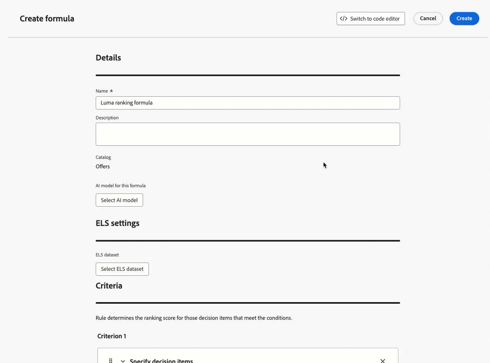

# 发行说明 {#release-notes}

>[!CONTEXTUALHELP]
>id="ajo_homepage_card1"
>title="新增功能"
>abstract="**Adobe Journey Optimizer** 不断地提供新功能、对现有功能的增强和错误修复。会在每月的最后一周将所有更改整合到发行说明中。"

[!DNL Adobe Journey Optimizer] 不断地提供新功能、对现有功能进行增强和修复错误。会在每月的最后一周将所有更改整合到发行说明中。[!DNL Adobe Journey Optimizer] 原生构建于 [!DNL Adobe Experience Platform] 之上并继承了其所具备的最新创新技术和改进。在 [Adobe Experience Platform 发行说明](https://experienceleague.adobe.com/docs/experience-platform/release-notes/latest.html?lang=zh-Hans){target="_blank"}中进一步了解这些更改。

## 2025年5月发行说明 {#25-5-rn}

**发行日期**： 2025年5月20日至21日

### 新功能 {#25-05-features}

此版本包含的新功能详述如下。

<table>
<thead>
<tr>
<th><strong>Adobe Experience Manager内容片段集成</strong> </th>
</tr>
</thead>
<tbody>
<tr>
<td>

通过将Adobe Experience Manager与Adobe Journey Optimizer集成，您现在可以轻松地在Journey Optimizer内容中使用Adobe Experience Manager内容片段。 这种无缝连接使得直接在Journey Optimizer中访问和使用您的AEM内容更加容易。

此功能以前仅供有限组织(LA)使用，现在已正式推出，并提供了以下增强功能：

<ul>
<!--li>Create offers by directly selecting an AEM Content Fragment.</li-->
<li>使用编辑器模式在片段签名中定义占位符和映射个性化值。</li>
</ul>
 

有关更多信息，请参阅<a href="../integrations/aem-fragments.md">详细文档</a>。

发布日期： 2025年5月23日

</td>
</tr>
</tbody>
</table>

<table>
<thead>
<tr>
<th><strong>Adobe Experience Manager Dynamic media集成</strong> </th>
</tr>
</thead>
<tbody>
<tr>
<td>

Dynamic Media 资源现可直接在 Journey Optimizer 中使用和访问。通过此集成，您可以：

<ul>
<li>通过实时更新集中管理资源。</li>
<li>立即修改您的资源设置，如宽度和高度。</li>
<li>通过更新内容和添加个性化字段来自定义Dynamic Media模板。</li>
</ul>
 

此功能以前以“有限可用性”发布，现在可用于所有环境（一般可用性）。

有关更多信息，请参阅<a href="../integrations/aem-dynamic.md">详细文档</a>。

发布日期： 2025年5月23日

</td>
</tr>
</tbody>
</table>

<table>
<thead>
<tr>
<th><strong>电子邮件Designer中的主题</strong> </th>
</tr>
</thead>
<tbody>
<tr>
<td>

您现在可以快速应用预批准的主题以确保所有电子邮件中的品牌一致性、加快活动创建过程并独立生成高质量电子邮件，同时减少对设计团队的依赖。

此功能目前为 Beta 版，仅供 Beta 版客户使用。要加入 Beta 版计划，请联系 Adobe 代表。

有关更多信息，请参阅<a href="../email/apply-email-themes.md">详细文档</a>。

发布日期： 2025年5月14日

</td>
</tr>
</tbody>
</table>

<table>
<thead>
<tr>
<th><strong>Decisioning — 新增人工智能公式生成器</strong> </th>
</tr>
</thead>
<tbody>
<tr>
<td>

您现在可以在新改进的界面中定义和组合标准，从而创建特定的决策排名公式。您可以定义自定义排名公式，这些公式通过引导式界面将AI模型分数、选件优先级、配置文件属性、选件属性和上下文信号组合在一起，而不是仅依赖静态选件优先级。

有关更多信息，请参阅<a href="../experience-decisioning/exd-ranking-formulas.md">详细文档</a>。

发布日期： 2025年5月14日

</td>
</tr>
</tbody>
</table>

<table>
<thead>
<tr>
<th><strong>将读取受众计划与批次分段作业同步</strong> </th>
</tr>
</thead>
<tbody>
<tr>
<td>

现在，您可以在批量分段完成后触发每日历程运行。 现在，所有客户都可以在每日计划的历程中使用此选项。 它允许您定义一个长达6小时的时间范围，以等待来自批处理分段作业的受众数据，确保历程使用最新数据运行，或者如果未准备就绪则跳过。

此功能以前以“有限可用性”发布，现在可用于所有环境（一般可用性）。

有关更多信息，请参阅<a href="../building-journeys/read-audience.md#schedule">详细文档</a>。

</td>
</tr>
</tbody>
</table>

<!--<table>
<thead>
<tr>
<th><strong>Calendar View for Campaign and Journey inventory</strong> </th>
</tr>
</thead>
<tbody>
<tr>
<td>

A calendar view is now available in the journeys and campaigns lists. It allows you to visualize all journeys and campaigns activations in the respective lists.

This change is only available for a set of organizations (Limited Availability). To gain access, contact your Adobe representative.

For more information, refer to these sections: <a href="../building-journeys/journey-ui.md">Browse & filter your journeys</a>, <a href="../campaigns/modify-stop-campaign.md">Access campaigns</a>.

</td>
</tr>
</tbody>
</table>-->

<!--<table>
<thead>
<tr>
<th><strong>Conflict & prioritization</strong> </th>
</tr>
</thead>
<tbody>
<tr>
<td>

In Journey Optimizer, managing the volume and timing of campaigns and journeys is essential to avoid overwhelming customers with too many interactions. Journey Optimizer now offers several tools for conflict management and prioritization - previously available only to limited-access (LA) organizations - that are now generally available (GA).

Previously released in Limited Availability, this capability is now available to all environments. With this General Availability release, the following enhancements have been introduced:

<ul>
<li>Expanded Support: Conflict management tools now support both Unitary Journeys and Audience Qualification Journeys, in addition to Read audience journeys.</li>
<li>Improved Troubleshooting: Two new step event fields are now available in the Query Service, enabling you to analyze why a profile was rejected from a journey or campaign.</li>
<li>Enhanced Reporting: Reports now indicate which specific rule excluded a profile from a journey or campaign, providing greater transparency and actionable insights.</li></ul>

For more information, refer to the <a href="../conflict-prioritization/gs-conflict-prioritization.md">detailed documentation</a>.

</td>
</tr>
</tbody>
</table>-->

<table>
<thead>
<tr>
<th><strong>模拟内容变体</strong> </th>
</tr>
</thead>
<tbody>
<tr>
<td>

此前在 Beta 中提供内容变体模拟功能，现在该功能已正式发布 (GA)。它可以让您使用从 CSV 或 JSON 文件上传的示例输入数据或通过手动添加数据预览内容的不同变体。系统会自动检测内容中用于个性化的所有属性，可使用这些属性进行测试以创建多个变体。

此功能以前以“有限可用性”发布，现在可用于所有环境。 在此General Availability版本中，该功能现在包括支持多语言内容和内容实验，使您能够测试不同语言和处理之间的变体。 此外，它现在支持上下文属性（以及用户档案属性），从而允许进行更加动态和情境化的内容测试。

有关更多信息，请参阅<a href="../test-approve/simulate-sample-input.md">详细文档</a>。

发布日期： 2025年5月23日

</td>
</tr>
</tbody>
</table>

<!--table>
<thead>
<tr>
<th><strong>Scale your Experimentation winner</strong> </th>
</tr>
</thead>
<tbody>
<tr>
<td>

Scale the Winner enables you to automatically or manually roll out the winning variation of an experiment to your full audience. This feature ensures that, once a top performer is identified, you can maximize its reach and effectiveness without constant manual oversight.

</td>
</tr>
</tbody>
</table-->

<table>
<thead>
<tr>
<th><strong>自定义短信提供商</strong> </th>
</tr>
</thead>
<tbody>
<tr>
<td>

Journey Optimizer现在允许您在默认选项之外配置其他短信提供商：Sinch、Infobip和Twilio。 通过自定义短信提供商配置，您可以直接集成第三方提供商，利用动态消息传递的高级有效负荷自定义，并管理同意首选项（选择加入/选择退出）以确保合规性。

有关更多信息，请参阅<a href="../sms/sms-configuration-custom.md">详细文档</a>。

此功能以前以“有限可用性”发布，现在可用于所有环境（一般可用性）。
</td>
</td>
</tr>
</tbody>
</table>

<!--
<table>
<thead>
<tr>
<th><strong>Supplemental ID for event-triggered journeys</strong> </th>
</tr>
</thead>
<tbody>
<tr>
<td>

You can now trigger journeys using a profile ID along with another identifier, such as an order ID, subscription ID, or prescription ID, allowing the same profile to be in the same journey multiple times at once. This enables scenarios like managing multiple orders or subscriptions in parallel, with each instance following its own path through the journey.

This capability is only available for a set of organizations (Limited Availability). To gain access, contact your Adobe representative.

</td>
</tr>
</tbody>
</table>
-->

### 改进 {#25-05-improv}

下面列出了此版本中的改进。

* **新对象支持沙盒复制**

   * **营销活动** — 发布日期：2025年5月15日

     使用资源包导出和导入功能跨多个沙盒复制营销活动时，现在还会复制以下依赖项：渠道配置、试验变体和设置、决策策略和项目。 [了解详情](../configuration/copy-objects-to-sandbox.md)

   * **决策** — 发布日期：2025年5月16日

     现在可以在沙盒之间复制决策对象，从而简化测试和部署工作流。 [了解详情](../configuration/copy-objects-to-sandbox.md#decisioning)

* 登陆页面的&#x200B;**文件夹** — 可用日期： 2025年5月9日

  为轻松管理登陆页面，您现在可以使用文件夹更高效地将其组织到结构化的层次结构中。 [了解详情](../landing-pages/manage-lp.md)

* **直邮：SFTP连接的SSH密钥支持** — 可用日期： 2025年5月5日

  在直邮文件路由配置中，除了具有密码身份验证类型的现有SFTP之外，您现在还可以将直邮文件导出到具有SSH密钥身份验证的SFTP服务器。 [了解详情](../direct-mail/direct-mail-configuration.md)

* **个性化的Papers激活** — 发布日期：2025年5月5日

  个性化编辑器中新增了一个“药丸”按钮。启用后，配置文件和上下文属性将显示为“药丸”，从而提高代码的可读性。[了解详情](../personalization/personalization-build-expressions.md#options)

  >[!AVAILABILITY]
  >
  >该功能将在接下来的 30 天内逐步推广到所有环境。

* Web渠道中支持&#x200B;**“重定向到URL”**

  现在，通过Journey Optimizer Web渠道可将访客重定向到另一个现有URL，而不是在可视编辑器中创作新的变体。 此功能可用于运行比较两个完全不同的页面的实验，而不是只更改页面中的几个元素。 [了解详情](../web/create-web.md#web-redirect-to-url)

* **模板和片段的文件夹**

  通过文件夹，您可以更轻松有效地将对象组织到结构化层次结构中。 文件夹以前面向一部分组织提供 (LA)，现在面向所有用户提供 (GA)，以便管理其内容模板和片段。请参阅[内容模板](../content-management/access-content-templates.md#folders)和[片段](../content-management/manage-fragments.md#folders)部分以了解详情。

* **电子邮件模板中的点击跟踪**

  现在，[!DNL Journey Optimizer]本机支持对电子邮件内容中图像映射的`<area>`元素进行点击跟踪。 这是为了确保图像映射区域接收与标准超链接相同的跟踪环绕、跟踪数据和附加参数。 [了解有关邮件跟踪的更多信息](../email/message-tracking.md#manage-tracking)

<!--
* **Decisioning - Leverage Adobe Experience Platform datasets** 
  
  Journey Optimizer now allows you to leverage Adobe Experience Platform datasets in the following Decisioning objects: eligibility rules, ranking formulas, and capping rules.

* **Right rail in campaigns list**

  In the campaign list, selecting a campaign now opens a pane displaying its details.

* **Form fields in code-based experience content**

  In content templates, you can now define specific JSON or HTML fields which enable non-technical users to easily edit content in code-based experiences without the need to manipulate code.

* **Decision item attribute support for decisioning rules**
  
  You can now leverage decision item attributes to create decisioning rules.

* **Subdomains - 'Custom delegation' method**  
  In addition to the full delegation and the CNAME method, a new subdomain configuration method is now available: the Custom delegation method, which enables you to fully own controlling and maintaining all aspects of DNS that are required for delivering, rendering, and tracking messages.
  -->

