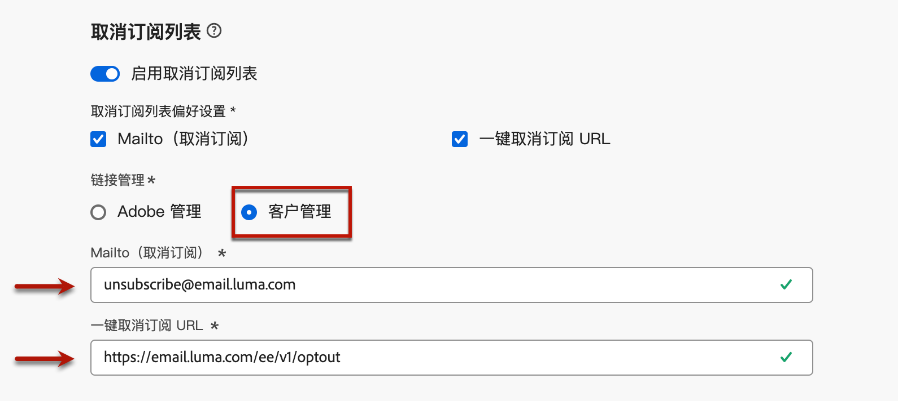

# 发行说明 {#release-notes}

>[!CONTEXTUALHELP]
>id="ajo_homepage_card1"
>title="新增功能？"
>abstract="**Adobe Journey Optimizer** 不断地提供新功能、对现有功能的增强和错误修复。会在每月的最后一周将所有更改整合到发行说明中。"

[!DNL Adobe Journey Optimizer] 不断地提供新功能、对现有功能进行增强和修复错误。会在每月的最后一周将所有更改整合到发行说明中。[!DNL Adobe Journey Optimizer] 原生构建于 [!DNL Adobe Experience Platform] 之上并继承了其所具备的最新创新技术和改进。在 [Adobe Experience Platform 发行说明](https://experienceleague.adobe.com/docs/experience-platform/release-notes/latest.html){target="_blank"}中，进一步了解这些更改。

## 2025年2月发行说明 {#25-02-rn}

<!--
**Early release notes below are subject to change without prior notice until the release availability date**. Links, screens and updated documentation are published at the release date.-->

**发行日期**： 2025年2月18日至19日

### 新功能 {#25-02-features}

此版本随附的新功能详述如下。

<table>
<thead>
<tr>
<th><strong>创建和管理业务规则</strong> </th>
</tr>
</thead>
<tbody>
<tr>
<td>

您现在可以使用规则集创建业务规则。 规则集是一组规则，可帮助您限制营销活动中的已发送消息和跨渠道的历程操作，并控制用户档案条目进入历程。

<ul><li>创建渠道规则集以限制跨一个或多个渠道发送的消息数。 将它们应用于营销活动或历程操作，以强制实施规则集中定义的规则。 渠道规则集允许您根据通信类型应用上限规则。 例如，设置规则集以限制“促销消息”，并为“新闻稿”设置另一个规则。 根据发送的通信类型，在营销活动或历程操作中应用相应的规则集。</li>
<li> 创建历程规则集以控制用户档案条目进入历程。 限制用户档案在给定时间段内进入历程的频率或用户档案可同时注册的历程数。 在历程级别应用这些变量以确保正确的条目管理。</li>

以前，业务规则可用于一组组织(LA)，现在则可用于所有用户(GA)。

有关更多信息，请参阅<a href="../configuration/rule-sets.md">详细文档</a>。

</td>
</tr>
</tbody>
</table>

<table>
<thead>
<tr>
<th><strong>使用AI助手生成登陆页面</strong> </th>
</tr>
</thead>
<tbody>
<tr>
<td>

您现在可以借助AI助手为登陆页面制作引人注目的内容，包括全页设计、个性化文本和自定义可视化图表。

有关更多信息，请参阅<a href="../content-management/generative-lp.md">详细文档</a>。

</td>
</tr>
</tbody>
</table>

<table>
<thead>
<tr>
<th><strong>带有AI助手(Beta)的品牌</strong> </th>
</tr>
</thead>
<tbody>
<tr>
<td>

您现在可以设置自己的品牌来定义品牌的视觉和语言标识。 

此功能作为私有测试版发布给有限的一组客户。 它将在未来版本中逐步向所有客户提供。

有关更多信息，请参阅<a href="../content-management/brands.md">详细文档</a>。

</td>
</tr>
</tbody>
</table>

<table>
<thead>
<tr>
<th><strong>自定义操作疑难解答（限量发布）</strong> </th>
</tr>
</thead>
<tbody>
<tr>
<td>

您现在可以通过直接从Adobe Journey Optimizer发出实际API调用来验证自定义操作配置。 

有关更多信息，请参阅<a href="../action/troubleshoot-custom-action.md">详细文档</a>。

 此功能仅适用于一组组织（限量发布）。 要获得访问权限，请与 Adobe 代表联系。

</td>
</tr>
</tbody>
</table>

<table>
<thead>
<tr>
<th><strong>灵活的受众评估（限量发布）</strong> </th>
</tr>
</thead>
<tbody>
<tr>
<td>

灵活的受众评估允许您按需为选定的受众运行分段作业，确保在将受众定位到Journey Optimizer历程和营销活动之前始终具有最新的受众数据。

有关更多信息，请参阅<a href="../audience/creating-a-segment-definition.md#flexible">详细文档</a>。

此功能仅适用于一组组织（限量发布）。 要获得访问权限，请与 Adobe 代表联系。

可用日期：2025年1月28日

</tr>
</tbody>
</table>
</table>

### 改进 {#25-02-improvements}

2月更新随附以下改进。

* **历程** — 您现在可以通过从管理部分发送API调用来测试自定义操作。 此新功能可帮助您在历程中使用自定义操作之前或之后对其进行故障排除。 [了解详情](../action/troubleshoot-custom-action.md)

* **数据集生存时间(TTL)** — 从本月开始，将在新沙盒和新组织中向Journey Optimizer系统生成的数据集推出生存时间(TTL)护栏，如下所示：

   * 配置文件存储中的数据为 90 天
   * 数据湖中的数据为 13 个月

  此更改将在后续阶段中推出到现有客户沙盒。

  在[专用常见问题解答](../data/datasets-ttl.md#frequently-asked-questions)中了解有关此更新的更多信息。

<!--* **Playbooks** - You can now create and publish your own Use Case Playbooks in Journey Optimizer.-->

* **直邮** — 现在支持在直邮渠道配置中进行文件路由的新服务器类型“数据登录区”。 [了解详情](../direct-mail/direct-mail-configuration.md#file-routing-configuration)

* **短信** — 您现在可以通过覆盖投放、反馈、入站和回调URL来管理来自多区域端点的短信消息投放。 为了支持此功能，已在API凭据配置中添加了新字段覆盖URL 。 此更改仅适用于Sinch提供程序。 [了解详情](../sms/sms-configuration-sinch.md)

* **Personalization**（推出日期：2025年1月29日） — 新的日期/时间帮助程序功能可在个性化编辑器中使用。 [了解详情](../personalization/functions/dates.md)

<!--
* The personalization editor has been enhanced with new capabilities such as Auto-complete, Search, and filtering options. You can also show or hide deprecated attributes.-->

* **电子邮件配置** — 如果您在Adobe之外管理同意，则现在可以设置自定义取消订阅电子邮件地址和自定义一键取消订阅URL，作为电子邮件渠道配置设置的一部分。 [阅读更多](../email/list-unsubscribe.md#custom-managed)

  {width="80%"}

* **Decisioning**（可用日期：2025年1月28日） — 现在，在编辑项目目录的架构时，Decisioning支持“对象”数据类型。 [了解详情](../experience-decisioning/catalogs.md)

