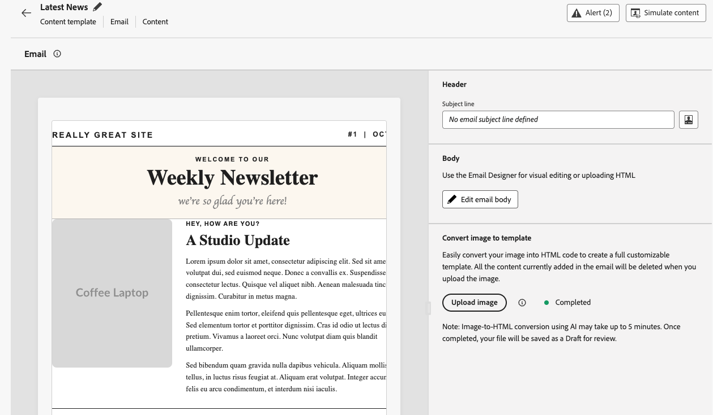
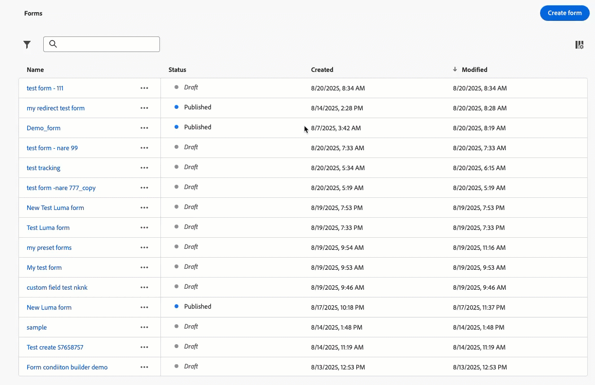
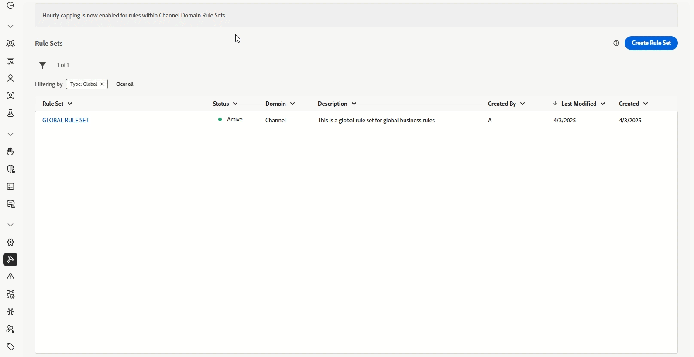

# 发行说明 {#release-notes}

>[!CONTEXTUALHELP]
>id="ajo_homepage_card1"
>title="新增功能"
>abstract="**Adobe Journey Optimizer** 不断地提供新功能、对现有功能的增强和错误修复。会在每月的最后一周将所有更改整合到发行说明中。"

[!DNL Adobe Journey Optimizer] 遵循持续交付模型，允许 Adobe 持续交付新功能、增强功能和修复。此方法支持以可扩展的方式分阶段推出各种功能，以确保所有环境的性能和稳定性。

由于此模型，在每月发行版本之间会更新发行说明。专用[最新更新](#latest-updates)部分重点介绍部署到生产环境的新功能和改进，因此您始终可以实时获知所有更改。 有关发行周期和可用性阶段的完整详细信息，请参阅[Journey Optimizer发行周期](releases.md)。

[!DNL Adobe Journey Optimizer] 原生构建于 [!DNL Adobe Experience Platform] 之上并继承了其所具备的最新创新技术和改进。在 [Adobe Experience Platform 发行说明](https://experienceleague.adobe.com/docs/experience-platform/release-notes/latest.html?lang=zh-Hans){target="_blank"}中进一步了解这些更改。

## 最近更新 {#latest-updates}

下面列出了过去几周发布的新功能和改进及其发布日期。 它们将在月底与下一个发行说明内容一起分组。 另请参阅以下[的最新](#latest-rn)发行说明。

### 新功能 {#features}

<table>
<thead>
<tr>
<th><strong>新历程警报</strong> </th>
</tr>
</thead>
<tbody>
<tr>
<td>

现在提供了三个新的历程警报，帮助您监控和跟踪历程生命周期事件和自定义操作性能：

<ul>
<li><strong>已发布历程</strong>：在历程画布中由从业人员发布历程时接收通知。</li>
<li><strong>历程已完成</strong>：当历程完成时，使用基于历程类型（读取受众或事件触发）的特定定义获取警报。</li>
<li><strong>已触发自定义操作上限</strong>：在自定义操作端点上激活上限时收到通知。</li>
</ul>

这些警报可以在组织级别订阅，或者针对特定历程进行订阅。

有关更多信息，请参阅<a href="../reports/alerts.md#journey-alerts">详细文档</a>。

发布日期： 2025年11月5日

</td>
</tr>
</tbody>
</table>

<table>
<thead>
<tr>
<th><strong>电子邮件设计器中的主题</strong> </th>
</tr>
</thead>
<tbody>
<tr>
<td>

您现在可以快速应用预批准的主题，以确保在所有电子邮件中实现品牌一致性、加快营销活动创建流程，并独立生成高质量电子邮件，同时减少对设计团队的依赖。

此功能之前以 Beta 发布，现在可供一部分组织使用（有限发布）。要获得访问权限，请与 Adobe 代表联系。

有关更多信息，请参阅<a href="../email/apply-email-themes.md">详细文档</a>。

发布日期： 2025年11月5日

</td>
</tr>
</tbody>
</table>

## 2025 年 10 月发行说明 {#oct-25-10-rn}

### 新功能 {#oct-25-10-features}

<table>
<thead>
<tr>
<th><strong>图像到HTML转换器</strong> </th>
</tr>
</thead>
<tbody>
<tr>
<td>

图像到HTML转换器是AI支持的功能，它将静态图像设计转换为完全可自定义的模块化HTML电子邮件内容模板。 此无代码工具使营销人员能够将可视化设计转换为响应式、可编辑的电子邮件模板，而无需专业技术 — 非常适合平台迁移、快速模板创建和构建可重用模板库。

此功能为限量发布版。请联系 Adobe 代表以获取访问权限。

有关更多信息，请参阅<a href="../email/image-to-html.md">详细文档</a>。

发布日期：2025 年 10 月 30 日

</td>
</tr>
</tbody>
</table>

<table>
<thead>
<tr>
<th><strong>自定义操作监控和报告</strong> </th>
</tr>
</thead>
<tbody>
<tr>
<td>

此功能可更好地显示自定义操作端点的运行状况和性能。 历程步骤事件数据集中的新自定义操作监视仪表板和相应字段将帮助您监视自定义操作端点的成功调用、错误、吞吐量、响应时间和队列等待时间。 您现在可以快速了解自定义操作中何时何处发生异常以及发生异常的原因。

此功能目前面向有限客户提供。

有关更多信息，请参阅<a href="../action/reporting.md">详细文档</a>。

发布日期： 2025年10月28日

</td>
</tr>
</tbody>
</table>

<table>
<thead>
<tr>
<th><strong>登陆页面自定义表单</strong> </th>
</tr>
</thead>
<tbody>
<tr>
<td>

使用 [!DNL Journey Optimizer]，您现在可以通过登陆页面捕获轮廓属性。

根据特定的数据集，创建、设计和管理适合您需求的自定义表单。然后，您可以在登陆页面中利用这些表单，将您选择的轮廓属性添加到为每个表单定义的数据集中。

此功能目前面向美国和澳大利亚的客户有限提供。 请联系 Adobe 代表以获取访问权限。

有关更多信息，请参阅<a href="../landing-pages/lp-forms.md">详细文档</a>。

发布日期： 2025年10月23日

</td>
</tr>
</tbody>
</table>

<table>
<thead>
<tr>
<th><strong>免打扰时间 / 基于时间进行排除</strong> </th>
</tr>
</thead>
<tbody>
<tr>
<td>

利用免打扰时间，您可以针对电子邮件、短信、推送和 WhatsApp 渠道定义基于时间的排除项。这可确保在特定时间段内不发送任何消息，从而帮助您尊重客户偏好并满足合规性要求。

您可以通过规则集应用免打扰时间并分配给营销活动或历程中的单个操作，以实现精确控制。

目前，免打扰时间规则仅面向一部分组织提供（有限发布）。要被添加到轮候库，请联系 Adobe 代表。

有关更多信息，请参阅<a href="../conflict-prioritization/quiet-hours.md">详细文档</a>。

发布日期：2025 年 10 月 22 日

</td>
</tr>
</tbody>
</table>

<!--table>
<thead>
<tr>
<th><strong>RCS Basic Messaging</strong> </th>
</tr>
</thead>
<tbody>
<tr>
<td>

With the new RCS Basic add-on offering, you can now deliver basic Rich Communication Services (RCS) messaging in Journey Optimizer, enabling the following enhanced messaging capabilities subject to provider and geographical support:

<ul>
<li><strong>Branded and verified sender support:</strong> Send messages using verified business profiles with branding elements (logo, sender name, etc.).</li>
<li><strong>Message delivery insights:</strong> Receive detailed delivery reports including message status updates (e.g., sent, delivered, read).</li>
<li><strong>Link tracking:</strong> Embed and track URLs within RCS messages for engagement analytics.</li>
<li><strong>Fallback to SMS:</strong> Automatic fallback to SMS when the recipient's device does not support RCS or is temporarily unreachable via RCS.</li>
<li><strong>Basic message composition:</strong> Send basic text-based RCS messages.</li>
</ul>
<!--img src="assets/do-not-localize/FILE.gif"-->
<!-- p>For more information, refer to the <a href="../FILE.md">detailed documentation</a>.

<!--/td>
</tr>
</tbody>
</table-->

<!--table>
<thead>
<tr>
<th><strong>Direct mail channel in Orchestrated campaigns</strong> </th>
</tr>
</thead>
<tbody>
<tr>
<td>

Direct mail channel is now available in orchestrated campaigns. The Direct mail activity facilitates direct mail sending within your Orchestrated campaign, for both one-time and recurring messages. It serves to automate the process of generating the extraction file required by direct mail providers. You can combine channel activities into the Orchestrated campaign canvas to create cross-channel campaigns that can trigger actions based on customer behavior and data.

<!--img src="assets/do-not-localize/FILE.gif"-->
<!-- p>For more information, refer to the <a href="../FILE.md">detailed documentation</a>.

<!--/td>
</tr>
</tbody>
</table-->

<!--table>
<thead>
<tr>
<th><strong>Direct Mail channel in journeys</strong> </th>
</tr>
</thead>
<tbody>
<tr>
<td>

Previously limited to Campaigns, Direct Mail channel is now available on the journey canvas, enabling you to incorporate Direct Mail into your journeys. Direct Mail can now be used in both batch and 1:1 journey scenarios, with support for file extraction configuration and time-based frequency settings.

 Previously released in Limited Availability, this capability is now available to all environments (General Availability).

<!--img src="assets/do-not-localize/FILE.gif"-->
<!-- p>For more information, refer to the <a href="../FILE.md">detailed documentation</a>.

<!--/td>
</tr>
</tbody>
</table-->

<!--table>
<thead>
<tr>
<th><strong>New API to retrieve Action Campaigns</strong> </th>
</tr>
</thead>
<tbody>
<tr>
<td>

A new Journey Optimizer API is now available, enabling you to programmatically retrieve and inspect campaign-related data such as details, versions, and configurations.

For more information, refer to the <a href="https://developer.adobe.com/journey-optimizer-apis/references/campaigns-retrieve/">detailed documentation</a>.

Availability date: October 22, 2025

</td>
</tr>
</tbody>
</table-->

<!--<table>
<thead>
<tr>
<th><strong>New source connectors for loyalty apps</strong> </th>
</tr>
</thead>
<tbody>
<tr>
<td>

New source connectors are now available in Adobe Experience Platform for the Talon.One, Capillary and Kobie loyalty Apps. These connectors let you seamlessly stream loyalty data into Adobe Experience Platform and leverage these data in Journey Optimizer.

For more information, refer to the <a href="../start/get-started-sources.md">detailed documentation</a>.

Availability date: October 22, 2025

</td>
</tr>
</tbody>
</table>-->

<!--table>
<thead>
<tr>
<th><strong>Decisioning support in email channel</strong> </th>
</tr>
</thead>
<tbody>
<tr>
<td>

You can now add Decision policies into email journeys and campaigns. Decision policies are containers for your offers that leverage the Decisioning engine to dynamically return the best content to deliver for each audience member.

Previously released in Limited Availability, this capability is now available to all environments (General Availability).

For more information, refer to the <a href="../FILE.md">detailed documentation</a>.

Availability date: October 22, 2025

</td>
</tr>
</tbody>
</table-->

<table>
<thead>
<tr>
<th><strong>适用于 API 触发电子邮件营销活动的高吞吐量消息传送</strong> </th>
</tr>
</thead>
<tbody>
<tr>
<td>

API 触发营销活动现在提供新的高吞吐量事务型消息传送模式。此模式专为大规模实时事务型消息传递而设计，支持每秒最多 5,000 个事务并具有较高的可用性。此模式还支持事务性消息，无需引用或创建客户轮廓，例如，访客签出、订单确认、密码重置、安全通知和其他服务/操作通知。

此功能仅适用于电子邮件渠道，以及已购买 Adobe 高吞吐量事务型消息传送附加组件的组织。请联系 Adobe 客户代表以获取更多详情。

有关更多信息，请参阅<a href="../campaigns/api-triggered-high-throughput.md">详细文档</a>。

发布日期：2025 年 10 月 22 日

</td>
</tr>
</tbody>
</table>

<table>
<thead>
<tr>
<th><strong>可重复使用的目标选择规则</strong> </th>
</tr>
</thead>
<tbody>
<tr>
<td>

为了节省您所花的时间和精力，Journey Optimizer 现在可以让您从专用 UI 菜单创建可重用的规则并在构建目标选择时利用这些规则，无论是在营销活动的内容优化还是在优化历程活动中。

目标选择规则当前处于有限发布状态。请联系 Adobe 代表以获取访问权限。请注意，此功能仅适用于已购买决策附加组件的组织。将逐步向所有客户推广此功能。

有关更多信息，请参阅<a href="../experience-decisioning/rules.md">详细文档</a>。

发布日期：2025 年 10 月 22 日

</td>
</tr>
</tbody>
</table>

<table>
<thead>
<tr>
<th><strong>新历程警报</strong> </th>
</tr>
</thead>
<tbody>
<tr>
<td>

可使用新的预配置警报监测历程执行：

<ul><li><a href="../reports/alerts.md#alert-discard-rate">轮廓丢弃率超限</a>：过去 5 分钟内，丢弃的轮廓与进入历程的轮廓的比率超过阈值。</li>
<li><a href="../reports/alerts.md#alert-custom-action-error-rate">自定义操作错误率超限</a>：过去 5 分钟内，自定义操作错误与成功 HTTP 调用的比率超过阈值。</li>
<li><a href="../reports/alerts.md#alert-profile-error-rate">轮廓错误率超限</a>：过去 5 分钟内，出错轮廓与进入历程的轮廓的比率超过阈值。</li></ul> 
您可以修改阈值并订阅单个历程级别警报和全局警报。

有关更多信息，请参阅<a href="../reports/alerts.md">详细文档</a>。

发布日期：2025 年 10 月 14 日

</td>
</tr>
</tbody>
</table>

<table>
<thead>
<tr>
<th><strong>执行元数据帮助程序</strong> </th>
</tr>
</thead>
<tbody>
<tr>
<td>

在个性化编辑器中提供了新的“executionMetadata”辅助函数。利用该功能，可将上下文信息附加到任何本机操作，并将其捕获到数据集中以导出到外部系统。

此功能为限量发布版。请联系 Adobe 代表以获取访问权限。

有关更多信息，请参阅<a href="../personalization/functions/helpers.md#execution-metadata">详细文档</a>。

发布日期：2025 年 10 月 13 日

</td>
</tr>
</tbody>
</table>

<table>
<thead>
<tr>
<th><strong>使用 Experimentation 代理的 Experimentation Accelerator</strong> </th>
</tr>
</thead>
<tbody>
<tr>
<td>

Journey Optimizer Experimentation Accelerator 现在包括 Experimentation 代理，它是一个 AI 驱动的对话工具，可让您与试验、见解和机会进行交互。这可增强 Journey Optimizer Experimentation Accelerator 体验，帮助您更高效地运行试验，了解有效的工作方式并探索下一步的优化方向。

有关更多信息，请参阅<a href="https://experienceleague.adobe.com/docs/experience-cloud-ai/experience-cloud-ai/agents/agent-experiment.html?lang=zh-hans" target="_blank">详细文档</a>。

发布日期：2025 年 10 月 10 日

</td>
</tr>
</tbody>
</table>

<table>
<thead>
<tr>
<th><strong>电子邮件的 PDF 附件</strong> </th>
</tr>
</thead>
<tbody>
<tr>
<td>

您现在可以将静态 PDF 文件附加到使用 Journey Optimizer 发送的电子邮件中。

<ul>
<li>对于每个轮廓，每年最多可以发送 6 条包含 PDF 附件的消息。</li>
<li>每个附件的最大文件大小为 5 MB。</li>
<li>如需额外大小或容量，您可以购买 PDF 附件功能的附加组件。有关更多信息，请与 Adobe 代表联系。</li>
</ul>

此功能之前为限量发布版，现在可供在所有环境中使用（正式发布）。

有关更多信息，请参阅<a href="../email/pdf-attachments.md">详细文档</a>。

发布日期：2025 年 9 月 30 日

</td>
</tr>
</tbody>
</table>

<table>
<thead>
<tr>
<th><strong>用于检索历程的公共 API</strong> </th>
</tr>
</thead>
<tbody>
<tr>
<td>

新 Journey Optimizer API 现在可用于检索历程及其关联的对象，例如营销活动和表面。

有关更多信息，请参阅<a href="https://developer.adobe.com/journey-optimizer-apis/references/journeys-retrieve/">详细文档</a>

发布日期：2025 年 9 月 25 日

</td>
</tr>
</tbody>
</table>

### 改进 {#updates-improvements}

**WhatsApp 渠道的执行字段**

除了电子邮件和短信之外，您还可以在沙盒级别更新 WhatsApp 投放的默认执行字段。也可以通过更改 WhatsApp 历程活动高级参数或 WhatsApp 渠道配置来覆盖全局设置的执行字段。[了解详情](../configuration/primary-email-addresses.md)

发布日期：2025 年 10 月 22 日

**自定义属性支持 Mailto（取消订阅）地址**

借助 Journey Optimizer，若您在 Adobe 平台外管理同意，可通过在电子邮件设定中定义一键取消订阅链接和自定义取消订阅电子邮件来设置外部自定义端点。当您的收件人点击取消订阅链接时，Journey Optimizer 会将一些默认的特定于轮廓的参数附加到同意更新事件。

为进一步对自定义端点进行个性化设置，您现在可以定义还将会附加到同意事件的自定义属性。[了解详情](../email/list-unsubscribe.md#custom-attributes)

>[!AVAILABILITY]
>
>此功能自 2025 年 8 月起已可用于自定义&#x200B;**[!UICONTROL 一键取消订阅 URL]**，现在，在有限发布版中可用于 **[!UICONTROL Mailto（取消订阅）]**&#x200B;选项。请联系 Adobe 代表以获取访问权限。

发布日期：2025 年 10 月 6 日

<!--
### Coming soon {#oct-25-10-soon}

In the next few days, the following capabilities and enhancements are scheduled for release. **Information is subject to change**. Updated links, screens, and documentation will be shared once these updates are live in production.

#### New capabilities {#oct-25-10-soon-features}

<table>
<thead>
<tr>
<th><strong>Themes in the Email Designer</strong> </th>
</tr>
</thead>
<tbody>
<tr>
<td>

You can now quickly apply pre-approved themes to ensure brand consistency across all emails, speed up your campaign creation process, and independently produce high-quality emails while reducing dependency on design teams.

Previously released in beta version, this capability is now available for a set of organizations (Limited Availability). To gain access, contact your Adobe representative.

For more information, refer to the <a href="../email/apply-email-themes.md">detailed documentation</a>.

Availability date: November 4, 2025

</td>
</tr>
</tbody>
</table>

#### Improvements {#oct-25-10-soon-improvements}

**Decisioning in emails through AI models**

You can now use AI models to optimize the best content in your email through the use of Decisioning. For example, this capability allows you to offer the best content based on custom events such as Purchases, Button Clicks, Add to Cart, etc.
-->

<!--
<table>
<thead>
<tr>
<th><strong>New Web Push notifications channel</strong> </th>
</tr>
</thead>
<tbody>
<tr>
<td>

Adobe Journey Optimizer now supports Web Push notifications, expanding the push channel beyond mobile. You can seamlessly deliver notifications to both mobile and desktop browsers, enabling you to reach customers directly on their devices without requiring an app.

This enhancement allows you to engage users with timely, personalized messages in real time, leveraging the same authoring workflows and targeting capabilities already available for mobile push.

For more information, refer to the <a href="../FILE.md">detailed documentation</a>

Availability date: Sept XX, 2025

</td>
</tr>
</tbody>
</table>

<table>
<thead>
<tr>
<th><strong>Custom action monitoring and reporting</strong> </th>
</tr>
</thead>
<tbody>
<tr>
<td>

Custom action monitoring and reporting is now available. This capability provides better visibility into journey health and execution, including lifecycle status and performance alerts. You can now quickly understand when, where, and why an anomalous situation is occurring in a custom action.

For more information, refer to the <a href="../FILE.md">detailed documentation</a>

Availability date: Sept XX, 2025

</td>
</td>
</tr>
</tbody>
</table>

<table>
<thead>
<tr>
<th><strong>New source connectors for loyalty apps</strong> </th>
</tr>
</thead>
<tbody>
<tr>
<td>

New source connectors are now available in Adobe Experience Platform for the Talon.One, Capillary, and Kobie loyalty apps. These connectors let you seamlessly stream loyalty data into Adobe Experience Platform and leverage these data in Journey Optimizer.

</td>
</tr>
</tbody>
</table>

-->
