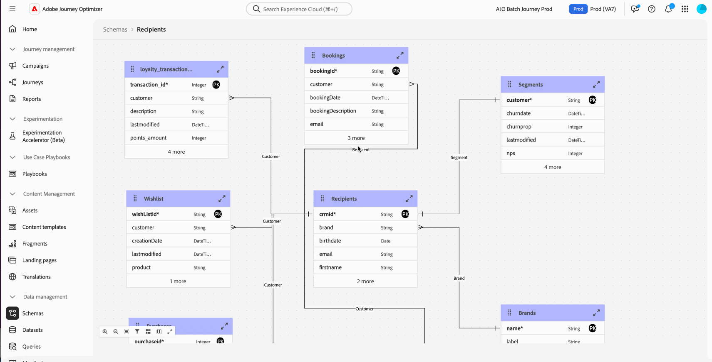

# 发行说明 {#release-notes}

>[!CONTEXTUALHELP]
>id="ajo_homepage_card1"
>title="新增功能"
>abstract="**Adobe Journey Optimizer** 不断地提供新功能、对现有功能的增强和错误修复。会在每月的最后一周将所有更改整合到发行说明中。"

[!DNL Adobe Journey Optimizer] 不断地提供新功能、对现有功能进行增强和修复错误。会在每月的最后一周将所有更改整合到发行说明中。[!DNL Adobe Journey Optimizer] 原生构建于 [!DNL Adobe Experience Platform] 之上并继承了其所具备的最新创新技术和改进。在 [Adobe Experience Platform 发行说明](https://experienceleague.adobe.com/docs/experience-platform/release-notes/latest.html?lang=zh-Hans){target="_blank"}中进一步了解这些更改。

## 2025年9月更新 {#sep-updates}

<table>
<thead>
<tr>
<th><strong>将Adobe Experience Platform数据用于个性化和决策 — 有限可用</strong> </th>
</tr>
</thead>
<tbody>
<tr>
<td>

以前在公共测试版中发布，此功能现在以有限可用性提供给所有环境。 在此版本中，引入了以下增强功能：

<ul><li>支持在入站渠道中进行数据集查找个性化。</li>
<li>“datasetLookup”帮助程序函数现在可用于表达式片段中。</li>
<li>现在，利用数据集管理界面中的一个选项，可启用基于记录的数据集以进行查找个性化，而无需执行API调用。</li>
<li>增强的监控功能，可跟踪数据摄取状态并了解数据集何时可供查找。</li>
<li>更新了使用指南和护栏，以确保最佳性能和可靠性。</li></ul>

有关更多信息，请参阅<a href="../data/lookup-aep-data.md">详细文档</a>

</td>
</tr>
</tbody>
</table>

## 2025年8月发行说明 {#25-8-rn}

**发布日期**：2025 年 8 月 19 日

### 新功能 {#Aug-25-8-features}

此版本包含的新功能详述如下。

<table>
<thead>
<tr>
<th><strong>暂停和恢复历程</strong> </th>
</tr>
</thead>
<tbody>
<tr>
<td>

您现在可以暂停和恢复历程。通过此功能，可以在不中断客户体验的情况下临时暂停实时历程，从而为历程设计人员提供了更好的控制力和灵活性。暂停后，不会发送任何通信，并且轮廓将停留在暂停状态，直到历程恢复。

您只能暂停和恢复一个历程，或者对一组历程执行批量暂停和恢复操作。

此外，您可以向暂停的历程应用全局筛选条件，以根据轮廓的属性排除轮廓。

此功能之前为限量发布版，现在可供在所有环境中使用（正式发布）。

有关更多信息，请参阅<a href="../building-journeys/journey-pause.md">详细文档</a>

</td>
</tr>
</tbody>
</table>

<table>
<thead>
<tr>
<th><strong>日程表视图</strong> </th>
</tr>
</thead>
<tbody>
<tr>
<td>

现在，历程和营销活动列表中提供日程表视图。该视图可让您在相应列表中查看所有历程和营销活动激活情况。

此功能之前为限量发布版，现在可供在所有环境中使用。在此正式发布版本中，该功能包括：

<ul>
<li>对在日期中导航做出的设计改进；</li>
<li>如果设置了开始和结束日期，可以查看营销活动草稿；</li>
<li>对于长时间运行的日程表项，提供了用于隐藏和显示它们的新设置。</li>
</ul>

有关更多信息，请参阅<a href="../building-journeys/journey-ui.md#calendar">详细文档</a>

</td>
</tr>
</tbody>
</table>

<!--table>
<thead>
<tr>
<th><strong>Dark mode in the Email Designer</strong> </th>
</tr>
</thead>
<tbody>
<tr>
<td>

The Journey Optimizer Email Designer now offers the ability to switch to dark mode view, where you can additionally define specific custom settings that will display only for recipients reading their emails in dark mode.

Note the following:

<ul>
<li>The dark mode final rendering may vary and depends on the recipient's email client.</li>
<li>Not all email clients support custom dark mode. Moreover, some email clients only apply their own default dark mode for all emails that are received. In both cases, the custom settings that you defined in the Email Designer cannot be rendered.</li>
</ul>

This capability is currently in beta version and only available to beta customers. To join the beta program, contact your Adobe representative.

For more information, refer to the <a href="../email/dark-mode.md">detailed documentation</a>

</td>
</tr>
</tbody>
</table-->

<!--table>
<thead>
<tr>
<th><strong>Use Adobe Experience Platform data for personalization</strong> </th>
</tr>
</thead>
<tbody>
<tr>
<td>

Leverage data from [!DNL Adobe Experience Platform] in the personalization editor to personalize your content and decision attributes. In particular, this allows you to extend the definition of your attributes to additional data in datasets for bulk updates that change periodically without having to manually update the attributes one at a time.

With this release, the following enhancements have been introduced:

<ul>
<li>Support of inbound channels,</li>
<li>The "datasetLookup" helper function can now be used within expression and visual fragments to personalize content using data from Adobe Experience Platform datasets,</li>
<li>An option in the dataset now allows you to enable datasets for lookup personalization, without having to perform an API call.</li>
</ul>

This capability is available in Limited Availability. Contact your Adobe representative to gain access.

For more information, refer to the <a href="../personalization/aep-data-perso.md">detailed documentation</a>

</td>
</tr>
</tbody>
</table-->

<!--table>
<thead>
<tr>
<th><strong>Use Decisioning in email channel</strong> </th>
</tr>
</thead>
<tbody>
<tr>
<td>

You can now add Decision policies into email journeys and campaigns. Decision policies are containers for your offers that leverage the Decisioning engine to dynamically return the best content to deliver for each audience member.

Previously released in Limited Availability, this capability is now available to all environments (General Availability).

<For more information, refer to the <a href="../FILE.md">detailed documentation</a>

</td>
</tr>
</tbody>
</table-->

<!--table>
<thead>
<tr>
<th><strong>Journey path optimization</strong> </th>
</tr>
</thead>
<tbody>
<tr>
<td>

Use the new Optimize node to target specific audiences or run A/B tests to determine the best path to meet your business-centric KPIs.

This tool allows you to test and vary, and customize communications, sequencing, and timing to best reach your customers.

This capability is available in Limited Availability. Contact your Adobe representative to gain access.

For more information, refer to the <a href="../building-journeys/optimize.md">detailed documentation</a>

</td>
</tr>
</tbody>
</table>-->

<table>
<thead>
<tr>
<th><strong>历程中的操作活动</strong> </th>
</tr>
</thead>
<tbody>
<tr>
<td>

Journey Optimizer 支持新的通用操作活动，让您能够配置单一操作和多操作入站操作组，从而简化历程画布中的操作配置。特别需要指出，通过这项新功能可以：

<ul>
<li>简化历程画布中的原生操作配置。</li>
<li>创建多操作集客操作组的能力。</li>
<li>将优化设置添加到任何内置渠道操作。</li>
<li>向任何操作添加试验选项和多语言选项。</li>
</ul>

此功能为限量发布版。请联系 Adobe 代表以获取访问权限。

有关更多信息，请参阅<a href="../building-journeys/journey-action.md">详细文档</a>

</td>
</tr>
</tbody>
</table>

<table>
<thead>
<tr>
<th><strong>电子邮件的 PDF 附件</strong> </th>
</tr>
</thead>
<tbody>
<tr>
<td>

您现在可以将静态 PDF 文件附加到使用 Journey Optimizer 发送的电子邮件中。

<ul>
<li>对于每个轮廓，每年最多可以发送 6 条包含 PDF 附件的消息。</li>
<li>每个附件的最大文件大小为 5 MB。</li>
<li>如需任何其他大小或容量，您可以购买附件包附加组件。有关更多信息，请与 Adobe 代表联系。</li>
</ul>

此功能为限量发布版。请联系 Adobe 代表以获取访问权限。

有关更多信息，请参阅<a href="../email/pdf-attachments.md">详细文档</a>

</td>
</tr>
</tbody>
</table>

<!--
<table>
<thead>
<tr>
<th><strong>Landing page custom forms</strong> </th>
</tr>
</thead>
<tbody>
<tr>
<td>

With [!DNL Journey Optimizer], you can now capture profile attributes though your landing pages.

Create, design and manage custom forms tailored to your needs based on a specific dataset. You can then leverage these forms in landing pages to add the profile attributes of your choice into the dataset defined for each form.

This capability is currently in beta version and only available to beta customers. To join the beta program, contact your Adobe representative.

For more information, refer to the <a href="../FILE.md">detailed documentation</a>

</td>
</tr>
</tbody>
</table>
-->

<table>
<thead>
<tr>
<th><strong>营销活动优化</strong> </th>
</tr>
</thead>
<tbody>
<tr>
<td>

Journey Optimizer现在为您提供多种工具，可为您的受众提供个性化和优化的内容，让您能够运行内容实验、创建基于规则的定位以及使用两者的高级组合，从而最大限度地提高营销活动和历程的有效性。

通过优化，您可以：

<ul>
<li>测试多个内容变体，确定最有效的消息内容。</li>
<li>根据用户属性和上下文数据提供个性化内容。</li>
<li>将定位与试验结合用于高级策略。</li>
<li>筛选出不符合变体条件的用户。</li>
<li>确保后备机制到位，保持用户参与。</li>
</ul>

历程或营销活动上线后，将根据定义的标准并根据匹配标准评估用户档案，并提供相应的体验或内容。

以前仅于8月8日在营销活动中发布，但现在从8月22日起的历程中也提供此功能。

有关更多信息，请参阅<a href="../campaigns/campaigns-message-optimization.md">详细文档</a>

</td>
</tr>
</tbody>
</table>

### 改进 {#Aug-25-8-improv}

此版本包含的改进如下所述。

* **管理**

   * **渠道配置监视警报** — 您现在可以通过电子邮件或在Journey Optimizer通知中心订阅以接收系统警报，以防缺少<!--a channel configuration failure happens or if -->DNS记录。 [了解详情](../reports/alerts.md#alert-dns-record-missing)

* **AI 助手**

   * **以多种语言生成内容** — 现在可以生成法语、西班牙语、德语、意大利语、日语、瑞典语、荷兰语和挪威语的内容。 [了解详情](../content-management/generative-uc.md#languages)

     发布日期： 8月25日

* **营销活动**

   * **出站营销活动中的速率控制** — 您现在可以为出站营销活动（电子邮件、短信、推送通知）启用速率控制，从而防止下游系统（如登陆页面或客户关怀平台）过载。 [了解详情](../campaigns/campaign-schedule.md#rate-control)

   * **操作营销活动计划** - 营销活动每日、每周和每月计划程序已更新，以便对定期计划进行更细致的控制：

      * **每周重复**：您现在可以选择每周或每两周重复一次营销活动，并选择在一周中运行该营销活动的日期。

      * **每月重复**：您现在可以选择每月或每两个月重复一次此营销活动，并选择在一个月中运行该营销活动的日期。

      * **每日、每周或每月计划**：您可以指定是否在特定日期停止执行定期计划，还是在达到特定次数后停止执行计划。

   * **计划的事务性操作营销活动** - 计划的事务性操作营销活动现支持通过电子邮件、短信和推送渠道批量发送基于受众的事务性通信。

* **渠道 — 内容卡片**

   * **内容卡布局模板** — 内容卡渠道现在提供OOTB消息布局，以简化您的创作体验。 此版本包括小图像、大图像和仅用于图像的布局模板。 [了解详情](../content-card/design-content-card.md)

* **渠道 - 推送**

   * **推送通知过期日期** - 您现在可以为每条推送通知指定过期日期，避免时效性信息（如黑色星期五促销）在特定日期过后继续发送，从而避免给客户带来糟糕的体验。

* **渠道 - 短信**

   * **模糊退出** - 启用后，**模糊退出**&#x200B;选项可检测与定义的退出关键词（如“CANCIL”）非常相似的入站消息，并自动发送确认回复以验证用户取消订阅的意向。如果用户通过定义的提示进行确认，则取消订阅它们。 [了解详情](../sms/sms-configuration-sinch.md)

     >[!NOTE]
     >
     >**Fuzzy Opt-out**&#x200B;仅适用于Sinch和Infobip。

   * **验证SMS连接** — 现在，您可以通过向指定设备发送示例消息，在Adobe Journey Optimizer中轻松测试和验证SMS API凭据。 [了解详情](../sms/sms-configuration-sinch.md)

* **配置**

  &lt;!—* **动态域支持** - Journey Optimizer现在支持Adobe接受的预定义域的完整/基本URL个性化。 此功能在“有限可用性”中面向一组客户提供。 [了解更多](../personalization/personalization-build-expressions.md#where) - 8月21日更新：正在等待英文。 以确认何时部署到生产环境。—>

   * **自定义属性支持一键取消订阅 URL** - 借助 Journey Optimizer，若您在 Adobe 平台外管理同意，可通过在电子邮件设定中定义一键取消订阅链接来设置外部自定义端点。当您的收件人点击取消订阅链接时，Journey Optimizer 会将一些默认的特定于轮廓的参数附加到同意更新事件。

     为进一步个性化一键式取消订阅链接，您现在可以定义还将附加到同意事件的自定义属性。 [了解详情](../email/list-unsubscribe.md#custom-attributes)

* **数据集**

   * **Experience Decisioning对象存储库 — 个性化优惠项目** — 内置导出数据集现在捕获所有优惠属性和生命周期状态，实现完整的个性化和报告。 [了解详情](../data/export-datasets.md)

   * 引入了通过`etag`字段进行版本检查，以提高一致性并跟踪更改，从而更可靠地提供项目。

* **决策**

   * **将片段附加到决策项** - Journey Optimizer现在提供将片段附加到决策项的功能，可在基于代码的体验营销活动中通过决策策略利用这些决策项。 此功能在“有限可用性”中面向一组客户提供。 [了解详情](../experience-decisioning/create-decision.md#fragments)

* **历程**

   * **历程批量操作** - 您现在可以从历程列表中选择多个项目。选择后，您可一次性暂停或恢复最多 10 个历程。

   * **自定义操作中的重定向 (302) 支持** - 自定义操作现在可以基于每个请求处理 HTTP 302 重定向。这允许历程与 API 集成，将请求重定向到本地化的或特定于区域的 URL。系统会自动执行重定向，以确保提供正确的内容而无需额外配置。

   * **历程中的多个入站操作** — 为简化历程编排，您现在可以在单个历程中定义多个入站操作。 此功能以前在营销活动中可用，可让您同时将多个基于代码的体验、应用程序内消息、内容卡或Web操作交付到不同的位置，每个操作都包含特定内容。 [了解详情](../building-journeys/journey-action.md#multi-action)

## 营销活动编排

**发布日期**：2025 年 8 月 4 日

Journey Optimizer 现在包括&#x200B;**营销活动编排**，这是一项专门为品牌发起的批量营销活动而设计的新功能。此版本引入了营销活动编排画布和增强的数据建模。同时利用这两项功能，营销人员可以规划、定向和提供个性化的跨渠道营销活动。

>[!IMPORTANT]
>
>要访问营销活动编排，您的许可证必须包括 **Journey Optimizer – 营销活动和历程**&#x200B;或 **Journey Optimizer – 营销活动**&#x200B;包。请联系 Adobe 代表，确认您的许可证并在需要时进行更新。

它包括[关系架构和数据集](#oc-relational)与[营销活动画布](#oc-canvas)。这两项创新共同为 Journey Optimizer 中的批量营销活动编排建立了新标准。下面列出了关键功能。

### 关键功能 {#oc-capabilities}

* **多步骤工作流**

  使用专门构建的全新营销活动编排画布，推动复杂的多渠道批量营销活动。

* **按需受众**

  按需细分受众以便立即激活。

* **多实体分段**

  使用业务上下文（非人员维度，例如产品、店铺、续订、预订等）构建受众。

* **预发送可见性**

  在营销活动启动前和运行时，审查、改善和优化受众及营销活动

### 营销活动画布 {#oc-canvas}

专为批量营销活动构建的全新可视化编排界面。此画布支持：

* 针对多步骤、多渠道营销活动流进行可视化规划

* 支持通过关系查询构建的按需受众

* 高级受众拆分、等待和条件逻辑

* 应用业务规则和筛选条件后获得精确的预发送计数

### 关系架构和数据集 {#oc-relational}

Adobe Journey Optimizer 现在支持链接到基于人员的轮廓的关系实体（例如，产品、店铺、预订、合同）。这允许跨多维数据结构进行分段和个性化，支持如下用例：

* 每项预订、订阅或合同对应一条消息

* 基于相关实体属性（例如，产品类别或店铺位置）进行分段

* 增强可寻址性（例如，发送到与实体绑定的所有已知联系人）

### 为什么这很重要

此版本使营销人员能够完全控制品牌发起的、基于受众的批量营销，并将灵活的数据建模与专门构建的编排体验相结合。它专为实时历程中的批量营销活动编排而设计，同时提供高级个性化和可扩展性。

### 了解详情

请参阅[营销活动编排文档](../orchestrated/gs-orchestrated-campaigns.md)以了解详情。

