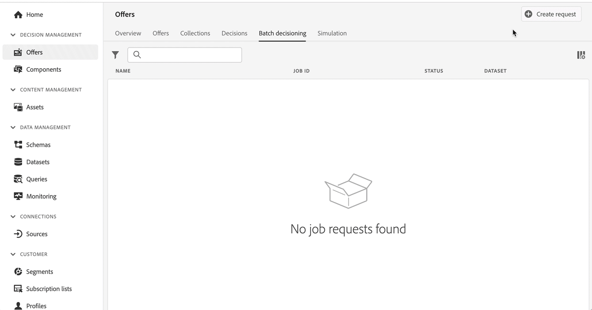

# 发行说明 {#release-notes}

此页面列出了 [!DNL Journey Optimizer] 的所有新增功能和改进。您还可以查阅[最新文档更新](documentation-updates.md)页面以了解更多更改。

[!DNL Adobe Journey Optimizer] 原生构建于 [!DNL Adobe Experience Platform] 之上并继承了其所具备的最新创新技术和改进。在 [Adobe Experience Platform 发行说明](https://experienceleague.adobe.com/docs/experience-platform/release-notes/latest.html?lang=zh-Hans){target=&quot;_blank&quot;} 中，进一步了解这些变更。

 立即注册 [Adobe Journey Optimizer 季度新闻稿](https://www.adobe.com/subscription/Adobe_Journey_Optimizer_NL.html){target=&quot;_blank&quot;}邮件，每个季度就能在收件箱中直接接收最新产品更新、精彩故事、用例、提示及更多内容。

## 2022 年 7 月版 {#july-2022-release}

### 新功能

<table>
<thead>
<tr>
<th><strong>新增内联消息传送流程</strong> </th>
</tr>
</thead>
<tbody>
<tr>
<td>

Journey Optimizer 为历程中的消息创作提供了一个新流程。在 Journey Optimizer 中，内联消息传送可简化创建和发送电子邮件、推送通知或短信的工作流程，为用户节省大量时间。通过将消息作为单独的步骤删除，而改为在历程画布上的操作中使其可内联编辑，用户只需单击较少的按钮并导航较少的屏幕即可设计和编辑内容。

有关更多信息，请参阅<a href="../messages/get-started-content.md">详细文档</a>。

</td>
</tr>
</tbody>
</table>

<table>
<thead>
<tr>
<th><strong>基于属性的访问控制（限量发布）</strong> </th>
</tr>
</thead>
<tbody>
<tr>
<td>

现可使用标签来识别架构字段，这些标签可定义组织或数据使用范围。管理员可使用权限界面定义涵盖 XDM 架构字段的访问策略，更好地管理授予用户或用户组（内部、外部或第三方用户）的访问权限，以及管理特定类型数据（即敏感个人数据/SPD）的访问权限。

目前，基于属性的访问控制的使用仅限于选定的用户，但将在未来版本中部署到所有环境。

有关更多信息，请参阅<a href="../administration/attribute-based-access.md">详细文档</a>。

</td>
</tr>
</tbody>
</table>

<table>
<thead>
<tr>
<th><strong>批量决策作业</strong> </th>
</tr>
</thead>
<tbody>
<tr>
<td>

现可从用户界面运行批量决策作业，这样就不需要开发人员来运行批处理 API 作业，还可以缩短营销所需的时间。使用新界面可创建作业并管理当前/过去的作业。

有关更多信息，请参阅<a href="../offers/batch-delivery.md">详细文档。

</td>
</tr>
</tbody>
</table>

<table>
<thead>
<tr>
<th><strong>在决策中自动使用表现最好的优惠（限量发布）</strong> </th>
</tr>
</thead>
<tbody>
<tr>
<td>

现可在决策管理中使用个性化优化模型系统。利用这种新型模型可根据区段和优惠表现对优惠进行优化和个性化设置。

目前，个性化优化 AI 模型的使用仅限于选定的用户，但将在未来的版本中部署到所有环境。

有关更多信息，请参阅<a href="../offers/ranking/personalized-optimization-model.md">详细文档</a>。

</td>
</tr>
</tbody>
</table>

### 改进

**历程**

* **结束旅程**  — 在历程画布中， **结束** 活动已从面板中删除。 现在，结束标记默认会添加到每个路径的末尾，且无法删除。 这项改进可更好地报告客户从历程中退出的位置，而无需历程从业者执行任何操作。 请参阅 [文档](../building-journeys/journey-end.md) 和 [功能视频](https://video.tv.adobe.com/v/345376){target=&quot;_blank&quot;}。

**消息**

* 消息预设现已改为&#x200B;**渠道平面**。[了解详情](../configuration/channel-surfaces.md)

**管理**

* **PTR 记录版本** - 现在，更新 PTR 记录时，处理时间最多只需 3 小时。[了解详情](../configuration/ptr-records.md#processing)

* **允许列表 UI** - 现可使用 Journey Optimizer 用户界面向允许列表添加新的电子邮件地址或域。[了解详情](../configuration/allow-list.md)

* **允许列表逻辑更新** - 现在，允许列表这一功能会在启用后立即应用允许列表逻辑，即使该列表为空也是如此。[了解详情](../configuration/allow-list.md#logic)

* **URL跟踪参数**  — 您现在可以使用表达式编辑器在电子邮件界面中配置URL跟踪参数（即预设）。 [了解详情](../configuration/email-settings.md#url-tracking)

**优惠决策**

* **受众规模** - 现在，在创建决策规则、选择区段或规则以设置优惠资格，或将区段或规则添加到决策范围时，用户界面中会显示新的受众规模估算组件。