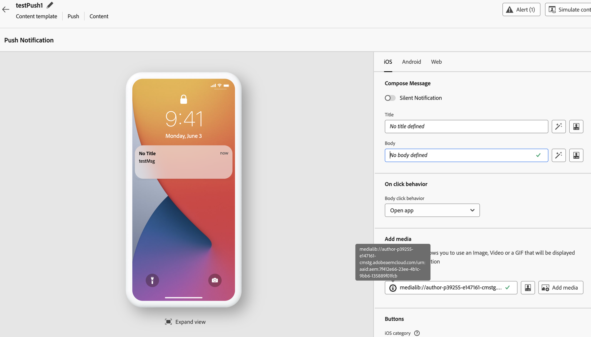

# 发行说明 {#release-notes}

>[!CONTEXTUALHELP]
>id="ajo_homepage_card1"
>title="新增功能"
>abstract="**Adobe Journey Optimizer** 不断地提供新功能、增强现有功能，并修复错误。 所有更改会在每月的最后一周整合到发行说明中。"

[!DNL Adobe Journey Optimizer] 遵循持续交付模式，使 Adobe 能够持续不断地提供新功能、增强功能和修复。 此方法支持以可扩展的方式分阶段推出各种功能，以确保所有环境的性能和稳定性。 由于此模型，在每月发行版本之间会更新发行说明。 有关发行周期和可用性阶段的完整详细信息，请参阅 [Journey Optimizer 发行周期](releases.md)。

[!DNL Adobe Journey Optimizer] 原生构建于 [!DNL Adobe Experience Platform] 之上并继承了其所具备的最新创新技术和改进。 在 [Adobe Experience Platform 发行说明](https://experienceleague.adobe.com/docs/experience-platform/release-notes/latest.html?lang=zh-Hans){target="_blank"}中进一步了解这些更改。

>[!NOTE]
>
>这些发行说明中列出的功能包括&#x200B;**可用日期**，该日期指示每个更改何时可在您的环境中访问。 **即将推出**&#x200B;折叠面板中的条目预计将在未来几天或几周内出现。 这些部分中的信息可能会发生更改。

## 2026年5月发行说明 {#may-26-rn}

### 历程 {#may-26-journeys}

在此版本中，历程中添加了以下功能和改进。 预计未来几天或几周内还将进行其他更改。

<table>
<thead>
<tr>
<th><strong>历程片段（限量发布）</strong> </th>
</tr>
</thead>
<tbody>
<tr>
<td>

您现在可以在Adobe Journey Optimizer中创建<strong>历程片段</strong>。 历程片段是可重用的旅程节点集，您可以只构建一次这些节点，然后将其放到沙盒中的任意旅程中。 无论是资格检查、首选渠道路由逻辑还是欢迎序列，片段都可以帮助团队更快地移动并保持一致，而无需每次从头开始重建相同的逻辑。

创建后，片段将存储在专用的<strong>片段清单</strong>中，并可使用<strong>历程片段</strong>活动插入任何历程。

<!--

-->

此功能仅面向一部分组织（限量发布）。 要获得访问权限，请与 Adobe 代表联系。

有关更多信息，请参阅<a href="../building-journeys/journey-fragments.md">详细文档</a>。

发布日期： 2026年5月13日

</td>
</tr>
</tbody>
</table>

<table>
<thead>
<tr>
<th><strong>历程模拟（有限可用性）</strong> </th>
</tr>
</thead>
<tbody>
<tr>
<td>

您现在可以将历程设置为<strong>模拟</strong>模式。 此模式允许您使用<strong>模拟用户</strong>验证逻辑。 这些是为了模拟而专门创建的临时轮廓，让您可以自由测试，而无需在 Adobe Experience Platform 中管理长期保留的测试轮廓。

此功能以限量发布版的形式提供给所有客户，仅具备基础能力。

有关更多信息，请参阅<a href="../building-journeys/simulate-journey.md">详细文档</a>。

发布日期： 2026年5月5日

</td>
</tr>
</tbody>
</table>

+++ 即将推出 — **下面的信息可能会发生更改。**

以下历程功能预计将在未来几天或几周内推出。

<table>
<thead>
<tr>
<th><strong>历程路径优化 — 定位（正式发布）</strong> </th>
</tr>
</thead>
<tbody>
<tr>
<td>

使用新的<strong>优化</strong>节点来定位特定受众，以确定满足以业务为中心的KPI的最佳途径。

利用此工具，可制定更高效的营销活动，从而更可能在1:1级别引起共鸣，改进客户的营销个性化工作，并提高关键客户参与KPI（如转化率和收入）。

以前此功能在“有限可用性”中可用，但现在此功能可用于所有环境。

发布日期：2026年6月1日

</td>
</tr>
</tbody>
</table>

<table>
<thead>
<tr>
<th><strong>历程仲裁 — 排名公式（一般可用性）</strong> </th>
</tr>
</thead>
<tbody>
<tr>
<td>

您现在可以使用公式根据客户用户档案属性和上下文因素自动提升历程优先级分数，确保客户进入最相关的历程。

以前此功能在“有限可用性”中可用，但现在此功能可用于所有环境。

发布日期：2026年6月1日

</td>
</tr>
</tbody>
</table>

<table>
<thead>
<tr>
<th><strong>历程表达式人工智能助手（公共Beta）</strong> </th>
</tr>
</thead>
<tbody>
<tr>
<td>

AI Assistant现在在历程高级表达式编辑器中运行，以将自然语言提示转换为有效的表达式和条件逻辑。 描述要构建的表达式，AI Assistant生成现成的代码，您可以立即应用或通过后续提示进行优化。

此功能以公共Beta的形式向所有客户提供。

<!--

-->

发布日期：2026年6月2日

</td>
</tr>
</tbody>
</table>

<table>
<thead>
<tr>
<th><strong>历程模拟（正式发布）</strong> </th>
</tr>
</thead>
<tbody>
<tr>
<td>

以前以“有限可用性”形式发布的“历程模拟”功能现在可用于所有环境。 通过这个General Availability版本，您现在可以使用Journey Agent直接在模拟菜单中生成模拟用户和事件。

发布日期：2026年6月初

</td>
</tr>
</tbody>
</table>

* **非循环读取受众历程的自动完成** — 一旦最后一个活动配置文件退出，非循环&#x200B;**读取受众**&#x200B;历程现在将自动转换为&#x200B;**已停止**&#x200B;状态。 以前，这些历程保持&#x200B;**实时**，直到91天的全局超时到期 — 即使不再有用户档案流过。 经过此改进后，历程状态会在完成时反映实际的执行状态，从而无需手动干预即可保持历程清单的准确性。

  请注意，此行为不适用于包含导致等待期的节点的历程，例如等待节点、反应节点或事件触发的过渡。 这些历程仍受标准91天全局超时限制。

  发布日期：2026年6月2日

* **自定义操作中基于证书的自定义身份验证** — 自定义操作现在支持基于证书的自定义身份验证。 通过将`subType: "certificateCredential"`添加到自定义授权配置，Journey Optimizer使用Adobe的受管证书对JWT客户端断言进行签名，并将其交换为访问令牌 — 无需客户端密钥。 专为实施基于证书的身份验证的企业API（如Azure Entra ID）而设计。

  发布日期：2026年6月2日

* **外部受众的补充标识符支持** — 现在，外部受众支持历程中的补充标识符，包括从CSV文件导入的受众和通过联合受众组合创建的受众。 您可以从受众中指定任何非身份属性或非人员身份属性作为补充ID，无需设置架构标签。

  发布日期：2026年6月1日

+++

### 编排的营销活动 {#may-26-oc}

此版本中的编排活动中添加了以下功能和改进。 预计未来几天或几周内还将进行其他更改。

<table>
<thead>
<tr>
<th><strong>链式编排的营销活动</strong> </th>
</tr>
</thead>
<tbody>
<tr>
<td>

现在，通过直接从另一个编排营销活动的<strong>结束活动</strong>触发编排的营销活动，可以将编排的营销活动链接在一起。

这使得将复杂的编排逻辑分解为更小的、可重用的流成为可能，这些流可以从多个父营销活动中调用，而不是每次都重新生成。 运行时传递的有效负载可用于下游营销活动中的分段和个性化，因此每个链接营销活动都可以根据其接收的上下文来运行。

有关更多信息，请参阅<a href="../orchestrated/trigger-orchestrated-campaign.md#signal-end">详细文档</a>。

发布日期： 2026年5月20日

</td>
</tr>
</tbody>
</table>

* **在扩充活动中添加链接** — 现在，在编排营销活动的扩充活动中可以使用添加链接功能。 这允许您在工作表数据和现有数据库表之间建立直接关系。

  发布日期： 2026年5月20日

+++ 即将推出 — **下面的信息可能会发生更改。**

预计未来几天或几周内，将推出以下精心设计的营销活动功能。

<table>
<thead>
<tr>
<th><strong>针对编排的活动的基于文件的定位（限量发布）</strong> </th>
</tr>
</thead>
<tbody>
<tr>
<td>

现在，编排的营销活动支持将CSV或TXT文件直接加载到营销活动画布中作为定向受众，而无需先将文件摄取到Adobe Experience Platform。 文件数据在执行时消耗，并且不作为Adobe Experience Platform数据集保留。 在文件设置过程中，可以定义列映射、数据类型、NULL处理和每列错误策略。 这支持临时发送或合作伙伴列表营销活动，在这些活动中构建完整摄取管道不切实际。

此功能仅面向一部分组织（限量发布）。 要获得访问权限，请与 Adobe 代表联系。

发布日期：2026年6月1日

</td>
</tr>
</tbody>
</table>

* **关系数据的基于循环的个性化** — 个性化编辑器现在支持循环块，该循环块遍历关系集合（如订单、帐户或预订），并在单个电子邮件或短信中为每个记录呈现一个内容块。 收藏集是使用个性化令牌通过数据选取器配置的，无需编写表达式。

  发布日期：2026年6月初

* **为每个收件人和营销活动个性化电子邮件发件人详细信息** — 现在，编排的营销活动可使用用户档案属性或关系数据对电子邮件标题字段（包括发件人姓名、发件人地址和回复地址）进行个性化。 这允许发件人详细信息反映每个收件人的相关顾问、位置或分支，而不是通过单个公司地址路由所有发送。

  可以在渠道级别设置标题值，并使用上下文数据覆盖每个营销活动的标题值，以实现更精确的控制。

  发布日期：2026年6月初

+++

### 营销活动 {#may-26-campaigns}

+++ 即将推出 — **下面的信息可能会发生更改。**

* **促销活动生命周期事件的客户警报** — 新的系统警报现在会通知您活动和API触发的促销活动的关键生命周期事件。 在沙盒级别订阅。

  发布日期：2026年6月1日

* **覆盖营销活动中的默认执行字段** — 以前在历程级别可用，现在可覆盖在营销活动参数中为电子邮件、短信和WhatsApp投放设置的全局默认执行字段。

  发布日期：2026年6月1日

+++

### 决策 {#may-26-decisioning}

在此版本中，Decisioning中添加了以下功能和改进。 预计未来几天或几周内还将进行其他更改。

<table>
<thead>
<tr>
<th><strong>决策规则和排名公式AI优化</strong> </th>
</tr>
</thead>
<tbody>
<tr>
<td>

[!DNL Adobe Journey Optimizer] 现在使用AI检测可简化的决策规则和排名公式。 在库存中，AI已为其标识优化机会的任何规则上均会显示一个红色指示符。 单击该指示器会显示原始表达式和AI建议的版本。 从此处，您可以下载一个文件以查看每个版本评估模拟配置文件的方式，并确认它们行为相同，然后将表达式替换为优化表达式。

有关更多信息，请参阅<a href="../start/ai-features.md#decisioning-optimization">详细文档</a>。

发布日期： 2026年5月5日

</td>
</tr>
</tbody>
</table>

* **Decisioning中的Adobe Experience Manager内容片段** — 您现在可以将Adobe Experience Manager内容片段映射到Decisioning中的决策项，并在决策策略中利用它们，以便在适当的时间将适当的片段提供给适当的客户。 [了解详情](../integrations/aem-fragments.md#aem-decisioning)

  此功能仅面向一部分组织（限量发布）。 要获得访问权限，请与 Adobe 代表联系。

  发布日期： 2026年5月20日

* **来自营销活动摘要的决策策略详细信息** — 现在，您可以在营销活动摘要页面中查看每个决策策略的完整结构，包括选择策略、决策项和备用优惠，而无需复制或编辑营销活动。 您还可以将JSON摘要复制到剪贴板，以便Adobe支持或您的工程团队进行故障诊断。 [了解更多信息](../experience-decisioning/use-decision-policy.md#decision-policy-summary)

  发布日期： 2026年5月20日

* **决策迁移工作流API** — 用于创建依赖项分析和迁移工作流的API协定已更新：在请求URL （`sandbox`、`offer`或`decision`）上传递&#x200B;**`request-level`**&#x200B;作为&#x200B;**查询参数**。 不能再在JSON正文中发送请求级别。 [了解详情](../experience-decisioning/decisioning-migration-api.md)

  发布日期： 2026年5月6日

+++ 即将推出 — **下面的信息可能会发生更改。**

预计未来几天或几周内将推出以下决策功能。

<table>
<thead>
<tr>
<th><strong>直邮渠道中的决策支持</strong> </th>
</tr>
</thead>
<tbody>
<tr>
<td>

您现在可以将决策策略添加到直邮历程和营销活动中。 决策策略是优惠的容器，它们利用决策引擎动态地为每个受众成员返回最佳内容。 直邮决策还支持批量决策用例，使您能够导出给定Adobe Experience Platform受众中每个用户档案的相应选件项目。

<!--

-->

发布日期：2026年6月1日

</td>
</tr>
</tbody>
</table>

+++

### 电子邮件渠道 {#may-26-email}

此版本中的电子邮件渠道添加了以下功能和改进。 预计未来几天或几周内还将进行其他更改。

<table>
<thead>
<tr>
<th><strong>电子邮件Designer中的深层链接</strong> </th>
</tr>
</thead>
<tbody>
<tr>
<td>

现在，可以通过电子邮件Designer中的专用选项向电子邮件内容添加深层链接。 这可确保用户直接被带到正确的应用程序内内容，而不是重定向到浏览器或应用商店，从而保持上下文和参与度。

请注意，尽管深层链接选项对所有客户都可用，但深层链接仅在您完成所需的配置和移动应用程序实施步骤时才有效。

有关更多信息，请参阅<a href="../email/deeplinks.md">详细文档</a>。

发布日期： 2026年5月12日

</td>
</tr>
</tbody>
</table>

* **限制片段中的继承中断** — 现在，创建或编辑片段时，您可以选择在电子邮件中使用时是否可修改片段。 锁定片段可确保片段在出现的所有地方均保持同步，从而防止可能违反品牌标准或合规要求的本地编辑。 可以稍后更新此设置，并将其应用于将来的使用情况。 [了解更多信息](../content-management/create-fragments.md#lock-visual-fragment)

  发布日期： 2026年5月21日

### 移动消息（短信、彩信和RCS） {#may-26-mobile}

此版本中的移动消息传递添加了以下功能和改进。

<table>
<thead>
<tr>
<th><strong>新的移动消息渠道和增强的RCS消息传递</strong> </th>
</tr>
</thead>
<tbody>
<tr>
<td>

现在，SMS、MMS和RCS在Adobe Journey Optimizer中的单个<strong>移动消息</strong>操作下统一，从而更轻松地从一个位置管理所有移动消息类型。 作为此更新的一部分，您现在可以通过新的本机创作体验直接在Journey Optimizer中创作富媒体RCS消息，包括图像、轮播和建议操作。

有关更多信息，请参阅<a href="../mobile/get-started-mobile.md">详细文档</a>。

发布日期： 2026年5月20日

</td>
</tr>
</tbody>
</table>

* **字符数** – 在 Adobe Journey Optimizer 中，您现在可以使用字符数实时监控短信消息的长度。 它有助于您了解消息何时会被拆分为多个片段，以便更好地管理格式并避免发送成本意外增加。 [了解详情](../mobile/create-mobile-message.md)

* **使短信进入自定义数据集** – 在&#x200B;**短信 API 凭据**&#x200B;中，将&#x200B;**入站短信**&#x200B;路由到您选择的&#x200B;**启用了轮廓的自定义体验事件数据集**，而不仅仅路由到默认的跟踪数据集。 [了解详情](../mobile/mobile-webhook.md)

* **Webhook 界面增强功能** – 在配置短信 Webhook 时，用户界面现在包含带有实用示例的内置设置指南，让您无需离开配置流程，即可更轻松地对齐提供商负载和解决问题。 [了解更多](../mobile/mobile-webhook.md)

* **短信内容中的深层链接** — 现在可以使用URL帮助程序函数添加指向短信内容的深层链接。 这可以确保直接将收件人导向到所需的应用程序内内容，而无需通过Web浏览器或应用商店路由收件人 — 前提是您已完成所需的配置和移动应用程序实施步骤。 [了解更多信息](../email/deeplinks.md)

### WhatsApp 渠道 {#may-26-whatsapp}

此版本中的WhatsApp渠道添加了以下改进。

* **WhatsApp按钮支持和跟踪** - WhatsApp模板现在支持&#x200B;**快速回复**、**Call to action - URL**&#x200B;和&#x200B;**Call to action — 不支持电话**、**复制代码**。 Journey Optimizer会发送支持的按钮并跟踪与其他渠道报表的交互。

* **WhatsApp渠道上下文数据** - Journey Optimizer现在可捕获从WhatsApp渠道返回的其他交互数据，并将其存储在`whatsAppChannelContext`字段组下的&#x200B;**AJO EmailTrackingExperienceEvent数据集**&#x200B;中。

  +++ 捕获了以下字段，可用于构建受众和分析WhatsApp参与度

   * **`messageType`** - WhatsApp消息类型（如`templateBased`、`response`）
   * **`inboundMessage`** — 入站回复内容（如`stop`、`start`、`subscribe`）
   * **`inboundNumber`** — 接收入站消息的发件人ID
   * **`channelType`** — 渠道类别（`Utility`、`Marketing`或`Promotional`）
   * **`profileNumber`** — 从中接收入站消息的电话号码
   * **`origTimestamp`** — 来自Meta / WhatsApp的原始时间戳
   * **`status`** — 包含标准化提供商反馈（`sent`、`delivered`、`bounce`、`error`、`delay`、`duplicate`、`denylist`、`exclude`或`unknown`）的投放状态以及原始提供商状态消息
   * **`reactionEvent`** — 用户响应的内容：用于回应的表情符号，或用于回复特定消息的消息文本
   * **`reactionMessageID`** — 正在响应的原始邮件的ID
   * **`reactionActionName`** — 响应操作的类型（`react`、`unreact`或`reply`）
   * **`interactiveSelectedTitle`** — 用户从WhatsApp交互式消息中选择的标题
   * **`interactiveType`** — 交互式消息类型（`list reply`、`button reply`或`button`）
   * **`interactiveSelectedDescription`** — 所选WhatsApp交互式选项的说明
   * **`interactiveSelectedID`** - WhatsApp中所选选项的ID

  +++

### 内容和集成 {#may-26-content}

此版本中的内容管理和集成添加了以下功能和改进。

<table>
<thead>
<tr>
<th><strong>内容审查程序选择器</strong> </th>
</tr>
</thead>
<tbody>
<tr>
<td>

Journey Optimizer现在使用<strong>内容审查程序选择器</strong>，这是一个统一的模式窗口，可同时选择Experience Manager Assets和内容片段。 新的选择器包括：

<ul>
<li><strong>浏览、搜索和筛选</strong>所有资源和片段。</li>
<li><strong>AI语义搜索</strong>：以纯语言描述您需要的内容，例如“山中的咖啡”，以根据含义和内容呈现与上下文相关的资源，而不仅仅是文本匹配。 还支持多语言查询。</li>
<li><strong>简短上传</strong>：上传营销简报，以根据其内容和要求自动显示与促销活动上下文一致的资产。</li>
<li><strong>Dynamic Media演绎版</strong>：在不离开选择器的情况下，为Dynamic Assets选取并应用图像演绎版。</li>
</ul>

有关更多信息，请参阅<a href="../integrations/aem-content-advisor.md">详细文档</a>。

发布日期： 2026年5月19日

</td>
</tr>
</tbody>
</table>

<table>
<thead>
<tr>
<th><strong>集成</strong> </th>
</tr>
</thead>
<tbody>
<tr>
<td>

<b>集成</b>功能允许您直接将第三方数据源连接到 Adobe Journey Optimizer。 该功能简化了拉取外部数据和<b>可组合内容</b>的方式，使您能够更轻松地在所有渠道中提供个性化、动态的消息。

此功能之前作为 Beta 版发布，现在可供在所有环境中使用（正式发布）。

有关更多信息，请参阅<a href="../integrations/integrations.md">详细文档</a>。

发布日期： 2026年5月4日

</td>
</tr>
</tbody>
</table>

* **Assets选择器中的跨组织存储库访问** — 您现在可以直接在Adobe Experience Manager资产选择器中，从多个组织的存储库中无缝选择资产。

### 管理 {#may-26-admin}

+++ 即将推出 — **下面的信息可能会发生更改。**

* **消息反馈事件数据集正在移动到批量摄取** - `AJO Message Feedback Event Dataset`正在从流式摄取模式转换为批量摄取模式。 此更改可确保数据摄取不超过流摄取限制。 如果您在Customer Journey Analytics报表中使用此数据集或对其运行查询，预计今后数据延迟最多将增加2小时。

  发布日期：2026年6月1日

+++

### 报告 {#may-26-reporting}

+++ 即将推出 — **下面的信息可能会发生更改。**

* **排除电子邮件和短信报告的机器人点击** — 现在提供了新的估计量度，以帮助从电子邮件和短信报告中过滤掉非人间（机器人）交互。 这些指标包括预计点击率、点进率(CTR)和点击打开率(CTOR)，从而更准确地提供了实际客户参与情况。 现有量度保持不变，这些新量度可与当前报表一起使用，以改善分析。

  发布日期：2026年6月1日

+++

### 可用性改进 {#may-26-usability}

2026年5月还发布了以下可用性改进。

#### 列表

* **批量操作** — 您现在可以在&#x200B;**促销活动**、**片段**&#x200B;和&#x200B;**模板**&#x200B;列表中同时选择多个项目，并通过单个操作栏执行批量操作，包括向包中添加项目、将项目移动到文件夹、编辑标记、管理访问权限，以及存档或删除项目。 [了解详情](../start/search-filter-categorize.md#bulk-actions)

  

* **排序和调整列大小** - **营销活动**、**片段**&#x200B;和&#x200B;**模板**&#x200B;列表现在支持通过单击任何列标题进行排序。 在“营销活动”文件夹视图中，还可按&#x200B;**[!UICONTROL 优先级]**&#x200B;和&#x200B;**[!UICONTROL 渠道配置]**&#x200B;进行排序和筛选。 **片段**&#x200B;和&#x200B;**模板**&#x200B;列表中的列宽也可以调整 — 拖动列边框以适合您最关注的数据。 [了解详情](../start/search-filter-categorize.md#filter-lists)

#### 内容创作

* **内联配置文件属性编辑** — 电子邮件Designer中的内联配置文件属性编辑最初于4月发布。 在5月版本中，此功能已从AI助手中分离，并扩展到推送渠道编辑器。 [了解详情](../personalization/personalize.md#inline-personalization)

  

* **推送渠道编辑器中的链接URL工具提示** — 当任何链接或媒体字段中的URL太长而无法显示时，该字段旁边始终会显示工具提示图标 — 将鼠标悬停在该字段上可查看完整URL。 [了解详情](../push/design-push.md#on-click-behavior)

  

<!--
#### Simulation & Preview

* **Redesigned preview experience** - The content preview screen has been redesigned with a side-by-side layout that lets you compare how your content renders across multiple profiles at a glance, enabling quicker and more confident reviews before sending. [Learn more](../test-approve/simulate-sample-input.md#preview)

  
-->

+++ 即将推出 — **下面的信息可能会发生更改。**

* **历程和营销活动文件夹** — 您现在可以将历程和营销活动组织到文件夹中，以改进界面中的导航和管理。

  发布日期：2026年6月2日

+++
