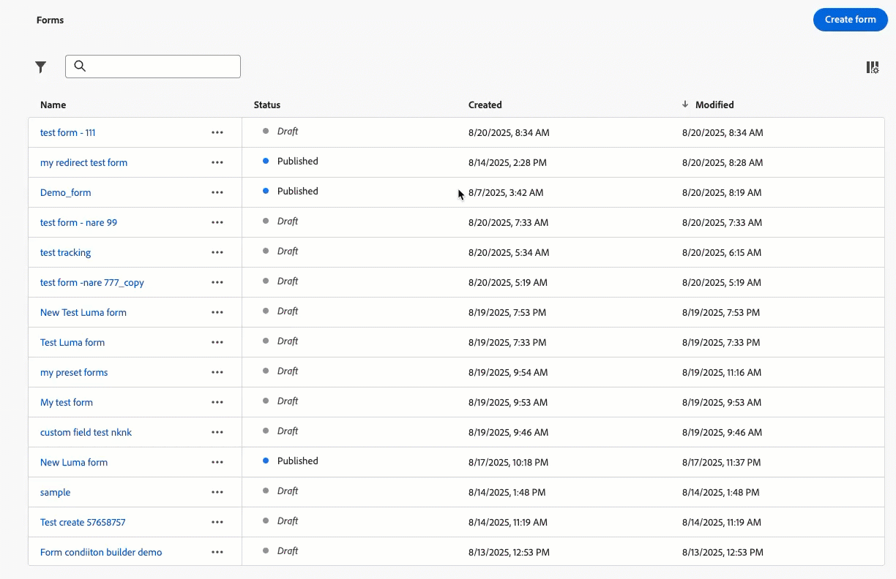

# 发行说明 {#release-notes}

>[!CONTEXTUALHELP]
>id="ajo_homepage_card1"
>title="新增功能"
>abstract="**Adobe Journey Optimizer** 不断地提供新功能、增强现有功能，并修复错误。会在每月的最后一周将所有更改整合到发行说明中。"

[!DNL Adobe Journey Optimizer]遵循持续交付模型，允许Adobe持续交付新功能、增强功能和修复。 此方法支持以可扩展的方式分阶段推出各种功能，以确保所有环境的性能和稳定性。

由于此模型，在每月发行版本之间会更新发行说明。有关发行周期和可用性阶段的完整详细信息，请参阅 [Journey Optimizer 发行周期](releases.md)。

[!DNL Adobe Journey Optimizer] 原生构建于 [!DNL Adobe Experience Platform] 之上并继承了其所具备的最新创新技术和改进。在 [Adobe Experience Platform 发行说明](https://experienceleague.adobe.com/docs/experience-platform/release-notes/latest.html?lang=zh-Hans){target="_blank"}中进一步了解这些更改。

## 2026年4月更新 {#april-26-rn}

### 新功能 {#april-26-features}

<table>
<thead>
<tr>
<th><strong>针对AI收件箱优化电子邮件</strong> </th>
</tr>
</thead>
<tbody>
<tr>
<td>

Adobe Journey Optimizer现在包含一项新功能，可确保将您的电子邮件结构优化为采用AI的收件箱，例如Gmail中的Apple Intelligence和Google Gemini。

随着AI助理越来越多地控制收件人如何阅读电子邮件和执行操作，此功能可帮助您生成和创作在下游AI任务中表现良好的内容，包括摘要、分类、优先级划分和意图提取。

有关详细信息，请参阅<a href="../email/llm-email-optimizer.md">为AI收件箱优化电子邮件</a>。

发布日期： 2026年4月17日

</td>
</tr>
</tbody>
</table>

<table>
<thead>
<tr>
<th><strong>历程路径试验</strong> </th>
</tr>
</thead>
<tbody>
<tr>
<td>

使用新的<strong>Optimize</strong>节点运行A/B测试或多臂老虎机实验，以确定满足以业务为中心的KPI的最佳途径。 通过此工具，您可以测试、更改并自定义通信、顺序和时间，以便更好地联系客户。

此功能此前为有限发布版，现已可供所有环境使用（正式发布版）。

作为正式发布的一部分，此版本引入了<strong>试验类型</strong>选择（A/B或多臂老虎机）和<strong>缩放单一历程的入选者</strong>。

有关更多信息，请参阅<a href="../building-journeys/path-experimentation.md">详细文档</a>。

发布日期： 2026年4月7日

</td>
</tr>
</tbody>
</table>

<table>
<thead>
<tr>
<th><strong>收件箱</strong> </th>
</tr>
</thead>
<tbody>
<tr>
<td>

<strong>收件箱</strong>是随内容卡一起提供的移动功能，它使客户能够在其应用程序或网站中创建一个集中的位置，以显示发送给其用户的消息。 这延长了营销通信的生命周期，确保消息在关闭后仍可访问。

有关更多信息，请参阅<a href="../inbox/inbox-gs.md">详细文档</a>。

发布日期： 2026年4月7日

</td>
</tr>
</tbody>
</table>

<!--
<table>
<thead>
<tr>
<th><strong>Optimize email text for AI inboxes</strong> </th>
</tr>
</thead>
<tbody>
<tr>
<td>

Adobe Journey Optimizer now includes a new capability that ensures your emails are optimally structured for AI-powered inboxes such as Apple Intelligence and Google Gemini in Gmail.

As AI assistants increasingly control how recipients read and act on email, this feature helps you author content that performs well across downstream AI tasks including summarization, triage, prioritization, and intent extraction.

For more information, refer to <a href="../email/llm-email-optimizer.md">Optimize email text for AI inboxes</a>.

Availability date: April 3, 2026

</td>
</tr>
</tbody>
</table>
-->

<table>
<thead>
<tr>
<th><strong>电子邮件渠道中的决策支持</strong> </th>
</tr>
</thead>
<tbody>
<tr>
<td>

您现在可以使用<strong>Decisioning</strong>来个性化和优化电子邮件的内容。 利用优先级得分、公式或AI模型，向每位收件人显示最相关的选件和内容。

此功能以前以“有限可用性”发布，现在可用于所有环境（一般可用性）。 在此General Availability版本中，现在支持镜像页面。

有关更多信息，请参阅<a href="../experience-decisioning/create-decision-policy.md">详细文档</a>。

发布日期： 2026年4月6日

</td>
</tr>
</tbody>
</table>

<table>
<thead>
<tr>
<th><strong>适用于Personalization表达式的AI助手</strong> </th>
</tr>
</thead>
<tbody>
<tr>
<td>

[!DNL Adobe Journey Optimizer] 现在，Personalization编辑器中包含一个AI助手。 用简单的语言描述要个性化的内容，然后助手会生成个性化表达式，您可以按原样使用，也可以在后续的简短对话中对其进行优化。

您还可以选择现有的个性化代码，并请求助理对其进行解释、修复或提出改进建议。 在生成表达式后，<strong>显示样本配置文件的预览</strong>针对一组有限的合成样本配置文件运行快速检查。

有关详细信息，请参阅<a href="../content-management/generative-personalization-expressions.md">Personalization表达式的AI助手</a>。

发布日期： 2026年4月13日

</td>
</tr>
</tbody>
</table>

### 改进 {#april-26-improv}

#### 决策

* **跳过暂时不可用的片段** — 在决策项中使用片段时，如果Edge上暂时无法使用片段，则会跳过该片段，并且旅程或营销活动将继续渲染而不是失败。 [了解详情](../experience-decisioning/fragments-decision-policies.md#temporary-unavailable-fragments)

  发布日期： 2026年4月14日

#### 电子邮件设计

* 电子邮件Designer中个性化表达式的&#x200B;**AI助手** — 在电子邮件Designer中，选择一个组件并在上下文工具栏中使用&#x200B;**添加表达式**&#x200B;以纯语言描述所需的个性化设置，查看生成的表达式，并在不离开设计器的情况下插入该表达式。 [了解详情](../content-management/generative-personalization-expressions.md#generate-email-designer)

  发布日期： 2026年4月15日

* **电子邮件内容的高级HTML编辑器** — 高级HTML模式允许您在Email Designer中编辑内容的HTML源，在源中添加高级表达式（如条件），并在HTML视图和桌面视图之间切换而不会丢失更改。

  以前此功能仅可用于电子邮件内容模板，现在此功能已部署到Email Designer中的&#x200B;**电子邮件**&#x200B;内容（例如，在历程和营销活动中创作的电子邮件）以及电子邮件内容模板。 它当前处于“有限可用”状态 — 请联系您的Adobe代表以获取访问权限。 [了解详情](../email/email-expert-mode.md)

  发布日期： 2026年4月9日

#### 历程路径优化

* **试验类型** — 在配置路径试验时，您现在可以在A/B试验（开始时固定拆分）或多臂赌博机（自动拆分并每周更新权重）之间进行选择。 [了解详情](../building-journeys/path-experimentation.md)

  发布日期： 2026年4月7日

* **路径实验：缩放入选者** — 您现在可以自动或手动将实验的入选路径转给完整受众。 确定入选者后，您可以扩大其影响范围和增强其有效性，而无需持续监控试验。 [了解详情](../building-journeys/path-experimentation.md#scale-winner)

  此功能仅在单一历程（事件触发和受众资格）中可用。 它不适用于读取受众历程。

  发布日期： 2026年4月7日

* **条件** - [优化](../building-journeys/optimize.md)活动是在历程中创建条件路径的新工具。 它取代了以前的&#x200B;**条件**&#x200B;活动，该活动已从UI中删除。 所有条件逻辑都将保留，并且现在通过&#x200B;**优化**&#x200B;活动的条件进行处理。 [了解详情](../building-journeys/conditions.md)

  此功能此前为有限发布版，现已可供所有环境使用（正式发布版）。

  发布日期： 2026年4月7日

* **创作时Adobe Experience Manager内容片段上下文** — 在文本字段和内容块之间移动时，您的内容片段选择将保持活动状态，以便您可以添加更多片段字段而无需每次重新打开&#x200B;**打开AEM内容顾问**。 [了解详情](../integrations/aem-fragments.md)

  此功能仅面向一部分组织（限量发布）。要获得访问权限，请与 Adobe 代表联系。

  发布日期：2026年4月1日

#### Adobe Experience Manager集成

* **Adobe Experience Manager内容片段变体支持** — 在插入Adobe Experience Manager内容片段时，您可以选择&#x200B;**内容片段变体**（例如语言或渠道变体），从而改进区域设置和多语言方案的处理。 [了解详情](../integrations/aem-fragments.md#aem-variations)

  此功能仅面向一部分组织（限量发布）。要获得访问权限，请与 Adobe 代表联系。

  发布日期：2026年4月3日

## 2026年3月发行说明 {#march-26-rn}

[新功能](#march-26-features)和[改进](#march-26-improv)部分涵盖的功能已经可用。 [即将推出](#coming-soon)部分列出了计划于3月晚些时候发布的功能和改进。

<!--
**The pre-release notes below are subject to change without prior notice until the release availability date**. Links, screens and updated documentation are published in the release notes, at the release date.

See also [Adobe Experience Platform pre-release notes](https://experienceleague.adobe.com/zh-hans/docs/experience-platform/release-notes/pre-release-notes){target="_blank"}.
-->

**发布日期**：2026 年 3 月 24-25 日

### 新功能 {#march-26-features}

<table>
<thead>
<tr>
<th><strong>URL参数加密</strong> </th>
</tr>
</thead>
<tbody>
<tr>
<td>

现在，可以加密添加到电子邮件中的跟踪和登陆页面链接中的URL参数，从而为敏感参数数据提供额外的安全层。

<ul>
<li>在专用<strong>管理</strong>注册表中注册和管理加密密钥。</li>
<li>在表达式中使用新的“Encrypt”帮助程序函数加密URL中要在渲染时保护的查询参数的敏感数据。</li>
</ul>

此功能仅面向一部分组织（限量发布）。要获得访问权限，请与 Adobe 代表联系。

有关更多信息，请参阅<a href="../personalization/url-parameter-encryption.md">详细文档</a>。

发布日期：2026年3月31日

</td>
</tr>
</tbody>
</table>

<table>
<thead>
<tr>
<th><strong>将图像转换为电子邮件内容模板</strong> </th>
</tr>
</thead>
<tbody>
<tr>
<td>

您现在可以直接在Journey Optimizer中将图像转换为电子邮件内容模板。 使用AI支持的分析，从可视化引用自动生成结构化HTML模板，显着缩短电子邮件设计时间。

此功能此前为有限发布版，现已可供所有环境使用（正式发布版）。

有关更多信息，请参阅<a href="../content-management/image-to-html.md">详细文档</a>。

发布日期：2026年3月31日

</td>
</tr>
</tbody>
</table>

<table>
<thead>
<tr>
<th><strong>登陆页面自定义表单</strong> </th>
</tr>
</thead>
<tbody>
<tr>
<td>

使用[!DNL Journey Optimizer]，您可以通过登陆页面捕获配置文件属性。

根据特定的数据集，创建、设计和管理适合您需求的自定义表单。然后，您可以在登陆页面中利用这些表单，将您选择的轮廓属性添加到为每个表单定义的数据集中。

此功能以前以“有限可用”的形式面向美国和澳大利亚的客户发布，现在则对所有环境均可用（一般可用）。

有关更多信息，请参阅<a href="../landing-pages/lp-forms.md">详细文档</a>。

发布日期：2026年3月26日。

</td>
</tr>
</tbody>
</table>

<table>
<thead>
<tr>
<th><strong>在编排的营销活动中测试活动</strong> </th>
</tr>
</thead>
<tbody>
<tr>
<td>

新的<strong>Test</strong>活动现在可在编排的营销活动中使用。 此活动根据定义的条件将工作流执行路由到不同的分支，让您能够在激活实时投放之前验证活动逻辑和配置。

有关更多信息，请参阅<a href="../orchestrated/activities/test.md">详细文档</a>。

</td>
</tr>
</tbody>
</table>

<table>
<thead>
<tr>
<th><strong>历程中的数据集查找支持</strong> </th>
</tr>
</thead>
<tbody>
<tr>
<td>

历程中新增的<strong>数据集查找</strong>活动允许您在运行时动态检索Adobe Experience Platform记录数据集中的数据 — 让您能够访问不属于配置文件或事件有效负载的信息，因此客户交互始终相关且及时。

以前以“有限可用性”发布给一组有限组织，现在历程中的数据集查找活动可供所有有权使用[数据集查找](../data/lookup-aep-data.md)的客户使用，同时仍保持有限可用性。

有关更多信息，请参阅<a href="../building-journeys/dataset-lookup.md">详细文档</a>。

</td>
</tr>
</tbody>
</table>

<table>
<thead>
<tr>
<th><strong>操作活动取代了特定于渠道的历程活动</strong> </th>
</tr>
</thead>
<tbody>
<tr>
<td>

在2026年2月<strong>操作活动</strong>正式发布后，历程画布中的旧版本机渠道活动（电子邮件、推送、短信、应用程序内、Web、基于代码的体验和内容卡）现已弃用。

现在，您必须使用单个操作活动来配置所有渠道操作，而无需单独的特定于渠道的节点。

使用旧版渠道活动的现有历程可以继续正常运行，无需进行任何更改或迁移。

有关更多信息，请参阅<a href="../building-journeys/journey-action.md">详细文档</a>。

</td>
</tr>
</tbody>
</table>

<table>
<thead>
<tr>
<th><strong>电子邮件模板的高级HTML编辑器</strong> </th>
</tr>
</thead>
<tbody>
<tr>
<td>

电子邮件内容模板的高级HTML模式允许您在Email Designer中编辑内容的HTML源，在源中添加高级表达式（如条件），并在HTML视图和桌面视图之间切换，而不会丢失所做的更改。

此功能仅在电子邮件渠道的内容模板中可用。 它当前处于“有限可用”状态 — 请联系您的Adobe代表以获取访问权限。

有关更多信息，请参阅<a href="../email/email-expert-mode.md">详细文档</a>。

发布日期： 2026年3月10日

</td>
</tr>
</tbody>
</table>

<table>
<thead>
<tr>
<th><strong>自定义Firefly模型与第三方图像生成模型的集成</strong> </th>
</tr>
</thead>
<tbody>
<tr>
<td>

启用标准和自定义 Firefly 模型以及经过批准的第三方图像模型的无缝集成，从而在生成图像时提供更大的灵活性、控制力以及品牌一致性。

根据您的需求选择合适的模型：

<ul><li> <strong>Adobe模型</strong>（由Firefly Image Model 4提供支持），无需其他设置即可立即生成图像</li><li> <strong>合作伙伴型号</strong> （由Gemini 2.5 Flash提供支持）提供专业功能</li><li><strong>自定义模型</strong>（基于您自己的资产进行培训的品牌特定模型），用于生成与您的品牌标识、风格和视觉准则完全一致的品牌。</li></ul>

有关更多信息，请参阅<a href="../content-management/generative-models.md">详细文档</a>。

发布日期：2026年3月2日

</td>
</tr>
</tbody>
</table>

<table>
<thead>
<tr>
<th><strong>iOS的实时活动</strong> </th>
</tr>
</thead>
<tbody>
<tr>
<td>

通过Adobe Journey Optimizer中的<strong>iOS Live Activity</strong>，将实时体验直接引入客户的Lock Screens和Dynamic Island。 交付实时更新，从订单跟踪和航班状态到事件倒计时、实时得分和交付进度，而不要求用户打开您的应用程序。 让您的受众了解情况，并在正确的时间参与活动，即他们所在的位置。

此功能以前以测试版的形式发布，但现在向所有环境提供（正式发布）。

有关更多信息，请参阅<a href="../mobile-live/get-started-mobile-live.md">详细文档</a>。

发布日期：2026年3月3日

</td>
</tr>
</tbody>
</table>

<table>
<thead>
<tr>
<th><strong>Journey Agent：渠道内容创建</strong> </th>
</tr>
</thead>
<tbody>
<tr>
<td>

由<strong>Adobe Experience Platform Agent Orchestrator</strong>提供支持的<strong>Journey Agent</strong>在Journey Optimizer中可用，并允许您通过自然语言界面分析旅程。 您现在还可以直接在Journey Agent中生成和管理特定于渠道的内容，为电子邮件和推送等渠道创建内容，应用和预览模板，通过提示优化音调和样式，以及在<strong>内容Designer</strong>中打开内容以进行上下文内编辑。

此功能仅面向一部分组织（限量发布）。要获得访问权限，请与 Adobe 代表联系。

有关更多信息，请参阅<a href="https://experienceleague.adobe.com/docs/experience-cloud-ai/experience-cloud-ai/agents/ajo-agent.html?lang=zh-Hans" target="_blank">详细文档</a>。

发布日期：2026年3月4日

</td>
</tr>
</tbody>
</table>

<table>
<thead>
<tr>
<th><strong>AI模型监测</strong> </th>
</tr>
</thead>
<tbody>
<tr>
<td>

Journey Optimizer现在允许您监控Decisioning AI模型的运行状况、培训状态和性能。 这使您可以验证培训是否成功、排除故障以及了解对结果的影响，以便使用AI为每个客户选择最佳选件。 请注意，此功能仅适用于<strong>决策</strong>（不适用于旧版决策管理模型）。

此功能当前仅适用于<strong>个性化优化</strong>模型（非自动优化）。

有关更多信息，请参阅<a href="../experience-decisioning/ranking/ai-model-observability.md">详细文档</a>。

发布日期： 2026年3月9日

</td>
</tr>
</tbody>
</table>

<table>
<thead>
<tr>
<th><strong>使用信号触发编排的营销活动</strong> </th>
</tr>
</thead>
<tbody>
<tr>
<td>

现在可以通过<strong>API信号</strong>触发编排的营销活动。 若要进行此设置，请将目标营销活动配置为<strong>由信号</strong>触发，发布该营销活动，然后使用API调用触发它。 API调用中包含的任何参数均可用作正在运行的营销活动中的变量。 请注意，信号触发的编排营销活动仍是<strong>批次</strong>营销活动，不同于API触发的营销活动。

有关更多信息，请参阅<a href="../orchestrated/trigger-orchestrated-campaign.md">详细文档</a>。

</td>
</tr>
</tbody>
</table>

<table>
<thead>
<tr>
<th><strong>编排的活动中的事务性类别</strong> </th>
</tr>
</thead>
<tbody>
<tr>
<td>

在编排的营销活动中，您现在可以将渠道活动设置为<strong>事务性</strong>类别。 这会将事务性渠道配置应用于该活动，并在业务规则不应应用或不需要客户选择加入时非常有用。

有关更多信息，请参阅<a href="../orchestrated/activities/channels.md#add">详细文档</a>。

此功能将在未来几天内逐步推广到所有地区。

</td>
</tr>
</tbody>
</table>

### 改进 {#march-26-improv}

此版本包含的改进如下所述。

#### 个性化

* **完整/基本URL个性化** — 您可以使用配置文件属性（例如，针对域或路径）个性化目标URL。 要启用此功能，请向Adobe提供您的接受域列表。 [了解详情](../personalization/personalization-build-expressions.md#where)

  此功能以前以“有限可用性”发布，以供在历程中使用，但现在对所有环境可用（一般可用性）。

  发布日期：2026年4月1日

#### 报告

* **发送时间优化：更新了控件位置和新的提升报告** — 发送时间优化(STO)控件已重新定位到操作配置菜单。 此外，历程报表中现在提供了新的提升报表，以衡量STO对促销活动绩效指标的影响。 [了解详情](../reports/channel-report-cja.md#optimization-models)

  发布日期： 2026年3月27日

<!--
* **Exclude bot clicks for email and SMS reporting** - Email and SMS reporting now automatically filters out bot clicks from click metrics, providing more accurate engagement data and preventing automated traffic from inflating your performance figures.

#### Email Designer

* **Email Designer displayed in Unified Shell** - The Email Designer is now displayed within the Unified Shell experience, providing a consistent navigation and header experience that aligns with other Adobe applications.

* **Text mode support in fragments** - To support text-based email workflows, you can now create and manage text versions of your visual fragments for optimal use in the plain text version of emails that include that fragment.

  **Caution:** When using a fragment that was created before the current release, the fragment text version may be incorrectly rendered—both in the Email Designer and in the final email delivered to your recipients. For best results with older fragments, edit, save and republish each fragment.
-->

#### 配置

<!--* **Folders for journeys and campaigns** - You can now organize your journeys and campaigns into folders, enabling structured navigation and easier management for teams working with large volumes of content. This capability is only available for a set of organizations (Limited Availability). To gain access, contact your Adobe representative.-->

* **AJO域证书续订失败** — 现在，当用于电子邮件传递的域证书即将到期或已过期时，您可以通过电子邮件或在Journey Optimizer通知中心订阅接收系统警报。 [了解详情](../reports/alerts.md#alert-certificates-renewal-unsuccessful)

  发布日期： 2026年3月26日

* **AJO次要收件人反馈事件数据集重命名** - `AJO Email BCC Feedback Event`数据集已重命名为`AJO Secondary Recipient Feedback Event`数据集。 具体影响取决于您的情况：

   * **现有用户**：只更新显示名称。 基础表名称保持不变。
   * **新用户和沙盒**：显示名称和表名称都反映新名称。
   * **具有新沙盒的现有用户**：显示名称和表名称都已更新为新名称。

  >[!NOTE]
  >
  >新数据集立即显示新名称。 对于较旧的数据集名称，回填和对帐会逐步进行，并且可能需要几周才能完成。

  发布日期：2026年3月2日

#### 历程

* **更新配置文件操作：支持多个配置文件属性** - **更新配置文件**&#x200B;操作活动现在支持在单个节点中更新最多五个配置文件属性。 以前，每个操作一次只能更新一个属性，需要多个节点更新多个属性。 使用新的&#x200B;**更新其他字段**&#x200B;按钮添加其他字段/值对，从而降低画布复杂性并提高性能。 [了解详情](../building-journeys/update-profiles.md)

* **历程中的出站消息波动发送** — 您现在可以计划来自Journey Optimizer历程的消息，以受控批次形式随时间传递。 [了解详情](../building-journeys/send-using-waves.md)

  此功能以前以“有限可用性”发布，以供在历程中使用，但现在对所有环境可用（一般可用性）。

  发布日期： 2026年3月16日

* **历程技术详细信息中的暂停和恢复详细信息** — 历程&#x200B;**技术详细信息**&#x200B;现在包含其他暂停和恢复信息：上次暂停和恢复的日期和时间、执行每个操作的用户的显示名称和内部标识符以及暂停行为、最长暂停持续时间和自动恢复状态等整套暂停历程设置。 [了解详情](../building-journeys/journey-properties.md)

  发布日期：2026年3月2日

#### 决策

* **决策迁移 — 选件和上下文属性** — 迁移API实体映射现在列出了&#x200B;**选件属性** （`migratedofferattributes`个性化选件项架构）和&#x200B;**上下文属性** （`migratedcontextattributes`迁移数据集架构）。 [了解详情](../experience-decisioning/decisioning-migration-api.md#entity-mapping)

  发布日期：2026年3月31日

<!--
## Coming soon {#coming-soon}

The features and improvements below are planned for release later in March/early April. Release dates and scope are **subject to change without prior notice**.

WAITING RELEASE DATE CONFIRMATION * **Target dimension simplification in Orchestrated Campaigns** - The active targeting dimension is now shown on the workflow canvas, so you can see which dimension is used by a channel activity. The multi-entity segmentation flow is simpler as you no longer need a separate "Change dimension" activity. Moreover, you can now choose explicitly whether messages are sent at the profile level or at a secondary dimension level.

WAITING RELEASE DATE CONFIRMATION
* **Target dimension simplification in Orchestrated Campaigns** - The active targeting dimension is now shown on the workflow canvas, so you can see which dimension is used by a channel activity. The multi-entity segmentation flow is simpler as you no longer need a separate "Change dimension" activity. Moreover, you can now choose explicitly whether messages are sent at the profile level or at a secondary dimension level.
-->
