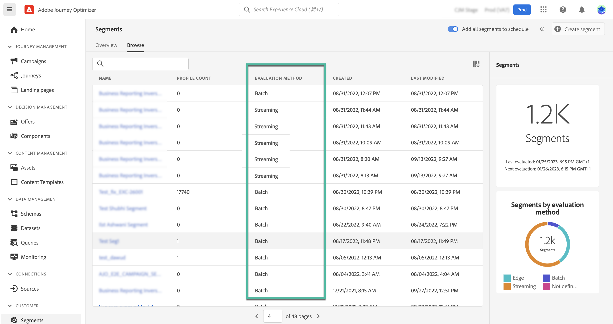

# Adobe Experience Platform区段快速入门 {#about-segments}

>[!CONTEXTUALHELP]
>id="ajo_campaigns_content_experiment_segment"
>title="区段"
>abstract="通过利用实时客户配置文件数据，Adobe Experience Platform 让您能够轻松地创建目标区段，用于捕捉客户的独特行为和偏好。"

[!DNL Journey Optimizer]  允许您直接从 **[!UICONTROL 区段]** 菜单，并将其用于您的历程或营销策划。

此外，还可以从分段服务本身创建区段。 在 [Adobe Experience Platform Segmentation Service文档](https://experienceleague.adobe.com/docs/experience-platform/segmentation/home.html).

## 在 [!DNL Journey Optimizer] {#segments-in-journey-optimizer}

您可以在 **[!DNL Journey Optimizer]** 不同方式：

* 选择区段作为 **营销活动的受众**，此时会将消息发送给属于选定区段的所有个人。 [了解如何定义营销活动的受众](../campaigns/create-campaign.md#define-the-audience-audience).

* 使用 **读取区段** 历程中的编排活动，以使区段中的所有个人进入历程并接收历程中包含的消息。

   假设您拥有“白银客户”客户细分。通过此活动，您可以让所有白银客户进入旅程并向他们发送一系列个性化消息。 [了解如何配置读取区段活动](../building-journeys/read-segment.md#configuring-segment-trigger-activity).

* 使用 **区段鉴别** 历程中的事件活动，以根据Adobe Experience Platform区段入口和出口，让个人进入历程或在历程中前进。

   例如，您可以让所有新的白银客户进入历程并发送消息。 有关如何使用此活动的更多信息，请参阅 [了解如何配置区段鉴别活动](../building-journeys/segment-qualification-events.md).

* 使用 **条件** 活动，以根据区段成员资格构建条件。 [了解如何在条件中使用区段](../building-journeys/condition-activity.md#using-a-segment).

## 受众评估方法{#evaluation-method-in-journey-optimizer}

在Adobe Journey Optimizer中，受众是使用以下两种评估方法之一从区段定义生成的：

* **流分段**:当新数据流入系统时，区段的受众列表会实时保持为最新。

   流式分段是一个持续的数据选择过程，它会更新区段以响应用户活动。生成并保存区段后，会将区段定义应用于传入数据到Journey Optimizer。 这意味着当个人的配置文件数据发生更改时，会在区段中添加或删除他们，从而确保目标受众始终相关。

* **批量分段**:每24小时评估一次区段的受众列表。

   批量分段是流式客户细分的一种替代方法，流式客户细分可通过客户细分定义一次处理所有用户档案数据。 这将创建可保存和导出以供使用的受众快照。 但是，与流式分段不同，批量分段不会持续实时更新受众列表，并且在批处理后传入的新数据在下一个批处理之前不会反映在区段中。”

系统根据评估区段规则的复杂性和成本来确定每个区段定义的批处理分段和流式分段之间的确定。 您可以在 **[!UICONTROL 评价方法]** 列。

>[!NOTE]
>
>如果 **[!UICONTROL 评价方法]** 列未显示，您需要使用列表右上角的配置按钮添加列。

首次定义区段后，用户档案会在符合条件时添加到受众。

从以前的数据回填受众最长可能需要24小时。 回填受众后，该受众会持续保持为最新状态，并始终准备进行定位。
