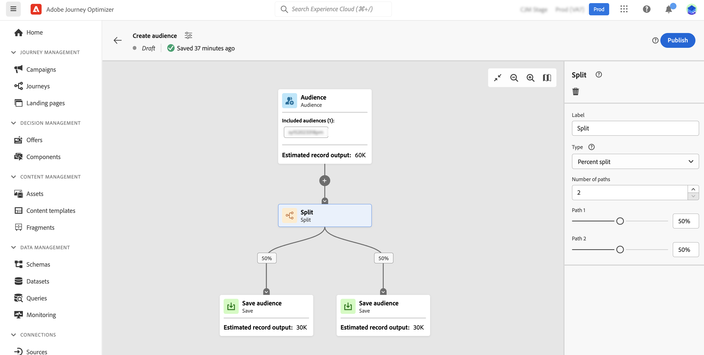

# 使用合成画布 {#composition-canvas}

合成画布是一种可视画布，允许您通过利用受众和活动（拆分、排除……）来创建合成。

在合成画布中配置合成的步骤如下：

1. [定义起始受众](#starting-audience)
1. [添加一个或多个活动](#action-activities)
1. [将结果保存到新受众中](#save)

## 选择起始受众 {#starting-audience}

>[!CONTEXTUALHELP]
>id="ajo_ao_merge_types"
>title="合并类型"
>abstract="指定应如何合并选定受众的配置文件。"

创建合成的第一步是选择一个或多个现有受众作为合成的基础。

选择 **[!UICONTROL 受众]** 活动，然后单击 **[!UICONTROL 添加受众]** 按钮，然后选择一个或多个受众。

在此示例中，我们要定位属于金牌和银牌受众的所有用户档案。

如果选择多个受众，请指定这些受众的配置文件应合并的方式：

* **[!UICONTROL 并集]**:包含来自选定受众的所有用户档案，
* **[!UICONTROL 交集]**:包括所有选定受众共有的用户档案，
* **[!UICONTROL 排除重叠]**:包括仅属于其中一个受众的用户档案。 将不包含属于多个受众的用户档案。

## 添加活动 {#action-activities}

选择起始受众后添加活动以优化您的选择。

要实现此目的，请单击合成路径上的+按钮，然后选择所需的活动。 此时会打开右侧窗格，用于配置活动。

>[!NOTE]
>
>您可以添加任意数量的 **[!UICONTROL 受众]** 和 **[!UICONTROL 排除]** 活动。 但是，在 **[!UICONTROL 排名]** 和 **[!UICONTROL 拆分]** 活动。

您可以随时通过单击右侧窗格中的删除按钮，从画布中删除活动。 在此活动之后添加的所有活动也将从画布中删除。

可用的活动包括：

* [受众](#audience):包括属于一个或多个现有受众的其他用户档案，
* [排除](#exclude):排除属于现有受众的用户档案，或根据特定属性排除用户档案，
* [排名](#rank):根据特定属性对用户档案进行排名，指定要保留的用户档案数并将其包含在您的构成中，
* [拆分](#split):根据随机百分比或属性将您的构图划分为多个路径。

### 受众活动 {#audience}

>[!CONTEXTUALHELP]
>id="ajo_ao_audience"
>title="受众活动"
>abstract="利用受众活动，可在合成中包含属于现有受众的其他用户档案。"

的 **[!UICONTROL 受众]** 活动允许您在合成中包含属于现有受众的其他用户档案。

此活动的配置与开始 [受众活动](#starting-audience).

### 排除活动 {#exclude}

>[!CONTEXTUALHELP]
>id="ajo_ao_exclude_type"
>title="排除类型"
>abstract="使用排除受众类型排除属于现有受众的用户档案。 使用属性类型排除可根据特定属性排除用户档案。"

>[!CONTEXTUALHELP]
>id="ajo_ao_exclude"
>title="排除活动"
>abstract="利用排除活动，可通过选择现有受众或使用规则从构图中排除用户档案。"

的 **[!UICONTROL 排除]** 活动，可将用户档案从构图中排除。 可以使用两种类型的排除：

* **[!UICONTROL 排除受众]**:排除属于现有受众的用户档案。

   单击 **[!UICONTROL 添加受众]** 按钮，然后选择要排除的受众。

   

* **[!UICONTROL 使用属性排除]**:根据特定属性排除用户档案。

   选择要查找的属性，然后指定要排除的值。 在本例中，我们从其家庭地址位于日本的合成用户档案中排除。

   

### 排名活动 {#rank}

>[!CONTEXTUALHELP]
>id="ajo_ao_ranking"
>title="排名活动"
>abstract="利用排名活动，可根据特定属性对用户档案进行排名，并将其包含在您的构图中。 例如，包括会员积分数量最大的50个用户档案。"

>[!CONTEXTUALHELP]
>id="ajo_ao_rank_profilelimit_text"
>title="添加配置文件限制"
>abstract="打开此选项可指定要包含在组合中的最大用户档案数。

的 **[!UICONTROL 排名]** 利用活动，可根据特定属性对用户档案进行排名，并将其包含在您的构图中。 例如，您可以包含50个用户档案，其中会员积分数量最多。

1. 选择要查找的属性并指定排名顺序（升序或降序）。

   >[注意]
   >
   >您可以选择具有以下数据类型的属性：整数，数字，短 <!--(other?)-->

1. 切换 **[!UICONTROL 添加配置文件限制]** 选项，并指定要包含在组合中的配置文件的最大数量。

   

### 拆分活动 {#split}

>[!CONTEXTUALHELP]
>id="ajo_ao_control_group_text"
>title="控制组"
>abstract="使用控制组隔离部分配置文件。 这允许您衡量营销活动的影响，并与其他群体的行为进行比较。"

>[!CONTEXTUALHELP]
>id="ajo_ao_split"
>title="拆分活动"
>abstract="利用拆分活动，可将构图划分为多个路径。 发布合成时，每个路径的一个受众都将保存到Adobe Experience Platform中。"

>[!CONTEXTUALHELP]
>id="ajo_ao_split_type"
>title="拆分类型"
>abstract="使用百分比拆分类型将用户档案随机拆分为多个路径。 利用属性拆分类型，可根据特定属性拆分用户档案。"

>[!CONTEXTUALHELP]
>id="ajo_ao_split_otherprofiles_text"
>title="其他用户档案"
>abstract="打开此选项可创建一个附加路径，其余配置文件与其他路径中指定的任何条件都不匹配。"

的 **[!UICONTROL 拆分]** 活动，可将构图划分为多个路径。

此操作会自动添加 **[!UICONTROL 保存]** 活动。 发布合成时，每个路径的一个受众都将保存到Adobe Experience Platform中。

可以使用两种类型的拆分操作：

* **[!UICONTROL 百分比拆分]**:将用户档案随机拆分为两个或多个路径。 例如，您可以将用户档案拆分为2个不同的路径，每个路径为45%，并为控制组添加一个额外的路径。

   

* **[!UICONTROL 属性拆分]**:根据特定属性拆分用户档案。 在此示例中，我们将根据用户档案的文件室类型首选项来拆分用户档案。

   

   >[!NOTE]
   >
   >的 **[!UICONTROL 其他用户档案]** 选项允许您使用其余配置文件创建其他路径，这些路径与其他路径中指定的任何条件都不匹配。

## 保存受众 {#save}

配置将保存到Adobe Experience Platform中的结果受众。

为此，请选择 **[!UICONTROL 保存受众]** 活动，然后指定要创建的新受众的名称。

合成准备就绪后，即可发布它。 [了解如何创建合成](create-compositions.md)

了解更多:

* [受众构成入门](get-started-audience-orchestration.md)
* [创建合成工作流](create-compositions.md)
* [访问和管理受众](access-audiences.md)
