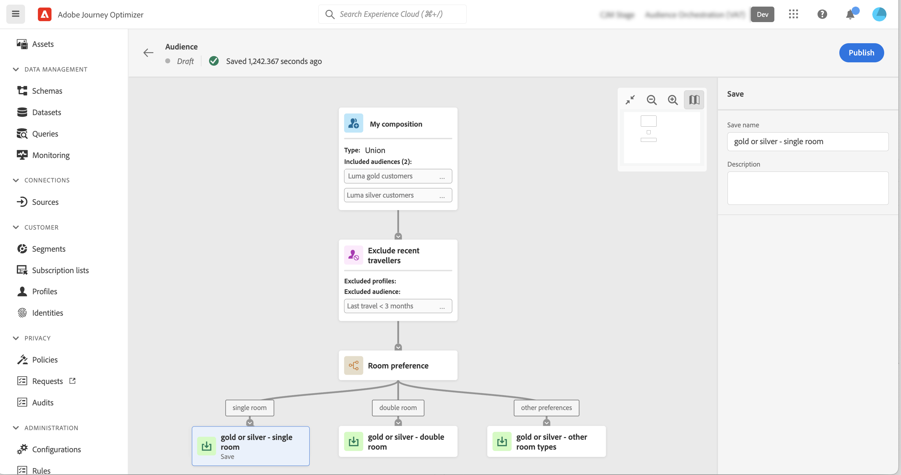

# 创建合成工作流 {#create-compositions}

利用合成工作流，可合并和排列现有受众以创建新受众。

## 创建合成工作流 {#create}

1. 访问 **[!UICONTROL 区段]** 菜单和选择 **[!UICONTROL 创建受众]**.

1. 选择 **[!UICONTROL 撰写受众]**.

   >[!NOTE]
   >
   >的 **[!UICONTROL 生成规则]** 创建方法允许您使用 [Segmentation Service](https://experienceleague.adobe.com/docs/experience-platform/segmentation/ui/overview.html).

   

1. 此时将显示组合画布，其中包含两个默认活动：

   * **[!UICONTROL 受众]**:作品的起点。 此活动允许您选择一个或多个受众作为工作流的基础，

   * **[!UICONTROL 保存]**:最后一步。 此活动用于将工作流的结果保存到新受众中。
   有关如何在合成工作流画布中配置活动的更多信息，请参阅 [使用合成画布](composition-canvas.md).

1. 选择 **[!UICONTROL 受众]** 活动，然后为合成指定标签。

   >[!IMPORTANT]
   >
   >的 **[!UICONTROL 受众]** 活动标签是您的合成的标签。 确保提供有意义的名称，以便更轻松地在列表中检索组合。

   

1. 通过在 **[!UICONTROL 受众]** 和 **[!UICONTROL 保存]** 活动。 [了解如何使用合成画布](composition-canvas.md)

   

1. 准备好构图后，单击 [**!UICONTROL发布]**按钮以发布合成并将生成的受众保存到Adobe Experience Platform。

   如果在发布过程中发生任何错误，则会显示警报，其中包含有关如何解决此问题的信息。

   

1. 合成已发布。 生成的受众将保存到Adobe Experience Platform。 <!-- and are ready to be targeted in Journey Optimizer campaigns. [Get started with campaigns](../campaigns/get-started-with-campaigns.md)-->

## 接入组合物 {#access}

>[!CONTEXTUALHELP]
>id="ajo_ao_publish"
>title="发布受众"
>abstract="发布您的构图，以将生成的受众保存到Adobe Experience Platform。"

所有创建的合成都可以从 **[!UICONTROL 组合物]** 选项卡。 它们可以具有多种状态：

* **[!UICONTROL 草稿]**:该组合正在进行中，尚未发布。
* **[!UICONTROL 已发布]**:合成已发布，因此已保存受众。 <!-- and are available for use.-->
* **[!UICONTROL 已存档]**:构图已存档。

>[!NOTE]
>
>您可以随时使用列表中的椭圆按钮复制或删除现有合成。

了解更多:

* [受众构成入门](get-started-audience-orchestration.md)
* [使用合成画布](composition-canvas.md)
* [访问和管理受众](access-audiences.md)
