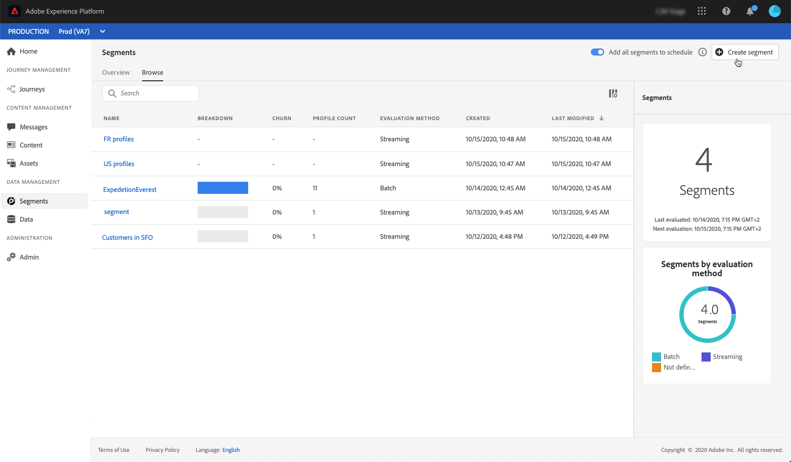

# 生成区段 {#build-segments}

在此示例中，我们将构建一个区段，以定位居住在亚特兰大、旧金山或西雅图的1980年以后出生的所有客户。 所有这些客户都应该在过去7天内打开Luma应用程序，然后在打开该应用程序后的2小时内完成购买。

1. 访问&#x200B;**[!UICONTROL Segments]**&#x200B;菜单，然后单击&#x200B;**[!UICONTROL Create segment]**&#x200B;按钮。

   

   区段定义屏幕允许您配置所有必填字段以定义区段。 了解如何在[分段服务文档](https://experienceleague.adobe.com/docs/experience-platform/segmentation/ui/overview.html){target=&quot;_blank&quot;}中配置区段。

   

1. 在&#x200B;**[!UICONTROL Segment properties]**&#x200B;窗格中，为区段提供名称和描述（可选）。

   

1. 将所需字段从左侧窗格拖放到中心工作区中，然后根据需要对其进行配置。

   >[!NOTE]
   >
   >请注意，左窗格中可用的字段因&#x200B;**XDM个人配置文件**&#x200B;和&#x200B;**XDM ExperienceEvent**&#x200B;架构为贵组织配置的方式而异。  请参阅[体验数据模型(XDM)文档](https://experienceleague.adobe.com/docs/experience-platform/xdm/home.html?lang=zh-Hans){target=&quot;_blank&quot;}，以了解更多信息。

   

   在此示例中，我们需要依赖&#x200B;**Attributes**&#x200B;和&#x200B;**Events**&#x200B;字段来构建区段：

   * **属性**:住在亚特兰大、旧金山或西雅图的档案1980年后出生

      

   * **事件**:在过去7天内打开了Luma应用程序，然后在打开该应用程序后的2小时内购买了产品的用户档案。

      

1. 在工作区中添加和配置新字段时，**[!UICONTROL Segment Properties]**&#x200B;窗格将自动更新，其中包含属于该区段的预计用户档案的信息。

   

1. 区段准备就绪后，单击&#x200B;**[!UICONTROL Save]**。 它会显示在Adobe Experience Platform区段列表中。 请注意，搜索栏可帮助您在列表中搜索特定区段。

现在，该区段可用于您的历程。 如需详细信息，请参阅[此部分](../segment/about-segments.md)。

## 教程视频{#create-segment-video}

>[!VIDEO](https://video.tv.adobe.com/v/334281?quality=12)
