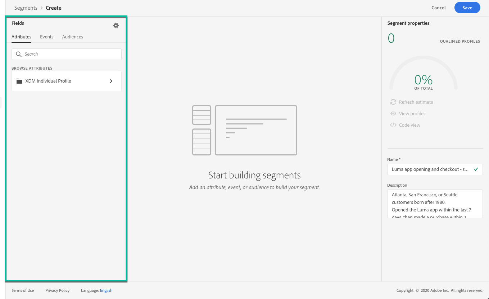

# 构建区段 {#build-segments}

>[!CONTEXTUALHELP]
>id="ajo_ao_create_rule"
>title="创建规则"
>abstract="通过构建规则创建方法，您可以使用 Adobe Experience Platform Segmentation Service 创建新的区段定义。"

在本例中，我们将构建一个区段，以定位居住在亚特兰大、旧金山或西雅图且出生于1980年之后的所有客户。 所有这些客户都应在过去7天内打开Luma应用程序，然后在打开应用程序后的2小时内购买了该应用程序。

➡️ [请在此视频中了解如何创建区段](#video-segment)

1. 访问 **[!UICONTROL 区段]** 菜单，然后单击 **[!UICONTROL 创建区段]** 按钮。

   

   利用区段定义屏幕，可配置定义区段所需的所有字段。 了解如何在 [分段服务文档](https://experienceleague.adobe.com/docs/experience-platform/segmentation/ui/overview.html){target="_blank"}.

   

1. 在 **[!UICONTROL 区段属性]** 窗格中，为区段提供名称和描述（可选）。

   

1. 将所需字段从左窗格拖放到中心工作区，然后根据需要进行配置。

   >[!NOTE]
   >
   >请注意，左窗格中可用的字段因 **XDM个人资料** 和 **XDM ExperienceEvent** 已为您的组织配置架构。  了解详情，请参阅 [Experience Data Model (XDM)文档](https://experienceleague.adobe.com/docs/experience-platform/xdm/home.html?lang=zh-Hans){target="_blank"}.

   

   在此示例中，我们需要依靠 **属性** 和 **事件** 用于构建区段的字段：

   * **属性**：居住在1980年后亚特兰大、旧金山或西雅图的用户档案

      

   * **事件**：过去7天内打开了Luma应用程序，然后在打开应用程序后2小时内购买的用户档案。

      

1. 当您在工作区中添加和配置新字段时， **[!UICONTROL 区段属性]** 窗格会自动更新属于该区段的估计用户档案的信息。

   

1. 区段准备就绪后，单击 **[!UICONTROL 保存]**. 它显示在Adobe Experience Platform区段的列表中。 请注意，搜索栏可帮助您搜索列表中的特定区段。

该区段现在可以在您的历程中使用。 有关详细信息，请参阅[此部分](../segment/about-segments.md)。

## 操作方法视频{#video-segment}

了解如何创建区段。

>[!VIDEO](https://video.tv.adobe.com/v/334281?quality=12)
