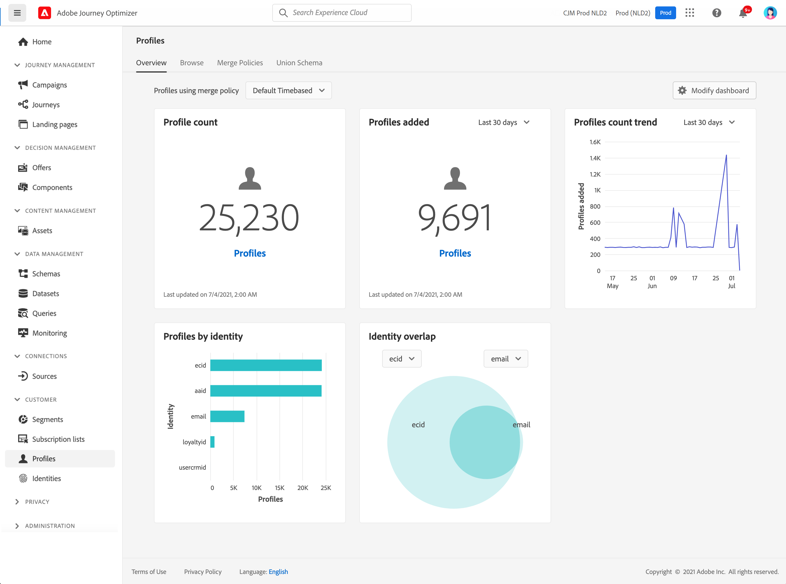

# 用户档案入门 {#profiles-gs}

利用 [!DNL Adobe Journey Optimizer] 通过整合来自多个渠道（包括在线、离线、CRM和第三方）的数据，来全面了解每个客户。 **用户档案** 允许您将客户数据整合到统一视图中，为每次客户互动提供一个可操作且带有时间戳的帐户。

>[!NOTE]
>
>如果贵组织是新 [!DNL Adobe Journey Optimizer] 和尚未创建活动的配置文件数据集或合并策略， **用户档案** 功能板不可见。 相反， **概述** 选项卡显示指向Adobe Experience Platform文档的链接，以帮助您开始使用实时客户资料。

了解如何访问和使用 **用户档案仪表板** 以及功能板中显示的量度的详细信息，请参阅 [此部分](https://experienceleague.adobe.com/docs/experience-platform/profile/ui/user-guide.html?lang=zh-Hans){target=&quot;_blank&quot;}。

您可以将多个来源的数据片段合并在一起，以便查看各个客户的完整视图。 将此数据整合在一起时，合并策略是用于确定数据优先级的规则，以及将合并哪些数据以创建统一视图。

详细了解 **合并策略** 此 [文档](https://experienceleague.adobe.com/docs/experience-platform/profile/merge-policies/ui-guide.html){target=&quot;_blank&quot;}。

**另请参阅**

* [实时客户资料文档](https://experienceleague.adobe.com/docs/experience-platform/query/home.html?lang=zh-Hans){target=&quot;_blank&quot;}
* [实时客户资料概述视频](https://experienceleague.adobe.com/docs/experience-platform/profile/home.html?lang=zh-Hans){target=&quot;_blank&quot;}
