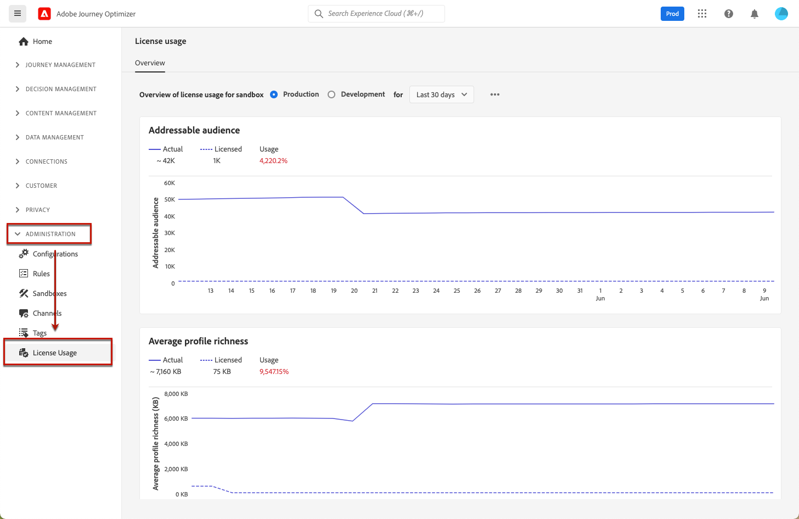

# 许可证使用功能板 {#license-usage}

的 [!DNL Adobe Journey Optimizer] [用户界面](../start/user-interface.md) 提供一个功能板，其中显示有关贵组织许可证使用情况的重要信息（在每日快照中捕获）。

要访问此功能板，请转到 **[!UICONTROL Administration]** > **[!UICONTROL License Usage]**. 这将打开 **[!UICONTROL Overview]** 选项卡。

>[!NOTE]
>
>要能够查看功能板，您必须获得 [查看许可证使用情况功能板](https://experienceleague.adobe.com/docs/experience-platform/dashboards/permissions.html?lang=en#available-permissions){target=&quot;_blank&quot;}权限。

请参阅Adobe Experience Platform文档，了解详情：

* [许可证使用功能板概述](https://experienceleague.adobe.com/docs/experience-platform/dashboards/guides/license-usage.html){target=&quot;_blank&quot;}
* [浏览许可证使用功能板](https://experienceleague.adobe.com/docs/experience-platform/dashboards/guides/license-usage.html#exploring-the-license-usage-dashboard){target=&quot;_blank&quot;}
* [可用量度](https://experienceleague.adobe.com/docs/experience-platform/dashboards/guides/license-usage.html#available-metrics){target=&quot;_blank&quot;}
