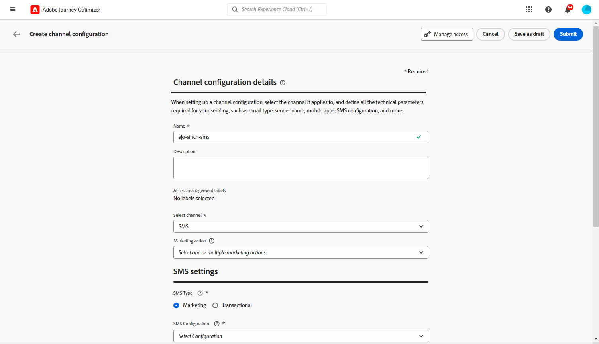

# 创建MMS消息 {#create-mms}

## 先决条件{#sms-prerequisites}

在创建短信消息之前，您首先需要使用Journey Optimizer配置短信供应商，请执行以下步骤：

* 在发送短信之前，您必须将供应商设置与 Journey Optimizer 集成。

+++ 了解如何创建新的Sinch MMS API凭据。

   1. 在左边栏中，浏览 **[!UICONTROL 管理]** > **[!UICONTROL 渠道]** 并选择 **[!UICONTROL API凭据]** 菜单。 单击 **[!UICONTROL 创建新的API凭据]** 按钮。

      

   1. 配置您的SMS API凭据：

   * 对象 **[!DNL Sinch MMS]**：

      * **[!UICONTROL 名称]**：选择API凭据的名称。

      * **[!UICONTROL 项目编号]**， **[!UICONTROL 应用程序ID]** 和 **[!UICONTROL api令牌]**：从“对话API”菜单中，您可以在“应用程序”菜单中找到您的凭据。  [了解详情](https://docs.cc.sinch.com/cloud/service-configuration/en/oxy_ex-1/common/wln1620131604643.html)

     

   1. 单击 **[!UICONTROL 提交]** 完成API凭据配置时。

  创建和配置API凭据后，现在需要为SMS消息创建渠道界面（即消息预设）。

+++

* 完成后，您将需要创建一个短信表面。这些步骤必须由 Adobe Journey Optimizer 系统管理员执行。

+++ 了解如何创建渠道表面。

   1. 在左边栏中，浏览 **[!UICONTROL 管理]** > **[!UICONTROL 渠道]** 并选择 **[!UICONTROL 品牌化]** > **[!UICONTROL 渠道表面]**. 单击 **[!UICONTROL 创建渠道表面]** 按钮。

      

   1. 输入表面的名称和描述（可选），然后选择短信渠道。

      

      >[!NOTE]
      >
      > 名称必须以字母(A-Z)开头。 它只能包含字母数字字符。 您也可以使用下划线 `_`，点`.` 和连字符 `-` 个字符。

   1. 定义 **短信设置**.

      

      首先，选择 **[!UICONTROL 短信类型]** 将随表面一起发送的内容： **[!UICONTROL 事务性]** 或 **[!UICONTROL 营销]**.

      * 选择 **营销** 促销短信：这些消息需要用户同意。
      * 选择 **事务性** 用于非商业性消息，如订单确认、密码重置通知或投放信息。

      创建短信消息时，必须选择与为消息选择的类别匹配的有效渠道平面。

      >[!CAUTION]
      >
      >**事务性** 短信消息可以发送给取消订阅营销通信的用户档案。 这些消息只能在特定上下文中发送。

   1. 选择 **[!UICONTROL 短信配置]** 以与曲面相关联。

      有关如何配置环境以发送短信消息的更多信息，请参阅 [本节](#create-api).

   1. 输入 **[!UICONTROL 发件人编号]** 您&#x200B;希望用于您的通信。

   1. 选择您的 **[!UICONTROL 短信执行字段]** 以选择 **[!UICONTROL 配置文件属性]** 与用户档案的电话号码关联。

   1. 如果要在短信消息中使用URL缩短功能，请从 **[!UICONTROL 子域]** 列表。

      >[!NOTE]
      >
      >要能够选择子域，请确保您之前已配置至少一个短信子域。 [了解如何操作](sms-subdomains.md)

   1. 输入 **[!UICONTROL 选择退出次数]** 要用于此表面。 当用户档案选择退出此号码时，您仍然能够通过可能用于发送短信的其他号码向他们发送消息 [!DNL Journey Optimizer].

      >[!NOTE]
      >
      >在 [!DNL Journey Optimizer]，短信选择退出不再在渠道级别进行管理。 现在，它是特定于某个数字的。

   1. 配置完所有参数后，单击 **[!UICONTROL 提交]** 以确认。 也可以将渠道曲面另存为草稿，并稍后恢复其配置。

      

   1. 创建渠道表面后，它将显示在列表中，其中包含 **[!UICONTROL 正在处理]** 状态。

      >[!NOTE]
      >
      >如果检查不成功，请在中详细了解可能失败的原因 [本节](#monitor-channel-surfaces).

   1. 检查成功后，渠道表面将获得 **[!UICONTROL 活动]** 状态。 它随时可用于投放消息。

      

## 创建短信消息 {#create-sms-journey-campaign}

浏览以下选项卡，了解如何在活动或历程中添加短信消息。

>[!BEGINTABS]

>[!TAB 向历程添加短信消息]

1. 打开您的历程，然后从拖放短信活动 **操作** 面板的部分。

   

1. 提供有关消息的基本信息（标签、描述、类别），然后选择要使用的消息界面。

   

   有关如何配置旅程的更多信息，请参阅 [此页面](../building-journeys/journey-gs.md)

   此 **[!UICONTROL 表面]** 默认情况下，字段会使用用户用于该渠道的最后一个表面进行预填充。

您现在可以从以下网址开始设计短信消息的内容 **[!UICONTROL 编辑内容]** 按钮。 [定义短信内容](#sms-content)

>[!TAB 向营销活动添加短信消息]

1. 创建新的计划或API触发的营销活动，请选择 **[!UICONTROL 短信]** 作为您的操作，然后选择 **[!UICONTROL 应用程序表面]** 以使用。 [了解有关短信配置的更多信息](sms-configuration.md).

   

1. 单击&#x200B;**[!UICONTROL 创建]**。

1. 从 **[!UICONTROL 属性]** 部分，编辑您的营销活动的 **[!UICONTROL 标题]** 和 **[!UICONTROL 描述]**.

   

1. 单击 **[!UICONTROL 选择受众]** 按钮，从可用的Adobe Experience Platform受众列表中定义要定位的受众。 [了解详情](../audience/about-audiences.md)。

1. 在 **[!UICONTROL 身份命名空间]** 字段中，选择要使用的命名空间，以便识别所选受众中的个人。 [了解详情](../event/about-creating.md#select-the-namespace)。

   

1. 单击 **[!UICONTROL 创建试验]** 开始配置内容实验并创建处理方式以测量其性能并为目标受众确定最佳选项。 [了解详情](../campaigns/content-experiment.md)

1. 在 **[!UICONTROL 操作跟踪]** 部分，指定是否要跟踪短信消息中的链接点击次数。

1. 营销活动旨在按特定日期或循环频率执行。 了解如何配置 **[!UICONTROL 计划]** 中的促销活动 [本节](../campaigns/create-campaign.md#schedule).

1. 从 **[!UICONTROL 操作触发器]** 菜单，选择 **[!UICONTROL 频率]** 短信消息的：

   * 一次
   * 每日
   * 每周
   * 月

您现在可以从以下网址开始设计短信消息的内容 **[!UICONTROL 编辑内容]** 按钮。 [设计短信内容](#sms-content)

>[!ENDTABS]

## 定义彩信内容{#mms-content}

1. 在历程或营销策划配置屏幕中，单击 **[!UICONTROL 编辑内容]** 按钮以配置短信内容。

1. 单击 **[!UICONTROL 消息]** 用于打开表达式编辑器的字段。

   

1. 使用表达式编辑器定义内容并添加动态内容。 您可以使用任何属性，如配置文件名称或城市。 了解有关 [个性化](../personalization/personalize.md) 和 [动态内容](../personalization/get-started-dynamic-content.md) 在表达式编辑器中。

1. 启用MMS选项以将媒体添加到短信内容。

   >[!NOTE]
   >
   > MMS选项仅适用于Sinch。 您需要创建特定的API凭据才能创建MMS。 [了解详情](sms-configuration.md#create-new-api)

   

1. 添加 **[!UICONTROL 标题]** 到您的媒体上。

1. 在中输入媒体的URL **[!UICONTROL 媒体]** 字段。

   

1. 单击&#x200B;**[!UICONTROL 保存]**&#x200B;并在预览中检查您的消息。您可以使用 **[!UICONTROL 模拟内容]** 以预览缩短的URL或个性化内容。

您现在可以测试短信消息并将其发送给受众。 [了解详情](send-sms.md)
发送后，您可以在促销活动或历程报表中测量短信的影响。 有关报告的更多信息，请参考[此章节](../reports/campaign-global-report.md#sms-tab)。

>[!NOTE]
>
>根据行业标准和法规，所有短信营销消息都必须包含一种让接收者能够轻松取消订阅的方式。要实现此目的，短信收件人可以使用选择启用和选择禁用关键词进行回复。 [了解如何管理选择退出](../privacy/opt-out.md#sms-opt-out-management-sms-opt-out-management)

**相关主题**

* [预览、测试和发送短信消息](send-sms.md)
* [配置短信渠道](sms-configuration.md)
* [短信报告](../reports/journey-global-report.md#sms-global)